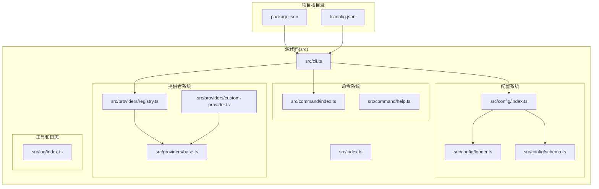
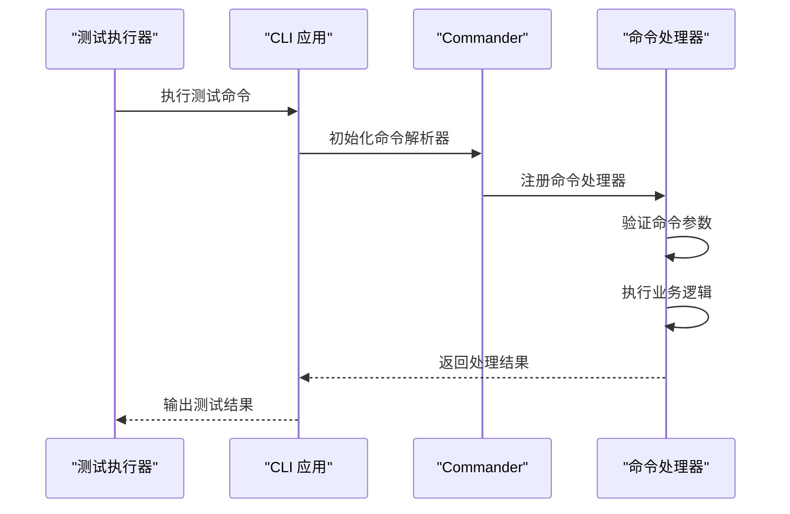
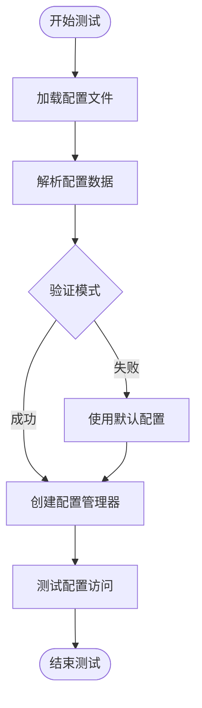
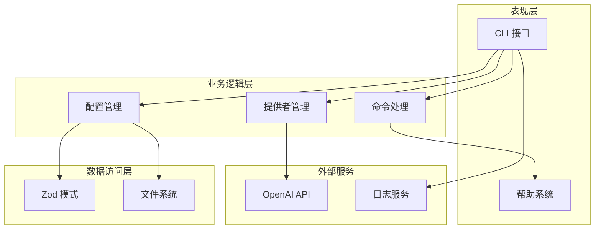
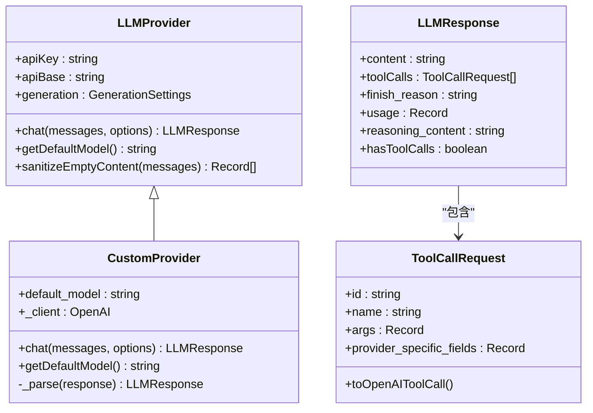
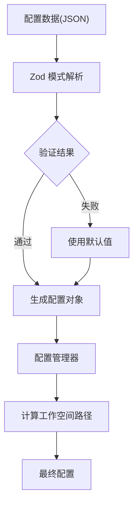
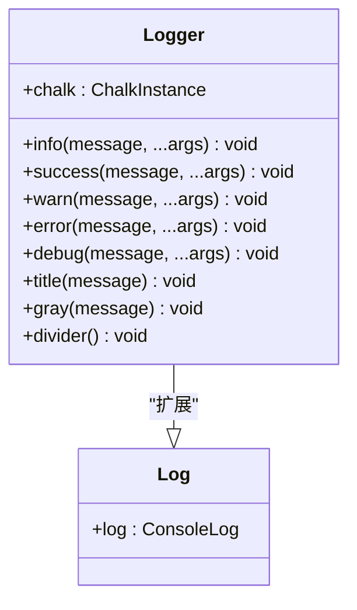
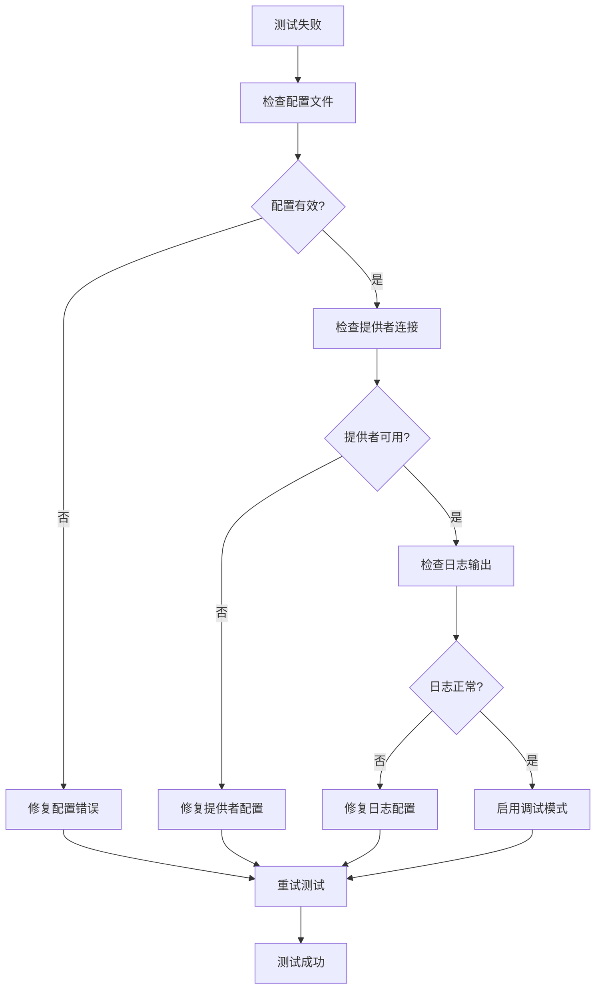

# 测试框架

<cite>
**本文档引用的文件**
- [package.json](file://package.json)
- [tsconfig.json](file://tsconfig.json)
- [src/cli.ts](file://src/cli.ts)
- [src/index.ts](file://src/index.ts)
- [src/command/index.ts](file://src/command/index.ts)
- [src/command/help.ts](file://src/command/help.ts)
- [src/config/index.ts](file://src/config/index.ts)
- [src/config/loader.ts](file://src/config/loader.ts)
- [src/config/schema.ts](file://src/config/schema.ts)
- [src/providers/base.ts](file://src/providers/base.ts)
- [src/providers/registry.ts](file://src/providers/registry.ts)
- [src/providers/custom-provider.ts](file://src/providers/custom-provider.ts)
- [src/log/index.ts](file://src/log/index.ts)
</cite>

## 目录
1. [简介](#简介)
2. [项目结构](#项目结构)
3. [核心组件](#核心组件)
4. [架构概览](#架构概览)
5. [详细组件分析](#详细组件分析)
6. [依赖分析](#依赖分析)
7. [性能考虑](#性能考虑)
8. [故障排除指南](#故障排除指南)
9. [结论](#结论)

## 简介

BatBot 是一个基于 TypeScript 的个人 AI 助手工具，当前代码库中并未包含完整的测试框架实现。根据现有代码分析，该项目采用以下测试策略：

- **构建时测试**：通过 TypeScript 编译器进行类型检查和编译验证
- **运行时测试**：通过命令行接口进行功能验证
- **配置验证测试**：使用 Zod 模式对配置文件进行运行时验证
- **日志记录测试**：通过内置的日志系统进行输出验证

## 项目结构

项目采用模块化架构设计，主要目录结构如下：



**图表来源**
- [package.json:17-22](file://package.json#L17-L22)
- [tsconfig.json:1-21](file://tsconfig.json#L1-L21)
- [src/cli.ts:1-143](file://src/cli.ts#L1-L143)

**章节来源**
- [package.json:1-39](file://package.json#L1-L39)
- [tsconfig.json:1-21](file://tsconfig.json#L1-L21)

## 核心组件

### 命令行接口测试

CLI 模块提供了完整的命令行测试入口点：



**图表来源**
- [src/cli.ts:17-143](file://src/cli.ts#L17-L143)
- [src/command/index.ts:5-16](file://src/command/index.ts#L5-L16)

### 配置系统测试

配置模块使用 Zod 模式进行运行时验证：



**图表来源**
- [src/config/loader.ts:7-23](file://src/config/loader.ts#L7-L23)
- [src/config/schema.ts:124-134](file://src/config/schema.ts#L124-L134)

**章节来源**
- [src/cli.ts:17-143](file://src/cli.ts#L17-L143)
- [src/config/loader.ts:1-33](file://src/config/loader.ts#L1-L33)
- [src/config/schema.ts:1-168](file://src/config/schema.ts#L1-L168)

## 架构概览

系统采用分层架构设计，各层职责明确：



**图表来源**
- [src/cli.ts:1-143](file://src/cli.ts#L1-L143)
- [src/command/help.ts:1-57](file://src/command/help.ts#L1-L57)
- [src/config/schema.ts:1-168](file://src/config/schema.ts#L1-L168)
- [src/providers/custom-provider.ts:1-92](file://src/providers/custom-provider.ts#L1-L92)

## 详细组件分析

### 提供者基类测试

LLMProvider 抽象基类提供了统一的测试接口：



**图表来源**
- [src/providers/base.ts:87-151](file://src/providers/base.ts#L87-L151)
- [src/providers/custom-provider.ts:6-92](file://src/providers/custom-provider.ts#L6-L92)

### 配置模式测试

配置系统使用 Zod 进行严格的类型验证：



**图表来源**
- [src/config/schema.ts:124-134](file://src/config/schema.ts#L124-L134)
- [src/config/loader.ts:13-22](file://src/config/loader.ts#L13-L22)

**章节来源**
- [src/providers/base.ts:1-151](file://src/providers/base.ts#L1-L151)
- [src/providers/custom-provider.ts:1-92](file://src/providers/custom-provider.ts#L1-L92)
- [src/config/schema.ts:1-168](file://src/config/schema.ts#L1-L168)

### 日志系统测试

日志模块提供了多级别的输出格式化：



**图表来源**
- [src/log/index.ts:5-47](file://src/log/index.ts#L5-L47)

**章节来源**
- [src/log/index.ts:1-51](file://src/log/index.ts#L1-L51)

## 依赖分析

项目依赖关系清晰，主要依赖包括：

```mermaid
graph TB
subgraph "运行时依赖"
OPENAI[openai@^6.33.0]
ZOD[zod@^4.3.6]
CHALK[chalk@^5.6.2]
PROMPTS[@clack/prompts@^1.1.0]
UUID[uuid@^13.0.0]
WRAP[wrap-ansi@^10.0.0]
STRIP[strip-ansi@^7.2.0]
COMMANDER[commander@^14.0.3]
end
subgraph "开发时依赖"
TYPES_NODE[@types/node@^25.5.0]
TYPESCRIPT[typescript@^5.9.3]
CYP_CLI[cpy-cli@^7.0.0]
end
subgraph "项目模块"
CLI[src/cli.ts]
CONFIG[src/config/]
PROVIDERS[src/providers/]
COMMAND[src/command/]
LOG[src/log/]
end
CLI --> OPENAI
CLI --> ZOD
CLI --> CHALK
CLI --> PROMPTS
CLI --> COMMANDER
CONFIG --> ZOD
PROVIDERS --> OPENAI
PROVIDERS --> UUID
COMMAND --> PROMPTS
LOG --> CHALK
```

**图表来源**
- [package.json:23-37](file://package.json#L23-L37)

**章节来源**
- [package.json:1-39](file://package.json#L1-L39)

## 性能考虑

当前代码库未包含专门的性能测试框架，但可以从以下几个方面进行优化：

1. **异步操作优化**：提供者类中的异步调用需要适当的超时控制
2. **内存管理**：大型消息处理时的内存使用情况
3. **并发处理**：多个请求同时处理时的资源竞争
4. **缓存策略**：重复请求的结果缓存机制

## 故障排除指南

### 常见问题诊断



### 错误处理机制

系统采用了多层次的错误处理策略：

1. **配置加载错误**：自动回退到默认配置
2. **网络请求错误**：提供者类中的异常捕获和错误响应
3. **日志记录错误**：不影响主流程的错误处理

**章节来源**
- [src/config/loader.ts:16-20](file://src/config/loader.ts#L16-L20)
- [src/providers/custom-provider.ts:55-61](file://src/providers/custom-provider.ts#L55-L61)

## 结论

BatBot 当前的测试框架相对简单但实用，主要特点包括：

1. **类型安全**：通过 TypeScript 和 Zod 实现编译时和运行时双重验证
2. **命令行测试**：直接通过 CLI 接口进行功能验证
3. **配置验证**：自动化的配置文件验证和回退机制
4. **日志记录**：完整的日志系统支持调试和监控

建议的改进方向：
- 添加单元测试套件（如 Jest 或 Vitest）
- 实现集成测试框架
- 建立持续集成管道
- 添加性能基准测试
- 实现端到端测试场景

这些改进将显著提升代码质量和系统的可靠性。