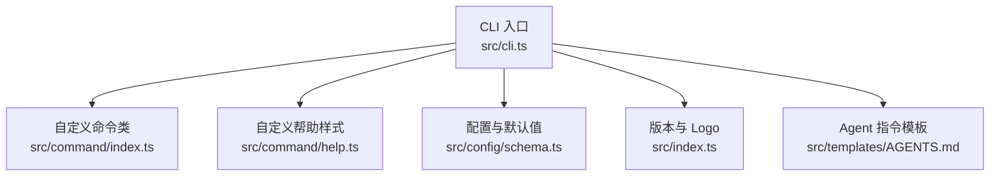
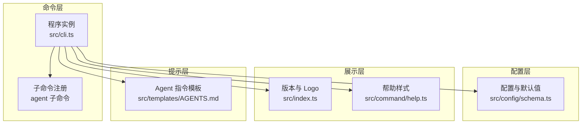
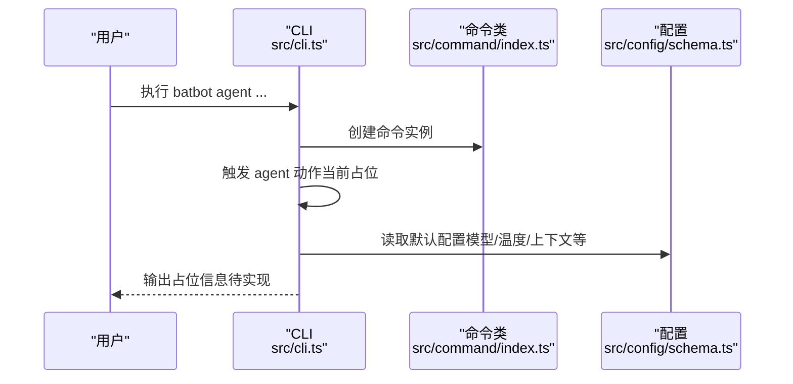
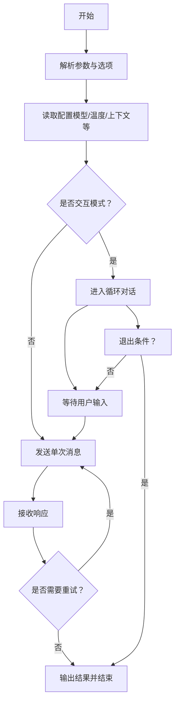
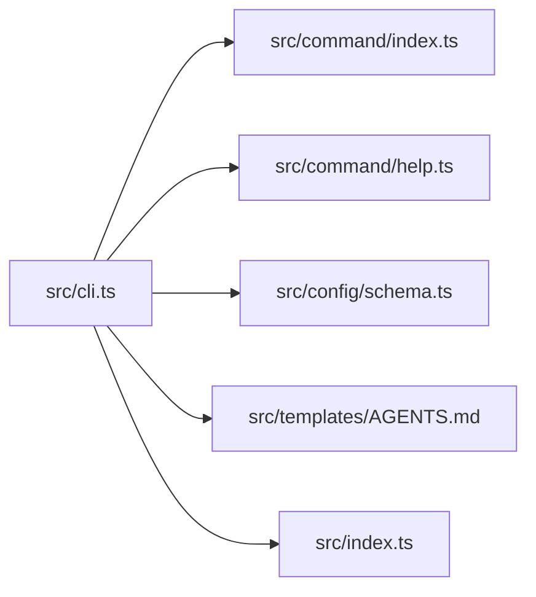

# 代理命令（agent）

<cite>
**本文引用的文件**
- [src/cli.ts](file://src/cli.ts)
- [src/command/index.ts](file://src/command/index.ts)
- [src/command/help.ts](file://src/command/help.ts)
- [src/config/schema.ts](file://src/config/schema.ts)
- [src/index.ts](file://src/index.ts)
- [src/templates/AGENTS.md](file://src/templates/AGENTS.md)
</cite>

## 目录
1. [简介](#简介)
2. [项目结构](#项目结构)
3. [核心组件](#核心组件)
4. [架构总览](#架构总览)
5. [详细组件分析](#详细组件分析)
6. [依赖分析](#依赖分析)
7. [性能考虑](#性能考虑)
8. [故障排除指南](#故障排除指南)
9. [结论](#结论)
10. [附录](#附录)

## 简介
本文件面向“代理命令（agent）”的使用与实现，目标是帮助用户与 AI 代理进行直接交互，涵盖消息发送、响应接收与对话管理；同时解释命令的使用方法、参数选项与交互流程，并提供实际示例、通信机制与数据传输格式说明、错误处理、超时与重试策略建议、调试技巧与故障排除指南。

当前仓库中，“agent”命令已注册到 CLI，但尚未实现具体参数与交互逻辑。本文在不臆测未实现功能的前提下，基于现有代码与配置，给出可落地的使用建议与最佳实践，确保用户能够安全、可控地与代理进行交互。

## 项目结构
与“代理命令（agent）”直接相关的模块如下：
- 命令行入口与子命令注册：src/cli.ts
- 自定义命令类与帮助样式：src/command/index.ts、src/command/help.ts
- 配置与默认参数：src/config/schema.ts
- 版本与 Logo：src/index.ts
- 模板与提示：src/templates/AGENTS.md

图表来源
- [src/cli.ts:15-94](file://src/cli.ts#L15-L94)
- [src/command/index.ts:5-13](file://src/command/index.ts#L5-L13)
- [src/command/help.ts:6-54](file://src/command/help.ts#L6-L54)
- [src/config/schema.ts:20-37](file://src/config/schema.ts#L20-L37)
- [src/index.ts:1-4](file://src/index.ts#L1-L4)
- [src/templates/AGENTS.md:1-22](file://src/templates/AGENTS.md#L1-L22)

章节来源
- [src/cli.ts:15-94](file://src/cli.ts#L15-L94)
- [src/command/index.ts:5-13](file://src/command/index.ts#L5-L13)
- [src/command/help.ts:6-54](file://src/command/help.ts#L6-L54)
- [src/config/schema.ts:20-37](file://src/config/schema.ts#L20-L37)
- [src/index.ts:1-4](file://src/index.ts#L1-L4)
- [src/templates/AGENTS.md:1-22](file://src/templates/AGENTS.md#L1-L22)

## 核心组件
- 自定义命令类（BatBotCommand）
  - 继承自 commander.Command，覆盖 createCommand 与 createHelp，以统一帮助输出风格与行为。
  - 作用：为 batbot 提供一致的命令体验与帮助样式。
- 命令注册与动作占位
  - 在 CLI 中注册了“agent”子命令，当前仅打印占位信息，尚未实现具体交互逻辑。
  - 建议后续在此处添加参数解析与交互流程。
- 配置与默认参数
  - 代理默认配置项包含工作空间、模型、提供商、最大上下文窗口、温度、工具迭代次数等。
  - 这些参数为后续实现“agent”命令的交互提供基础配置。
- 版本与 Logo
  - CLI 名称、描述与版本号由顶层导出常量提供，用于统一显示。
- Agent 指令模板
  - 提供 Agent 的行为约束与技能使用指引，便于在交互中遵循规范。

章节来源
- [src/command/index.ts:5-13](file://src/command/index.ts#L5-L13)
- [src/cli.ts:66-71](file://src/cli.ts#L66-L71)
- [src/config/schema.ts:20-37](file://src/config/schema.ts#L20-L37)
- [src/index.ts:1-4](file://src/index.ts#L1-L4)
- [src/templates/AGENTS.md:1-22](file://src/templates/AGENTS.md#L1-L22)

## 架构总览
下图展示了“agent”命令从 CLI 到配置与模板的整体关系，以及当前实现状态（占位）：

图表来源
- [src/cli.ts:15-94](file://src/cli.ts#L15-L94)
- [src/config/schema.ts:20-37](file://src/config/schema.ts#L20-L37)
- [src/index.ts:1-4](file://src/index.ts#L1-L4)
- [src/command/help.ts:6-54](file://src/command/help.ts#L6-L54)
- [src/templates/AGENTS.md:1-22](file://src/templates/AGENTS.md#L1-L22)

## 详细组件分析

### 命令注册与交互占位
- 当前“agent”子命令仅打印占位信息，未实现参数与交互逻辑。
- 建议在动作回调中：
  - 解析输入消息（如通过 -m/--message）
  - 读取配置（模型、温度、上下文窗口等）
  - 调用代理接口发送消息并接收响应
  - 输出对话结果并维护会话上下文

图表来源
- [src/cli.ts:66-71](file://src/cli.ts#L66-L71)
- [src/command/index.ts:5-13](file://src/command/index.ts#L5-L13)
- [src/config/schema.ts:20-37](file://src/config/schema.ts#L20-L37)

章节来源
- [src/cli.ts:66-71](file://src/cli.ts#L66-L71)
- [src/command/index.ts:5-13](file://src/command/index.ts#L5-L13)
- [src/config/schema.ts:20-37](file://src/config/schema.ts#L20-L37)

### 参数与选项设计建议
以下为“agent”命令的推荐参数与选项（基于现有配置与常见 CLI 实践），当前实现尚未包含这些参数，请在后续完善：
- -m, --message <文本>
  - 必填：用户要发送给代理的消息内容
- -r, --role <角色>
  - 可选：指定消息角色（如 user/system/assistant），默认 user
- -i, --interactive
  - 可选：进入交互式对话模式，持续输入与回复
- -w, --workspace <路径>
  - 可选：覆盖默认工作空间路径
- -M, --model <模型名>
  - 可选：覆盖默认模型
- -T, --temperature <数值>
  - 可选：覆盖默认温度
- -t, --timeout <秒>
  - 可选：请求超时时间
- -R, --retry <次数>
  - 可选：失败重试次数
- -v, --verbose
  - 可选：启用详细日志输出

章节来源
- [src/config/schema.ts:20-37](file://src/config/schema.ts#L20-L37)

### 交互流程与对话管理
- 基本对话流程
  - 输入消息 → 解析参数 → 读取配置 → 发送请求 → 接收响应 → 输出结果
- 复杂查询建议
  - 使用 -i/--interactive 进入循环对话，结合 -t/--timeout 与 -R/--retry 提升稳定性
  - 对于需要工具调用的任务，结合工具配置与模板约束，确保符合 Agent 行为规范
- 上下文管理
  - 建议维护会话历史，控制上下文长度不超过 contextWindowTokens
  - 对长对话采用摘要或分段策略，避免超出上下文限制

[此图为概念性流程示意，无需图表来源]

### 通信机制与数据传输格式
- 通信对象
  - 代理服务端（例如 OpenRouter 或其他兼容服务）
- 认证与凭据
  - 通过 providers 配置中的 apiKey 与 apiBase 设置认证头
- 请求与响应
  - 请求体：包含 messages 数组（含 role 与 content）、model、temperature、max_tokens 等
  - 响应体：包含 choices[].message.content 或流式片段
- 工具与 MCP
  - 若启用工具，需遵循工具配置与 MCP 服务器规范，确保安全与可控

章节来源
- [src/config/schema.ts:41-53](file://src/config/schema.ts#L41-L53)
- [src/config/schema.ts:108-114](file://src/config/schema.ts#L108-L114)

### 使用示例
- 基础对话
  - batbot agent -m "你好"
- 交互式对话
  - batbot agent -i -t 30 -R 3
- 指定模型与温度
  - batbot agent -m "解释量子计算" -M "bailian/qwen3.5-plus" -T 0.7
- 指定工作空间
  - batbot agent -m "写个脚本" -w "/home/user/my-workspace"

章节来源
- [src/cli.ts:53](file://src/cli.ts#L53)

## 依赖分析
- CLI 依赖
  - commander：命令行框架
  - @clack/prompts：交互式提示（onboard 步骤）
  - chalk：彩色输出
- 配置依赖
  - zod：配置校验与类型推断
- 模块耦合
  - CLI 与命令类、帮助样式、配置、模板松耦合，便于扩展
- 潜在风险
  - 当前“agent”命令动作为空实现，存在用户体验与功能缺失风险
  - 配置项较多，需在实现中明确默认值与覆盖策略

图表来源
- [src/cli.ts:15-94](file://src/cli.ts#L15-L94)
- [src/command/index.ts:5-13](file://src/command/index.ts#L5-L13)
- [src/command/help.ts:6-54](file://src/command/help.ts#L6-L54)
- [src/config/schema.ts:20-37](file://src/config/schema.ts#L20-L37)
- [src/templates/AGENTS.md:1-22](file://src/templates/AGENTS.md#L1-L22)
- [src/index.ts:1-4](file://src/index.ts#L1-L4)

章节来源
- [src/cli.ts:15-94](file://src/cli.ts#L15-L94)
- [src/command/index.ts:5-13](file://src/command/index.ts#L5-L13)
- [src/command/help.ts:6-54](file://src/command/help.ts#L6-L54)
- [src/config/schema.ts:20-37](file://src/config/schema.ts#L20-L37)
- [src/templates/AGENTS.md:1-22](file://src/templates/AGENTS.md#L1-L22)
- [src/index.ts:1-4](file://src/index.ts#L1-L4)

## 性能考虑
- 上下文窗口控制
  - 通过 contextWindowTokens 控制最大上下文长度，避免内存与延迟问题
- 温度与采样
  - 合理设置 temperature，平衡创造性与稳定性
- 超时与重试
  - 为网络请求设置合理超时与重试次数，提升鲁棒性
- 工具调用
  - 限制工具访问范围（如 restrictToWorkspace），减少 IO 开销与风险

[本节为通用建议，无需章节来源]

## 故障排除指南
- 无法找到配置
  - 确认配置文件路径与权限，执行 onboard 初始化
- API 凭据无效
  - 检查 providers.apiKey 是否正确配置
- 超时或连接失败
  - 调整 -t/--timeout，必要时增加 -R/--retry
- 上下文过长
  - 缩短对话轮次或降低模型上下文窗口
- 交互模式无响应
  - 检查终端输入与编码，确认未被阻塞

章节来源
- [src/cli.ts:25-57](file://src/cli.ts#L25-L57)
- [src/config/schema.ts:41-53](file://src/config/schema.ts#L41-L53)

## 结论
“代理命令（agent）”当前处于占位阶段，尚未实现具体交互逻辑。建议尽快完善参数解析、消息发送与响应接收、对话管理与错误处理，并结合配置与模板约束，提供稳定、可控且易用的交互体验。通过合理的超时与重试策略、上下文控制与工具安全策略，可显著提升用户体验与系统可靠性。

[本节为总结，无需章节来源]

## 附录
- 版本与 Logo
  - 版本号与标识符由顶层导出，用于统一 CLI 显示
- Agent 指令模板
  - 提供行为约束与技能使用指引，有助于规范交互与任务执行

章节来源
- [src/index.ts:1-4](file://src/index.ts#L1-L4)
- [src/templates/AGENTS.md:1-22](file://src/templates/AGENTS.md#L1-L22)