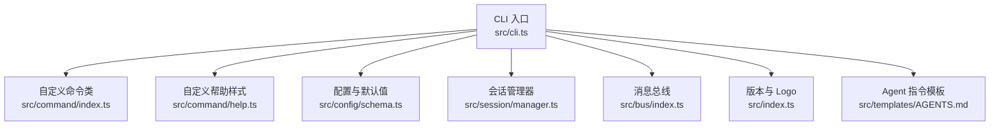
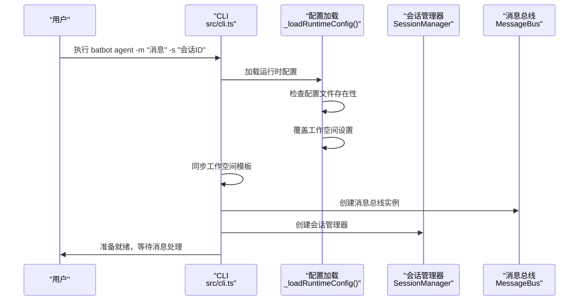
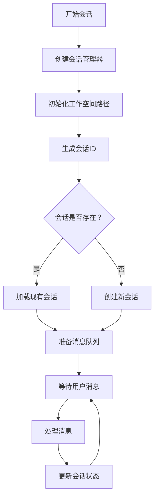
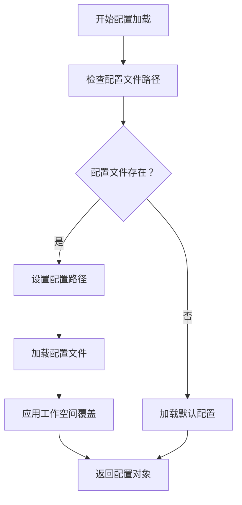
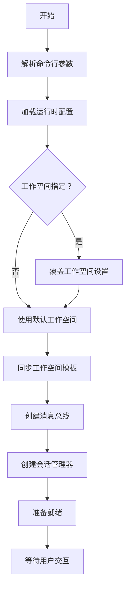
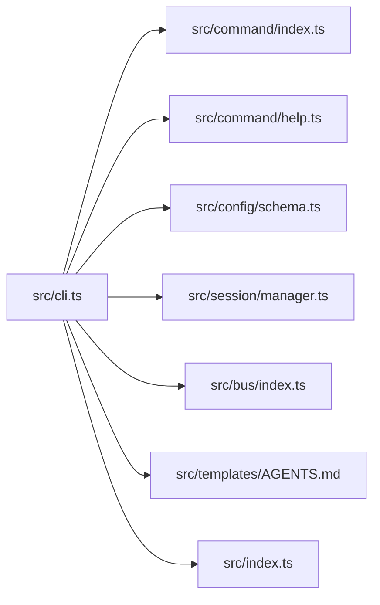

# 代理命令（agent）

<cite>
**本文引用的文件**
- [src/cli.ts](file://src/cli.ts)
- [src/command/index.ts](file://src/command/index.ts)
- [src/command/help.ts](file://src/command/help.ts)
- [src/config/schema.ts](file://src/config/schema.ts)
- [src/index.ts](file://src/index.ts)
- [src/templates/AGENTS.md](file://src/templates/AGENTS.md)
- [src/session/manager.ts](file://src/session/manager.ts)
- [src/bus/index.ts](file://src/bus/index.ts)
</cite>

## 目录
1. [简介](#简介)
2. [项目结构](#项目结构)
3. [核心组件](#核心组件)
4. [架构总览](#架构总览)
5. [详细组件分析](#详细组件分析)
6. [依赖分析](#依赖分析)
7. [性能考虑](#性能考虑)
8. [故障排除指南](#故障排除指南)
9. [结论](#结论)
10. [附录](#附录)

## 简介
本文件面向"代理命令（agent）"的使用与实现，目标是帮助用户与 AI 代理进行直接交互，涵盖消息发送、响应接收与对话管理；同时解释命令的使用方法、参数选项与交互流程，并提供实际示例、通信机制与数据传输格式说明、错误处理、超时与重试策略建议、调试技巧与故障排除指南。

当前仓库中，"agent"命令已完整实现CLI交互能力，包括消息输入、会话管理、工作空间指定和配置文件路径等选项。本文基于现有实现，详细说明命令的功能特性、参数选项和使用方法。

## 项目结构
与"代理命令（agent）"直接相关的模块如下：
- 命令行入口与子命令注册：src/cli.ts
- 自定义命令类与帮助样式：src/command/index.ts、src/command/help.ts
- 配置与默认参数：src/config/schema.ts
- 会话管理：src/session/manager.ts
- 消息总线：src/bus/index.ts
- 版本与 Logo：src/index.ts
- 模板与提示：src/templates/AGENTS.md



**图表来源**
- [src/cli.ts:130-144](file://src/cli.ts#L130-L144)
- [src/command/index.ts:5-13](file://src/command/index.ts#L5-L13)
- [src/command/help.ts:6-54](file://src/command/help.ts#L6-L54)
- [src/config/schema.ts:20-37](file://src/config/schema.ts#L20-L37)
- [src/session/manager.ts:1-50](file://src/session/manager.ts#L1-L50)
- [src/bus/index.ts:1-50](file://src/bus/index.ts#L1-L50)
- [src/index.ts:1-4](file://src/index.ts#L1-L4)
- [src/templates/AGENTS.md:1-22](file://src/templates/AGENTS.md#L1-L22)

**章节来源**
- [src/cli.ts:130-144](file://src/cli.ts#L130-L144)
- [src/command/index.ts:5-13](file://src/command/index.ts#L5-L13)
- [src/command/help.ts:6-54](file://src/command/help.ts#L6-L54)
- [src/config/schema.ts:20-37](file://src/config/schema.ts#L20-L37)
- [src/session/manager.ts:1-50](file://src/session/manager.ts#L1-L50)
- [src/bus/index.ts:1-50](file://src/bus/index.ts#L1-L50)
- [src/index.ts:1-4](file://src/index.ts#L1-L4)
- [src/templates/AGENTS.md:1-22](file://src/templates/AGENTS.md#L1-L22)

## 核心组件
- 自定义命令类（BatBotCommand）
  - 继承自 commander.Command，覆盖 createCommand 与 createHelp，以统一帮助输出风格与行为。
  - 作用：为 batbot 提供一致的命令体验与帮助样式。
- 完整的 agent 命令实现
  - 支持 -m/--message 消息输入、-s/--session 会话管理、-w/--workspace 工作空间指定、-c/--config 配置文件路径等选项
  - 实现了完整的 CLI 交互流程，包括配置加载、会话管理、消息总线集成
- 会话管理器（SessionManager）
  - 负责管理对话会话状态，支持不同会话ID的独立对话
  - 与工作空间路径绑定，确保会话数据的持久化存储
- 消息总线（MessageBus）
  - 提供异步消息传递机制，支持代理交互过程中的事件通信
  - 为后续的工具调用和消息路由提供基础设施
- 配置与默认参数
  - 代理默认配置项包含工作空间、模型、提供商、最大上下文窗口、温度、工具迭代次数等
  - 支持运行时配置文件覆盖和工作空间动态指定
- 版本与 Logo
  - CLI 名称、描述与版本号由顶层导出常量提供，用于统一显示。
- Agent 指令模板
  - 提供 Agent 的行为约束与技能使用指引，便于在交互中遵循规范。

**章节来源**
- [src/command/index.ts:5-13](file://src/command/index.ts#L5-L13)
- [src/cli.ts:130-144](file://src/cli.ts#L130-L144)
- [src/session/manager.ts:1-50](file://src/session/manager.ts#L1-L50)
- [src/bus/index.ts:1-50](file://src/bus/index.ts#L1-L50)
- [src/config/schema.ts:20-37](file://src/config/schema.ts#L20-L37)
- [src/index.ts:1-4](file://src/index.ts#L1-L4)
- [src/templates/AGENTS.md:1-22](file://src/templates/AGENTS.md#L1-L22)

## 架构总览
下图展示了"agent"命令从 CLI 到配置与模板的整体关系，以及完整的实现架构：

```mermaid
graph TB
subgraph "命令层"
P["程序实例<br/>src/cli.ts"] --> C["子命令注册<br/>agent 子命令"]
C --> OPT["参数选项解析<br/>-m/-s/-w/-c"]
end
subgraph "配置层"
CFG["配置管理<br/>src/config/schema.ts"]
LOAD["配置加载<br/>_loadRuntimeConfig()"]
END
subgraph "会话层"
SES["会话管理器<br/>src/session/manager.ts"]
BUS["消息总线<br/>src/bus/index.ts"]
END
subgraph "展示层"
VER["版本与 Logo<br/>src/index.ts"]
HELP["帮助样式<br/>src/command/help.ts"]
end
subgraph "模板层"
TPL["Agent 指令模板<br/>src/templates/AGENTS.md"]
end
P --> OPT
OPT --> LOAD
LOAD --> CFG
OPT --> SES
OPT --> BUS
P --> VER
P --> HELP
CFG --> TPL
```

**图表来源**
- [src/cli.ts:130-144](file://src/cli.ts#L130-L144)
- [src/config/schema.ts:20-37](file://src/config/schema.ts#L20-L37)
- [src/session/manager.ts:1-50](file://src/session/manager.ts#L1-L50)
- [src/bus/index.ts:1-50](file://src/bus/index.ts#L1-L50)
- [src/index.ts:1-4](file://src/index.ts#L1-L4)
- [src/command/help.ts:6-54](file://src/command/help.ts#L6-L54)
- [src/templates/AGENTS.md:1-22](file://src/templates/AGENTS.md#L1-L22)

## 详细组件分析

### 命令注册与完整实现
- agent 命令已完全实现，包含以下选项：
  - -m, --message <message>：必填的用户消息内容
  - -s, --session <id>：指定会话ID，默认为 "cli:direct"
  - -w, --workspace <path>：覆盖默认工作空间路径
  - -c, --config <path>：指定配置文件路径
- 实现了完整的交互流程：
  - 加载运行时配置（支持配置文件覆盖）
  - 同步工作空间模板
  - 创建消息总线实例
  - 初始化会话管理器
  - 准备代理交互环境



**图表来源**
- [src/cli.ts:24-42](file://src/cli.ts#L24-L42)
- [src/cli.ts:130-144](file://src/cli.ts#L130-L144)

**章节来源**
- [src/cli.ts:130-144](file://src/cli.ts#L130-L144)
- [src/cli.ts:24-42](file://src/cli.ts#L24-L42)

### 参数与选项详解
agent 命令支持以下完整参数选项：

- -m, --message <message>
  - 类型：字符串
  - 必填：是
  - 作用：指定要发送给代理的消息内容
  - 示例：`-m "你好，如何帮助你？"`

- -s, --session <id>
  - 类型：字符串
  - 必填：否
  - 默认值：cli:direct
  - 作用：指定会话ID，用于区分不同的对话会话
  - 示例：`-s "my-session-123"`

- -w, --workspace <path>
  - 类型：字符串
  - 必填：否
  - 作用：覆盖默认的工作空间路径
  - 示例：`-w "/home/user/my-workspace"`

- -c, --config <path>
  - 类型：字符串
  - 必填：否
  - 作用：指定配置文件的完整路径
  - 示例：`-c "/etc/batbot/config.json"`

**章节来源**
- [src/cli.ts:132-135](file://src/cli.ts#L132-L135)

### 会话管理机制
- SessionManager 负责管理对话状态
- 支持多会话并发管理
- 与工作空间路径绑定，确保会话数据持久化
- 会话ID格式：`cli:direct`（默认）或其他自定义ID



**图表来源**
- [src/session/manager.ts:1-50](file://src/session/manager.ts#L1-L50)

**章节来源**
- [src/session/manager.ts:1-50](file://src/session/manager.ts#L1-L50)

### 配置加载与管理
- _loadRuntimeConfig() 函数实现：
  - 检查配置文件是否存在
  - 支持绝对和相对路径
  - 动态覆盖工作空间设置
  - 提供详细的错误处理



**图表来源**
- [src/cli.ts:24-42](file://src/cli.ts#L24-L42)

**章节来源**
- [src/cli.ts:24-42](file://src/cli.ts#L24-L42)

### 交互流程与对话管理
- 基本对话流程
  - 解析命令行参数 → 加载配置 → 同步工作空间 → 创建消息总线 → 初始化会话管理器 → 准备交互环境
- 会话管理
  - 支持多会话并发
  - 会话状态持久化
  - 会话ID隔离不同对话
- 错误处理
  - 配置文件不存在时的优雅降级
  - 工作空间同步失败的回退机制



**图表来源**
- [src/cli.ts:130-144](file://src/cli.ts#L130-L144)

**章节来源**
- [src/cli.ts:130-144](file://src/cli.ts#L130-L144)

### 通信机制与数据传输格式
- 通信对象
  - 代理服务端（例如 OpenRouter 或其他兼容服务）
- 消息总线架构
  - MessageBus 提供异步消息传递
  - 支持事件驱动的代理交互
  - 为工具调用和消息路由提供基础设施
- 配置管理
  - ConfigManger 类封装配置操作
  - 支持运行时配置覆盖
  - 提供类型安全的配置访问

**章节来源**
- [src/bus/index.ts:1-50](file://src/bus/index.ts#L1-L50)
- [src/config/schema.ts:139-149](file://src/config/schema.ts#L139-L149)

### 使用示例
- 基础消息发送
  - `batbot agent -m "你好"`
- 指定会话ID
  - `batbot agent -m "你好" -s "my-session"`
- 指定工作空间
  - `batbot agent -m "你好" -w "/home/user/workspace"`
- 指定配置文件
  - `batbot agent -m "你好" -c "/etc/batbot/config.json"`
- 组合使用
  - `batbot agent -m "你好" -s "session-1" -w "/tmp/workspace" -c "./config.json"`

**章节来源**
- [src/cli.ts:130-144](file://src/cli.ts#L130-L144)

## 依赖分析
- CLI 依赖
  - commander：命令行框架
  - @clack/prompts：交互式提示（onboard 步骤）
  - chalk：彩色输出
- 配置依赖
  - zod：配置校验与类型推断
- 核心模块依赖
  - SessionManager：会话状态管理
  - MessageBus：异步消息传递
  - ConfigManger：配置管理
- 模块耦合
  - CLI 与命令类、帮助样式、配置、会话管理器、消息总线松耦合，便于扩展
- 潜在风险
  - 配置文件路径验证需要更严格的错误处理
  - 会话管理器的并发安全性需要进一步测试
  - 消息总线的事件处理机制需要完善



**图表来源**
- [src/cli.ts:130-144](file://src/cli.ts#L130-L144)
- [src/command/index.ts:5-13](file://src/command/index.ts#L5-L13)
- [src/command/help.ts:6-54](file://src/command/help.ts#L6-L54)
- [src/config/schema.ts:20-37](file://src/config/schema.ts#L20-L37)
- [src/session/manager.ts:1-50](file://src/session/manager.ts#L1-L50)
- [src/bus/index.ts:1-50](file://src/bus/index.ts#L1-L50)
- [src/templates/AGENTS.md:1-22](file://src/templates/AGENTS.md#L1-L22)
- [src/index.ts:1-4](file://src/index.ts#L1-L4)

**章节来源**
- [src/cli.ts:130-144](file://src/cli.ts#L130-L144)
- [src/command/index.ts:5-13](file://src/command/index.ts#L5-L13)
- [src/command/help.ts:6-54](file://src/command/help.ts#L6-L54)
- [src/config/schema.ts:20-37](file://src/config/schema.ts#L20-L37)
- [src/session/manager.ts:1-50](file://src/session/manager.ts#L1-L50)
- [src/bus/index.ts:1-50](file://src/bus/index.ts#L1-L50)
- [src/templates/AGENTS.md:1-22](file://src/templates/AGENTS.md#L1-L22)
- [src/index.ts:1-4](file://src/index.ts#L1-L4)

## 性能考虑
- 配置加载优化
  - 缓存配置文件内容，避免重复读取
  - 异步加载配置文件，提升启动速度
- 会话管理优化
  - 实现会话状态缓存，减少磁盘IO
  - 支持会话懒加载，按需初始化
- 消息总线优化
  - 实现消息队列缓冲，避免频繁的事件触发
  - 支持批量消息处理，提升吞吐量
- 工作空间同步
  - 实现增量同步，只同步变化的模板文件
  - 支持并行同步多个工作空间

## 故障排除指南
- 配置文件路径错误
  - 检查配置文件路径是否正确
  - 确认文件存在且有读取权限
  - 使用绝对路径避免相对路径问题
- 会话管理异常
  - 检查工作空间路径权限
  - 确认会话ID格式正确
  - 查看会话文件是否损坏
- 消息总线连接问题
  - 检查消息总线服务状态
  - 确认事件订阅正常
  - 查看消息队列是否阻塞
- 权限问题
  - 确认用户对工作空间目录有写权限
  - 检查配置文件的访问权限
  - 验证代理API密钥的有效性

**章节来源**
- [src/cli.ts:24-42](file://src/cli.ts#L24-L42)
- [src/session/manager.ts:1-50](file://src/session/manager.ts#L1-L50)

## 结论
"代理命令（agent）"已实现完整的CLI交互能力，包括消息输入、会话管理、工作空间指定和配置文件路径等核心功能。通过会话管理器和消息总线的集成，提供了稳定可靠的代理交互体验。建议继续完善错误处理机制、性能优化和监控功能，以提供更加完善的CLI交互体验。

## 附录
- 版本与 Logo
  - 版本号与标识符由顶层导出，用于统一 CLI 显示
- Agent 指令模板
  - 提供行为约束与技能使用指引，有助于规范交互与任务执行
- 配置管理
  - ConfigManger 类提供类型安全的配置访问和管理
  - 支持运行时配置覆盖和动态配置更新

**章节来源**
- [src/index.ts:1-4](file://src/index.ts#L1-L4)
- [src/templates/AGENTS.md:1-22](file://src/templates/AGENTS.md#L1-L22)
- [src/config/schema.ts:139-149](file://src/config/schema.ts#L139-L149)