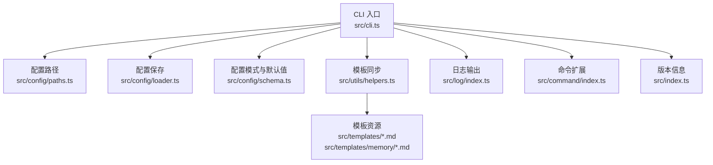
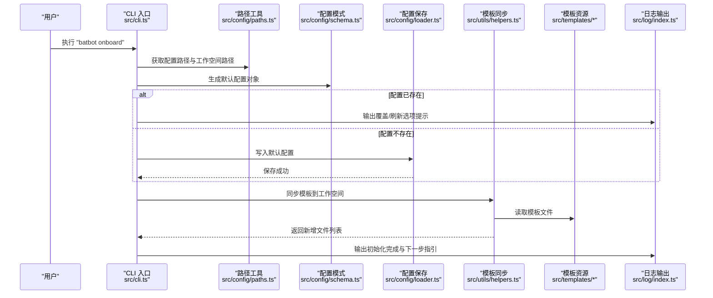
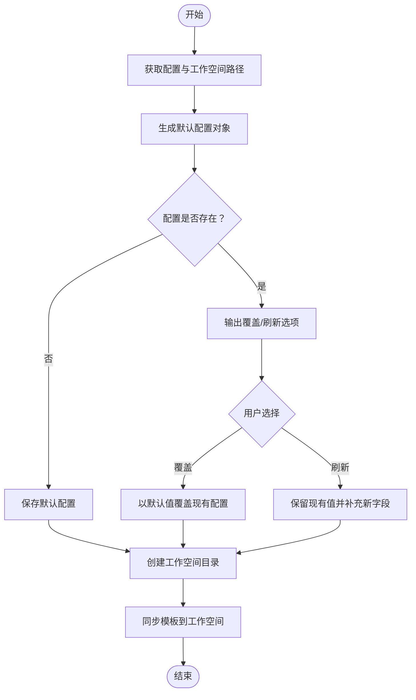
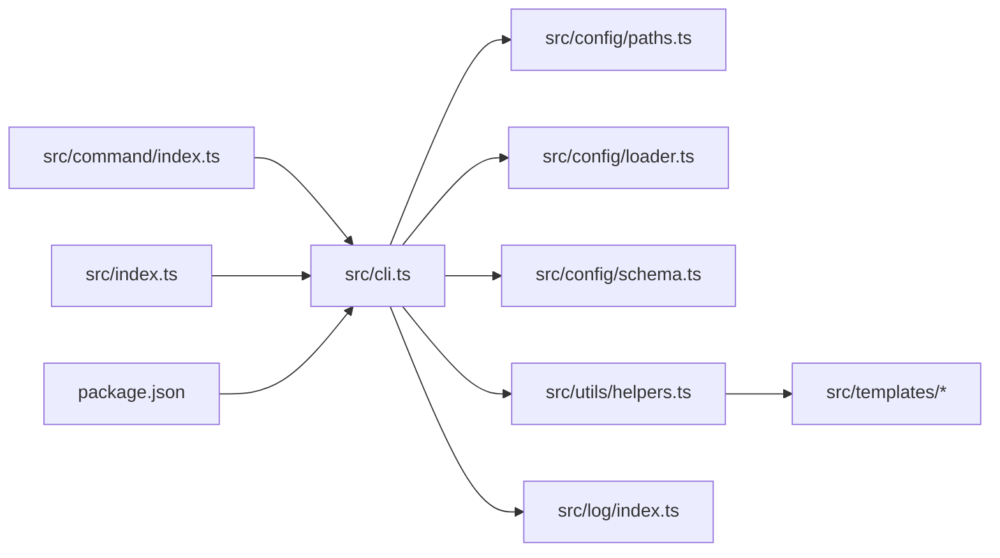

# 初始化命令（onboard）

<cite>
**本文引用的文件**
- [cli.ts](file://src/cli.ts)
- [index.ts](file://src/index.ts)
- [paths.ts](file://src/config/paths.ts)
- [loader.ts](file://src/config/loader.ts)
- [schema.ts](file://src/config/schema.ts)
- [helpers.ts](file://src/utils/helpers.ts)
- [index.ts](file://src/command/index.ts)
- [index.ts](file://src/log/index.ts)
- [package.json](file://package.json)
- [MEMORY.md](file://src/templates/memory/MEMORY.md)
- [AGENTS.md](file://src/templates/AGENTS.md)
</cite>

## 目录
1. [简介](#简介)
2. [项目结构](#项目结构)
3. [核心组件](#核心组件)
4. [架构总览](#架构总览)
5. [详细组件分析](#详细组件分析)
6. [依赖关系分析](#依赖关系分析)
7. [性能考量](#性能考量)
8. [故障排查指南](#故障排查指南)
9. [结论](#结论)
10. [附录](#附录)

## 简介
本节介绍 batbot 的 onboard 初始化命令，用于在用户首次安装或重置时，自动完成以下任务：
- 检查并生成默认配置文件
- 创建工作空间目录
- 同步模板文件到工作空间
- 输出下一步操作指引

该命令会根据目标主机的用户目录生成默认配置与工作空间路径，并在必要时提示用户选择覆盖或保留策略。

## 项目结构
与 onboard 命令直接相关的模块与职责如下：
- CLI 入口：解析命令、注册 onboard 子命令并执行初始化逻辑
- 配置管理：负责配置路径、默认值生成与保存
- 工具函数：负责模板同步与工作空间目录创建
- 日志系统：统一输出信息、警告与成功提示
- 模板资源：提供默认模板文件，供同步到工作空间

图表来源
- [cli.ts:1-94](file://src/cli.ts#L1-L94)
- [paths.ts:1-11](file://src/config/paths.ts#L1-L11)
- [loader.ts:1-16](file://src/config/loader.ts#L1-L16)
- [schema.ts:1-146](file://src/config/schema.ts#L1-L146)
- [helpers.ts:1-47](file://src/utils/helpers.ts#L1-L47)
- [index.ts:1-49](file://src/log/index.ts#L1-L49)
- [index.ts:1-16](file://src/command/index.ts#L1-L16)
- [index.ts:1-4](file://src/index.ts#L1-L4)

章节来源
- [cli.ts:1-94](file://src/cli.ts#L1-L94)
- [paths.ts:1-11](file://src/config/paths.ts#L1-L11)
- [loader.ts:1-16](file://src/config/loader.ts#L1-L16)
- [schema.ts:1-146](file://src/config/schema.ts#L1-L146)
- [helpers.ts:1-47](file://src/utils/helpers.ts#L1-L47)
- [index.ts:1-49](file://src/log/index.ts#L1-L49)
- [index.ts:1-16](file://src/command/index.ts#L1-L16)
- [index.ts:1-4](file://src/index.ts#L1-L4)

## 核心组件
- CLI 子命令注册与执行：在 CLI 入口中注册 onboard 子命令，解析执行初始化流程
- 配置路径与默认值：通过路径工具确定配置与工作空间位置；通过配置模式生成默认配置
- 配置保存：确保配置目录存在并写入默认配置
- 模板同步：扫描内置模板，复制到工作空间，缺失即创建
- 日志输出：统一输出初始化进度与后续指引

章节来源
- [cli.ts:21-56](file://src/cli.ts#L21-L56)
- [paths.ts:4-10](file://src/config/paths.ts#L4-L10)
- [loader.ts:6-15](file://src/config/loader.ts#L6-L15)
- [schema.ts:118-128](file://src/config/schema.ts#L118-L128)
- [helpers.ts:11-46](file://src/utils/helpers.ts#L11-L46)
- [index.ts:5-44](file://src/log/index.ts#L5-L44)

## 架构总览
下图展示 onboard 命令从注册到执行的关键交互：

图表来源
- [cli.ts:24-56](file://src/cli.ts#L24-L56)
- [paths.ts:4-10](file://src/config/paths.ts#L4-L10)
- [schema.ts:118-128](file://src/config/schema.ts#L118-L128)
- [loader.ts:6-15](file://src/config/loader.ts#L6-L15)
- [helpers.ts:11-46](file://src/utils/helpers.ts#L11-L46)
- [index.ts:5-44](file://src/log/index.ts#L5-L44)

## 详细组件分析

### onboard 命令执行流程
- 路径检查：获取配置路径与工作空间路径
- 默认配置生成：使用配置模式生成默认配置对象
- 配置处理分支：
  - 若配置已存在：输出覆盖与刷新两种模式的提示
  - 若配置不存在：直接保存默认配置
- 工作空间创建：若目录不存在则递归创建
- 模板同步：扫描模板目录，复制 .md 文件到工作空间；同时创建 memory 目录与 HISTORY.md
- 完成提示：输出 batbot 就绪信息与下一步操作指引

图表来源
- [cli.ts:24-56](file://src/cli.ts#L24-L56)
- [paths.ts:4-10](file://src/config/paths.ts#L4-L10)
- [schema.ts:118-128](file://src/config/schema.ts#L118-L128)
- [loader.ts:6-15](file://src/config/loader.ts#L6-L15)
- [helpers.ts:11-46](file://src/utils/helpers.ts#L11-L46)

章节来源
- [cli.ts:24-56](file://src/cli.ts#L24-L56)
- [paths.ts:4-10](file://src/config/paths.ts#L4-L10)
- [schema.ts:118-128](file://src/config/schema.ts#L118-L128)
- [loader.ts:6-15](file://src/config/loader.ts#L6-L15)
- [helpers.ts:11-46](file://src/utils/helpers.ts#L11-L46)

### 配置路径与默认值
- 配置路径：位于用户主目录下的 .batbot/config.json
- 工作空间路径：位于用户主目录下的 .batbot/workspace
- 默认配置：由配置模式生成，包含 agents、channels、providers、gateway、tools 等键的默认值
- 配置保存：确保配置目录存在后写入 JSON，默认缩进格式化

章节来源
- [paths.ts:4-10](file://src/config/paths.ts#L4-L10)
- [schema.ts:118-128](file://src/config/schema.ts#L118-L128)
- [loader.ts:6-15](file://src/config/loader.ts#L6-L15)

### 模板同步机制
- 模板来源：src/templates 下的 .md 文件与 memory 目录
- 同步策略：
  - 若目标工作空间中不存在对应文件，则创建并复制内容
  - 特殊处理 memory/MEMORY.md 与 memory/HISTORY.md
  - 确保 skills 目录存在
- 输出行为：非静默模式下逐项输出新增文件名

章节来源
- [helpers.ts:11-46](file://src/utils/helpers.ts#L11-L46)
- [MEMORY.md:1-24](file://src/templates/memory/MEMORY.md#L1-L24)
- [AGENTS.md:1-22](file://src/templates/AGENTS.md#L1-L22)

### 日志与用户提示
- 日志级别：info、success、warn、error、debug、gray 等
- onboard 中的提示包括：
  - 配置已存在时的覆盖/刷新选项说明
  - 成功创建配置与工作空间的提示
  - 模板同步后的新增文件列表
  - 初始化完成后下一步操作指引

章节来源
- [index.ts:5-44](file://src/log/index.ts#L5-L44)
- [cli.ts:30-56](file://src/cli.ts#L30-L56)

### 命令注册与帮助
- 自定义命令类：继承 commander.Command，重写 createHelp 以支持自定义帮助
- onboard 注册：在 CLI 入口中注册子命令并绑定 action

章节来源
- [index.ts:5-12](file://src/command/index.ts#L5-L12)
- [cli.ts:21-23](file://src/cli.ts#L21-L23)

## 依赖关系分析
- CLI 依赖配置路径、配置保存、配置模式、模板同步与日志模块
- 模板同步依赖模板资源目录
- 日志模块被 CLI 与模板同步共同使用

图表来源
- [cli.ts:1-94](file://src/cli.ts#L1-L94)
- [paths.ts:1-11](file://src/config/paths.ts#L1-L11)
- [loader.ts:1-16](file://src/config/loader.ts#L1-L16)
- [schema.ts:1-146](file://src/config/schema.ts#L1-L146)
- [helpers.ts:1-47](file://src/utils/helpers.ts#L1-L47)
- [index.ts:1-49](file://src/log/index.ts#L1-L49)
- [index.ts:1-16](file://src/command/index.ts#L1-L16)
- [index.ts:1-4](file://src/index.ts#L1-L4)
- [package.json:1-35](file://package.json#L1-L35)

章节来源
- [cli.ts:1-94](file://src/cli.ts#L1-L94)
- [paths.ts:1-11](file://src/config/paths.ts#L1-L11)
- [loader.ts:1-16](file://src/config/loader.ts#L1-L16)
- [schema.ts:1-146](file://src/config/schema.ts#L1-L146)
- [helpers.ts:1-47](file://src/utils/helpers.ts#L1-L47)
- [index.ts:1-49](file://src/log/index.ts#L1-L49)
- [index.ts:1-16](file://src/command/index.ts#L1-L16)
- [index.ts:1-4](file://src/index.ts#L1-L4)
- [package.json:1-35](file://package.json#L1-L35)

## 性能考量
- 模板同步为一次性文件操作，文件数量有限，性能开销可忽略
- 仅在配置不存在时进行写入，避免重复 IO
- 使用递归创建目录，减少多次调用

## 故障排查指南
- 权限不足导致无法创建配置或工作空间
  - 现象：报错提示无权限
  - 处理：确认用户主目录可写，或以管理员身份运行
- 配置路径被占用或不可写
  - 现象：保存配置失败
  - 处理：检查目标路径权限，清理冲突文件
- 模板同步未产生新文件
  - 现象：无新增文件输出
  - 处理：确认工作空间中已有对应文件；如需强制覆盖，请先删除再执行 onboard
- 覆盖与刷新模式混淆
  - 现象：期望保留旧配置但被覆盖
  - 处理：重新执行 onboard 并选择“刷新”模式，以保留现有值并补充新字段

章节来源
- [cli.ts:30-39](file://src/cli.ts#L30-L39)
- [helpers.ts:19-29](file://src/utils/helpers.ts#L19-L29)

## 结论
onboard 初始化命令通过统一的路径、配置与模板机制，为用户提供了标准化的首次体验。其设计强调默认值的安全性与可扩展性，并通过清晰的日志输出引导用户完成后续配置与使用。

## 附录

### 使用示例
- 基本用法
  - 在终端执行 batbot onboard，按提示完成初始化
- 覆盖现有配置
  - 当配置已存在时，选择覆盖选项以用默认值替换
- 保留现有配置
  - 当配置已存在时，选择刷新选项以保留现有值并补充新增字段

章节来源
- [cli.ts:30-39](file://src/cli.ts#L30-L39)

### 参数说明
- 无额外参数：onboard 为一次性初始化命令，不接受额外参数
- 行为差异
  - 覆盖：丢弃旧配置，使用默认配置
  - 刷新：保留旧配置，仅补充新增字段

章节来源
- [cli.ts:30-39](file://src/cli.ts#L30-L39)

### 最佳实践
- 首次安装后务必在配置文件中添加 API 密钥
- 如需自定义工作空间路径，可在配置中调整 agents.default.workspace
- 定期检查模板同步结果，确保工作空间中的模板文件完整

章节来源
- [schema.ts:20-31](file://src/config/schema.ts#L20-L31)
- [cli.ts:50-55](file://src/cli.ts#L50-L55)