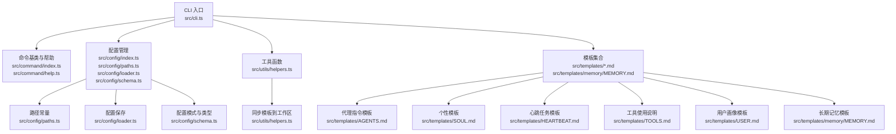
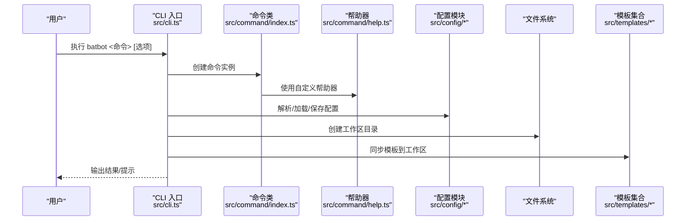
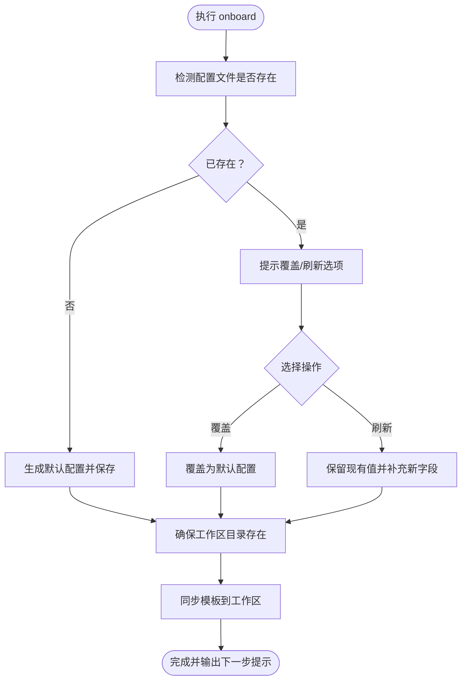
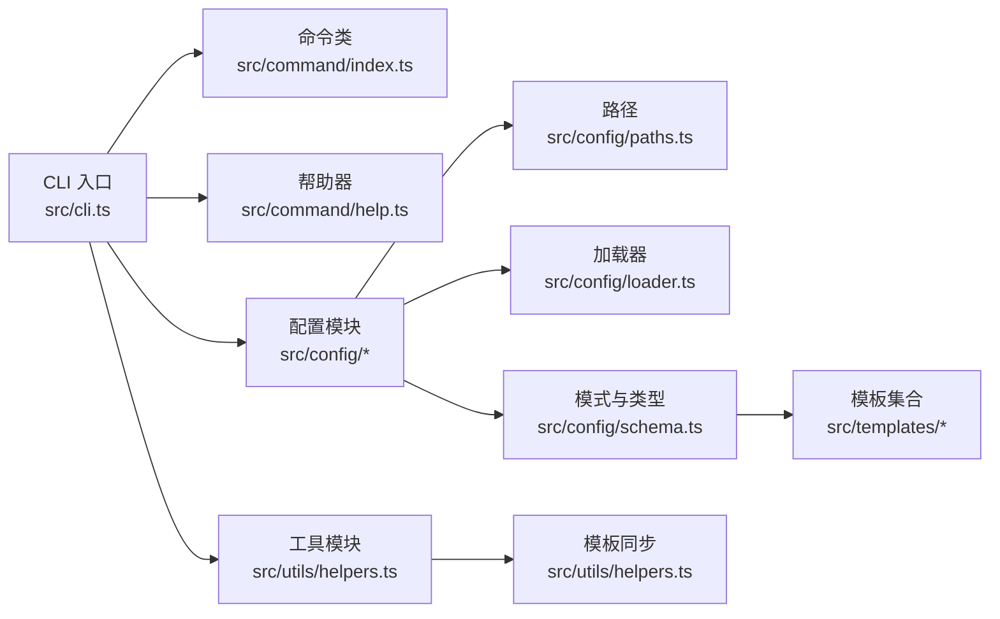

# 命令参考手册

<cite>
**本文引用的文件**
- [src/cli.ts](file://src/cli.ts)
- [src/command/index.ts](file://src/command/index.ts)
- [src/command/help.ts](file://src/command/help.ts)
- [src/index.ts](file://src/index.ts)
- [src/config/index.ts](file://src/config/index.ts)
- [src/config/paths.ts](file://src/config/paths.ts)
- [src/config/loader.ts](file://src/config/loader.ts)
- [src/config/schema.ts](file://src/config/schema.ts)
- [src/utils/helpers.ts](file://src/utils/helpers.ts)
- [src/templates/AGENTS.md](file://src/templates/AGENTS.md)
- [src/templates/SOUL.md](file://src/templates/SOUL.md)
- [src/templates/HEARTBEAT.md](file://src/templates/HEARTBEAT.md)
- [src/templates/TOOLS.md](file://src/templates/TOOLS.md)
- [src/templates/USER.md](file://src/templates/USER.md)
- [src/templates/memory/MEMORY.md](file://src/templates/memory/MEMORY.md)
</cite>

## 目录
1. [简介](#简介)
2. [项目结构](#项目结构)
3. [核心组件](#核心组件)
4. [架构总览](#架构总览)
5. [详细组件分析](#详细组件分析)
6. [依赖关系分析](#依赖关系分析)
7. [性能与可用性考量](#性能与可用性考量)
8. [故障排查指南](#故障排查指南)
9. [结论](#结论)
10. [附录：命令语法与示例](#附录命令语法与示例)

## 简介
本手册面向使用 BatBot 的用户与维护者，系统化梳理所有命令的语法、参数、选项、执行流程、返回值与错误处理，并结合配置与模板文件说明命令与系统其他组件的关系。当前仓库中已实现的命令包括：初始化命令（onboard）、代理命令（agent）、网关命令（gateway）、状态命令（status）、渠道命令（channels）与提供商命令（provider）。对于尚未完全实现的命令，本手册仍提供预期行为与最佳实践建议。

## 项目结构
- CLI 入口负责注册与解析命令；命令类通过自定义帮助器增强输出风格。
- 配置模块提供路径、加载与校验逻辑，支持默认值与分层结构。
- 工具模块负责工作区模板同步，确保首次运行时生成必要的文件与目录。
- 模板模块提供工作区内的知识与规则文件，用于指导代理行为与工具使用。

图表来源
- [src/cli.ts:1-96](file://src/cli.ts#L1-L96)
- [src/command/index.ts:1-16](file://src/command/index.ts#L1-L16)
- [src/command/help.ts:1-57](file://src/command/help.ts#L1-L57)
- [src/config/index.ts:1-3](file://src/config/index.ts#L1-L3)
- [src/config/paths.ts:1-11](file://src/config/paths.ts#L1-L11)
- [src/config/loader.ts:1-16](file://src/config/loader.ts#L1-L16)
- [src/config/schema.ts:1-146](file://src/config/schema.ts#L1-L146)
- [src/utils/helpers.ts:1-47](file://src/utils/helpers.ts#L1-L47)
- [src/templates/AGENTS.md:1-22](file://src/templates/AGENTS.md#L1-L22)
- [src/templates/SOUL.md:1-22](file://src/templates/SOUL.md#L1-L22)
- [src/templates/HEARTBEAT.md:1-17](file://src/templates/HEARTBEAT.md#L1-L17)
- [src/templates/TOOLS.md:1-16](file://src/templates/TOOLS.md#L1-L16)
- [src/templates/USER.md:1-50](file://src/templates/USER.md#L1-L50)
- [src/templates/memory/MEMORY.md:1-24](file://src/templates/memory/MEMORY.md#L1-L24)

章节来源
- [src/cli.ts:1-96](file://src/cli.ts#L1-L96)
- [src/command/index.ts:1-16](file://src/command/index.ts#L1-L16)
- [src/command/help.ts:1-57](file://src/command/help.ts#L1-L57)
- [src/config/index.ts:1-3](file://src/config/index.ts#L1-L3)
- [src/config/paths.ts:1-11](file://src/config/paths.ts#L1-L11)
- [src/config/loader.ts:1-16](file://src/config/loader.ts#L1-L16)
- [src/config/schema.ts:1-146](file://src/config/schema.ts#L1-L146)
- [src/utils/helpers.ts:1-47](file://src/utils/helpers.ts#L1-L47)
- [src/templates/AGENTS.md:1-22](file://src/templates/AGENTS.md#L1-L22)
- [src/templates/SOUL.md:1-22](file://src/templates/SOUL.md#L1-L22)
- [src/templates/HEARTBEAT.md:1-17](file://src/templates/HEARTBEAT.md#L1-L17)
- [src/templates/TOOLS.md:1-16](file://src/templates/TOOLS.md#L1-L16)
- [src/templates/USER.md:1-50](file://src/templates/USER.md#L1-L50)
- [src/templates/memory/MEMORY.md:1-24](file://src/templates/memory/MEMORY.md#L1-L24)

## 核心组件
- CLI 命令注册与解析：在入口文件中注册 onboard、agent、gateway、status、channels、provider 等子命令，并设置名称、描述与版本信息。
- 自定义命令类与帮助器：通过继承命令类并重写帮助器以增强输出样式与可读性。
- 配置系统：提供配置路径、加载与保存能力，以及基于 Zod 的配置模式与默认值。
- 工作区模板同步：在首次运行或需要时，将模板文件复制到用户工作区，确保必要文件存在。

章节来源
- [src/cli.ts:14-96](file://src/cli.ts#L14-L96)
- [src/command/index.ts:4-16](file://src/command/index.ts#L4-L16)
- [src/command/help.ts:6-57](file://src/command/help.ts#L6-L57)
- [src/config/paths.ts:4-11](file://src/config/paths.ts#L4-L11)
- [src/config/loader.ts:6-16](file://src/config/loader.ts#L6-L16)
- [src/utils/helpers.ts:11-47](file://src/utils/helpers.ts#L11-L47)

## 架构总览
下图展示了 CLI、配置与模板之间的交互关系，以及命令在运行时如何影响工作区与配置文件。

图表来源
- [src/cli.ts:14-96](file://src/cli.ts#L14-L96)
- [src/command/index.ts:4-16](file://src/command/index.ts#L4-L16)
- [src/command/help.ts:6-57](file://src/command/help.ts#L6-L57)
- [src/config/index.ts:1-3](file://src/config/index.ts#L1-L3)
- [src/config/paths.ts:4-11](file://src/config/paths.ts#L4-L11)
- [src/config/loader.ts:6-16](file://src/config/loader.ts#L6-L16)
- [src/utils/helpers.ts:11-47](file://src/utils/helpers.ts#L11-L47)

## 详细组件分析

### 初始化命令 onboard
- 命令定位：注册于 CLI 入口，作为系统初始化入口。
- 主要功能：
  - 检测配置文件是否存在，若不存在则创建默认配置并保存；若存在则提示覆盖或刷新策略。
  - 确保工作区目录存在，不存在则创建。
  - 将模板集合同步到工作区，生成必要的文件与目录。
  - 输出后续步骤提示，引导用户添加 API Key 并开始对话。
- 参数与选项：
  - 当前实现未定义额外参数与选项，行为由交互式确认与默认配置决定。
- 执行流程：

图表来源
- [src/cli.ts:24-58](file://src/cli.ts#L24-L58)
- [src/config/loader.ts:6-16](file://src/config/loader.ts#L6-L16)
- [src/config/schema.ts:118-129](file://src/config/schema.ts#L118-L129)
- [src/utils/helpers.ts:11-47](file://src/utils/helpers.ts#L11-L47)

- 返回值与错误处理：
  - 成功：输出成功日志与下一步指引。
  - 失败：若文件系统操作失败（如权限不足），将抛出异常并中断流程。
- 组合使用与最佳实践：
  - 在首次安装后，先执行 onboard，再编辑配置文件中的 API Key，最后使用 agent 进行对话。
  - 若已有配置但希望保留旧值仅补充新字段，选择“刷新”选项。
- 内部实现原理与关联组件：
  - 依赖配置模式与默认值生成，确保字段完整性。
  - 依赖模板同步工具，保证工作区具备必要的知识与规则文件。

章节来源
- [src/cli.ts:24-58](file://src/cli.ts#L24-L58)
- [src/config/loader.ts:6-16](file://src/config/loader.ts#L6-L16)
- [src/config/schema.ts:118-129](file://src/config/schema.ts#L118-L129)
- [src/utils/helpers.ts:11-47](file://src/utils/helpers.ts#L11-L47)

### 代理命令 agent
- 命令定位：注册于 CLI 入口，用于直接与代理交互。
- 主要功能：
  - 当前实现为占位，输出交互提示。
- 参数与选项：
  - 当前实现未定义参数与选项。
- 执行流程与预期行为：
  - 后续可扩展为接收消息输入、调用代理模型、返回响应等。
- 组合使用与最佳实践：
  - 结合工作区内的 USER、SOUL、AGENTS 等模板，提升个性化与上下文质量。
- 内部实现原理与关联组件：
  - 与配置中的代理默认项、工具限制、心跳等配置相关联。

章节来源
- [src/cli.ts:68-72](file://src/cli.ts#L68-L72)
- [src/config/schema.ts:20-37](file://src/config/schema.ts#L20-L37)
- [src/templates/AGENTS.md:1-22](file://src/templates/AGENTS.md#L1-L22)
- [src/templates/SOUL.md:1-22](file://src/templates/SOUL.md#L1-L22)
- [src/templates/USER.md:1-50](file://src/templates/USER.md#L1-L50)

### 网关命令 gateway
- 命令定位：注册于 CLI 入口，用于启动网关服务。
- 主要功能：
  - 当前实现为占位，输出启动提示。
- 参数与选项：
  - 当前实现未定义参数与选项。
- 执行流程与预期行为：
  - 后续可扩展为绑定主机与端口、启用心跳检查、暴露 API 等。
- 组合使用与最佳实践：
  - 结合配置中的网关主机与端口、心跳间隔等参数进行部署。
- 内部实现原理与关联组件：
  - 与配置中的网关与心跳配置相关联。

章节来源
- [src/cli.ts:60-66](file://src/cli.ts#L60-L66)
- [src/config/schema.ts:67-73](file://src/config/schema.ts#L67-L73)
- [src/templates/HEARTBEAT.md:1-17](file://src/templates/HEARTBEAT.md#L1-L17)

### 状态命令 status
- 命令定位：注册于 CLI 入口，用于显示系统状态。
- 主要功能：
  - 当前实现为占位，输出状态提示。
- 参数与选项：
  - 当前实现未定义参数与选项。
- 执行流程与预期行为：
  - 后续可扩展为展示配置路径、工作区状态、代理与工具可用性等。
- 组合使用与最佳实践：
  - 与 onboard 配合，确认初始化是否成功。
- 内部实现原理与关联组件：
  - 与配置路径与工作区状态相关联。

章节来源
- [src/cli.ts:74-80](file://src/cli.ts#L74-L80)
- [src/config/paths.ts:4-11](file://src/config/paths.ts#L4-L11)

### 渠道命令 channels
- 命令定位：注册于 CLI 入口，用于管理渠道。
- 主要功能：
  - 当前实现为占位，输出管理提示。
- 参数与选项：
  - 当前实现未定义参数与选项。
- 执行流程与预期行为：
  - 后续可扩展为列出、启用/禁用、配置渠道（如钉钉）等。
- 组合使用与最佳实践：
  - 结合 ChannelsConfigSchema 中的渠道配置进行管理。
- 内部实现原理与关联组件：
  - 与 ChannelsConfigSchema 相关联。

章节来源
- [src/cli.ts:82-86](file://src/cli.ts#L82-L86)
- [src/config/schema.ts:14-18](file://src/config/schema.ts#L14-L18)

### 提供商命令 provider
- 命令定位：注册于 CLI 入口，用于管理提供商。
- 主要功能：
  - 当前实现为占位，输出管理提示。
- 参数与选项：
  - 当前实现未定义参数与选项。
- 执行流程与预期行为：
  - 后续可扩展为列出、切换、配置提供商（如 bailian）等。
- 组合使用与最佳实践：
  - 结合 ProvidersConfigSchema 与 ProviderConfigSchema 进行管理。
- 内部实现原理与关联组件：
  - 与 ProvidersConfigSchema、ProviderConfigSchema 相关联。

章节来源
- [src/cli.ts:88-93](file://src/cli.ts#L88-L93)
- [src/config/schema.ts:41-53](file://src/config/schema.ts#L41-L53)

## 依赖关系分析
- CLI 对命令类与帮助器的依赖：通过自定义命令类与帮助器统一输出风格。
- CLI 对配置模块的依赖：解析、加载与保存配置，确保命令执行前后的状态一致。
- CLI 对工具模块的依赖：在初始化阶段同步模板到工作区。
- 配置模块对路径与加载器的依赖：提供配置路径与保存能力。
- 模板模块对工作区的依赖：作为工作区内容的来源。

图表来源
- [src/cli.ts:14-96](file://src/cli.ts#L14-L96)
- [src/command/index.ts:4-16](file://src/command/index.ts#L4-L16)
- [src/command/help.ts:6-57](file://src/command/help.ts#L6-L57)
- [src/config/index.ts:1-3](file://src/config/index.ts#L1-L3)
- [src/config/paths.ts:4-11](file://src/config/paths.ts#L4-L11)
- [src/config/loader.ts:6-16](file://src/config/loader.ts#L6-L16)
- [src/config/schema.ts:1-146](file://src/config/schema.ts#L1-L146)
- [src/utils/helpers.ts:11-47](file://src/utils/helpers.ts#L11-L47)

章节来源
- [src/cli.ts:14-96](file://src/cli.ts#L14-L96)
- [src/config/index.ts:1-3](file://src/config/index.ts#L1-L3)
- [src/config/paths.ts:4-11](file://src/config/paths.ts#L4-L11)
- [src/config/loader.ts:6-16](file://src/config/loader.ts#L6-L16)
- [src/config/schema.ts:1-146](file://src/config/schema.ts#L1-L146)
- [src/utils/helpers.ts:11-47](file://src/utils/helpers.ts#L11-L47)

## 性能与可用性考量
- 首次初始化时的 I/O 操作：onboard 会进行文件系统写入与模板同步，建议在空闲时段执行，避免阻塞。
- 配置加载与校验：Zod 模式校验在运行前进行，确保配置字段完整与合法，减少运行期错误。
- 工作区隔离：工具配置可限制访问范围，降低误操作风险。
- 版本与标识：CLI 显示版本与图标，便于识别当前环境。

## 故障排查指南
- 权限问题：若保存配置或创建工作区失败，请检查用户权限与磁盘空间。
- 配置冲突：若配置文件格式不正确，将导致加载失败。请备份后重新生成默认配置。
- 模板缺失：若工作区缺少模板文件，请重新执行初始化或手动同步模板。
- 网络与超时：工具执行存在超时限制，网络请求可能受代理或防火墙影响。

章节来源
- [src/config/loader.ts:6-16](file://src/config/loader.ts#L6-L16)
- [src/utils/helpers.ts:11-47](file://src/utils/helpers.ts#L11-L47)
- [src/config/schema.ts:89-94](file://src/config/schema.ts#L89-L94)

## 结论
本手册梳理了 BatBot 的命令体系与关键组件关系，明确了各命令的当前实现与未来扩展方向。通过 onboard 完成初始化，结合配置与模板，用户可以快速搭建并使用代理、网关、渠道与提供商管理功能。建议在实际使用中遵循最佳实践，合理组织工作区内容，并根据需要逐步完善命令的参数与选项。

## 附录：命令语法与示例
- 命令通用语法
  - batbot <命令> [选项]
  - batbot -v, --version
- onboard
  - 语法：batbot onboard
  - 说明：初始化配置与工作区，同步模板文件。
  - 示例：batbot onboard
  - 注意：首次运行后需在配置文件中填写 API Key。
- agent
  - 语法：batbot agent
  - 说明：与代理交互（当前为占位）。
  - 示例：batbot agent
- gateway
  - 语法：batbot gateway
  - 说明：启动网关服务（当前为占位）。
  - 示例：batbot gateway
- status
  - 语法：batbot status
  - 说明：显示系统状态（当前为占位）。
  - 示例：batbot status
- channels
  - 语法：batbot channels
  - 说明：管理渠道（当前为占位）。
  - 示例：batbot channels
- provider
  - 语法：batbot provider
  - 说明：管理提供商（当前为占位）。
  - 示例：batbot provider

章节来源
- [src/cli.ts:16-96](file://src/cli.ts#L16-L96)
- [src/index.ts:1-4](file://src/index.ts#L1-L4)