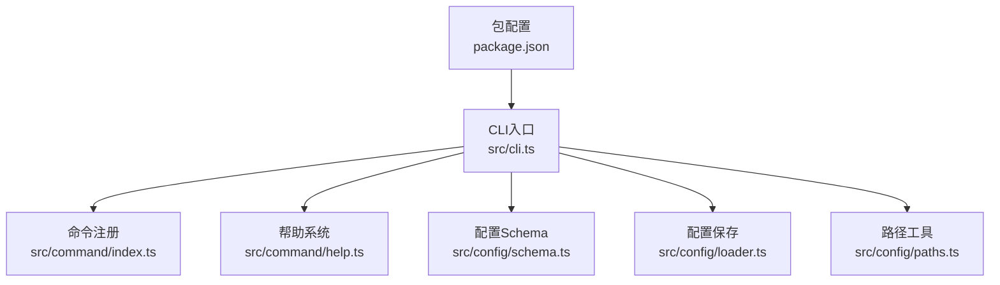
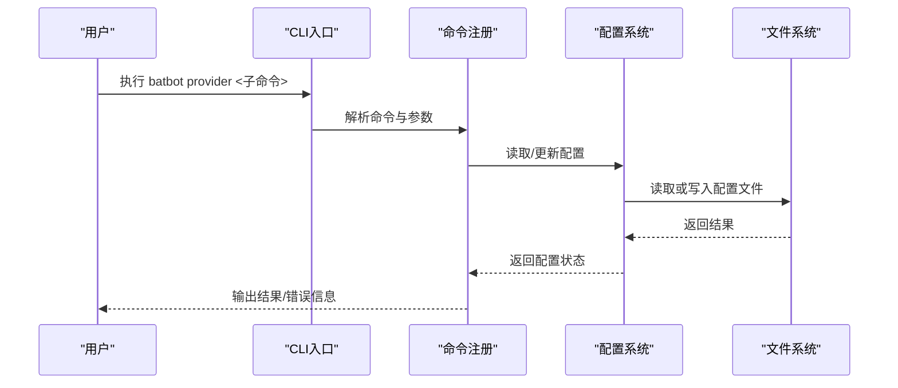
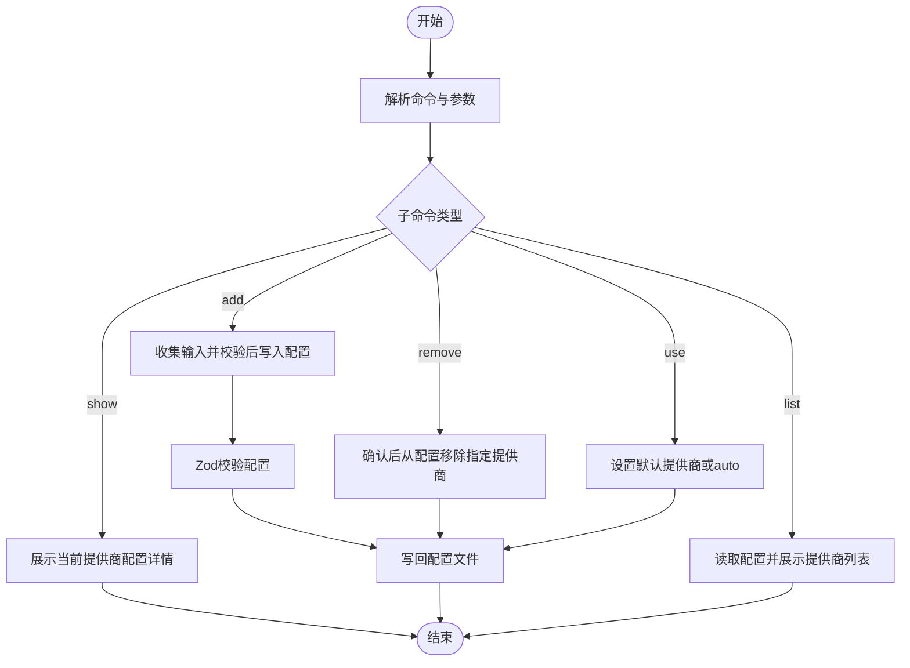
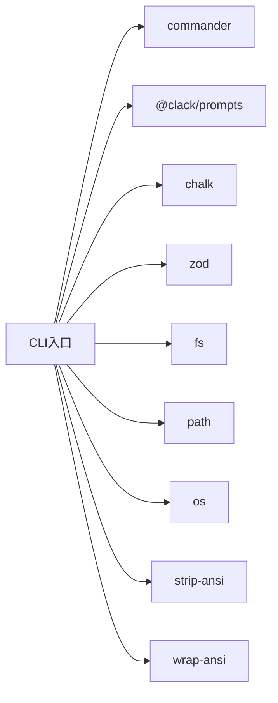

# 提供商命令 (provider)

<cite>
**本文引用的文件**
- [src/cli.ts](file://src/cli.ts)
- [src/command/index.ts](file://src/command/index.ts)
- [src/command/help.ts](file://src/command/help.ts)
- [src/config/schema.ts](file://src/config/schema.ts)
- [src/config/loader.ts](file://src/config/loader.ts)
- [src/config/paths.ts](file://src/config/paths.ts)
- [package.json](file://package.json)
</cite>

## 目录
1. [简介](#简介)
2. [项目结构](#项目结构)
3. [核心组件](#核心组件)
4. [架构总览](#架构总览)
5. [详细组件分析](#详细组件分析)
6. [依赖关系分析](#依赖关系分析)
7. [性能考虑](#性能考虑)
8. [故障排除指南](#故障排除指南)
9. [结论](#结论)
10. [附录](#附录)

## 简介
本文件面向“provider”提供商命令，系统性说明其在AI模型提供商管理中的职责与用法。当前仓库中，“provider”命令已注册到CLI入口，但尚未实现具体子命令与交互逻辑。本文基于现有代码结构与配置模式，给出“provider”命令的功能蓝图、最佳实践、成本控制建议、故障排除与降级策略，并提供可扩展的实现建议，以便后续完善“provider”命令的添加、配置、切换与删除能力。

## 项目结构
- CLI入口通过commander注册“provider”命令，当前仅输出占位提示信息。
- 配置系统采用Zod Schema定义agents、providers、tools等配置项，其中providers默认包含bailian提供商。
- 命令帮助系统自定义了颜色与排版样式，提升CLI体验。
- 包管理器定义了运行时依赖，包括commander、@clack/prompts、chalk等。

图表来源
- [src/cli.ts:15-100](file://src/cli.ts#L15-L100)
- [src/command/index.ts:1-16](file://src/command/index.ts#L1-16)
- [src/command/help.ts:1-57](file://src/command/help.ts#L1-L57)
- [src/config/schema.ts:118-126](file://src/config/schema.ts#L118-L126)
- [src/config/loader.ts:1-16](file://src/config/loader.ts#L1-L16)
- [src/config/paths.ts:1-11](file://src/config/paths.ts#L1-L11)
- [package.json:1-36](file://package.json#L1-L36)

章节来源
- [src/cli.ts:15-100](file://src/cli.ts#L15-L100)
- [src/command/index.ts:1-16](file://src/command/index.ts#L1-L16)
- [src/command/help.ts:1-57](file://src/command/help.ts#L1-L57)
- [src/config/schema.ts:118-126](file://src/config/schema.ts#L118-L126)
- [src/config/loader.ts:1-16](file://src/config/loader.ts#L1-L16)
- [src/config/paths.ts:1-11](file://src/config/paths.ts#L1-L11)
- [package.json:1-36](file://package.json#L1-L36)

## 核心组件
- CLI命令注册：在入口文件中注册“provider”命令，描述为“管理提供商”，当前动作仅输出占位信息。
- 命令定制：通过自定义Command类与BatHelp类，统一帮助输出风格与颜色。
- 配置Schema：定义providers配置结构，默认包含bailian提供商；支持apiKey、apiBase、extraHeaders等字段。
- 配置保存：提供saveConfig方法，将配置写入用户主目录下的~/.batbot/config.json。
- 路径工具：提供getConfigPath/getWorkspacePath，用于定位配置与工作区路径。

章节来源
- [src/cli.ts:94-98](file://src/cli.ts#L94-L98)
- [src/command/index.ts:5-12](file://src/command/index.ts#L5-L12)
- [src/command/help.ts:6-54](file://src/command/help.ts#L6-L54)
- [src/config/schema.ts:41-53](file://src/config/schema.ts#L41-L53)
- [src/config/loader.ts:6-15](file://src/config/loader.ts#L6-L15)
- [src/config/paths.ts:4-10](file://src/config/paths.ts#L4-L10)

## 架构总览
“provider”命令的实现应遵循以下架构思路：
- 命令层：继承commander，注册provider及其子命令（如add、remove、list、use）。
- 配置层：读取/写入配置文件，确保providers字段的正确性与一致性。
- 交互层：使用@clack/prompts进行确认与输入，结合chalk美化输出。
- 工具层：封装路径解析、配置校验、模板同步等通用能力。

图表来源
- [src/cli.ts:94-98](file://src/cli.ts#L94-L98)
- [src/config/loader.ts:6-15](file://src/config/loader.ts#L6-L15)
- [src/config/paths.ts:4-10](file://src/config/paths.ts#L4-L10)

## 详细组件分析

### 命令注册与帮助系统
- 自定义Command类：重写createCommand/createHelp，使帮助输出与整体风格一致。
- BatHelp类：覆盖标题、命令、选项、参数等文本样式，增强可读性。
- CLI入口：注册“provider”命令，描述为“管理提供商”，当前动作输出占位信息。

章节来源
- [src/command/index.ts:5-12](file://src/command/index.ts#L5-L12)
- [src/command/help.ts:6-54](file://src/command/help.ts#L6-L54)
- [src/cli.ts:94-98](file://src/cli.ts#L94-L98)

### 配置Schema与提供商字段
- ProviderConfigSchema：定义单个提供商的配置项，包括apiKey、apiBase、extraHeaders。
- ProvidersConfigSchema：定义多个提供商集合，默认包含bailian键。
- ConfigSchema：顶层配置对象，包含agents、channels、providers、gateway、tools等字段。

章节来源
- [src/config/schema.ts:41-53](file://src/config/schema.ts#L41-L53)
- [src/config/schema.ts:118-126](file://src/config/schema.ts#L118-L126)

### 配置保存与路径解析
- saveConfig：确保配置目录存在，序列化配置并写入JSON文件。
- getConfigPath/getWorkspacePath：返回用户主目录下“.batbot”路径，便于集中管理配置与工作区。

章节来源
- [src/config/loader.ts:6-15](file://src/config/loader.ts#L6-L15)
- [src/config/paths.ts:4-10](file://src/config/paths.ts#L4-L10)

### “provider”命令的实现蓝图
- 子命令设计
  - list：列出所有已配置的提供商及其简要信息。
  - add：交互式添加新提供商，要求输入名称、apiKey、apiBase、extraHeaders等。
  - remove：删除指定提供商，支持确认提示。
  - use：切换当前默认提供商（或设置为auto）。
  - show：显示当前配置的提供商详情。
- 交互流程
  - 使用@clack/prompts进行确认与输入收集。
  - 读取现有配置，合并/更新providers字段后写回。
  - 对配置进行Zod校验，确保字段类型与约束符合预期。
- 错误处理
  - API密钥为空、URL格式不合法、额外头部格式异常等情况需明确报错。
  - 文件写入失败或权限不足时，提示用户检查目录权限。

图表来源
- [src/config/schema.ts:41-53](file://src/config/schema.ts#L41-L53)
- [src/config/loader.ts:6-15](file://src/config/loader.ts#L6-L15)

## 依赖关系分析
- CLI依赖commander进行命令解析，依赖@clack/prompts与chalk进行交互与输出美化。
- 配置系统依赖zod进行类型校验，依赖fs/path/os进行文件与路径操作。
- 命令帮助系统依赖strip-ansi与wrap-ansi进行文本宽度计算与换行处理。

图表来源
- [src/cli.ts:1-14](file://src/cli.ts#L1-L14)
- [package.json:22-28](file://package.json#L22-L28)

章节来源
- [src/cli.ts:1-14](file://src/cli.ts#L1-L14)
- [package.json:22-28](file://package.json#L22-L28)

## 性能考虑
- 配置读写：尽量批量读取与写入，避免频繁IO；对大配置文件采用增量更新策略。
- 交互延迟：在交互式输入时，提供超时机制与进度反馈，避免长时间阻塞。
- 并发安全：多进程同时修改配置时，建议引入锁或原子写入，防止竞态条件。
- 日志与调试：在开发阶段开启详细日志，生产环境保持精简输出，避免影响性能。

## 故障排除指南
- 配置文件损坏
  - 现象：启动时报错或配置未生效。
  - 处理：备份原配置，使用onboard命令重建默认配置，再逐步恢复必要字段。
- API密钥无效
  - 现象：调用提供商接口失败。
  - 处理：确认apiKey是否正确、是否过期；检查apiBase与extraHeaders格式；尝试更换备用提供商。
- 权限问题
  - 现象：无法写入配置文件或工作区。
  - 处理：检查~/.batbot目录权限，确保当前用户具有读写权限。
- 网络与代理
  - 现象：请求超时或被拦截。
  - 处理：配置extraHeaders或使用代理；验证网络连通性与防火墙规则。
- 降级策略
  - 当前提供商不可用时，切换至备用提供商；若仍失败，回退到本地模型或禁用工具调用，保证基本可用性。

章节来源
- [src/cli.ts:25-63](file://src/cli.ts#L25-L63)
- [src/config/schema.ts:41-45](file://src/config/schema.ts#L41-L45)

## 结论
“provider”命令目前处于占位阶段，尚未实现具体功能。基于现有配置Schema与CLI框架，建议优先实现“list/add/remove/use/show”等子命令，并配套完善的交互与错误处理机制。通过标准化配置结构、严格的类型校验与健壮的容错策略，可为用户提供稳定、易用且可扩展的提供商管理体验。

## 附录
- 支持的提供商列表
  - 默认包含bailian提供商；后续可通过“add”命令扩展更多提供商。
- API密钥管理
  - 建议将敏感信息存储在受保护的配置中，避免硬编码；定期轮换密钥并监控使用情况。
- 配额监控
  - 在调用提供商接口时记录请求次数与费用；结合配置中的计费字段进行可视化展示。
- 模型选择与性能比较
  - 不同提供商的响应速度与质量存在差异；建议建立基准测试集，定期评估并调整默认提供商。
- 负载均衡策略
  - 可按提供商权重或健康状态进行动态分配；当某提供商达到阈值时自动切换至其他节点。
- 最佳实践与成本控制
  - 合理设置温度、上下文窗口与最大令牌数，避免不必要的资源消耗。
  - 使用缓存与预热机制减少重复请求；对高频调用进行节流与限速。
  - 定期清理历史记录与临时文件，降低存储开销。