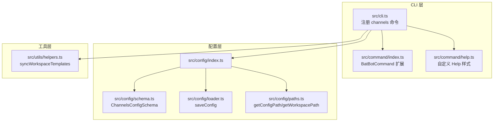
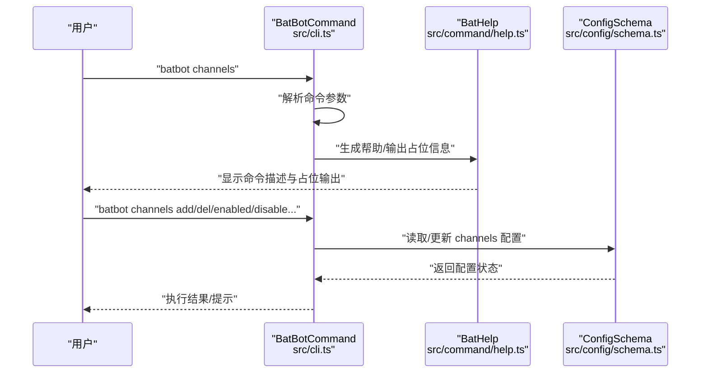
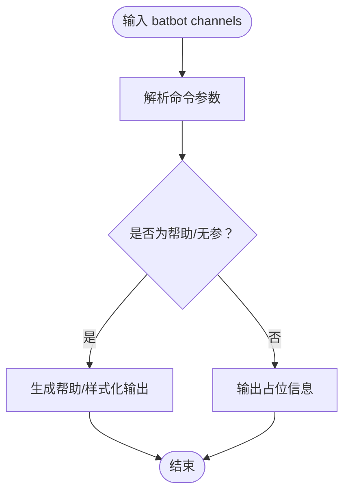
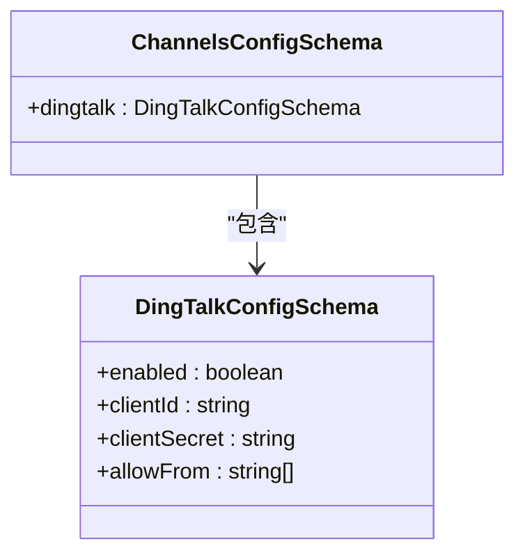
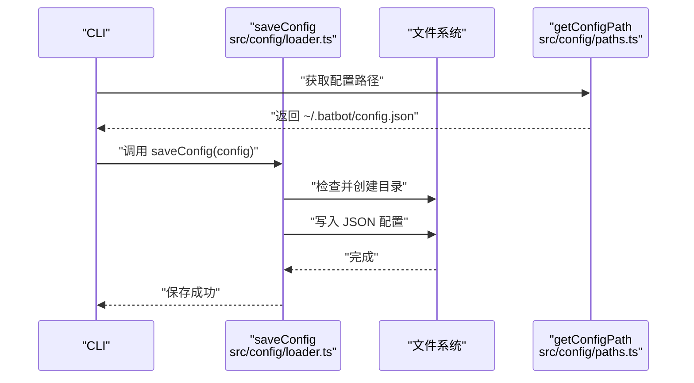
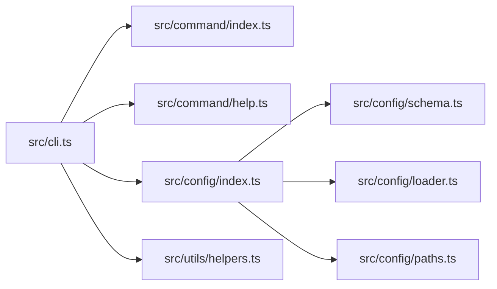

# 渠道命令 (channels)

<cite>
**本文引用的文件**
- [src/cli.ts](file://src/cli.ts)
- [src/command/index.ts](file://src/command/index.ts)
- [src/command/help.ts](file://src/command/help.ts)
- [src/config/index.ts](file://src/config/index.ts)
- [src/config/schema.ts](file://src/config/schema.ts)
- [src/config/loader.ts](file://src/config/loader.ts)
- [src/config/paths.ts](file://src/config/paths.ts)
- [src/utils/helpers.ts](file://src/utils/helpers.ts)
- [src/index.ts](file://src/index.ts)
</cite>

## 目录
1. [简介](#简介)
2. [项目结构](#项目结构)
3. [核心组件](#核心组件)
4. [架构总览](#架构总览)
5. [详细组件分析](#详细组件分析)
6. [依赖关系分析](#依赖关系分析)
7. [性能考虑](#性能考虑)
8. [故障排除指南](#故障排除指南)
9. [结论](#结论)
10. [附录](#附录)

## 简介
本文件围绕 channels 渠道命令进行系统化文档说明，目标是帮助用户理解并正确使用 batbot 的渠道管理能力。当前仓库中 channels 命令已注册到 CLI，但尚未实现具体子命令与功能逻辑；本文将基于现有代码结构，给出 channels 命令的预期行为、配置模型、集成流程、最佳实践与故障排除建议，并以可视化图示呈现关键交互。

## 项目结构
channels 命令位于 CLI 层，通过 commander 扩展类进行注册；配置模型在 config 模块中定义，其中包含 channels 配置的 Schema；工具函数负责工作区模板同步与配置持久化。

**图表来源**
- [src/cli.ts:1-101](file://src/cli.ts#L1-L101)
- [src/command/index.ts:1-16](file://src/command/index.ts#L1-L16)
- [src/command/help.ts:1-57](file://src/command/help.ts#L1-L57)
- [src/config/index.ts:1-3](file://src/config/index.ts#L1-L3)
- [src/config/schema.ts:1-146](file://src/config/schema.ts#L1-L146)
- [src/config/loader.ts:1-16](file://src/config/loader.ts#L1-L16)
- [src/config/paths.ts:1-11](file://src/config/paths.ts#L1-L11)
- [src/utils/helpers.ts:1-47](file://src/utils/helpers.ts#L1-L47)

**章节来源**
- [src/cli.ts:1-101](file://src/cli.ts#L1-L101)
- [src/command/index.ts:1-16](file://src/command/index.ts#L1-L16)
- [src/command/help.ts:1-57](file://src/command/help.ts#L1-L57)
- [src/config/index.ts:1-3](file://src/config/index.ts#L1-L3)
- [src/config/schema.ts:1-146](file://src/config/schema.ts#L1-L146)
- [src/config/loader.ts:1-16](file://src/config/loader.ts#L1-L16)
- [src/config/paths.ts:1-11](file://src/config/paths.ts#L1-L11)
- [src/utils/helpers.ts:1-47](file://src/utils/helpers.ts#L1-L47)

## 核心组件
- channels 命令：已在 CLI 中注册，当前仅输出“正在管理渠道...”，后续需扩展子命令与业务逻辑。
- 配置模型：channels 配置通过 ChannelsConfigSchema 定义，当前包含 dingtalk 子项，未来可扩展 Telegram、WhatsApp 等。
- 配置加载与保存：通过 saveConfig 将配置写入用户主目录下的 .batbot/config.json。
- 工作区模板同步：初始化时同步模板文件至本地工作区，便于后续渠道接入与调试。

**章节来源**
- [src/cli.ts:86-91](file://src/cli.ts#L86-L91)
- [src/config/schema.ts:14-18](file://src/config/schema.ts#L14-L18)
- [src/config/schema.ts:5-12](file://src/config/schema.ts#L5-L12)
- [src/config/loader.ts:6-15](file://src/config/loader.ts#L6-L15)
- [src/utils/helpers.ts:11-46](file://src/utils/helpers.ts#L11-L46)

## 架构总览
channels 命令的调用链路从 CLI 进入，经由自定义命令对象与帮助样式扩展，最终与配置系统对接。当前流程如下：

**图表来源**
- [src/cli.ts:86-91](file://src/cli.ts#L86-L91)
- [src/command/help.ts:6-54](file://src/command/help.ts#L6-L54)
- [src/config/schema.ts:118-126](file://src/config/schema.ts#L118-L126)

**章节来源**
- [src/cli.ts:86-91](file://src/cli.ts#L86-L91)
- [src/command/help.ts:6-54](file://src/command/help.ts#L6-L54)
- [src/config/schema.ts:118-126](file://src/config/schema.ts#L118-L126)

## 详细组件分析

### channels 命令注册与扩展
- 注册位置：在 CLI 文件中注册 channels 命令，描述为“管理渠道”。
- 命令扩展：通过自定义 BatBotCommand 类覆盖 createHelp/createCommand，以统一帮助样式与行为。
- 当前行为：执行时输出占位信息，表示“正在管理渠道...”。

**图表来源**
- [src/cli.ts:86-91](file://src/cli.ts#L86-L91)
- [src/command/index.ts:5-12](file://src/command/index.ts#L5-L12)
- [src/command/help.ts:6-54](file://src/command/help.ts#L6-L54)

**章节来源**
- [src/cli.ts:86-91](file://src/cli.ts#L86-L91)
- [src/command/index.ts:5-12](file://src/command/index.ts#L5-L12)
- [src/command/help.ts:6-54](file://src/command/help.ts#L6-L54)

### channels 配置模型（当前与扩展）
- 当前模型：channels 下存在 dingtalk 子项，包含启用开关、客户端凭据与允许来源列表等字段。
- 扩展建议：未来可新增 telegram、whatsapp 等子项，每个子项包含独立的 enabled、认证参数与使用限制字段。
- 配置持久化：通过 saveConfig 将配置写入 ~/.batbot/config.json，路径由 getConfigPath 提供。

**图表来源**
- [src/config/schema.ts:14-18](file://src/config/schema.ts#L14-L18)
- [src/config/schema.ts:5-12](file://src/config/schema.ts#L5-L12)

**章节来源**
- [src/config/schema.ts:14-18](file://src/config/schema.ts#L14-L18)
- [src/config/schema.ts:5-12](file://src/config/schema.ts#L5-L12)
- [src/config/loader.ts:6-15](file://src/config/loader.ts#L6-L15)
- [src/config/paths.ts:4-6](file://src/config/paths.ts#L4-L6)

### 配置加载与保存流程
- 保存流程：确保配置目录存在，若不存在则递归创建；将配置序列化为 JSON 并写入文件。
- 路径策略：默认配置路径为用户主目录下的 .batbot/config.json，工作区路径为 .batbot/workspace。

**图表来源**
- [src/config/loader.ts:6-15](file://src/config/loader.ts#L6-L15)
- [src/config/paths.ts:4-6](file://src/config/paths.ts#L4-L6)

**章节来源**
- [src/config/loader.ts:6-15](file://src/config/loader.ts#L6-L15)
- [src/config/paths.ts:4-6](file://src/config/paths.ts#L4-L6)

### 工作区模板同步
- 同步范围：将 templates 目录下的 Markdown 模板复制到工作区，同时创建 memory 与 skills 目录。
- 用途：为渠道接入提供基础文档与示例，便于个性化与调试。

**章节来源**
- [src/utils/helpers.ts:11-46](file://src/utils/helpers.ts#L11-L46)

## 依赖关系分析
channels 命令与配置系统的耦合度较低，主要通过 ConfigSchema 读取 channels 配置；CLI 与命令扩展之间通过自定义 Command 类实现帮助样式统一。

**图表来源**
- [src/cli.ts:1-101](file://src/cli.ts#L1-L101)
- [src/command/index.ts:1-16](file://src/command/index.ts#L1-L16)
- [src/command/help.ts:1-57](file://src/command/help.ts#L1-L57)
- [src/config/index.ts:1-3](file://src/config/index.ts#L1-L3)
- [src/config/schema.ts:1-146](file://src/config/schema.ts#L1-L146)
- [src/config/loader.ts:1-16](file://src/config/loader.ts#L1-L16)
- [src/config/paths.ts:1-11](file://src/config/paths.ts#L1-L11)
- [src/utils/helpers.ts:1-47](file://src/utils/helpers.ts#L1-L47)

**章节来源**
- [src/cli.ts:1-101](file://src/cli.ts#L1-L101)
- [src/command/index.ts:1-16](file://src/command/index.ts#L1-L16)
- [src/command/help.ts:1-57](file://src/command/help.ts#L1-L57)
- [src/config/index.ts:1-3](file://src/config/index.ts#L1-L3)
- [src/config/schema.ts:1-146](file://src/config/schema.ts#L1-L146)
- [src/config/loader.ts:1-16](file://src/config/loader.ts#L1-L16)
- [src/config/paths.ts:1-11](file://src/config/paths.ts#L1-L11)
- [src/utils/helpers.ts:1-47](file://src/utils/helpers.ts#L1-L47)

## 性能考虑
- 配置读写：配置文件体积小，读写开销低；建议避免频繁写入，批量更新后一次性保存。
- 模板同步：仅在首次初始化或显式触发时执行，避免重复 IO。
- 命令解析：当前 channels 命令为占位输出，实际扩展时应采用惰性加载与缓存策略，减少启动时长。

[本节为通用指导，无需列出章节来源]

## 故障排除指南
- 无法找到 channels 命令
  - 确认 CLI 是否正确注册了 channels 命令。
  - 参考：[src/cli.ts:86-91](file://src/cli.ts#L86-L91)
- 配置未生效或路径错误
  - 检查配置文件路径是否为 ~/.batbot/config.json。
  - 参考：[src/config/paths.ts:4-6](file://src/config/paths.ts#L4-L6)
- 配置保存失败
  - 确保用户主目录可写，必要时手动创建 .batbot 目录。
  - 参考：[src/config/loader.ts:6-15](file://src/config/loader.ts#L6-L15)
- 渠道未启用或认证失败
  - 检查 channels 配置中的 enabled 字段与凭据是否正确。
  - 参考：[src/config/schema.ts:14-18](file://src/config/schema.ts#L14-L18)

**章节来源**
- [src/cli.ts:86-91](file://src/cli.ts#L86-L91)
- [src/config/paths.ts:4-6](file://src/config/paths.ts#L4-L6)
- [src/config/loader.ts:6-15](file://src/config/loader.ts#L6-L15)
- [src/config/schema.ts:14-18](file://src/config/schema.ts#L14-L18)

## 结论
channels 命令目前处于占位阶段，后续需完善子命令与渠道接入逻辑。基于现有配置模型，可按需扩展 Telegram、WhatsApp 等渠道；通过统一的配置加载与保存机制，确保渠道配置的安全与可维护性。建议在扩展过程中遵循最小权限原则与分层设计，逐步完善认证、权限与安全配置。

[本节为总结性内容，无需列出章节来源]

## 附录

### channels 命令使用建议（概念性）
- 添加渠道
  - 在 channels 配置中新增对应子项，设置 enabled=true，并填写认证参数。
  - 参考：[src/config/schema.ts:14-18](file://src/config/schema.ts#L14-L18)
- 配置渠道
  - 根据渠道特性设置允许来源、超时、限流等参数。
  - 参考：[src/config/schema.ts:5-12](file://src/config/schema.ts#L5-L12)
- 启用/禁用
  - 通过 enabled 字段控制渠道开关；变更后重新加载配置。
  - 参考：[src/config/schema.ts:14-18](file://src/config/schema.ts#L14-L18)
- 认证与权限
  - 使用专用密钥与白名单来源，避免泄露敏感信息。
  - 参考：[src/config/schema.ts:5-12](file://src/config/schema.ts#L5-L12)
- 连接测试与性能优化
  - 通过最小化配置验证连通性；对高并发场景设置合理的超时与重试策略。
  - 参考：[src/config/schema.ts:118-126](file://src/config/schema.ts#L118-L126)

[本节为概念性说明，无需列出章节来源]