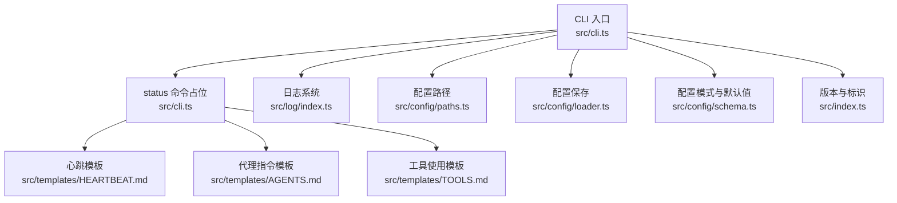
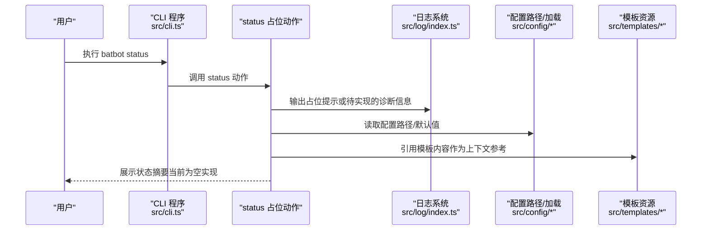
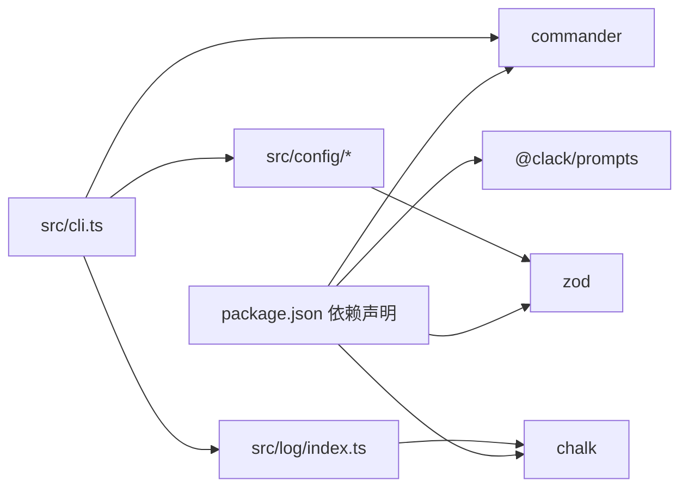

# 状态命令（status）

<cite>
**本文引用的文件**
- [cli.ts](file://src/cli.ts)
- [index.ts](file://src/index.ts)
- [schema.ts](file://src/config/schema.ts)
- [paths.ts](file://src/config/paths.ts)
- [loader.ts](file://src/config/loader.ts)
- [index.ts](file://src/log/index.ts)
- [HEARTBEAT.md](file://src/templates/HEARTBEAT.md)
- [AGENTS.md](file://src/templates/AGENTS.md)
- [TOOLS.md](file://src/templates/TOOLS.md)
- [package.json](file://package.json)
</cite>

## 目录
1. [简介](#简介)
2. [项目结构](#项目结构)
3. [核心组件](#核心组件)
4. [架构总览](#架构总览)
5. [详细组件分析](#详细组件分析)
6. [依赖关系分析](#依赖关系分析)
7. [性能考量](#性能考量)
8. [故障排查指南](#故障排查指南)
9. [结论](#结论)
10. [附录](#附录)

## 简介
本文件面向“状态命令（status）”的使用与运维实践，帮助用户理解如何通过命令行查看 BatBot 的当前运行状态，并基于配置、服务、连接与资源使用等维度进行健康度评估与日常维护。由于当前仓库中 status 命令仅注册但尚未实现具体输出逻辑，本文在不臆测实现的前提下，提供可落地的状态检查清单、最佳实践与运维建议，便于后续扩展完善。

## 项目结构
围绕状态命令的相关模块分布如下：
- CLI 入口：定义命令子项与解析流程
- 配置体系：提供配置路径、加载与校验能力
- 日志系统：统一日志输出风格与级别
- 模板资源：心跳任务、工具使用等参考模板
- 版本与元信息：版本号与 Logo

图示来源
- [cli.ts:1-101](file://src/cli.ts#L1-L101)
- [paths.ts:1-11](file://src/config/paths.ts#L1-L11)
- [loader.ts:1-16](file://src/config/loader.ts#L1-L16)
- [schema.ts:1-146](file://src/config/schema.ts#L1-L146)
- [index.ts:1-49](file://src/log/index.ts#L1-L49)
- [HEARTBEAT.md:1-17](file://src/templates/HEARTBEAT.md#L1-L17)
- [AGENTS.md:1-22](file://src/templates/AGENTS.md#L1-L22)
- [TOOLS.md:1-16](file://src/templates/TOOLS.md#L1-L16)
- [index.ts:1-3](file://src/index.ts#L1-L3)

章节来源
- [cli.ts:1-101](file://src/cli.ts#L1-L101)
- [paths.ts:1-11](file://src/config/paths.ts#L1-L11)
- [loader.ts:1-16](file://src/config/loader.ts#L1-L16)
- [schema.ts:1-146](file://src/config/schema.ts#L1-L146)
- [index.ts:1-49](file://src/log/index.ts#L1-L49)
- [HEARTBEAT.md:1-17](file://src/templates/HEARTBEAT.md#L1-L17)
- [AGENTS.md:1-22](file://src/templates/AGENTS.md#L1-L22)
- [TOOLS.md:1-16](file://src/templates/TOOLS.md#L1-L16)
- [index.ts:1-3](file://src/index.ts#L1-L3)

## 核心组件
- CLI 子命令注册：已注册 status 命令，当前 action 仅为占位输出提示信息，尚未实现具体状态采集与展示。
- 配置系统：提供配置文件路径、默认值与校验；支持保存配置到用户目录。
- 日志系统：提供 info/success/warn/error/debug 等多级输出，便于状态命令扩展时统一格式化输出。
- 模板资源：包含心跳任务、代理指令与工具使用等模板，用于辅助理解系统运行周期与工具约束。

章节来源
- [cli.ts:80-84](file://src/cli.ts#L80-L84)
- [schema.ts:118-128](file://src/config/schema.ts#L118-L128)
- [loader.ts:6-15](file://src/config/loader.ts#L6-L15)
- [index.ts:5-29](file://src/log/index.ts#L5-L29)
- [HEARTBEAT.md:1-17](file://src/templates/HEARTBEAT.md#L1-L17)
- [AGENTS.md:1-22](file://src/templates/AGENTS.md#L1-L22)
- [TOOLS.md:1-16](file://src/templates/TOOLS.md#L1-L16)

## 架构总览
下图展示了 status 命令从注册到执行的调用链路，以及与配置、日志、模板的关系。

图示来源
- [cli.ts:80-84](file://src/cli.ts#L80-L84)
- [index.ts:5-29](file://src/log/index.ts#L5-L29)
- [paths.ts:4-10](file://src/config/paths.ts#L4-L10)
- [loader.ts:6-15](file://src/config/loader.ts#L6-L15)
- [HEARTBEAT.md:1-17](file://src/templates/HEARTBEAT.md#L1-L17)
- [AGENTS.md:1-22](file://src/templates/AGENTS.md#L1-L22)
- [TOOLS.md:1-16](file://src/templates/TOOLS.md#L1-L16)

## 详细组件分析

### status 命令注册与占位行为
- 已在 CLI 中注册 status 子命令，描述为“显示 batbot 状态”，当前 action 仅输出占位提示。
- 建议后续扩展：在 action 内部按“配置状态、服务状态、连接状态、资源使用情况”四个维度组织输出，并结合日志系统进行分级打印。

章节来源
- [cli.ts:80-84](file://src/cli.ts#L80-L84)

### 配置状态（Configuration Status）
- 配置文件位置：位于用户主目录下的 .batbot/config.json。
- 默认值与字段：系统通过 Zod Schema 定义了 agents、channels、providers、gateway、tools 等配置段的默认值与类型约束。
- 保存策略：若目录不存在会自动创建，配置以 JSON 形式写入，便于人工核对与审计。

建议解读要点
- 若配置文件缺失或损坏，系统将无法加载默认值，可能影响服务启动与功能可用性。
- 关注关键字段如 gateway.host/port、providers.apiKey、tools.exec.timeout 等是否符合预期。

章节来源
- [paths.ts:4-10](file://src/config/paths.ts#L4-L10)
- [loader.ts:6-15](file://src/config/loader.ts#L6-L15)
- [schema.ts:118-128](file://src/config/schema.ts#L118-L128)
- [schema.ts:67-73](file://src/config/schema.ts#L67-L73)
- [schema.ts:41-53](file://src/config/schema.ts#L41-L53)
- [schema.ts:108-116](file://src/config/schema.ts#L108-L116)

### 服务状态（Service Status）
- 当前仓库未提供独立的服务进程管理与状态查询接口，status 命令暂无直接输出服务列表与运行态。
- 可基于现有 CLI 结构扩展：在 status 中探测本地监听端口、进程存在性、模板文件是否存在等，作为服务可用性的间接证据。

章节来源
- [cli.ts:65-78](file://src/cli.ts#L65-L78)
- [HEARTBEAT.md:1-17](file://src/templates/HEARTBEAT.md#L1-L17)
- [AGENTS.md:1-22](file://src/templates/AGENTS.md#L1-L22)

### 连接状态（Connection Status）
- gateway 配置包含 host/port 与心跳配置，heartbeat.enabled 与 intervalS 决定心跳开关与周期。
- 心跳模板说明了每 30 分钟检查一次的任务机制，可用于判断系统是否按计划执行周期性任务。

建议解读要点
- 若 heartbeat.enabled 为 false 或 intervalS 设置过大，可能导致周期任务延迟。
- 心跳模板为空或仅含注释时，系统会跳过心跳处理，需检查模板内容与权限。

章节来源
- [schema.ts:67-73](file://src/config/schema.ts#L67-L73)
- [schema.ts:55-63](file://src/config/schema.ts#L55-L63)
- [HEARTBEAT.md:1-17](file://src/templates/HEARTBEAT.md#L1-L17)

### 资源使用情况（Resource Usage）
- 当前仓库未提供资源采集与展示逻辑，status 命令暂不输出 CPU/内存/磁盘等指标。
- 可扩展方向：在 status 中集成系统资源查询（如进程占用、工作区大小、工具执行超时统计），并与日志系统联动输出。

章节来源
- [schema.ts:89-94](file://src/config/schema.ts#L89-L94)
- [schema.ts:108-116](file://src/config/schema.ts#L108-L116)
- [TOOLS.md:1-16](file://src/templates/TOOLS.md#L1-L16)

### 输出信息的含义与解读方法
- 配置状态：确认配置文件存在且字段有效；关注默认值与实际值差异。
- 服务状态：结合本地端口占用与进程存在性进行判断；若无服务监听，需检查启动参数与权限。
- 连接状态：依据心跳配置与模板内容判断系统是否按计划执行周期任务。
- 资源使用：建议扩展后，结合阈值告警与历史趋势进行健康评估。

章节来源
- [paths.ts:4-10](file://src/config/paths.ts#L4-L10)
- [schema.ts:55-63](file://src/config/schema.ts#L55-L63)
- [HEARTBEAT.md:1-17](file://src/templates/HEARTBEAT.md#L1-L17)
- [TOOLS.md:1-16](file://src/templates/TOOLS.md#L1-L16)

### 最佳实践与定期维护建议
- 定期核对配置文件：确保 apiKey、host/port、工具超时等关键参数正确。
- 维护心跳任务：在 HEARTBEAT.md 中添加/更新周期任务，避免模板为空导致跳过。
- 工具安全与限制：遵循工具使用模板中的安全限制，避免危险命令与越权访问。
- 日志分级：使用日志系统输出 info/success/warn/error，便于快速定位问题。

章节来源
- [schema.ts:41-53](file://src/config/schema.ts#L41-L53)
- [schema.ts:89-94](file://src/config/schema.ts#L89-L94)
- [schema.ts:108-116](file://src/config/schema.ts#L108-L116)
- [HEARTBEAT.md:1-17](file://src/templates/HEARTBEAT.md#L1-L17)
- [TOOLS.md:1-16](file://src/templates/TOOLS.md#L1-L16)
- [index.ts:5-29](file://src/log/index.ts#L5-L29)

### 健康状况判断与潜在问题定位
- 配置异常：配置文件缺失或字段无效 → 检查路径与权限；必要时重置为默认值。
- 服务不可用：无监听端口或进程退出 → 检查启动参数、依赖与资源占用。
- 心跳失效：心跳模板为空或任务未执行 → 检查模板内容与权限。
- 工具受限：执行超时或被阻断 → 调整超时时间或放宽限制（谨慎）。

章节来源
- [paths.ts:4-10](file://src/config/paths.ts#L4-L10)
- [schema.ts:55-63](file://src/config/schema.ts#L55-L63)
- [schema.ts:89-94](file://src/config/schema.ts#L89-L94)
- [HEARTBEAT.md:1-17](file://src/templates/HEARTBEAT.md#L1-L17)

### 状态监控、告警与自动恢复配置指南
- 监控建议：在 status 扩展中加入资源与服务探测，形成健康快照；结合日志系统记录异常事件。
- 告警设置：为心跳失败、工具超时、服务离线等关键事件设定阈值与通知渠道。
- 自动恢复：对可自愈场景（如临时网络抖动）设计重试策略；对需要人工干预的场景（如配置错误）提供修复指引。

章节来源
- [index.ts:5-29](file://src/log/index.ts#L5-L29)
- [schema.ts:55-63](file://src/config/schema.ts#L55-L63)
- [schema.ts:89-94](file://src/config/schema.ts#L89-L94)

## 依赖关系分析
- CLI 依赖 commander 提供命令解析与帮助系统。
- 配置系统依赖 zod 进行类型校验与默认值填充。
- 日志系统依赖 chalk 实现彩色输出。
- 模板资源用于指导心跳与工具使用，间接影响系统运行行为。

图示来源
- [package.json:22-34](file://package.json#L22-L34)
- [cli.ts:1-15](file://src/cli.ts#L1-L15)
- [index.ts:1-49](file://src/log/index.ts#L1-L49)
- [schema.ts:1-146](file://src/config/schema.ts#L1-L146)

章节来源
- [package.json:22-34](file://package.json#L22-L34)
- [cli.ts:1-15](file://src/cli.ts#L1-L15)
- [index.ts:1-49](file://src/log/index.ts#L1-L49)
- [schema.ts:1-146](file://src/config/schema.ts#L1-L146)

## 性能考量
- 配置读取：采用一次性加载与缓存策略，避免频繁 IO。
- 日志输出：控制台输出为主，建议在 status 中减少冗余信息，聚焦关键指标。
- 工具执行：合理设置超时与输出截断，防止阻塞与资源耗尽。

章节来源
- [loader.ts:6-15](file://src/config/loader.ts#L6-L15)
- [schema.ts:89-94](file://src/config/schema.ts#L89-L94)
- [schema.ts:108-116](file://src/config/schema.ts#L108-L116)
- [index.ts:5-29](file://src/log/index.ts#L5-L29)

## 故障排查指南
- 配置文件问题：检查 ~/.batbot/config.json 是否存在与可读；若损坏可删除后重新初始化。
- 权限问题：确认运行用户对配置与工作区目录有读写权限。
- 心跳任务：检查 HEARTBEAT.md 内容与权限，确保系统能正常读取与执行。
- 工具执行：核对工具超时与安全限制，避免误判为失败。

章节来源
- [paths.ts:4-10](file://src/config/paths.ts#L4-L10)
- [loader.ts:6-15](file://src/config/loader.ts#L6-L15)
- [HEARTBEAT.md:1-17](file://src/templates/HEARTBEAT.md#L1-L17)
- [TOOLS.md:1-16](file://src/templates/TOOLS.md#L1-L16)

## 结论
当前仓库中 status 命令处于占位阶段，尚未实现具体的状态输出。本文提供了基于现有配置、模板与日志系统的状态检查清单与运维建议，为后续完善 status 命令的实现提供参考。建议优先扩展配置状态与心跳状态的可视化输出，再逐步引入服务与资源使用情况的采集与展示。

## 附录
- 版本信息：参见版本与标识导出。
- CLI 使用：通过 batbot status 触发状态命令入口。

章节来源
- [index.ts:1-3](file://src/index.ts#L1-L3)
- [cli.ts:80-84](file://src/cli.ts#L80-L84)