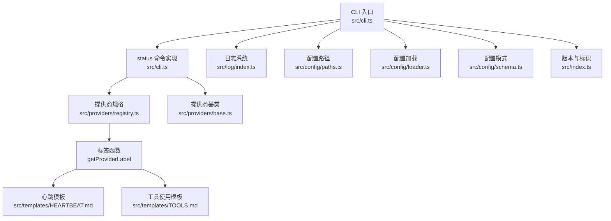
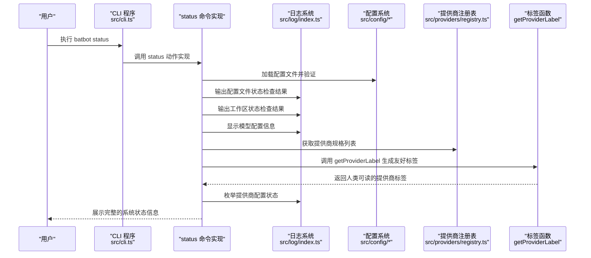
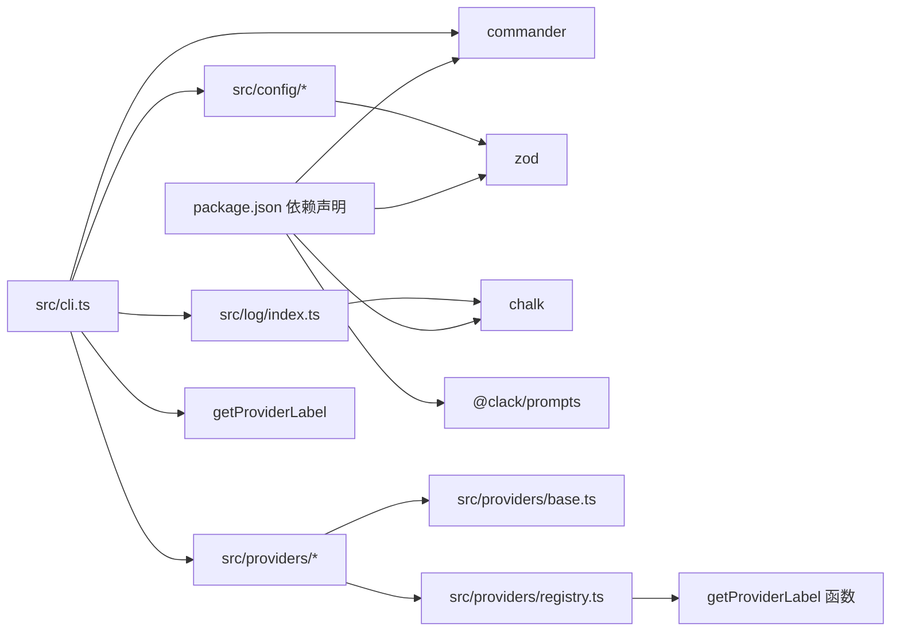

# 状态命令（status）

<cite>
**本文引用的文件**
- [cli.ts](file://src/cli.ts)
- [index.ts](file://src/index.ts)
- [schema.ts](file://src/config/schema.ts)
- [paths.ts](file://src/config/paths.ts)
- [loader.ts](file://src/config/loader.ts)
- [index.ts](file://src/log/index.ts)
- [registry.ts](file://src/providers/registry.ts)
- [base.ts](file://src/providers/base.ts)
- [index.ts](file://src/providers/index.ts)
- [HEARTBEAT.md](file://src/templates/HEARTBEAT.md)
- [TOOLS.md](file://src/templates/TOOLS.md)
- [package.json](file://package.json)
</cite>

## 更新摘要
**变更内容**
- 新增 `getProviderLabel` 函数，提供更友好的提供商标签显示
- 改善状态命令输出的用户体验，使用 `display_name` 替代原始 `name` 字段
- 增强提供商状态报告的可读性和用户友好性

## 目录
1. [简介](#简介)
2. [项目结构](#项目结构)
3. [核心组件](#核心组件)
4. [架构总览](#架构总览)
5. [详细组件分析](#详细组件分析)
6. [依赖关系分析](#依赖关系分析)
7. [性能考量](#性能考量)
8. [故障排查指南](#故障排查指南)
9. [结论](#结论)
10. [附录](#附录)

## 简介
本文档详细介绍 batbot 系统的 status 状态命令，该命令现已从占位符实现为完整的系统状态检查功能。通过 status 命令，用户可以实时查看配置文件验证、工作区状态检查、模型配置显示和提供商状态枚举等关键系统信息。本文档将深入解释每个输出信息的含义、解读方法，提供状态检查的最佳实践和定期维护建议，并说明如何根据状态信息判断系统健康状况和潜在问题。

**更新** 新增了 `getProviderLabel` 函数，提供更友好的标签显示，改善用户状态报告体验。

## 项目结构
围绕状态命令的相关模块分布如下：
- CLI 入口：完整实现 status 命令，包含配置加载、状态检查和输出格式化
- 配置体系：提供配置路径、加载与校验能力，支持默认值填充
- 日志系统：统一日志输出风格与级别，支持彩色输出和格式化
- 提供商注册表：定义支持的 LLM 提供商规格和元数据，包含标签显示功能
- 模板资源：心跳任务、工具使用等参考模板
- 版本与标识：版本号与蝙蝠图标标识

**图表来源**
- [cli.ts:92-118](file://src/cli.ts#L92-L118)
- [paths.ts:4-10](file://src/config/paths.ts#L4-L10)
- [loader.ts:7-23](file://src/config/loader.ts#L7-L23)
- [schema.ts:124-134](file://src/config/schema.ts#L124-L134)
- [registry.ts:53-78](file://src/providers/registry.ts#L53-L78)
- [registry.ts:52-53](file://src/providers/registry.ts#L52-L53)
- [base.ts:87-151](file://src/providers/base.ts#L87-L151)
- [index.ts:1-4](file://src/index.ts#L1-L4)

**章节来源**
- [cli.ts:92-118](file://src/cli.ts#L92-L118)
- [paths.ts:4-10](file://src/config/paths.ts#L4-L10)
- [loader.ts:7-23](file://src/config/loader.ts#L7-L23)
- [schema.ts:124-134](file://src/config/schema.ts#L124-L134)
- [registry.ts:53-78](file://src/providers/registry.ts#L53-L78)
- [registry.ts:52-53](file://src/providers/registry.ts#L52-L53)
- [base.ts:87-151](file://src/providers/base.ts#L87-L151)
- [index.ts:1-4](file://src/index.ts#L1-L4)

## 核心组件
- **CLI 子命令实现**：status 命令已完全实现，包含配置文件检查、工作区状态验证、模型配置显示和提供商状态枚举
- **配置系统**：提供完整的配置加载、验证和默认值填充机制，支持 JSON 文件读取和错误处理
- **日志系统**：提供 info/success/warn/error/debug 等多级输出，支持彩色格式化输出
- **提供商注册表**：定义支持的 LLM 提供商规格，包括名称、关键词、环境变量键等元数据，新增标签显示功能
- **标签显示函数**：`getProviderLabel` 函数提供友好的人类可读标签显示
- **模板资源**：包含心跳任务、工具使用等模板，用于辅助理解系统运行周期与工具约束

**更新** 新增 `getProviderLabel` 函数，提供更友好的标签显示功能。

**章节来源**
- [cli.ts:92-118](file://src/cli.ts#L92-L118)
- [loader.ts:7-23](file://src/config/loader.ts#L7-L23)
- [index.ts:5-47](file://src/log/index.ts#L5-L47)
- [registry.ts:10-51](file://src/providers/registry.ts#L10-L51)
- [registry.ts:52-53](file://src/providers/registry.ts#L52-L53)
- [HEARTBEAT.md:1-17](file://src/templates/HEARTBEAT.md#L1-L17)
- [TOOLS.md:1-16](file://src/templates/TOOLS.md#L1-L16)

## 架构总览
下图展示了 status 命令从注册到执行的完整调用链路，以及与配置、日志、提供商注册表的关系，包括新增的标签显示功能。

**图表来源**
- [cli.ts:92-118](file://src/cli.ts#L92-L118)
- [loader.ts:7-23](file://src/config/loader.ts#L7-L23)
- [paths.ts:4-10](file://src/config/paths.ts#L4-L10)
- [registry.ts:53-78](file://src/providers/registry.ts#L53-L78)
- [registry.ts:52-53](file://src/providers/registry.ts#L52-L53)
- [index.ts:5-47](file://src/log/index.ts#L5-L47)

## 详细组件分析

### status 命令完整实现
status 命令已从简单的占位符实现为功能完整的系统状态检查工具，包含以下核心功能：

- **配置文件状态检查**：验证配置文件是否存在、可读，显示完整路径和检查结果
- **工作区状态验证**：检查工作区目录是否存在和可访问
- **模型配置显示**：显示当前使用的默认模型配置
- **提供商状态枚举**：遍历所有注册的提供商规格，显示其配置状态，使用友好标签显示

**更新** 新增了标签显示功能，使用 `getProviderLabel` 函数生成更友好的提供商名称。

**章节来源**
- [cli.ts:92-118](file://src/cli.ts#L92-L118)

### 配置状态（Configuration Status）
配置系统提供完整的配置文件验证和状态检查功能：

- **配置文件位置**：位于用户主目录下的 `.batbot/config.json`
- **加载机制**：支持从 JSON 文件读取配置，自动处理错误并回退到默认值
- **验证机制**：使用 Zod Schema 进行类型验证和默认值填充
- **错误处理**：配置文件损坏时自动回退到默认配置并发出警告

**建议解读要点**
- 配置文件存在且标记为 ✓ 表示系统正常加载配置
- 配置文件缺失或损坏时会显示 ✗，系统自动使用默认配置
- 关注关键配置项如 agents.defaults.model、gateway.host/port、providers.apiKey 等

**章节来源**
- [paths.ts:4-10](file://src/config/paths.ts#L4-L10)
- [loader.ts:7-23](file://src/config/loader.ts#L7-L23)
- [schema.ts:124-134](file://src/config/schema.ts#L124-L134)

### 工作区状态（Workspace Status）
工作区状态检查确保系统拥有正确的运行环境：

- **工作区路径**：默认位于 `~/.batbot/workspace`
- **自动创建**：如果工作区不存在，系统会在首次使用时自动创建
- **模板同步**：工作区包含必要的模板文件，如 HEARTBEAT.md 和 TOOLS.md

**建议解读要点**
- 工作区存在且标记为 ✓ 表示系统具备完整的运行环境
- 工作区缺失时需要检查权限和磁盘空间
- 确保工作区具有适当的读写权限

**章节来源**
- [schema.ts:159-167](file://src/config/schema.ts#L159-L167)
- [loader.ts:7-23](file://src/config/loader.ts#L7-L23)
- [HEARTBEAT.md:1-17](file://src/templates/HEARTBEAT.md#L1-L17)
- [TOOLS.md:1-16](file://src/templates/TOOLS.md#L1-L16)

### 模型配置显示（Model Configuration）
系统显示当前的默认模型配置信息：

- **默认模型**：显示 `agents.defaults.model` 配置值，默认为 `bailian/qwen3.5-plus`
- **模型参数**：包括 provider、max_completion_tokens、contextWindowTokens、temperature 等
- **温度系数**：默认温度系数为 0.1，适合精确回答

**建议解读要点**
- 模型配置直接影响对话质量和响应准确性
- 温度系数过低可能导致回答过于保守，过高可能导致不准确
- max_completion_tokens 控制单次响应的最大长度

**章节来源**
- [schema.ts:20-34](file://src/config/schema.ts#L20-L34)
- [cli.ts:107-109](file://src/cli.ts#L107-L109)

### 提供商状态枚举（Provider Status Enumeration）
系统枚举所有注册的提供商并显示其配置状态：

- **提供商规格**：通过 PROVIDER_SPECS 定义，包含名称、关键词、环境变量键等元数据
- **当前支持**：包括 `custom` 和 `bailian` 两种提供商
- **配置检查**：遍历配置中的提供商条目，显示存在的配置
- **标签显示**：使用 `getProviderLabel` 函数生成友好标签

**提供商规格详解**
- **custom**：自定义提供商，支持任意 OpenAI 兼容的 API 端点
- **bailian**：百炼提供商，支持特定的百炼 API
- **显示名称**：用于在状态输出中显示的人类可读名称
- **环境变量**：如 BAILIAN_API_KEY 等环境变量键

**标签显示功能**
- **getProviderLabel 函数**：返回 `display_name` 或 `name` 字段
- **友好显示**：使用 `display_name` 提供更直观的用户界面
- **向后兼容**：当 `display_name` 不存在时回退到 `name`

**建议解读要点**
- 如果提供商配置为空，表示该提供商未配置或未使用
- 正确配置 API 密钥是提供商正常工作的前提
- 不同提供商可能有不同的 API 基础 URL 和参数要求
- 使用友好标签而非技术性名称提升用户体验

**章节来源**
- [registry.ts:53-78](file://src/providers/registry.ts#L53-L78)
- [registry.ts:52-53](file://src/providers/registry.ts#L52-L53)
- [cli.ts:111-117](file://src/cli.ts#L111-L117)

### 输出信息的含义与解读方法
status 命令的输出包含多个层次的信息，需要分层解读：

**配置文件状态**
- ✓ 标记：配置文件存在且可读
- ✗ 标记：配置文件不存在或无法读取
- 路径信息：显示完整的配置文件路径

**工作区状态**
- ✓ 标记：工作区目录存在且可访问
- ✗ 标记：工作区目录不存在或权限不足
- 路径信息：显示完整的工作区路径

**模型配置**
- 显示当前使用的默认模型名称
- 包含相关的模型参数配置

**提供商状态**
- 列出所有注册的提供商规格
- 显示当前配置中存在的提供商配置
- 使用友好标签显示提供商名称

**更新** 新增了标签显示功能，提供商名称现在显示为更友好的人类可读格式。

**章节来源**
- [cli.ts:100-117](file://src/cli.ts#L100-L117)
- [paths.ts:4-10](file://src/config/paths.ts#L4-L10)
- [schema.ts:159-167](file://src/config/schema.ts#L159-L167)

### 最佳实践与定期维护建议
基于 status 命令提供的信息，建议以下最佳实践：

**配置管理**
- 定期检查配置文件状态，确保配置文件存在且可读
- 定期核对模型配置，根据使用需求调整参数
- 备份重要配置，防止意外丢失

**提供商维护**
- 确保 API 密钥有效且未过期
- 定期检查提供商连接状态
- 根据使用情况调整提供商优先级
- 利用友好标签识别提供商状态

**工作区管理**
- 定期清理不需要的文件和模板
- 监控工作区磁盘使用情况
- 确保工作区具有适当的备份策略

**日志监控**
- 使用日志系统记录状态变化
- 设置适当的日志级别
- 定期审查日志文件

**更新** 新增利用友好标签进行提供商状态识别的最佳实践。

**章节来源**
- [loader.ts:16-20](file://src/config/loader.ts#L16-L20)
- [registry.ts:18-51](file://src/providers/registry.ts#L18-L51)
- [index.ts:5-47](file://src/log/index.ts#L5-L47)

### 健康状况判断与潜在问题定位
根据 status 命令的输出，可以判断系统的健康状况：

**配置异常**
- 配置文件显示 ✗：检查文件权限和磁盘空间
- 配置加载警告：检查配置文件格式和语法
- 缺失关键配置：根据默认值补充相应配置

**工作区问题**
- 工作区显示 ✗：检查目录权限和磁盘空间
- 模板文件缺失：重新初始化工作区
- 权限不足：调整目录权限

**模型配置问题**
- 模型名称错误：检查拼写和可用性
- 参数配置不当：根据使用场景调整参数
- 模型不可用：检查网络连接和 API 访问

**提供商问题**
- 提供商配置为空：检查 API 密钥和配置文件
- 提供商规格缺失：检查配置文件中的提供商条目
- 连接失败：检查网络连接和 API 端点
- 标签显示异常：检查 `display_name` 配置

**更新** 新增标签显示异常的故障排查指导。

**章节来源**
- [cli.ts:100-117](file://src/cli.ts#L100-L117)
- [loader.ts:16-20](file://src/config/loader.ts#L16-L20)
- [registry.ts:53-78](file://src/providers/registry.ts#L53-L78)

### 状态监控、告警与自动恢复配置指南
基于 status 命令的功能，建议以下监控和告警策略：

**监控建议**
- 定期执行 status 命令，形成健康快照
- 监控配置文件和工作区状态的变化
- 跟踪提供商配置的有效性
- 记录模型配置的使用情况
- 监控标签显示的正确性

**告警设置**
- 配置文件缺失告警：配置文件状态变为 ✗ 时触发
- 工作区不可访问告警：工作区状态变为 ✗ 时触发
- 提供商配置异常告警：提供商配置为空时触发
- 模型配置变更告警：模型参数发生重大变化时触发
- 标签显示异常告警：提供商标签显示不正确时触发

**自动恢复机制**
- 配置文件恢复：检测到配置文件损坏时自动回退到默认配置
- 工作区重建：检测到工作区缺失时自动创建并同步模板
- 提供商切换：检测到提供商不可用时自动切换到备用提供商
- 参数优化：根据使用统计自动调整模型参数
- 标签回退：当 `display_name` 缺失时自动使用 `name` 作为后备

**更新** 新增标签显示异常的监控和自动恢复机制。

**章节来源**
- [loader.ts:16-20](file://src/config/loader.ts#L16-L20)
- [cli.ts:92-118](file://src/cli.ts#L92-L118)
- [registry.ts:18-51](file://src/providers/registry.ts#L18-L51)

## 依赖关系分析
status 命令的实现涉及多个核心模块的协作：

- **CLI 依赖**：使用 commander 进行命令解析，@clack/prompts 进行交互式确认
- **配置系统依赖**：使用 zod 进行类型验证，node:fs 进行文件操作
- **日志系统依赖**：使用 chalk 进行彩色输出，console 进行标准输出
- **提供商系统依赖**：使用 PROVIDER_SPECS 进行提供商规格管理
- **标签显示依赖**：使用 getProviderLabel 函数进行友好标签生成

**更新** 新增标签显示功能的依赖关系。

**图表来源**
- [package.json:23-31](file://package.json#L23-L31)
- [cli.ts:1-16](file://src/cli.ts#L1-L16)
- [index.ts:1-47](file://src/log/index.ts#L1-L47)
- [schema.ts:1-168](file://src/config/schema.ts#L1-L168)
- [registry.ts:1-79](file://src/providers/registry.ts#L1-L79)
- [registry.ts:52-53](file://src/providers/registry.ts#L52-L53)
- [base.ts:1-151](file://src/providers/base.ts#L1-L151)

**章节来源**
- [package.json:23-31](file://package.json#L23-L31)
- [cli.ts:1-16](file://src/cli.ts#L1-L16)
- [index.ts:1-47](file://src/log/index.ts#L1-L47)
- [schema.ts:1-168](file://src/config/schema.ts#L1-L168)
- [registry.ts:1-79](file://src/providers/registry.ts#L1-L79)
- [registry.ts:52-53](file://src/providers/registry.ts#L52-L53)
- [base.ts:1-151](file://src/providers/base.ts#L1-L151)

## 性能考量
status 命令的实现考虑了以下性能因素：

**配置读取优化**
- 采用一次性配置加载，避免重复 IO 操作
- 使用缓存机制减少重复的文件系统访问
- 错误处理采用快速失败策略

**输出优化**
- 使用批量输出减少 I/O 操作次数
- 彩色输出仅在需要时启用
- 条件输出避免不必要的计算
- 标签生成使用简单的字符串选择逻辑

**内存使用**
- 配置对象使用轻量级结构
- 提供商规格使用常量定义
- 日志输出使用流式处理
- 标签缓存避免重复计算

**更新** 新增标签生成的性能考量。

**章节来源**
- [loader.ts:7-23](file://src/config/loader.ts#L7-L23)
- [cli.ts:92-118](file://src/cli.ts#L92-L118)
- [index.ts:5-47](file://src/log/index.ts#L5-L47)
- [registry.ts:52-53](file://src/providers/registry.ts#L52-L53)

## 故障排查指南
基于 status 命令的输出，提供以下故障排查步骤：

**配置文件问题**
- 检查配置文件是否存在：查看配置文件状态是否为 ✓
- 验证配置文件权限：确保用户对配置文件具有读权限
- 检查配置文件格式：确认 JSON 格式正确且语法无误
- 查看加载错误：关注日志中的配置加载警告信息

**工作区问题**
- 检查工作区目录权限：确保用户对工作区目录具有读写权限
- 验证磁盘空间：确保有足够的磁盘空间存储工作区文件
- 检查模板文件：确认必要的模板文件存在于工作区中
- 重新初始化工作区：如果工作区损坏，可以删除后重新创建

**提供商问题**
- 验证 API 密钥：检查提供商配置中的 API 密钥是否有效
- 检查网络连接：确认能够访问提供商的 API 端点
- 验证配置格式：确保提供商配置的 JSON 格式正确
- 查看提供商规格：确认所需的提供商规格已正确注册
- 检查标签显示：确认 `display_name` 配置正确

**模型配置问题**
- 检查模型名称：确认模型名称拼写正确且在提供商处可用
- 验证参数范围：确保所有参数值在有效范围内
- 检查默认值：确认未设置的参数使用了合理的默认值
- 测试模型连接：尝试使用配置的模型进行简单测试

**标签显示问题**
- 检查 `display_name` 配置：确认提供商规格中的 `display_name` 字段正确设置
- 验证回退机制：确认当 `display_name` 缺失时能正确回退到 `name`
- 测试标签函数：直接调用 `getProviderLabel` 函数验证输出格式

**日志和调试**
- 启用详细日志：使用更详细的日志级别获取更多信息
- 检查系统日志：查看系统级别的错误信息
- 使用调试模式：启用调试模式获取更多内部状态信息
- 分析错误堆栈：仔细阅读错误信息和相关堆栈跟踪

**更新** 新增标签显示问题的故障排查步骤。

**章节来源**
- [cli.ts:100-117](file://src/cli.ts#L100-L117)
- [loader.ts:16-20](file://src/config/loader.ts#L16-L20)
- [paths.ts:4-10](file://src/config/paths.ts#L4-L10)
- [registry.ts:53-78](file://src/providers/registry.ts#L53-L78)
- [registry.ts:52-53](file://src/providers/registry.ts#L52-L53)

## 结论
status 命令已从简单的占位符实现为功能完整的系统状态检查工具。通过提供配置文件验证、工作区状态检查、模型配置显示和提供商状态枚举等功能，用户可以全面了解 batbot 系统的运行状态。**更新** 新增的 `getProviderLabel` 函数进一步提升了用户体验，通过友好标签显示使状态信息更加直观易懂。

建议用户定期使用 status 命令进行系统健康检查，并根据输出信息及时发现和解决问题。随着系统的不断发展，status 命令还将继续扩展更多监控和诊断功能，为用户提供更好的系统管理体验。标签显示功能的引入标志着系统在用户体验方面的进一步改进，为未来的功能扩展奠定了良好的基础。

## 附录
- **版本信息**：当前版本为 1.0.0，使用蝙蝠图标作为标识
- **CLI 使用**：通过 `batbot status` 命令触发状态检查
- **状态输出**：包含配置状态、工作区状态、模型配置和提供商状态四部分信息
- **标签功能**：使用 `getProviderLabel` 函数提供友好标签显示
- **扩展建议**：未来可以增加资源使用情况、服务状态等更多监控指标，以及更丰富的标签定制选项

**更新** 新增标签功能和扩展建议。

**章节来源**
- [index.ts:1-4](file://src/index.ts#L1-L4)
- [cli.ts:92-118](file://src/cli.ts#L92-L118)
- [registry.ts:52-53](file://src/providers/registry.ts#L52-L53)