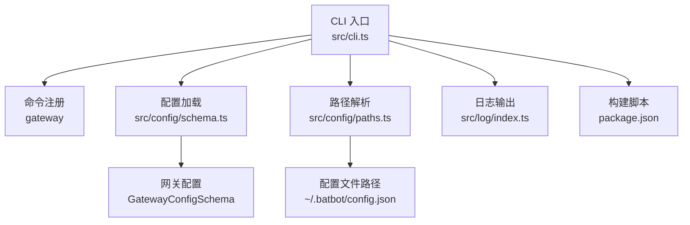
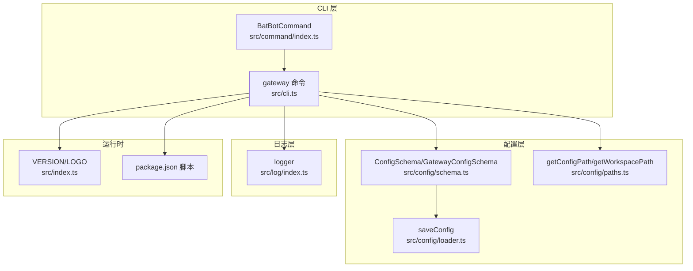
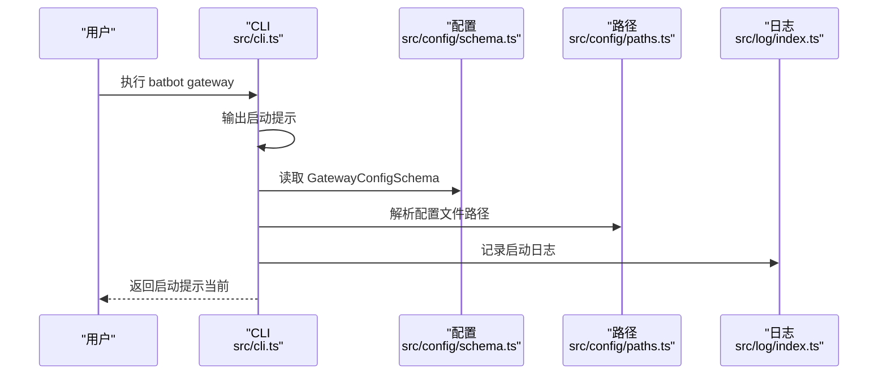
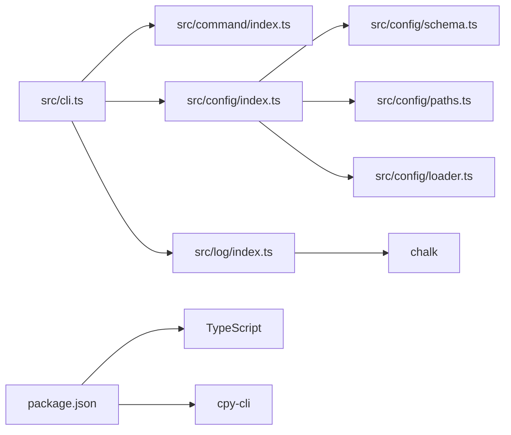

# 网关命令 (gateway)

<cite>
**本文引用的文件**
- [cli.ts](file://src/cli.ts)
- [index.ts](file://src/index.ts)
- [schema.ts](file://src/config/schema.ts)
- [paths.ts](file://src/config/paths.ts)
- [loader.ts](file://src/config/loader.ts)
- [index.ts](file://src/log/index.ts)
- [package.json](file://package.json)
</cite>

## 目录
1. [简介](#简介)
2. [项目结构](#项目结构)
3. [核心组件](#核心组件)
4. [架构总览](#架构总览)
5. [详细组件分析](#详细组件分析)
6. [依赖关系分析](#依赖关系分析)
7. [性能考虑](#性能考虑)
8. [故障排查指南](#故障排查指南)
9. [结论](#结论)
10. [附录](#附录)

## 简介
本文件面向“gateway 网关命令”的使用与运维，聚焦于如何通过 batbot CLI 启动网关服务、配置与端口监听、服务生命周期管理（启动/停止/重启）、配置项说明、性能调优与监控建议，以及状态检查、日志管理与常见问题诊断。当前仓库中，gateway 命令已注册到 CLI，但其具体实现尚为空白占位；本文在不臆测实现的前提下，基于现有配置与路径设计，给出可落地的实践指南与最佳实践。

## 项目结构
- CLI 入口与命令注册位于 src/cli.ts，其中定义了 gateway 子命令。
- 配置体系由 src/config/schema.ts 定义，包含网关配置 GatewayConfigSchema，默认主机与端口等。
- 配置文件与工作空间路径由 src/config/paths.ts 提供。
- 日志模块位于 src/log/index.ts，提供统一的日志输出接口。
- 版本与标识信息位于 src/index.ts。
- 构建与运行脚本位于 package.json。

图表来源
- [cli.ts:15-98](file://src/cli.ts#L15-L98)
- [schema.ts:67-73](file://src/config/schema.ts#L67-L73)
- [paths.ts:4-10](file://src/config/paths.ts#L4-L10)
- [index.ts:1-4](file://src/index.ts#L1-L4)
- [package.json:17-21](file://package.json#L17-L21)

章节来源
- [cli.ts:15-98](file://src/cli.ts#L15-L98)
- [schema.ts:67-73](file://src/config/schema.ts#L67-L73)
- [paths.ts:4-10](file://src/config/paths.ts#L4-L10)
- [index.ts:1-4](file://src/index.ts#L1-L4)
- [package.json:17-21](file://package.json#L17-L21)

## 核心组件
- CLI 命令注册：gateway 子命令已注册，描述为“启动 batbot 网关”。当前 action 仅打印提示信息，实际网络监听与服务启动逻辑尚未实现。
- 配置模型：GatewayConfigSchema 定义了 host、port 与心跳子配置 heartbeat。默认 host 为本地回环地址，port 默认值为正整数。
- 路径与持久化：getConfigPath 返回用户主目录下的 ~/.batbot/config.json；saveConfig 将配置写入磁盘。
- 日志系统：logger 提供 info/success/warn/error/debug 等彩色输出，便于状态与错误提示。
- 版本与标识：VERSION 与 LOGO 用于 CLI 的版本展示与品牌标识。

章节来源
- [cli.ts:63-68](file://src/cli.ts#L63-L68)
- [schema.ts:67-73](file://src/config/schema.ts#L67-L73)
- [loader.ts:6-15](file://src/config/loader.ts#L6-L15)
- [paths.ts:4-10](file://src/config/paths.ts#L4-L10)
- [index.ts:1-4](file://src/index.ts#L1-L4)
- [index.ts:5-48](file://src/log/index.ts#L5-L48)

## 架构总览
下图展示了从 CLI 到配置与日志的整体交互关系，以及网关配置在系统中的位置。

图表来源
- [cli.ts:15-98](file://src/cli.ts#L15-L98)
- [schema.ts:118-126](file://src/config/schema.ts#L118-L126)
- [loader.ts:6-15](file://src/config/loader.ts#L6-L15)
- [paths.ts:4-10](file://src/config/paths.ts#L4-L10)
- [index.ts:1-4](file://src/index.ts#L1-L4)
- [package.json:17-21](file://package.json#L17-L21)

## 详细组件分析

### 网关命令行为与启动流程
- 当前行为：执行 batbot gateway 时，CLI 仅输出“启动 batbot 网关...”提示，未进行任何网络监听或服务启动。
- 建议流程（待实现）：解析配置 -> 绑定 host/port -> 启动网络监听 -> 注册心跳处理 -> 暴露健康检查端点 -> 记录启动日志 -> 接受请求。

图表来源
- [cli.ts:63-68](file://src/cli.ts#L63-L68)
- [schema.ts:67-73](file://src/config/schema.ts#L67-L73)
- [paths.ts:4-10](file://src/config/paths.ts#L4-L10)
- [index.ts:1-4](file://src/index.ts#L1-L4)

章节来源
- [cli.ts:63-68](file://src/cli.ts#L63-L68)

### 端口配置与网络监听
- 默认监听地址与端口：host 默认为本地回环地址，port 为正整数默认值。
- 建议：在生产环境中，host 可设置为 0.0.0.0 并结合防火墙策略；确保端口未被占用；如需 HTTPS，应在反向代理层处理 TLS 终止。

章节来源
- [schema.ts:67-71](file://src/config/schema.ts#L67-L71)

### 心跳配置
- heartbeat.enabled：是否启用心跳上报。
- heartbeat.intervalS：心跳间隔秒数，默认 30 分钟。
- 建议：在网关实现中，按心跳周期定期上报状态；失败重试与退避策略可提升稳定性。

章节来源
- [schema.ts:55-63](file://src/config/schema.ts#L55-L63)

### 配置文件与持久化
- 配置文件路径：~/.batbot/config.json。
- 写入流程：若目录不存在则创建；以 JSON 格式写入配置。
- 建议：首次运行时通过 onboard 初始化默认配置；后续通过管理命令更新。

章节来源
- [paths.ts:4-10](file://src/config/paths.ts#L4-L10)
- [loader.ts:6-15](file://src/config/loader.ts#L6-L15)

### 日志与状态输出
- 日志级别：info/success/warn/error/debug。
- 建议：启动阶段输出关键配置摘要；异常时输出错误码与上下文；调试模式下输出更细粒度日志。

章节来源
- [index.ts:5-48](file://src/log/index.ts#L5-L48)

## 依赖关系分析
- CLI 依赖命令框架与自定义帮助类；依赖配置与路径模块；依赖日志模块。
- 配置模块依赖 Zod 进行类型校验；依赖 Node 路径与操作系统模块。
- 日志模块依赖 chalk 进行颜色输出。
- 构建脚本依赖 TypeScript 编译器与拷贝工具。

图表来源
- [cli.ts:15-98](file://src/cli.ts#L15-L98)
- [schema.ts:1-3](file://src/config/index.ts#L1-L3)
- [paths.ts:1-11](file://src/config/paths.ts#L1-L11)
- [loader.ts:1-16](file://src/config/loader.ts#L1-L16)
- [index.ts:5-48](file://src/log/index.ts#L5-L48)
- [package.json:22-34](file://package.json#L22-L34)

章节来源
- [cli.ts:15-98](file://src/cli.ts#L15-L98)
- [schema.ts:1-3](file://src/config/index.ts#L1-L3)
- [paths.ts:1-11](file://src/config/paths.ts#L1-L11)
- [loader.ts:1-16](file://src/config/loader.ts#L1-L16)
- [index.ts:5-48](file://src/log/index.ts#L5-L48)
- [package.json:22-34](file://package.json#L22-L34)

## 性能考虑
- 网络监听：选择合适的 backlog 与 keepalive 参数；限制并发连接数并设置超时。
- 心跳：合理设置心跳间隔，避免过于频繁导致资源消耗；失败重试指数退避。
- 日志：生产环境建议异步落盘与滚动策略，避免阻塞事件循环。
- 资源隔离：容器化部署时设置 CPU/内存限制与健康检查探针。

## 故障排查指南
- 启动无响应
  - 检查 CLI 是否正确输出启动提示；确认 gateway 命令已注册且未被覆盖。
  - 章节来源
    - [cli.ts:63-68](file://src/cli.ts#L63-L68)
- 端口冲突
  - 使用 netstat/ss/lsof 检查端口占用；修改 GatewayConfig.port 或释放占用进程。
  - 章节来源
    - [schema.ts:67-71](file://src/config/schema.ts#L67-L71)
- 权限问题
  - 非特权端口需提权；建议使用 1024+ 端口或使用反向代理转发。
- 配置读取失败
  - 确认 ~/.batbot/config.json 存在且格式合法；必要时通过 onboard 重新生成。
  - 章节来源
    - [paths.ts:4-10](file://src/config/paths.ts#L4-L10)
    - [loader.ts:6-15](file://src/config/loader.ts#L6-L15)
- 日志定位
  - 使用 logger.error/info/warn 区分严重程度；结合时间戳与上下文字段快速定位。
  - 章节来源
    - [index.ts:5-48](file://src/log/index.ts#L5-L48)

## 结论
gateway 网关命令已在 CLI 中完成注册，当前处于占位阶段。基于现有配置模型与路径设计，建议尽快完善网络监听、心跳上报与健康检查能力，并配套完善的日志与监控策略，以满足生产环境的可用性与可观测性要求。

## 附录

### 命令与操作指南
- 启动
  - 执行 batbot gateway；当前仅输出提示，后续将绑定 host/port 并启动监听。
  - 章节来源
    - [cli.ts:63-68](file://src/cli.ts#L63-L68)
- 停止
  - 通过进程管理工具（如 kill/pkill/systemctl/docker stop）终止进程。
- 重启
  - 先停止后启动；或使用进程管理器的 reload/restart 能力。
- 状态检查
  - 通过进程列表与端口占用情况判断；后续可扩展健康检查端点。
  - 章节来源
    - [schema.ts:67-71](file://src/config/schema.ts#L67-L71)

### 配置项速览
- 网关配置（GatewayConfig）
  - host：监听地址，默认本地回环
  - port：监听端口，默认正整数
  - heartbeat：心跳开关与间隔
- 心跳配置（HeartbeatConfig）
  - enabled：是否启用
  - intervalS：心跳间隔秒数，默认 1800
- 配置文件路径
  - ~/.batbot/config.json
- 章节来源
  - [schema.ts:67-73](file://src/config/schema.ts#L67-L73)
  - [schema.ts:55-63](file://src/config/schema.ts#L55-L63)
  - [paths.ts:4-10](file://src/config/paths.ts#L4-L10)