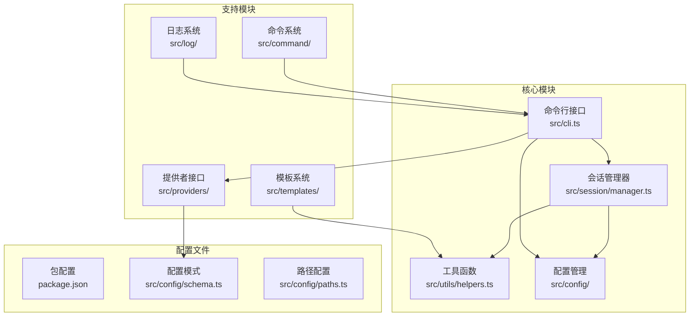
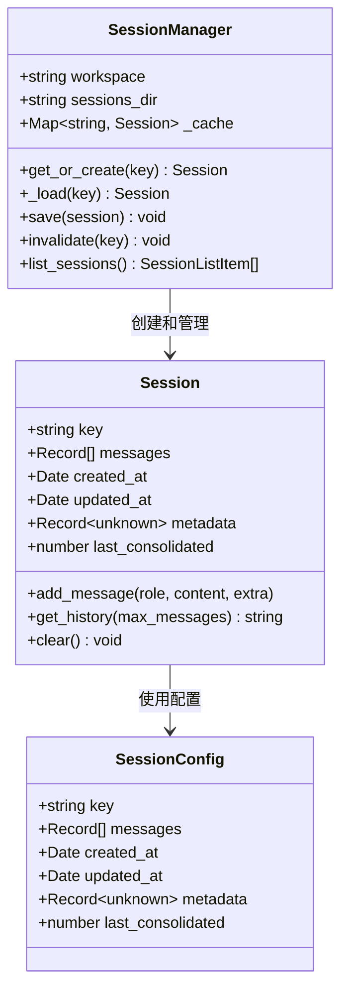
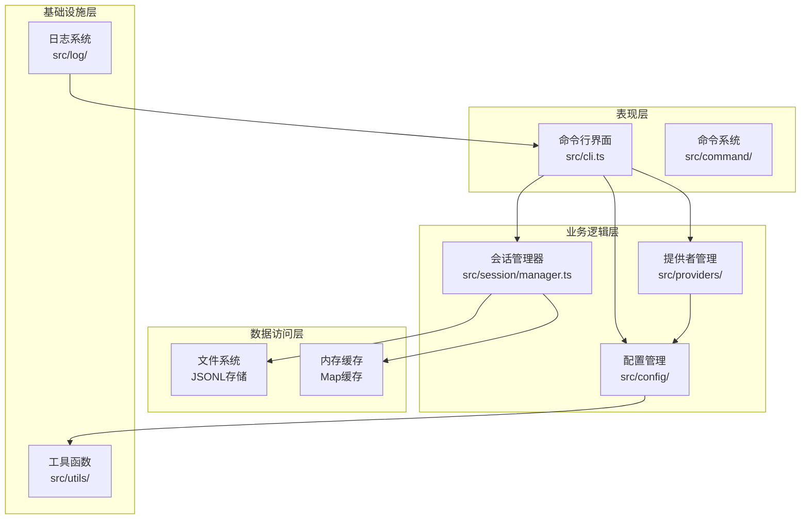
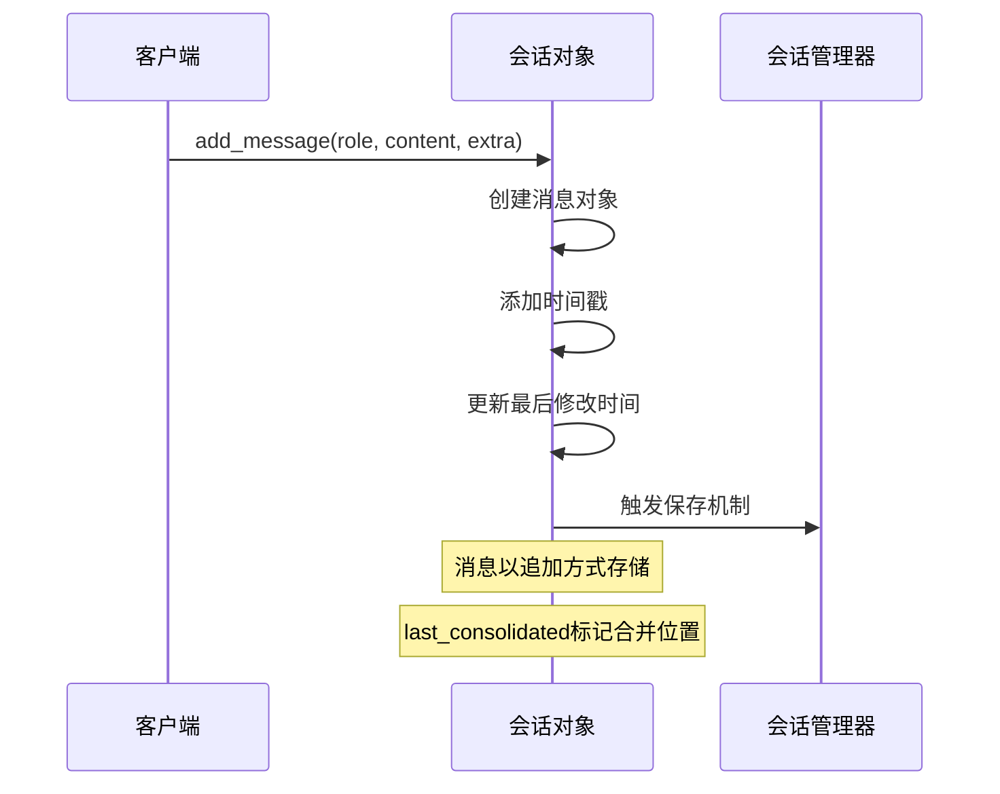
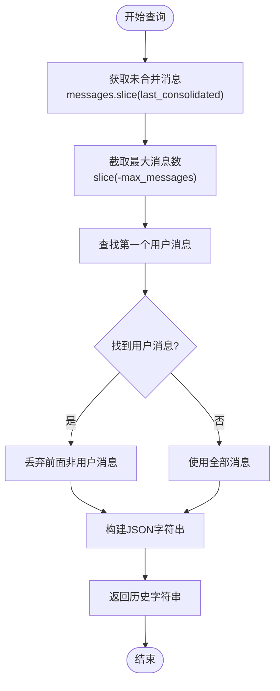
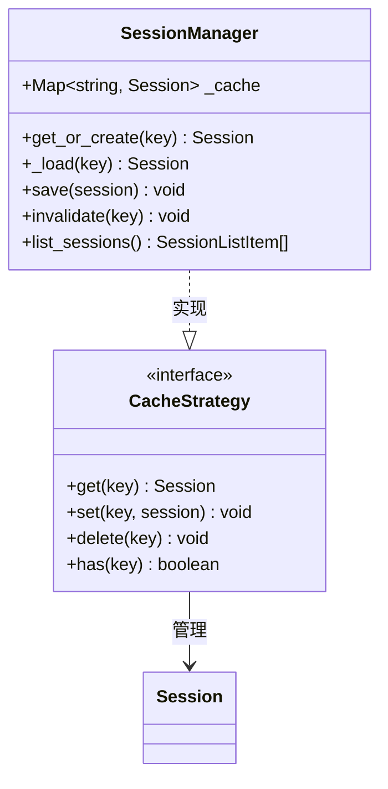
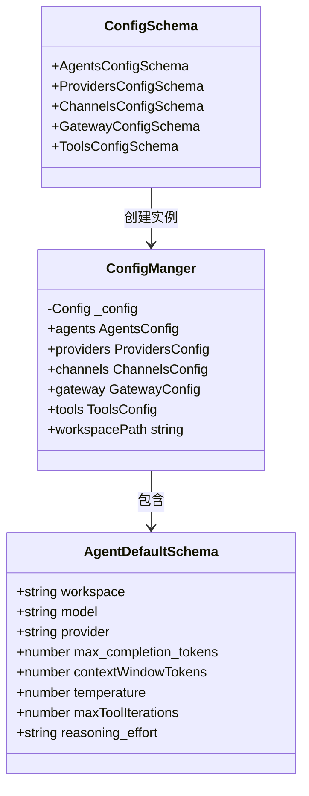
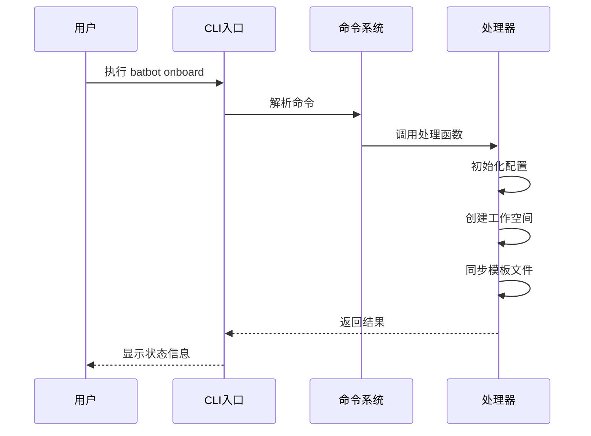
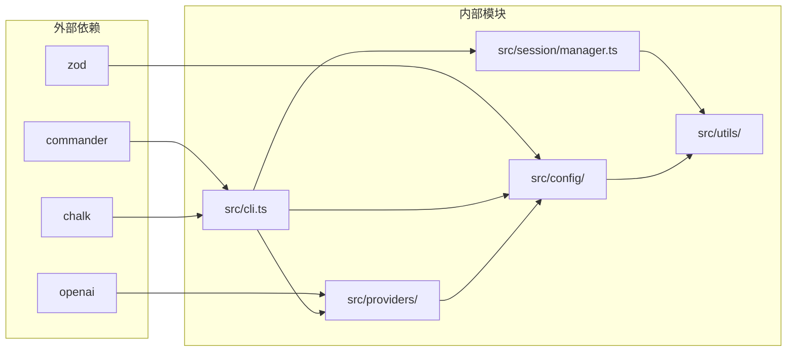

# 会话管理系统

<cite>
**本文档引用的文件**
- [src/session/manager.ts](file://src/session/manager.ts)
- [src/utils/helpers.ts](file://src/utils/helpers.ts)
- [src/config/schema.ts](file://src/config/schema.ts)
- [src/config/paths.ts](file://src/config/paths.ts)
- [src/config/loader.ts](file://src/config/loader.ts)
- [src/cli.ts](file://src/cli.ts)
- [src/providers/base.ts](file://src/providers/base.ts)
- [src/providers/registry.ts](file://src/providers/registry.ts)
- [src/command/index.ts](file://src/command/index.ts)
- [src/command/help.ts](file://src/command/help.ts)
- [src/log/index.ts](file://src/log/index.ts)
- [package.json](file://package.json)
</cite>

## 目录
1. [简介](#简介)
2. [项目结构](#项目结构)
3. [核心组件](#核心组件)
4. [架构概览](#架构概览)
5. [详细组件分析](#详细组件分析)
6. [依赖关系分析](#依赖关系分析)
7. [性能考虑](#性能考虑)
8. [故障排除指南](#故障排除指南)
9. [结论](#结论)

## 简介

BatBot 是一个基于 TypeScript 的个人 AI 助手系统，专注于会话管理和对话历史持久化。该系统提供了完整的会话生命周期管理，包括会话创建、消息存储、历史查询和缓存机制。

系统采用 JSONL（JSON Lines）格式存储会话数据，确保了数据的可读性和高效性。会话管理器负责处理所有与会话相关的操作，包括内存缓存、磁盘持久化和会话列表管理。

## 项目结构

项目采用模块化的目录结构，主要包含以下核心模块：

**图表来源**
- [src/session/manager.ts:1-237](file://src/session/manager.ts#L1-L237)
- [src/utils/helpers.ts:1-66](file://src/utils/helpers.ts#L1-L66)
- [src/config/schema.ts:1-168](file://src/config/schema.ts#L1-L168)

**章节来源**
- [src/session/manager.ts:1-237](file://src/session/manager.ts#L1-L237)
- [src/utils/helpers.ts:1-66](file://src/utils/helpers.ts#L1-L66)
- [src/config/schema.ts:1-168](file://src/config/schema.ts#L1-L168)

## 核心组件

### 会话管理器架构

系统的核心是会话管理器，它提供了完整的会话生命周期管理功能：

**图表来源**
- [src/session/manager.ts:30-237](file://src/session/manager.ts#L30-L237)

### 数据存储格式

系统采用 JSONL（JSON Lines）格式存储会话数据，具有以下特点：

- **元数据行**：第一行存储会话的元信息
- **消息行**：后续每一行存储一条消息记录
- **追加写入**：消息以追加方式写入，提高缓存效率
- **不可变性**：合并过程不修改原始消息列表

**章节来源**
- [src/session/manager.ts:21-83](file://src/session/manager.ts#L21-L83)
- [src/session/manager.ts:124-191](file://src/session/manager.ts#L124-L191)

## 架构概览

系统采用分层架构设计，各层职责明确：

**图表来源**
- [src/cli.ts:1-146](file://src/cli.ts#L1-L146)
- [src/session/manager.ts:89-237](file://src/session/manager.ts#L89-L237)
- [src/providers/base.ts:87-151](file://src/providers/base.ts#L87-L151)

## 详细组件分析

### 会话类实现

会话类是系统的核心数据结构，负责管理单个对话会话的所有数据：

#### 消息管理机制

**图表来源**
- [src/session/manager.ts:51-60](file://src/session/manager.ts#L51-L60)
- [src/session/manager.ts:166-191](file://src/session/manager.ts#L166-L191)

#### 历史查询算法

会话的历史查询实现了智能的消息截取和用户回合对齐：

**图表来源**
- [src/session/manager.ts:66-77](file://src/session/manager.ts#L66-L77)

**章节来源**
- [src/session/manager.ts:30-83](file://src/session/manager.ts#L30-L83)
- [src/session/manager.ts:66-77](file://src/session/manager.ts#L66-L77)

### 会话管理器功能

会话管理器提供了完整的会话生命周期管理：

#### 缓存策略

**图表来源**
- [src/session/manager.ts:89-117](file://src/session/manager.ts#L89-L117)

#### 文件系统集成

会话管理器通过安全的文件命名和目录管理确保数据持久化：

**章节来源**
- [src/session/manager.ts:89-237](file://src/session/manager.ts#L89-L237)
- [src/utils/helpers.ts:52-66](file://src/utils/helpers.ts#L52-L66)

### 配置管理系统

系统采用 Zod 模式验证的配置管理，确保配置的完整性和正确性：

**图表来源**
- [src/config/schema.ts:124-168](file://src/config/schema.ts#L124-L168)
- [src/config/loader.ts:7-33](file://src/config/loader.ts#L7-L33)

**章节来源**
- [src/config/schema.ts:1-168](file://src/config/schema.ts#L1-L168)
- [src/config/loader.ts:1-33](file://src/config/loader.ts#L1-L33)

### 命令行接口系统

CLI 系统提供了完整的用户交互界面：

#### 命令注册机制

**图表来源**
- [src/cli.ts:24-75](file://src/cli.ts#L24-L75)
- [src/command/index.ts:4-16](file://src/command/index.ts#L4-L16)

**章节来源**
- [src/cli.ts:1-146](file://src/cli.ts#L1-L146)
- [src/command/index.ts:1-16](file://src/command/index.ts#L1-L16)

## 依赖关系分析

系统依赖关系清晰，模块间耦合度适中：

**图表来源**
- [package.json:23-32](file://package.json#L23-L32)
- [src/session/manager.ts:1-3](file://src/session/manager.ts#L1-L3)

**章节来源**
- [package.json:1-39](file://package.json#L1-L39)

## 性能考虑

### 内存优化策略

1. **惰性加载**：会话仅在需要时从磁盘加载到内存
2. **LRU 缓存**：使用 Map 结构实现简单的缓存机制
3. **增量持久化**：只在必要时保存会话状态

### I/O 性能优化

1. **批量写入**：将元数据和消息一次性写入文件
2. **追加写入**：避免随机访问，提高写入性能
3. **文件同步**：使用同步文件操作确保数据一致性

### 内存管理

1. **消息截取**：通过 `last_consolidated` 标记减少内存占用
2. **历史清理**：定期清理不需要的历史消息
3. **缓存失效**：提供显式的缓存清理机制

## 故障排除指南

### 常见问题及解决方案

#### 会话加载失败

**症状**：无法加载现有会话或创建新会话
**原因**：文件权限问题或损坏的 JSONL 文件
**解决方法**：
1. 检查会话文件是否存在且可读
2. 验证 JSONL 文件格式的完整性
3. 确认文件编码为 UTF-8

#### 配置文件错误

**症状**：启动时出现配置解析错误
**原因**：配置文件格式不正确或缺少必需字段
**解决方法**：
1. 运行 `batbot onboard` 重新初始化配置
2. 检查配置文件的 JSON 格式
3. 验证所有必需字段都已设置

#### 工作空间问题

**症状**：无法创建或访问工作空间目录
**原因**：权限不足或路径不存在
**解决方法**：
1. 确认用户对目标目录有写权限
2. 手动创建缺失的目录结构
3. 检查磁盘空间是否充足

**章节来源**
- [src/session/manager.ts:156-159](file://src/session/manager.ts#L156-L159)
- [src/config/loader.ts:13-22](file://src/config/loader.ts#L13-L22)

## 结论

BatBot 会话管理系统是一个设计精良的 TypeScript 应用，具有以下特点：

1. **模块化设计**：清晰的分层架构和职责分离
2. **高性能实现**：优化的内存使用和 I/O 操作
3. **可靠性保障**：完善的错误处理和数据持久化机制
4. **扩展性强**：灵活的配置系统和插件架构

系统特别适合需要长期对话记忆和个人化 AI 助手的应用场景。通过 JSONL 格式的数据存储和智能的缓存策略，系统能够在保证数据完整性的同时提供高效的性能表现。

未来可以考虑的功能增强包括：
- 支持会话压缩和归档
- 添加会话搜索和标签功能
- 实现跨设备同步机制
- 增强数据备份和恢复能力