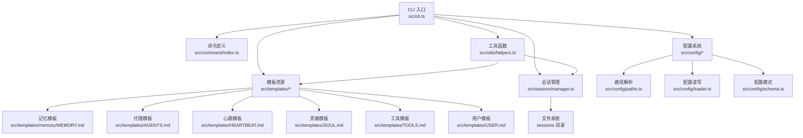
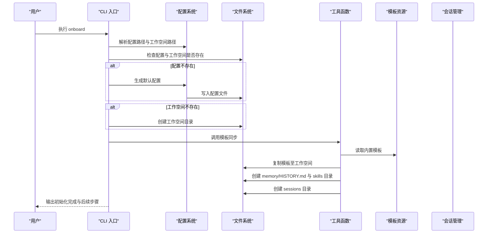
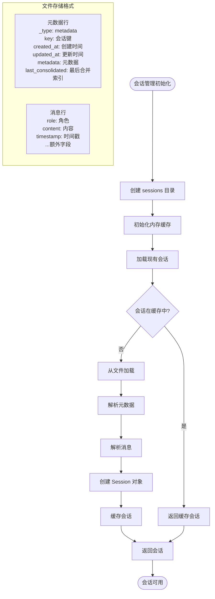
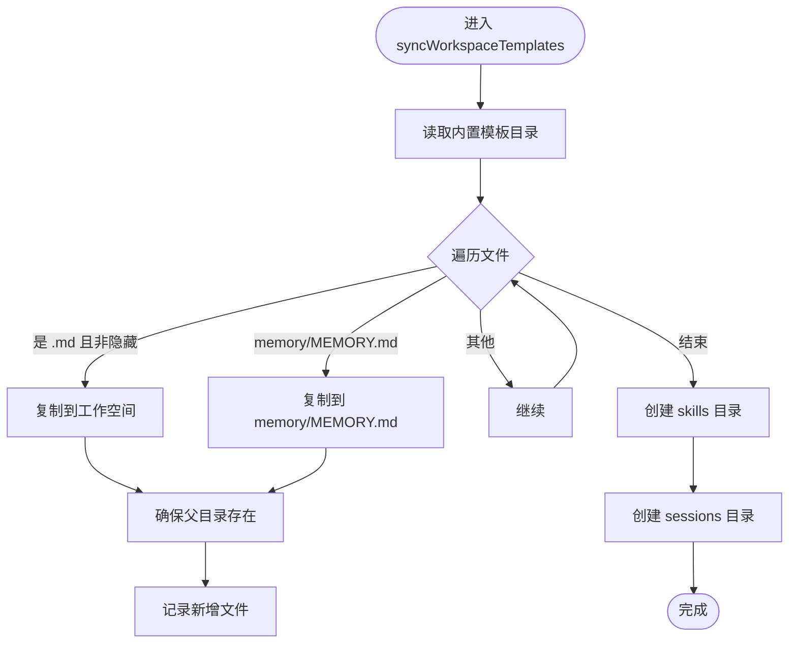

# 工作空间管理

<cite>
**本文引用的文件**
- [src/index.ts](file://src/index.ts)
- [src/cli.ts](file://src/cli.ts)
- [src/command/index.ts](file://src/command/index.ts)
- [src/config/index.ts](file://src/config/index.ts)
- [src/config/paths.ts](file://src/config/paths.ts)
- [src/config/loader.ts](file://src/config/loader.ts)
- [src/config/schema.ts](file://src/config/schema.ts)
- [src/utils/helpers.ts](file://src/utils/helpers.ts)
- [src/utils/index.ts](file://src/utils/index.ts)
- [src/session/manager.ts](file://src/session/manager.ts)
- [src/agent/loop.ts](file://src/agent/loop.ts)
- [src/templates/memory/MEMORY.md](file://src/templates/memory/MEMORY.md)
- [src/templates/AGENTS.md](file://src/templates/AGENTS.md)
- [src/templates/HEARTBEAT.md](file://src/templates/HEARTBEAT.md)
- [src/templates/SOUL.md](file://src/templates/SOUL.md)
- [src/templates/TOOLS.md](file://src/templates/TOOLS.md)
- [src/templates/USER.md](file://src/templates/USER.md)
- [package.json](file://package.json)
</cite>

## 更新摘要
**变更内容**
- 新增会话管理系统集成，增强工作空间功能
- 添加会话持久化和管理机制
- 扩展工作空间目录结构，增加 sessions 目录
- 增强消息历史管理和缓存机制

## 目录
1. [简介](#简介)
2. [项目结构](#项目结构)
3. [核心组件](#核心组件)
4. [架构总览](#架构总览)
5. [详细组件分析](#详细组件分析)
6. [依赖分析](#依赖分析)
7. [性能考虑](#性能考虑)
8. [故障排查指南](#故障排查指南)
9. [结论](#结论)
10. [附录](#附录)

## 简介
本文件为"工作空间管理系统"的详细技术文档，围绕以下目标展开：  
- 解释工作空间的概念与作用：本地存储、模板管理、文件同步机制  
- 模板系统实现：内存模板、代理模板、心跳模板、灵魂模板、工具模板、用户模板  
- 工作空间的创建、维护与清理操作指南  
- 模板文件的结构、内容与更新机制  
- 工作空间的备份、恢复与迁移方法  
- 工作空间与配置系统的集成关系  
- **新增**：会话管理系统集成，支持对话历史持久化和管理  

该系统以命令行入口为核心，通过初始化流程创建并填充工作空间，同时提供模板文件用于指导代理行为、记录长期记忆、管理周期任务等。**新增的会话管理系统**为工作空间提供了完整的对话历史管理能力。

## 项目结构
项目采用按功能分层的组织方式：  
- 命令行入口与子命令：负责初始化、网关、代理交互、状态查询、通道与提供商管理等  
- 配置模块：路径解析、配置加载与保存、配置模式校验  
- 模板资源：内置模板集合，包含记忆、代理指令、心跳任务、灵魂设定、工具使用说明、用户档案等  
- 工具函数：工作空间模板同步逻辑、目录创建、文件名安全处理  
- **新增**：会话管理：对话历史持久化、缓存管理、JSONL格式存储  
- 日志与帮助：日志输出与命令帮助定制  

**图表来源**
- [src/cli.ts:1-146](file://src/cli.ts#L1-L146)
- [src/command/index.ts:1-15](file://src/command/index.ts#L1-L15)
- [src/config/paths.ts:1-11](file://src/config/paths.ts#L1-L11)
- [src/config/loader.ts:1-16](file://src/config/loader.ts#L1-L16)
- [src/config/schema.ts:1-168](file://src/config/schema.ts#L1-L168)
- [src/utils/helpers.ts:1-66](file://src/utils/helpers.ts#L1-L66)
- [src/session/manager.ts:1-237](file://src/session/manager.ts#L1-L237)
- [src/templates/memory/MEMORY.md:1-24](file://src/templates/memory/MEMORY.md#L1-L24)
- [src/templates/AGENTS.md:1-22](file://src/templates/AGENTS.md#L1-L22)
- [src/templates/HEARTBEAT.md:1-17](file://src/templates/HEARTBEAT.md#L1-L17)
- [src/templates/SOUL.md:1-22](file://src/templates/SOUL.md#L1-L22)
- [src/templates/TOOLS.md:1-16](file://src/templates/TOOLS.md#L1-L16)
- [src/templates/USER.md:1-50](file://src/templates/USER.md#L1-L50)

**章节来源**
- [src/cli.ts:1-146](file://src/cli.ts#L1-L146)
- [src/config/paths.ts:1-11](file://src/config/paths.ts#L1-L11)
- [src/utils/helpers.ts:1-66](file://src/utils/helpers.ts#L1-L66)

## 核心组件
- CLI 与命令系统：提供 batbot 的命令入口，支持 onboard 初始化、gateway 启动、agent 交互、status 查询、channels 与 provider 管理等  
- 配置系统：定义配置模式（agents、providers、gateway、tools、channels），解析与保存配置，计算工作空间路径  
- 模板系统：内置多类模板文件，用于指导代理行为、记录长期记忆、管理周期任务等  
- **新增**：会话管理系统：提供对话历史的持久化存储、缓存管理、消息历史获取等功能  
- 工具函数：工作空间模板同步，确保工作空间目录下存在所需模板与子目录，提供目录创建和文件名安全处理  

**章节来源**
- [src/cli.ts:1-146](file://src/cli.ts#L1-L146)
- [src/config/schema.ts:136-168](file://src/config/schema.ts#L136-L168)
- [src/utils/helpers.ts:11-66](file://src/utils/helpers.ts#L11-L66)
- [src/session/manager.ts:1-237](file://src/session/manager.ts#L1-L237)

## 架构总览
工作空间管理的核心流程如下：  
- 用户执行 onboard 命令  
- 系统解析配置路径与工作空间路径  
- 若配置不存在则创建默认配置；若工作空间不存在则创建目录  
- 同步模板到工作空间：复制内置模板、创建记忆子目录与历史文件、创建技能目录、**新增**：创建会话目录  
- 输出下一步指引（如添加 API Key、开始聊天）

**图表来源**
- [src/cli.ts:27-75](file://src/cli.ts#L27-L75)
- [src/config/paths.ts:4-10](file://src/config/paths.ts#L4-L10)
- [src/config/loader.ts:6-15](file://src/config/loader.ts#L6-L15)
- [src/utils/helpers.ts:11-66](file://src/utils/helpers.ts#L11-L66)
- [src/session/manager.ts:89-97](file://src/session/manager.ts#L89-L97)

## 详细组件分析

### CLI 与命令系统
- 命令入口：基于 commander 定义 batbot 主命令与版本信息  
- 子命令：onboard 初始化、gateway 启动、agent 交互、status 查询、channels 与 provider 管理预留  
- onboard 流程：检查/创建配置与工作空间，调用模板同步，输出引导信息  

**章节来源**
- [src/cli.ts:17-146](file://src/cli.ts#L17-L146)
- [src/command/index.ts:1-15](file://src/command/index.ts#L1-L15)

### 配置系统
- 路径解析：返回用户主目录下的 .batbot/config.json 与 .batbot/workspace  
- 配置保存：确保配置目录存在后写入 JSON 文件  
- 配置模式：  
  - agents.default：工作空间、模型、上下文窗口、温度、最大工具迭代次数等  
  - providers：提供者配置（如 bailian）  
  - gateway：主机、端口、心跳配置  
  - tools：web 搜索、exec 工具、限制在工作空间访问、MCP 服务器等  
  - channels：通道配置（示例：钉钉）  
- 工作空间路径计算：支持相对路径、~ 替换与绝对路径解析  

**章节来源**
- [src/config/paths.ts:4-10](file://src/config/paths.ts#L4-L10)
- [src/config/loader.ts:6-15](file://src/config/loader.ts#L6-L15)
- [src/config/schema.ts:136-168](file://src/config/schema.ts#L136-L168)

### 模板系统
内置模板文件及其用途：  
- AGENTS.md：代理行为与提醒、心跳任务管理指导  
- HEARTBEAT.md：周期性任务清单，约定"Active/Completed"分区  
- SOUL.md：代理个性、价值观与沟通风格  
- TOOLS.md：工具签名自动提供，补充非显式约束与使用模式  
- USER.md：用户画像、偏好、工作背景与特殊指令  
- memory/MEMORY.md：长期记忆结构化模板，建议自动更新重要信息  
- skills：工作空间内技能目录（由工具函数创建）  

模板同步逻辑：  
- 遍历内置模板目录，复制 .md 文件到工作空间  
- 特别处理 memory/MEMORY.md 与 memory/HISTORY.md（后者为空文件）  
- 确保 skills 目录存在  
- **新增**：确保 sessions 目录存在  

**章节来源**
- [src/templates/AGENTS.md:1-22](file://src/templates/AGENTS.md#L1-L22)
- [src/templates/HEARTBEAT.md:1-17](file://src/templates/HEARTBEAT.md#L1-L17)
- [src/templates/SOUL.md:1-22](file://src/templates/SOUL.md#L1-L22)
- [src/templates/TOOLS.md:1-16](file://src/templates/TOOLS.md#L1-L16)
- [src/templates/USER.md:1-50](file://src/templates/USER.md#L1-L50)
- [src/templates/memory/MEMORY.md:1-24](file://src/templates/memory/MEMORY.md#L1-L24)
- [src/utils/helpers.ts:11-66](file://src/utils/helpers.ts#L11-L66)

### 会话管理系统
**新增功能**：为工作空间提供完整的对话历史管理能力

#### Session 类
- **职责**：表示单个对话会话，存储消息历史
- **特性**：
  - 消息追加只读设计，提高 LLM 缓存效率
  - 支持元数据存储（创建时间、更新时间、自定义字段）
  - 提供消息历史获取功能，支持用户回合对齐
  - 支持消息清理和最后合并索引跟踪

#### SessionManager 类
- **职责**：管理多个会话实例，提供持久化存储
- **特性**：
  - JSONL 格式存储，每条消息一行，元数据单独一行
  - 内存缓存机制，提高重复访问性能
  - 文件名安全处理，防止非法字符
  - 会话列表管理，支持按更新时间排序

#### 工作空间集成
- **目录结构**：在工作空间根目录创建 `sessions` 目录
- **文件格式**：每个会话对应一个 `.jsonl` 文件
- **元数据格式**：第一行存储会话元数据，后续行存储消息记录
- **缓存策略**：内存中缓存已加载的会话，避免重复 I/O

**图表来源**
- [src/session/manager.ts:89-97](file://src/session/manager.ts#L89-L97)
- [src/session/manager.ts:109-117](file://src/session/manager.ts#L109-L117)
- [src/session/manager.ts:124-160](file://src/session/manager.ts#L124-L160)
- [src/session/manager.ts:166-191](file://src/session/manager.ts#L166-L191)

**章节来源**
- [src/session/manager.ts:1-237](file://src/session/manager.ts#L1-L237)

### 工具函数：工作空间模板同步
- 输入：工作空间根路径、是否静默输出  
- 行为：  
  - 读取内置模板目录，复制所有 .md 文件到工作空间  
  - 复制 memory/MEMORY.md 到工作空间 memory 目录  
  - 在 memory 下创建 HISTORY.md（空文件）  
  - 创建 skills 目录  
  - **新增**：创建 sessions 目录  
  - 记录新增文件并可选输出日志  
- 错误处理：若目标已存在则跳过；确保父目录存在  

**图表来源**
- [src/utils/helpers.ts:11-66](file://src/utils/helpers.ts#L11-L66)

**章节来源**
- [src/utils/helpers.ts:11-66](file://src/utils/helpers.ts#L11-L66)

### 版本与标识
- 版本号与徽标常量导出，供 CLI 描述与版本输出使用  

**章节来源**
- [src/index.ts:1-4](file://src/index.ts#L1-L4)

## 依赖分析
- 运行时依赖：chalk（命令行高亮）、commander（命令行解析）、zod（配置模式校验）  
- **新增**：@clack/prompts（交互式确认对话框）  
- 开发依赖：typescript、cpy-cli（构建时复制模板）、@types/node  
- 构建脚本：编译 TypeScript，并复制 src 目录下的所有 .md 模板到 dist 输出目录  

**章节来源**
- [package.json:22-34](file://package.json#L22-L34)

## 性能考虑
- 模板同步为一次性或增量触发（onboard 时），文件数量有限，性能开销可忽略  
- 配置读写为小体积 JSON 文件，I/O 成本低  
- **新增**：会话管理采用内存缓存机制，避免重复文件 I/O  
- **新增**：JSONL 格式存储，支持高效的逐行读取和追加写入  
- 建议：  
  - 将工作空间置于本地磁盘，避免网络挂载导致的延迟  
  - 控制工具访问范围（如 restrictToWorkspace），减少不必要的文件扫描  
  - 心跳间隔根据实际需求调整，避免过于频繁的周期性任务检查  
  - **新增**：合理设置会话清理策略，避免过多历史文件占用磁盘空间  

## 故障排查指南
- 配置文件损坏或格式错误  
  - 现象：启动时报配置解析错误  
  - 排查：检查 ~/.batbot/config.json 是否为合法 JSON；必要时删除后重新 onboard  
  - 参考：配置模式定义与保存逻辑  
- 工作空间缺失或权限不足  
  - 现象：onboard 无法创建目录或复制模板  
  - 排查：确认用户主目录可写；检查 ~/.batbot 权限；手动创建目录后重试  
  - 参考：路径解析与保存逻辑  
- 模板未同步到工作空间  
  - 现象：工作空间缺少某些模板文件  
  - 排查：确认内置模板存在；检查同步函数是否被调用；手动执行同步逻辑  
  - 参考：模板同步函数与模板目录  
- 工具访问受限  
  - 现象：工具执行失败或访问被拒绝  
  - 排查：检查 tools.restrictToWorkspace 设置；核对 exec 超时与安全限制  
  - 参考：工具配置模式与工具模板说明  
- **新增**：会话文件损坏  
  - 现象：会话加载失败或显示异常  
  - 排查：检查 sessions 目录下 JSONL 文件格式；验证元数据行格式；删除损坏文件后重新创建  
  - 参考：会话管理器的错误处理逻辑  
- **新增**：会话缓存问题  
  - 现象：会话数据不一致或内存泄漏  
  - 排查：调用 `invalidate()` 方法清除缓存；检查会话生命周期管理  
  - 参考：会话管理器的缓存机制  

**章节来源**
- [src/config/schema.ts:136-168](file://src/config/schema.ts#L136-L168)
- [src/utils/helpers.ts:11-66](file://src/utils/helpers.ts#L11-L66)
- [src/session/manager.ts:156-159](file://src/session/manager.ts#L156-L159)

## 结论
本工作空间管理系统通过 CLI 初始化流程，结合配置系统与模板资源，实现了本地化的知识与行为管理：  
- 工作空间作为本地存储中心，承载代理指令、长期记忆、周期任务与用户画像  
- 模板系统提供标准化结构与使用规范，降低接入成本  
- 配置系统以模式校验保障一致性，路径解析与保存逻辑保证可移植性  
- 工具函数确保模板与目录结构的一致性，便于维护与扩展  
- **新增**：会话管理系统提供完整的对话历史持久化能力，支持高效的消息管理与缓存机制  

## 附录

### 工作空间创建、维护与清理操作指南
- 创建与初始化  
  - 执行 onboard，系统会：  
    - 生成默认配置（若不存在）  
    - 创建工作空间目录（若不存在）  
    - 同步模板到工作空间（含 memory、skills 与 **新增**：sessions 目录）  
- 维护  
  - 编辑 USER.md、SOUL.md、AGENTS.md、TOOLS.md 以个性化代理行为  
  - 使用 HEARTBEAT.md 管理周期任务  
  - 在 MEMORY.md 中记录长期记忆要点  
  - **新增**：会话管理：通过 SessionManager 管理会话历史，支持消息追加和历史查询  
- 清理  
  - 删除工作空间目录可完全清理（谨慎操作）  
  - 重新执行 onboard 以重建模板与目录结构  
  - **新增**：清理会话历史：删除 sessions 目录下的所有 JSONL 文件  

**章节来源**
- [src/cli.ts:27-75](file://src/cli.ts#L27-L75)
- [src/utils/helpers.ts:11-66](file://src/utils/helpers.ts#L11-L66)
- [src/session/manager.ts:89-97](file://src/session/manager.ts#L89-L97)

### 模板文件结构、内容与更新机制
- 结构与分区  
  - AGENTS.md：行为指导、提醒与心跳任务管理  
  - HEARTBEAT.md：Active/Completed 分区，约定周期任务  
  - SOUL.md：个性、价值观、沟通风格  
  - TOOLS.md：工具约束与使用模式  
  - USER.md：用户画像、偏好、工作背景与特殊指令  
  - memory/MEMORY.md：长期记忆结构化模板  
- 更新机制  
  - onboard 时自动同步内置模板  
  - 用户可直接编辑工作空间中的模板文件  
  - MEMORY.md 建议由系统自动更新重要信息（模板注释提示）  

**章节来源**
- [src/templates/AGENTS.md:1-22](file://src/templates/AGENTS.md#L1-L22)
- [src/templates/HEARTBEAT.md:1-17](file://src/templates/HEARTBEAT.md#L1-L17)
- [src/templates/SOUL.md:1-22](file://src/templates/SOUL.md#L1-L22)
- [src/templates/TOOLS.md:1-16](file://src/templates/TOOLS.md#L1-L16)
- [src/templates/USER.md:1-50](file://src/templates/USER.md#L1-L50)
- [src/templates/memory/MEMORY.md:1-24](file://src/templates/memory/MEMORY.md#L1-L24)
- [src/utils/helpers.ts:11-66](file://src/utils/helpers.ts#L11-L66)

### 工作空间备份、恢复与迁移方法
- 备份  
  - 备份 ~/.batbot 目录（包含 config.json 与 workspace）  
  - **新增**：备份 sessions 目录下的所有会话文件  
- 恢复  
  - 在新环境还原 ~/.batbot；如需重新初始化，执行 onboard  
  - **新增**：恢复会话历史：将备份的 sessions 目录复制到新的工作空间  
- 迁移  
  - 更换工作空间路径：修改 agents.default.workspace 配置项  
  - 迁移后重新执行 onboard 以确保模板与目录一致  
  - **新增**：迁移会话历史：复制 sessions 目录到新工作空间  

**章节来源**
- [src/config/schema.ts:136-168](file://src/config/schema.ts#L136-L168)
- [src/config/paths.ts:4-10](file://src/config/paths.ts#L4-L10)
- [src/cli.ts:27-75](file://src/cli.ts#L27-L75)
- [src/session/manager.ts:89-97](file://src/session/manager.ts#L89-L97)

### 工作空间与配置系统的集成关系
- 路径集成：配置中定义 agents.default.workspace，ConfigManger 提供 workspacePath 属性，支持 ~ 替换与绝对路径解析  
- 行为集成：gateway、tools、providers 等配置影响代理运行参数与能力  
- 生命周期集成：onboard 时读取/写入配置，随后进行模板同步  
- **新增**：会话集成：SessionManager 依赖工作空间路径创建 sessions 目录，实现会话历史的持久化存储  

**章节来源**
- [src/config/schema.ts:136-168](file://src/config/schema.ts#L136-L168)
- [src/config/paths.ts:4-10](file://src/config/paths.ts#L4-L10)
- [src/cli.ts:27-75](file://src/cli.ts#L27-L75)
- [src/session/manager.ts:89-97](file://src/session/manager.ts#L89-L97)

### 会话管理系统使用指南
**新增章节**：详细介绍会话管理系统的使用方法

#### 会话创建与获取
- 使用 `get_or_create(key)` 方法获取或创建会话
- 会话键支持包含特殊字符，系统会自动进行安全处理
- 首次创建的会话包含空消息列表和默认元数据

#### 消息管理
- 使用 `add_message(role, content, extra)` 方法添加消息
- 支持多种角色：user、assistant、system、tool 等
- 自动添加时间戳和更新会话元数据
- 消息追加只读设计，提高 LLM 缓存效率

#### 历史查询
- 使用 `get_history(max_messages)` 获取消息历史
- 支持限制返回的消息数量
- 自动处理用户回合对齐，避免孤立的工具结果块

#### 会话持久化
- 使用 `save(session)` 方法将会话保存到文件
- 采用 JSONL 格式存储，每条消息一行
- 自动缓存已保存的会话，提高后续访问性能

#### 会话管理
- 使用 `list_sessions()` 获取所有会话列表
- 支持按更新时间排序
- 使用 `invalidate(key)` 清除缓存中的会话

**章节来源**
- [src/session/manager.ts:1-237](file://src/session/manager.ts#L1-L237)