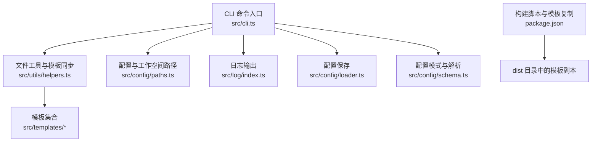
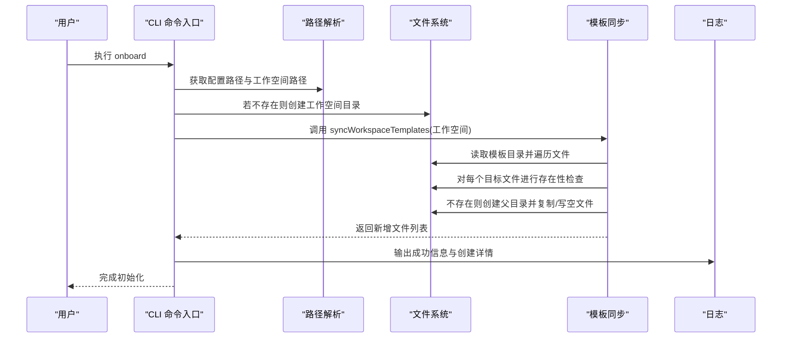
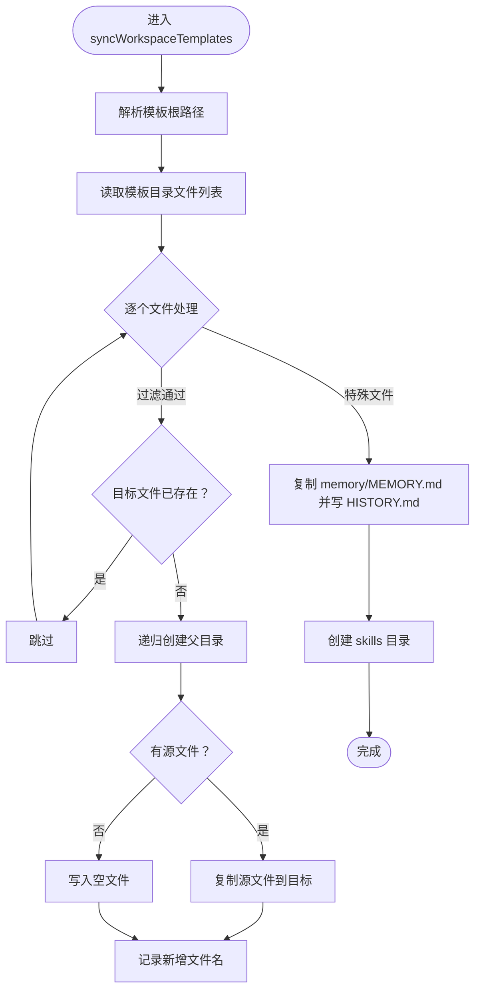
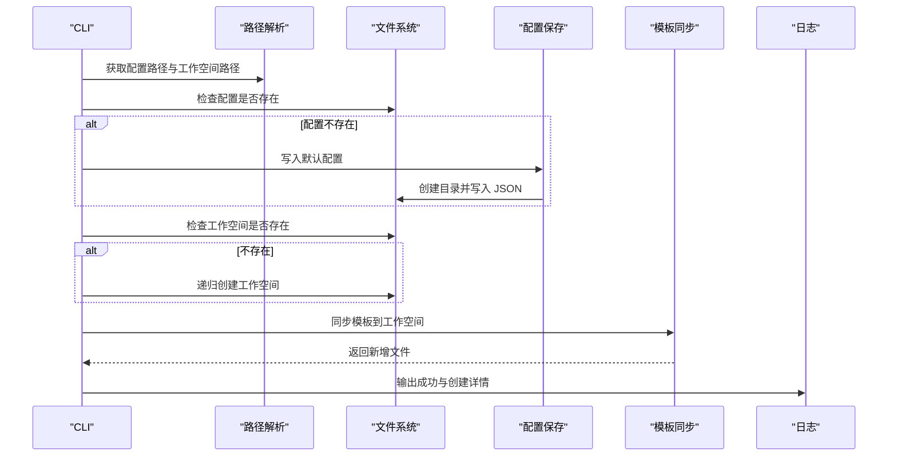
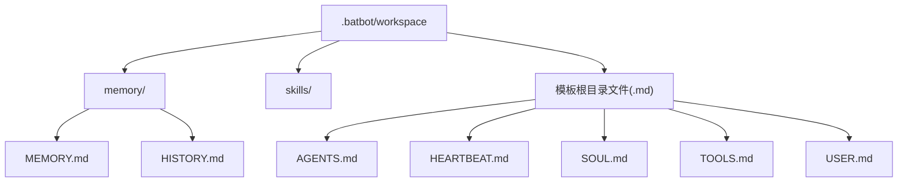
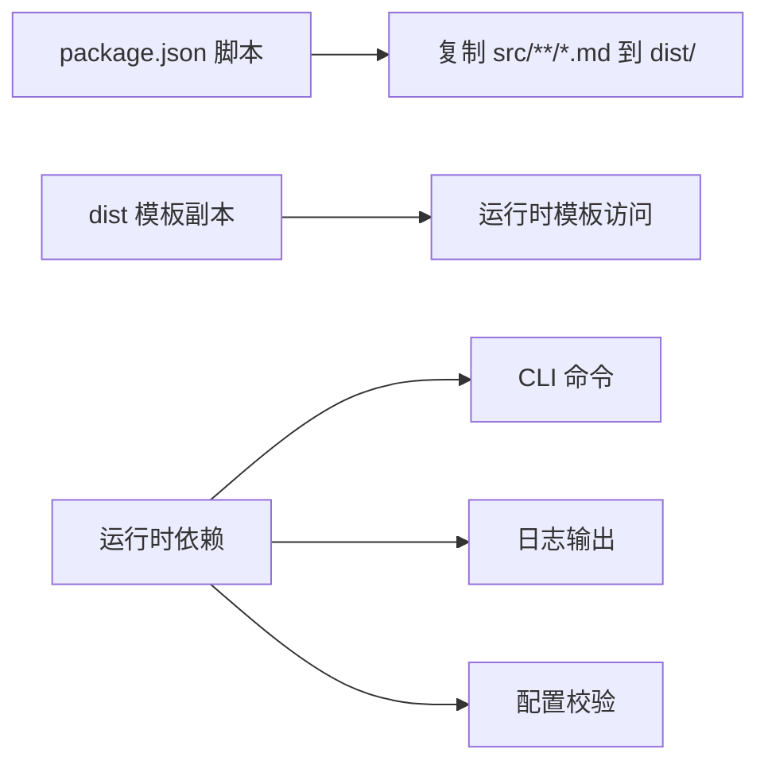

# 文件管理

<cite>
**本文引用的文件**
- [src/cli.ts](file://src/cli.ts)
- [src/utils/helpers.ts](file://src/utils/helpers.ts)
- [src/config/paths.ts](file://src/config/paths.ts)
- [src/config/loader.ts](file://src/config/loader.ts)
- [src/config/schema.ts](file://src/config/schema.ts)
- [src/log/index.ts](file://src/log/index.ts)
- [src/templates/memory/MEMORY.md](file://src/templates/memory/MEMORY.md)
- [src/templates/AGENTS.md](file://src/templates/AGENTS.md)
- [src/templates/HEARTBEAT.md](file://src/templates/HEARTBEAT.md)
- [src/templates/SOUL.md](file://src/templates/SOUL.md)
- [src/templates/TOOLS.md](file://src/templates/TOOLS.md)
- [src/templates/USER.md](file://src/templates/USER.md)
- [package.json](file://package.json)
</cite>

## 目录
1. [简介](#简介)
2. [项目结构](#项目结构)
3. [核心组件](#核心组件)
4. [架构总览](#架构总览)
5. [详细组件分析](#详细组件分析)
6. [依赖分析](#依赖分析)
7. [性能考量](#性能考量)
8. [故障排除指南](#故障排除指南)
9. [结论](#结论)
10. [附录](#附录)

## 简介
本文件管理文档聚焦于“工作空间文件管理”的核心能力与实现，涵盖以下方面：
- 工作空间初始化：配置与工作空间目录创建
- 模板同步：将内置模板复制到工作空间，并确保目录结构完整
- 目录结构：memory、skills 及各模板文件的组织关系
- 错误处理与日志：在文件创建、复制、目录创建等环节的日志输出策略
- 路径与跨平台：基于 Node.js 的路径处理与用户主目录解析
- 最佳实践与故障排除：权限、并发、异常场景下的建议与排查步骤

## 项目结构
该仓库采用按职责分层的组织方式：
- CLI 层：命令入口与用户交互（onboard/gateway/agent/status/channels/provider）
- 配置层：配置路径解析、默认值与保存逻辑
- 工具层：文件系统操作与模板同步
- 模板层：内置 Markdown 模板集合
- 日志层：统一日志输出与着色

图表来源
- [src/cli.ts:1-94](file://src/cli.ts#L1-L94)
- [src/utils/helpers.ts:11-46](file://src/utils/helpers.ts#L11-L46)
- [src/config/paths.ts:1-11](file://src/config/paths.ts#L1-L11)
- [src/config/loader.ts:1-16](file://src/config/loader.ts#L1-L16)
- [src/config/schema.ts:130-145](file://src/config/schema.ts#L130-L145)
- [src/log/index.ts:1-49](file://src/log/index.ts#L1-L49)
- [package.json:17-21](file://package.json#L17-L21)

章节来源
- [src/cli.ts:1-94](file://src/cli.ts#L1-L94)
- [src/config/paths.ts:1-11](file://src/config/paths.ts#L1-L11)
- [package.json:17-21](file://package.json#L17-L21)

## 核心组件
- CLI onboard 命令：负责初始化配置、创建工作空间、调用模板同步
- 路径解析：统一从用户主目录生成配置与工作空间路径
- 模板同步：将内置模板复制到工作空间，确保 memory/skills 目录与关键文件存在
- 日志系统：提供 info/success/warn/error/debug 等多级输出
- 配置保存：在首次运行时创建配置文件并写入默认值

章节来源
- [src/cli.ts:21-56](file://src/cli.ts#L21-L56)
- [src/config/paths.ts:4-10](file://src/config/paths.ts#L4-L10)
- [src/utils/helpers.ts:11-46](file://src/utils/helpers.ts#L11-L46)
- [src/log/index.ts:5-44](file://src/log/index.ts#L5-L44)
- [src/config/loader.ts:6-15](file://src/config/loader.ts#L6-L15)

## 架构总览
下图展示了 onboard 命令执行时的关键流程：路径解析、目录创建、模板同步与日志输出。

图表来源
- [src/cli.ts:24-46](file://src/cli.ts#L24-L46)
- [src/utils/helpers.ts:11-46](file://src/utils/helpers.ts#L11-L46)
- [src/config/paths.ts:4-10](file://src/config/paths.ts#L4-L10)
- [src/log/index.ts:5-44](file://src/log/index.ts#L5-L44)

## 详细组件分析

### 组件一：模板同步函数 syncWorkspaceTemplates
该函数负责将内置模板复制到工作空间，并确保必要的目录与文件存在。其核心流程如下：

- 模板根路径解析：通过相对路径定位到模板目录
- 文件遍历与过滤：读取模板目录中的文件，仅处理以 .md 结尾且不以点开头的文件
- 存在性检查与创建：若目标文件不存在，则递归创建父目录；若源文件存在则复制，否则写入空文件
- 特殊文件处理：显式复制 memory/MEMORY.md 到工作空间；写入 memory/HISTORY.md（空文件）
- 目录补全：确保 skills 目录存在
- 日志输出：非静默模式下输出新增文件路径

图表来源
- [src/utils/helpers.ts:11-46](file://src/utils/helpers.ts#L11-L46)

章节来源
- [src/utils/helpers.ts:11-46](file://src/utils/helpers.ts#L11-L46)

### 组件二：CLI 初始化流程（onboard）
onboard 命令负责：
- 解析配置与工作空间路径
- 若配置不存在则创建默认配置并保存
- 若工作空间不存在则递归创建
- 调用模板同步函数生成工作空间文件
- 输出引导信息与下一步操作提示

图表来源
- [src/cli.ts:24-46](file://src/cli.ts#L24-L46)
- [src/config/loader.ts:6-15](file://src/config/loader.ts#L6-L15)
- [src/utils/helpers.ts:11-46](file://src/utils/helpers.ts#L11-L46)
- [src/log/index.ts:5-44](file://src/log/index.ts#L5-L44)

章节来源
- [src/cli.ts:21-56](file://src/cli.ts#L21-L56)
- [src/config/loader.ts:6-15](file://src/config/loader.ts#L6-L15)

### 组件三：日志与错误处理
- 日志级别：info/success/warn/error/debug/gray/title/divider 等
- 错误处理策略：当前实现未在模板同步中显式捕获异常；onboard 中对配置与工作空间的创建使用了存在性检查与递归创建，避免重复错误
- 建议：在模板同步中增加 try/catch 包裹关键 FS 操作，并在失败时记录错误日志与中断流程，以便用户快速定位问题

章节来源
- [src/log/index.ts:5-44](file://src/log/index.ts#L5-L44)
- [src/cli.ts:30-39](file://src/cli.ts#L30-L39)
- [src/utils/helpers.ts:19-29](file://src/utils/helpers.ts#L19-L29)

### 组件四：路径与跨平台兼容性
- 用户主目录：通过 Node.js os.homedir 与 path.join 组合生成配置与工作空间路径
- 跨平台：使用 path.join 保证路径分隔符正确；Windows/Unix 下均能生成有效路径
- 相对路径：模板根路径通过 __dirname 与 ../ 计算，确保在打包后仍可定位模板目录

章节来源
- [src/config/paths.ts:1-11](file://src/config/paths.ts#L1-L11)
- [src/utils/helpers.ts:15](file://src/utils/helpers.ts#L15)

### 组件五：工作空间目录结构与模板关系
- 工作空间根目录：~/.batbot/workspace
- memory 目录：用于长期记忆与历史记录
  - memory/MEMORY.md：从模板复制
  - memory/HISTORY.md：在同步时写入空文件
- skills 目录：用于存放技能相关文件，初始化时创建
- 其他模板文件：直接从 src/templates 复制到工作空间根目录（.md 且不以点开头）

图表来源
- [src/utils/helpers.ts:31-39](file://src/utils/helpers.ts#L31-L39)
- [src/templates/memory/MEMORY.md:1-24](file://src/templates/memory/MEMORY.md#L1-L24)
- [src/templates/AGENTS.md:1-22](file://src/templates/AGENTS.md#L1-L22)
- [src/templates/HEARTBEAT.md:1-17](file://src/templates/HEARTBEAT.md#L1-L17)
- [src/templates/SOUL.md:1-22](file://src/templates/SOUL.md#L1-L22)
- [src/templates/TOOLS.md:1-16](file://src/templates/TOOLS.md#L1-L16)
- [src/templates/USER.md:1-50](file://src/templates/USER.md#L1-L50)

章节来源
- [src/utils/helpers.ts:31-39](file://src/utils/helpers.ts#L31-L39)
- [src/templates/memory/MEMORY.md:1-24](file://src/templates/memory/MEMORY.md#L1-L24)
- [src/templates/AGENTS.md:1-22](file://src/templates/AGENTS.md#L1-L22)
- [src/templates/HEARTBEAT.md:1-17](file://src/templates/HEARTBEAT.md#L1-L17)
- [src/templates/SOUL.md:1-22](file://src/templates/SOUL.md#L1-L22)
- [src/templates/TOOLS.md:1-16](file://src/templates/TOOLS.md#L1-L16)
- [src/templates/USER.md:1-50](file://src/templates/USER.md#L1-L50)

## 依赖分析
- 构建阶段：构建脚本会将 src 目录下的所有 .md 文件复制到 dist 目录，确保运行时模板可用
- 运行时依赖：chalk 用于日志着色；commander 提供 CLI 能力；zod 用于配置校验

图表来源
- [package.json:17-21](file://package.json#L17-L21)

章节来源
- [package.json:17-21](file://package.json#L17-L21)

## 性能考量
- 文件遍历与复制：模板数量有限，性能开销可忽略；若未来模板增多，可考虑异步遍历与批量写入
- 目录创建：递归创建为幂等操作，多次调用不会产生额外成本
- 日志输出：控制台输出对性能影响极小，但大量日志可能阻塞终端渲染
- 跨平台路径：path.join 为常量时间操作，性能稳定

## 故障排除指南
常见问题与解决思路：
- 权限不足
  - 现象：无法创建工作空间或写入文件
  - 排查：确认用户对 ~/.batbot 是否具有读写权限；必要时使用 chmod 或以管理员身份运行
- 路径解析异常
  - 现象：工作空间或配置路径不正确
  - 排查：检查 Node.js 环境变量与 home 目录设置；确认路径拼接逻辑是否符合预期
- 模板复制失败
  - 现象：部分模板未出现在工作空间
  - 排查：检查模板目录是否存在；确认文件名过滤规则（仅 .md 且不以点开头）是否导致遗漏
- 日志缺失
  - 现象：无任何输出
  - 排查：确认日志级别与终端支持 ANSI；在静默模式下调用时不会输出新增文件列表
- 配置覆盖与保留
  - 现象：onboard 重复执行时配置被覆盖
  - 排查：遵循 CLI 提示，选择覆盖或保留策略；保留策略会合并新字段

章节来源
- [src/cli.ts:30-39](file://src/cli.ts#L30-L39)
- [src/utils/helpers.ts:19-29](file://src/utils/helpers.ts#L19-L29)
- [src/log/index.ts:5-44](file://src/log/index.ts#L5-L44)

## 结论
本文件管理系统围绕“工作空间初始化与模板同步”展开，通过 CLI、路径解析、模板同步与日志模块协同，实现了从零到一的工作空间搭建。模板同步函数以幂等的方式确保关键目录与文件的存在，配合日志输出提升可观测性。未来可在错误处理、异步化与可配置性方面进一步增强。

## 附录
- 最佳实践
  - 在生产环境使用非 root 用户运行，确保 ~/.batbot 可写
  - 使用静默模式进行自动化部署，减少日志噪声
  - 定期备份 memory 与 skills 目录，防止意外覆盖
  - 如需扩展模板，遵循 .md 且不以点开头的命名规范
- 常见命令
  - 初始化：batbot onboard
  - 启动网关：batbot gateway
  - 代理交互：batbot agent
  - 查看状态：batbot status
  - 管理通道/提供商：batbot channels / batbot provider