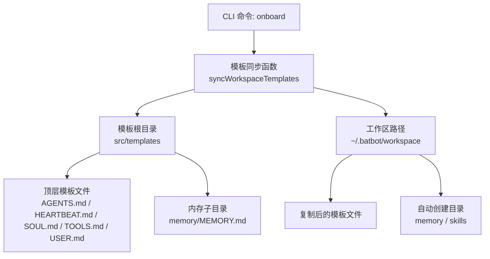
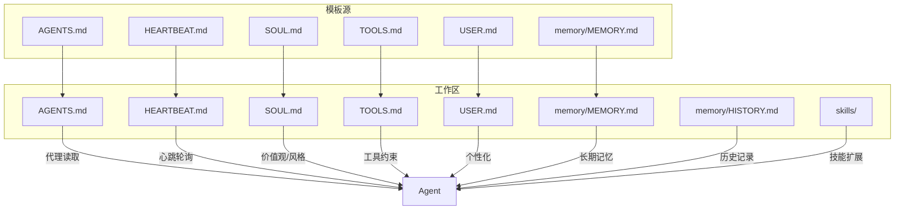
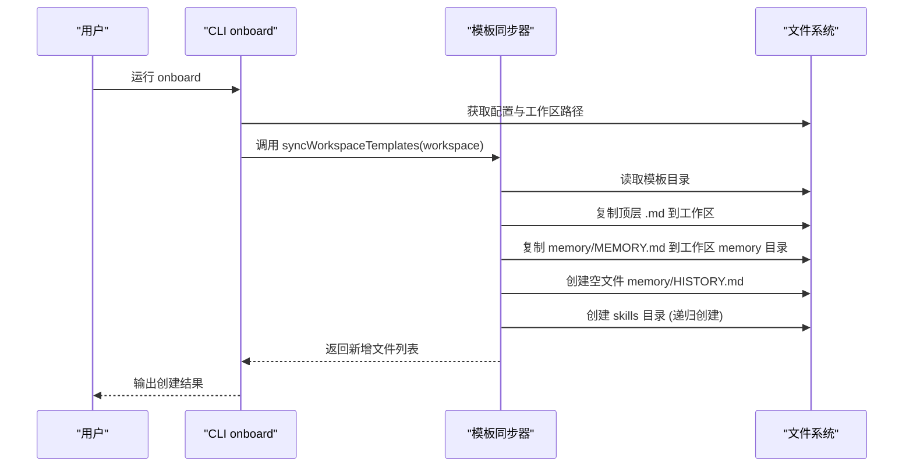
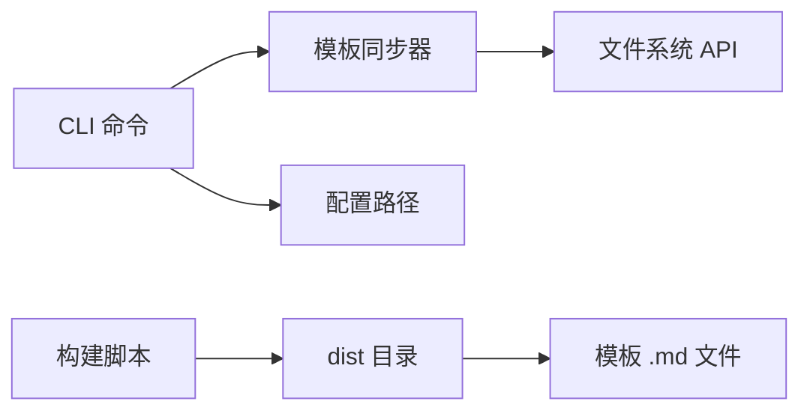

# 模板系统

<cite>
**本文引用的文件**
- [src/templates/memory/MEMORY.md](file://src/templates/memory/MEMORY.md)
- [src/templates/AGENTS.md](file://src/templates/AGENTS.md)
- [src/templates/HEARTBEAT.md](file://src/templates/HEARTBEAT.md)
- [src/templates/SOUL.md](file://src/templates/SOUL.md)
- [src/templates/TOOLS.md](file://src/templates/TOOLS.md)
- [src/templates/USER.md](file://src/templates/USER.md)
- [src/utils/helpers.ts](file://src/utils/helpers.ts)
- [src/cli.ts](file://src/cli.ts)
- [src/config/paths.ts](file://src/config/paths.ts)
- [src/config/schema.ts](file://src/config/schema.ts)
- [package.json](file://package.json)
</cite>

## 更新摘要
**所做变更**
- 更新了模板同步机制部分，重点说明了目录创建递归选项的改进处理
- 强调了嵌套目录结构正确创建的技术细节
- 更新了相关章节的源码引用以反映最新的实现

## 目录
1. [简介](#简介)
2. [项目结构](#项目结构)
3. [核心组件](#核心组件)
4. [架构总览](#架构总览)
5. [详细组件分析](#详细组件分析)
6. [依赖分析](#依赖分析)
7. [性能考虑](#性能考虑)
8. [故障排查指南](#故障排查指南)
9. [结论](#结论)
10. [附录](#附录)

## 简介
本文件系统性阐述 batbot 的"模板系统"，其目标是通过一组标准化的 Markdown 模板文件，为 AI 代理提供可读、可维护且可演进的行为与上下文基线。模板系统围绕以下关键点展开：
- 模板文件的组织结构、命名规范与用途
- 每类模板（内存、代理、心跳、灵魂、工具、用户）的职责边界与协作关系
- 模板同步机制的实现逻辑（文件复制、目录创建、空文件生成）
- 模板内容结构、格式要求与最佳实践
- 模板更新策略与版本管理建议

## 项目结构
模板系统位于 src/templates 目录下，包含若干核心模板与一个子目录 memory，其中包含长期记忆与历史记录模板。CLI 命令 onboard 在初始化时会调用模板同步函数，将模板复制到用户的本地工作区，并创建必要的子目录。

**图表来源**
- [src/cli.ts:22-56](file://src/cli.ts#L22-L56)
- [src/utils/helpers.ts:11-46](file://src/utils/helpers.ts#L11-L46)
- [src/config/paths.ts:4-10](file://src/config/paths.ts#L4-L10)

**章节来源**
- [src/cli.ts:22-56](file://src/cli.ts#L22-L56)
- [src/utils/helpers.ts:11-46](file://src/utils/helpers.ts#L11-L46)
- [src/config/paths.ts:4-10](file://src/config/paths.ts#L4-L10)

## 核心组件
- 模板同步器：负责扫描模板目录、复制或创建文件、确保工作区具备所需结构。
- 配置与路径：提供默认工作区路径与配置保存逻辑，确保模板放置在正确位置。
- CLI 初始化流程：onboard 命令串联配置创建、工作区创建与模板同步。

**章节来源**
- [src/utils/helpers.ts:11-46](file://src/utils/helpers.ts#L11-L46)
- [src/config/paths.ts:4-10](file://src/config/paths.ts#L4-L10)
- [src/cli.ts:22-56](file://src/cli.ts#L22-L56)

## 架构总览
模板系统以"约定优于配置"为核心设计原则：模板作为"事实来源"，在首次初始化时被复制到用户的工作区；运行期由代理读取这些模板以形成行为与上下文。心跳模板驱动周期性任务，内存模板承载跨会话记忆，用户模板提供个性化参数，工具模板约束工具使用规则，代理模板定义代理行为与技能使用方式，灵魂模板沉淀代理价值观与风格。

**图表来源**
- [src/utils/helpers.ts:31-46](file://src/utils/helpers.ts#L31-L46)
- [src/templates/AGENTS.md:1-22](file://src/templates/AGENTS.md#L1-L22)
- [src/templates/HEARTBEAT.md:1-17](file://src/templates/HEARTBEAT.md#L1-L17)
- [src/templates/SOUL.md:1-22](file://src/templates/SOUL.md#L1-L22)
- [src/templates/TOOLS.md:1-16](file://src/templates/TOOLS.md#L1-L16)
- [src/templates/USER.md:1-50](file://src/templates/USER.md#L1-L50)
- [src/templates/memory/MEMORY.md:1-24](file://src/templates/memory/MEMORY.md#L1-L24)

## 详细组件分析

### 内存模板（memory/MEMORY.md）
- 职责：持久化重要信息，支持跨会话的记忆与上下文延续。
- 结构要点：包含用户信息、偏好、项目上下文、重要备注等分节；末尾标注由系统自动更新。
- 使用场景：代理在对话中识别需要长期保留的信息时，写入该文件以增强后续交互质量。
- 最佳实践：仅记录对后续对话有实际价值的事实；避免冗余与敏感信息泄露。

**章节来源**
- [src/templates/memory/MEMORY.md:1-24](file://src/templates/memory/MEMORY.md#L1-L24)

### 代理模板（AGENTS.md）
- 职责：定义代理的行为准则、提醒调度策略与心跳任务管理方式。
- 关键规则：
  - 提醒调度需通过内置工具完成，不得仅写入记忆文件。
  - 心跳任务通过编辑心跳模板进行增删改写。
  - 对于周期性任务，应更新心跳模板而非一次性定时任务。
- 最佳实践：将复杂逻辑下沉到工具与心跳模板，保持代理指令简洁明确。

**章节来源**
- [src/templates/AGENTS.md:1-22](file://src/templates/AGENTS.md#L1-L22)

### 心跳模板（HEARTBEAT.md）
- 职责：声明周期性任务清单，按固定间隔被代理检查执行。
- 结构要点：包含"活动任务"与"已完成"两个区域；若仅有标题与注释则跳过心跳。
- 使用建议：将重复性、低优先级的任务放入心跳模板，便于统一管理与审计。

**章节来源**
- [src/templates/HEARTBEAT.md:1-17](file://src/templates/HEARTBEAT.md#L1-L17)

### 灵魂模板（SOUL.md）
- 职责：沉淀代理的人格特质、价值观与沟通风格。
- 结构要点：分别列出个性、价值观与沟通风格条目，便于在不同场景下调整语气与表达。
- 最佳实践：保持价值观稳定，风格随用户偏好动态适配。

**章节来源**
- [src/templates/SOUL.md:1-22](file://src/templates/SOUL.md#L1-L22)

### 工具模板（TOOLS.md）
- 职责：说明工具签名之外的非显式约束与使用模式。
- 安全限制示例：命令超时、危险命令拦截、输出截断、工作区访问限制等。
- 最佳实践：在调用前评估风险与边界，必要时启用工作区限制以降低影响面。

**章节来源**
- [src/templates/TOOLS.md:1-16](file://src/templates/TOOLS.md#L1-L16)

### 用户模板（USER.md）
- 职责：描述用户基本信息、偏好、工作背景与特殊指示，帮助代理个性化交互。
- 结构要点：基础信息、沟通风格、响应长度、技术层级、工作上下文、兴趣主题、特别指示等。
- 最佳实践：定期回顾与更新，确保与当前工作流一致。

**章节来源**
- [src/templates/USER.md:1-50](file://src/templates/USER.md#L1-L50)

### 模板同步机制
- 触发时机：CLI 命令 onboard 执行时调用模板同步函数。
- 同步流程：
  - 扫描模板根目录，复制顶层 .md 文件至工作区。
  - 复制 memory/MEMORY.md 至工作区 memory 子目录。
  - 创建空文件 memory/HISTORY.md（用于历史记录）。
  - 创建 skills 目录（用于技能扩展）。
  - **递归创建缺失的中间目录**：使用 `{ recursive: true }` 选项确保嵌套目录结构正确创建。
- 错误与幂等：若目标已存在则跳过；日志输出新增文件列表。

**更新** 增强了目录创建的递归选项处理，确保嵌套目录结构的正确创建

**图表来源**
- [src/cli.ts:22-56](file://src/cli.ts#L22-L56)
- [src/utils/helpers.ts:11-46](file://src/utils/helpers.ts#L11-L46)

**章节来源**
- [src/cli.ts:22-56](file://src/cli.ts#L22-L56)
- [src/utils/helpers.ts:11-46](file://src/utils/helpers.ts#L11-L46)

### 模板内容结构、格式要求与最佳实践
- 格式要求
  - 统一采用 Markdown 格式，使用清晰的标题层级与分节。
  - 使用注释占位符或提示性文本，指导用户填写。
  - 保持段落简洁、要点明确，避免冗长叙述。
- 最佳实践
  - 将"规则"与"示例"分离，先讲规则再给示例。
  - 对安全敏感的模板（如工具与用户），强调最小权限与隐私保护。
  - 对可演化的模板（如用户偏好），建议定期复审与更新。
  - 对可共享的模板（如代理与工具），建议在团队内达成共识后再推广。

## 依赖分析
- CLI 依赖模板同步器，后者依赖文件系统 API 实现复制与创建。
- 配置模块提供默认工作区路径，确保模板放置在用户家目录下的标准位置。
- 构建脚本在编译后复制所有 .md 模板到输出目录，保证发布包包含模板。

**图表来源**
- [src/cli.ts:22-56](file://src/cli.ts#L22-L56)
- [src/utils/helpers.ts:11-46](file://src/utils/helpers.ts#L11-L46)
- [src/config/paths.ts:4-10](file://src/config/paths.ts#L4-L10)
- [package.json:20](file://package.json#L20)

**章节来源**
- [src/cli.ts:22-56](file://src/cli.ts#L22-L56)
- [src/utils/helpers.ts:11-46](file://src/utils/helpers.ts#L11-L46)
- [src/config/paths.ts:4-10](file://src/config/paths.ts#L4-L10)
- [package.json:20](file://package.json#L20)

## 性能考虑
- 模板同步为一次性初始化操作，开销极小，无需担心性能问题。
- 心跳模板检查频率由配置控制，默认 30 分钟一次，可根据实际需求调整。
- 工具调用存在超时与输出截断等限制，避免长时间阻塞或大体量输出影响响应时间。

## 故障排查指南
- 模板未出现在工作区
  - 确认已执行 onboard 命令。
  - 检查工作区路径是否正确（默认位于用户家目录下的 .batbot/workspace）。
  - 查看日志输出，确认新增文件列表。
- 权限问题
  - 确保用户对工作区目录具有读写权限。
  - 若启用工作区限制，请确认工具配置允许访问相应路径。
- 心跳任务未触发
  - 检查心跳模板是否仅包含标题与注释；若如此会被视为无任务而跳过。
  - 确认心跳间隔配置合理，且代理具备读取模板的权限。
- **目录创建问题**
  - **更新** 确保使用 `{ recursive: true }` 选项创建嵌套目录结构。
  - 检查父目录权限，确保具有创建子目录的权限。

**章节来源**
- [src/cli.ts:22-56](file://src/cli.ts#L22-L56)
- [src/config/schema.ts:55-63](file://src/config/schema.ts#L55-L63)
- [src/templates/HEARTBEAT.md:6](file://src/templates/HEARTBEAT.md#L6)
- [src/utils/helpers.ts:21](file://src/utils/helpers.ts#L21)

## 结论
模板系统通过标准化的文件结构与同步机制，将代理的行为基线、上下文与规则从代码中剥离出来，使用户能够以自然语言的方式定制与演进 AI 行为。配合心跳、记忆与用户模板，系统实现了可解释、可维护、可扩展的个人智能助理框架。

## 附录

### 模板类型与用途速览
- AGENTS.md：代理行为与提醒调度规则
- HEARTBEAT.md：周期性任务清单
- SOUL.md：人格、价值观与沟通风格
- TOOLS.md：工具使用约束与安全限制
- USER.md：用户画像与个性化偏好
- memory/MEMORY.md：长期记忆与上下文
- memory/HISTORY.md：历史记录（自动生成）

### 版本管理与更新策略建议
- 采用语义化版本管理，变更模板时提升主版本号以提示破坏性改动。
- 对于非破坏性更新（如新增字段、优化措辞），提升次版本号。
- 在仓库中维护变更日志，记录每个版本的模板变更摘要。
- 发布前通过构建脚本复制模板，确保 dist 包含最新模板。
- 团队协作时，使用分支与 PR 审批流程管理模板变更，避免未经评审的修改。

**章节来源**
- [package.json:20](file://package.json#L20)