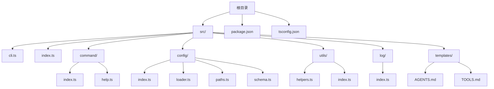
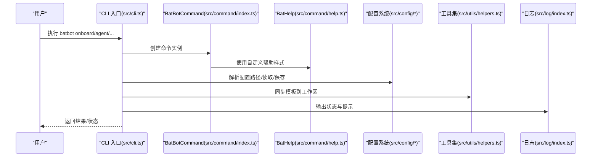
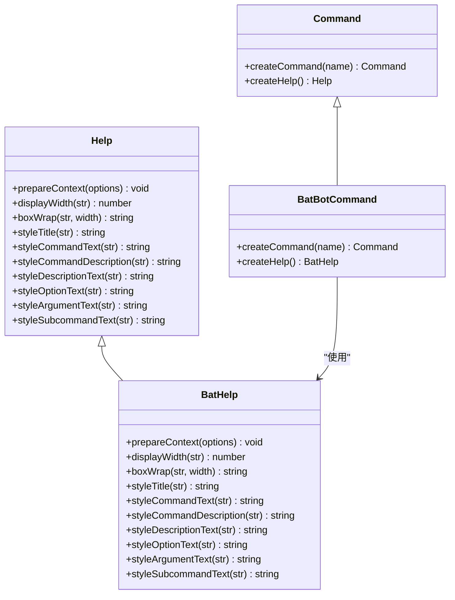
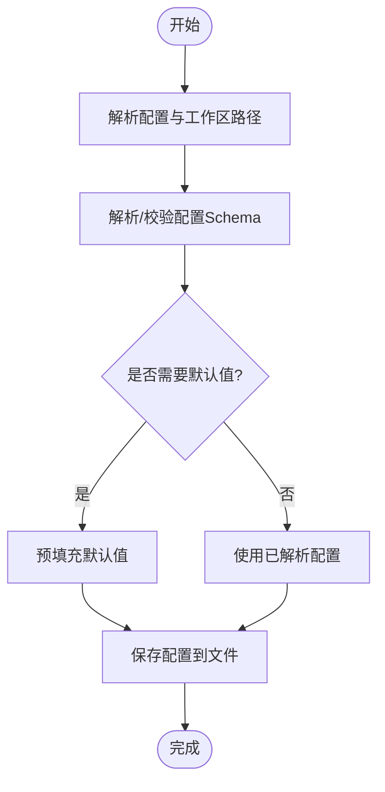
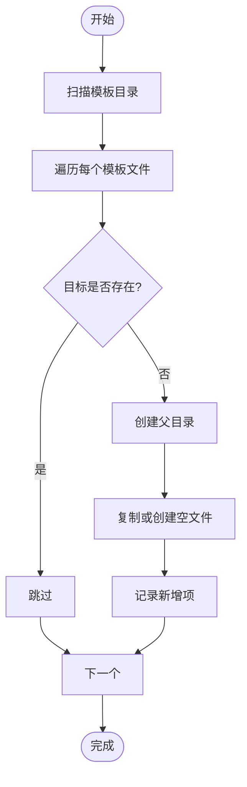
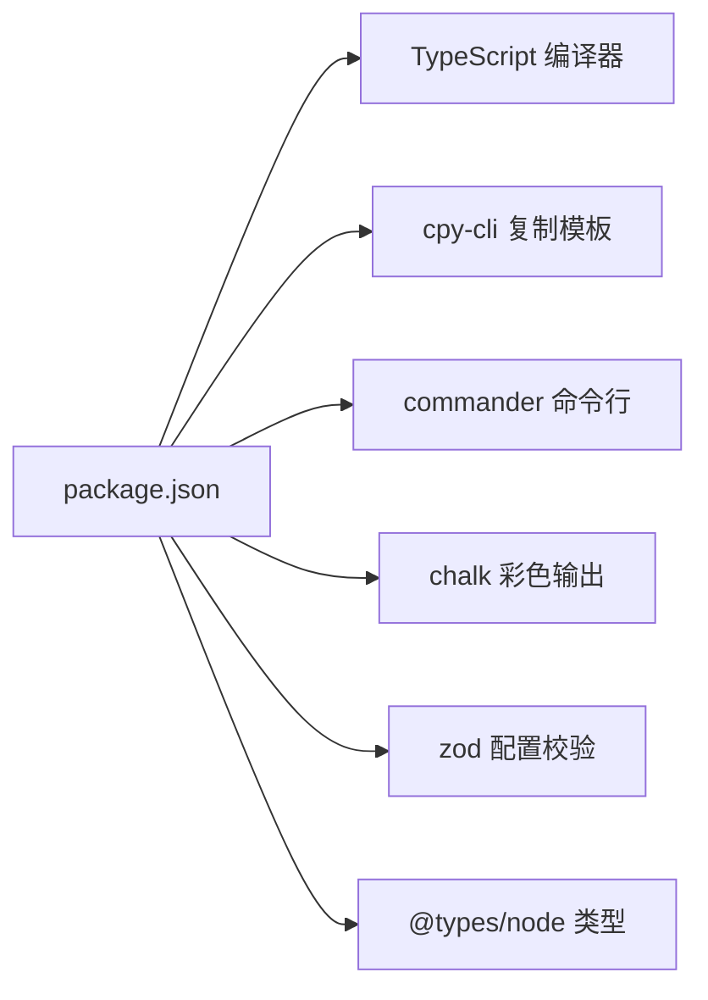

# 开发者指南

<cite>
**本文引用的文件**
- [package.json](file://package.json)
- [tsconfig.json](file://tsconfig.json)
- [src/index.ts](file://src/index.ts)
- [src/cli.ts](file://src/cli.ts)
- [src/command/index.ts](file://src/command/index.ts)
- [src/command/help.ts](file://src/command/help.ts)
- [src/config/index.ts](file://src/config/index.ts)
- [src/config/loader.ts](file://src/config/loader.ts)
- [src/config/paths.ts](file://src/config/paths.ts)
- [src/config/schema.ts](file://src/config/schema.ts)
- [src/utils/helpers.ts](file://src/utils/helpers.ts)
- [src/utils/index.ts](file://src/utils/index.ts)
- [src/log/index.ts](file://src/log/index.ts)
- [src/templates/AGENTS.md](file://src/templates/AGENTS.md)
- [src/templates/TOOLS.md](file://src/templates/TOOLS.md)
</cite>

## 目录
1. [简介](#简介)
2. [项目结构](#项目结构)
3. [核心组件](#核心组件)
4. [架构总览](#架构总览)
5. [详细组件分析](#详细组件分析)
6. [依赖分析](#依赖分析)
7. [性能考虑](#性能考虑)
8. [故障排查指南](#故障排查指南)
9. [结论](#结论)
10. [附录](#附录)

## 简介
本指南面向希望参与 BatBot 项目开发的工程师与贡献者，覆盖代码结构、模块组织、TypeScript 配置与构建流程、自定义命令开发、插件扩展机制、调试与测试、性能优化、贡献规范以及开发环境与发布流程等。文档以仓库现有实现为依据，避免臆测，确保可操作性与一致性。

## 项目结构
项目采用按功能域分层的目录组织方式，核心模块包括命令行入口、命令系统、配置管理、日志与工具集、模板资源等。TypeScript 编译输出至 dist 目录，构建脚本会复制 Markdown 模板到目标目录。

图表来源
- [src/cli.ts:1-92](file://src/cli.ts#L1-L92)
- [src/command/index.ts:1-16](file://src/command/index.ts#L1-L16)
- [src/command/help.ts:1-57](file://src/command/help.ts#L1-L57)
- [src/config/index.ts:1-3](file://src/config/index.ts#L1-L3)
- [src/config/loader.ts:1-16](file://src/config/loader.ts#L1-L16)
- [src/config/paths.ts:1-11](file://src/config/paths.ts#L1-L11)
- [src/config/schema.ts:1-146](file://src/config/schema.ts#L1-L146)
- [src/utils/helpers.ts:1-47](file://src/utils/helpers.ts#L1-L47)
- [src/utils/index.ts:1-1](file://src/utils/index.ts#L1-L1)
- [src/log/index.ts:1-49](file://src/log/index.ts#L1-L49)
- [src/templates/AGENTS.md:1-22](file://src/templates/AGENTS.md#L1-L22)
- [src/templates/TOOLS.md:1-16](file://src/templates/TOOLS.md#L1-L16)

章节来源
- [package.json:1-35](file://package.json#L1-L35)
- [tsconfig.json:1-21](file://tsconfig.json#L1-L21)

## 核心组件
- 命令行入口与 CLI：负责解析 batbot 子命令（如 onboard、gateway、agent、status、channels、provider），并调用相应逻辑。
- 自定义命令系统：通过继承 commander 的 Command 类，扩展帮助信息样式与子命令创建行为。
- 配置系统：集中定义配置模式、默认值与路径解析，并提供保存配置的能力。
- 工具与模板同步：在初始化时将模板文件同步到工作区，便于用户快速上手。
- 日志系统：封装统一的日志输出，支持多种颜色与格式化能力。

章节来源
- [src/cli.ts:1-92](file://src/cli.ts#L1-L92)
- [src/command/index.ts:1-16](file://src/command/index.ts#L1-L16)
- [src/command/help.ts:1-57](file://src/command/help.ts#L1-L57)
- [src/config/schema.ts:1-146](file://src/config/schema.ts#L1-L146)
- [src/config/loader.ts:1-16](file://src/config/loader.ts#L1-L16)
- [src/utils/helpers.ts:1-47](file://src/utils/helpers.ts#L1-L47)
- [src/log/index.ts:1-49](file://src/log/index.ts#L1-L49)

## 架构总览
下图展示了 CLI 启动后的主要控制流：解析命令、加载配置、执行初始化或代理交互等。

图表来源
- [src/cli.ts:1-92](file://src/cli.ts#L1-L92)
- [src/command/index.ts:1-16](file://src/command/index.ts#L1-L16)
- [src/command/help.ts:1-57](file://src/command/help.ts#L1-L57)
- [src/config/loader.ts:1-16](file://src/config/loader.ts#L1-L16)
- [src/utils/helpers.ts:1-47](file://src/utils/helpers.ts#L1-L47)
- [src/log/index.ts:1-49](file://src/log/index.ts#L1-L49)

## 详细组件分析

### 命令系统与帮助样式
- 继承关系：自定义 BatBotCommand 继承自 commander.Command，重写 createCommand 与 createHelp，以注入自定义帮助器。
- 帮助样式：BatHelp 覆盖标题、命令文本、描述、选项、参数、子命令等样式的渲染，并支持 ANSI 安全宽度计算与自动换行包装。
- CLI 集成：CLI 入口通过 new BatBotCommand() 创建根命令，设置名称、描述与版本，随后注册多个子命令。

图表来源
- [src/command/index.ts:1-16](file://src/command/index.ts#L1-L16)
- [src/command/help.ts:1-57](file://src/command/help.ts#L1-L57)

章节来源
- [src/command/index.ts:1-16](file://src/command/index.ts#L1-L16)
- [src/command/help.ts:1-57](file://src/command/help.ts#L1-L57)
- [src/cli.ts:1-92](file://src/cli.ts#L1-L92)

### 配置系统
- 配置模式：使用 Zod 定义各模块配置的 Schema，包括 Agent 默认参数、Provider、Gateway、Tools、Channels 等，并提供默认值与预填充。
- 路径解析：提供配置与工作区路径解析函数，支持用户主目录与相对路径处理。
- 配置保存：提供保存配置到指定路径的函数，自动创建目录并写入 JSON 文件。
- 配置管理器：ConfigManager 提供工作区路径解析逻辑，支持波浪号展开与绝对路径转换。

图表来源
- [src/config/paths.ts:1-11](file://src/config/paths.ts#L1-L11)
- [src/config/schema.ts:1-146](file://src/config/schema.ts#L1-L146)
- [src/config/loader.ts:1-16](file://src/config/loader.ts#L1-L16)

章节来源
- [src/config/index.ts:1-3](file://src/config/index.ts#L1-L3)
- [src/config/paths.ts:1-11](file://src/config/paths.ts#L1-L11)
- [src/config/schema.ts:1-146](file://src/config/schema.ts#L1-L146)
- [src/config/loader.ts:1-16](file://src/config/loader.ts#L1-L16)

### 工具与模板同步
- 功能：在初始化时扫描模板目录，将 Markdown 文件复制到工作区；同时创建 memory 与 skills 目录，保证工作区结构完整。
- 行为：对已存在文件不覆盖，仅记录新增项；支持静默模式用于测试或批量处理。

图表来源
- [src/utils/helpers.ts:1-47](file://src/utils/helpers.ts#L1-L47)

章节来源
- [src/utils/helpers.ts:1-47](file://src/utils/helpers.ts#L1-L47)
- [src/utils/index.ts:1-1](file://src/utils/index.ts#L1-L1)

### 日志系统
- 能力：提供 info、success、warn、error、debug、title、gray、divider 等方法，统一输出风格与颜色。
- 用途：CLI 初始化、配置保存、模板同步等流程中用于向用户反馈状态与提示。

章节来源
- [src/log/index.ts:1-49](file://src/log/index.ts#L1-L49)

### CLI 入口与命令注册
- 版本与标识：导出版本号与图标，供 CLI 描述使用。
- 子命令：onboard 初始化配置与工作区、gateway 启动网关、agent 与 status、channels、provider 等占位命令。
- 流程：onboard 中解析路径、保存配置、创建目录、同步模板并输出下一步指引。

章节来源
- [src/index.ts:1-4](file://src/index.ts#L1-L4)
- [src/cli.ts:1-92](file://src/cli.ts#L1-L92)

## 依赖分析
- 运行时依赖：chalk（彩色输出）、commander（命令行解析）、strip-ansi/wrap-ansi（帮助样式与文本包装）。
- 开发依赖：typescript（编译）、cpy-cli（构建时复制模板）、@types/node（类型声明）。
- 构建脚本：dev（监听编译）、build（编译并复制模板）、start（运行 dist/index.js）。

图表来源
- [package.json:1-35](file://package.json#L1-L35)

章节来源
- [package.json:1-35](file://package.json#L1-L35)
- [tsconfig.json:1-21](file://tsconfig.json#L1-L21)

## 性能考虑
- 编译与打包
  - 使用 NodeNext 模块解析与模块系统，减少运行时兼容成本。
  - 严格模式开启，提升类型安全与潜在错误发现效率。
- I/O 与文件操作
  - 模板同步仅在首次初始化执行，避免重复 I/O。
  - 写入配置前确保目录存在，减少失败重试。
- 日志输出
  - 使用 ANSI 包装与宽度计算，避免长文本渲染异常导致的额外开销。

章节来源
- [tsconfig.json:1-21](file://tsconfig.json#L1-L21)
- [src/utils/helpers.ts:1-47](file://src/utils/helpers.ts#L1-L47)
- [src/config/loader.ts:1-16](file://src/config/loader.ts#L1-L16)

## 故障排查指南
- 配置未生成或路径异常
  - 检查配置路径解析逻辑与默认值，确认用户主目录权限。
  - 参考：[src/config/paths.ts:1-11](file://src/config/paths.ts#L1-L11)
- 配置保存失败
  - 确认目录创建与写入权限，检查 JSON 序列化是否成功。
  - 参考：[src/config/loader.ts:1-16](file://src/config/loader.ts#L1-L16)
- 模板未同步
  - 确认模板目录存在且包含 .md 文件，检查目标工作区目录权限。
  - 参考：[src/utils/helpers.ts:1-47](file://src/utils/helpers.ts#L1-L47)
- 命令帮助样式异常
  - 检查 ANSI 包装与宽度计算，确认终端支持彩色输出。
  - 参考：[src/command/help.ts:1-57](file://src/command/help.ts#L1-L57)
- 日志输出不符合预期
  - 检查日志方法与颜色映射，确认终端 ANSI 支持。
  - 参考：[src/log/index.ts:1-49](file://src/log/index.ts#L1-L49)

章节来源
- [src/config/paths.ts:1-11](file://src/config/paths.ts#L1-L11)
- [src/config/loader.ts:1-16](file://src/config/loader.ts#L1-L16)
- [src/utils/helpers.ts:1-47](file://src/utils/helpers.ts#L1-L47)
- [src/command/help.ts:1-57](file://src/command/help.ts#L1-L57)
- [src/log/index.ts:1-49](file://src/log/index.ts#L1-L49)

## 结论
本指南基于现有代码实现了对 BatBot 项目结构、命令系统、配置与工具链的系统化梳理。后续可在现有基础上扩展插件机制、完善测试与调试流程，并持续优化构建与运行时性能。

## 附录

### TypeScript 配置与构建流程
- 编译目标与模块系统：ES2022 + NodeNext，确保现代语法与模块解析。
- 输出目录：dist，源码根目录 src。
- 构建脚本：
  - dev：监听编译，适合开发调试。
  - build：编译并复制模板到 dist。
  - start：运行编译产物。
- 参考：
  - [tsconfig.json:1-21](file://tsconfig.json#L1-L21)
  - [package.json:17-21](file://package.json#L17-L21)

章节来源
- [tsconfig.json:1-21](file://tsconfig.json#L1-L21)
- [package.json:17-21](file://package.json#L17-L21)

### 自定义命令开发指南
- 继承与扩展
  - 继承 BatBotCommand，复用 createCommand 与 createHelp，保持一致的帮助样式。
  - 参考：[src/command/index.ts:1-16](file://src/command/index.ts#L1-L16)，[src/command/help.ts:1-57](file://src/command/help.ts#L1-L57)
- 注册子命令
  - 在 CLI 入口中通过 program.command(...) 注册新命令，设置描述与 action。
  - 参考：[src/cli.ts:56-89](file://src/cli.ts#L56-L89)
- 实现自定义逻辑
  - 在 action 中调用配置加载、模板同步、日志输出等工具函数。
  - 参考：[src/config/loader.ts:1-16](file://src/config/loader.ts#L1-L16)，[src/utils/helpers.ts:1-47](file://src/utils/helpers.ts#L1-L47)，[src/log/index.ts:1-49](file://src/log/index.ts#L1-L49)

章节来源
- [src/command/index.ts:1-16](file://src/command/index.ts#L1-L16)
- [src/command/help.ts:1-57](file://src/command/help.ts#L1-L57)
- [src/cli.ts:56-89](file://src/cli.ts#L56-L89)
- [src/config/loader.ts:1-16](file://src/config/loader.ts#L1-L16)
- [src/utils/helpers.ts:1-47](file://src/utils/helpers.ts#L1-L47)
- [src/log/index.ts:1-49](file://src/log/index.ts#L1-L49)

### 插件系统扩展机制与最佳实践
- 当前现状
  - CLI 采用子命令扩展，命令类与帮助样式可扩展。
  - 配置系统通过 Zod Schema 定义，易于新增字段与默认值。
- 扩展建议
  - 新增命令：在 CLI 中注册新子命令，遵循现有命名与描述风格。
  - 新增配置：在 schema 中添加新字段与默认值，必要时更新路径解析与保存逻辑。
  - 模板与工作区：通过工具函数同步模板，确保工作区目录结构一致。
- 参考：
  - [src/cli.ts:56-89](file://src/cli.ts#L56-L89)
  - [src/config/schema.ts:1-146](file://src/config/schema.ts#L1-L146)
  - [src/utils/helpers.ts:1-47](file://src/utils/helpers.ts#L1-L47)

章节来源
- [src/cli.ts:56-89](file://src/cli.ts#L56-L89)
- [src/config/schema.ts:1-146](file://src/config/schema.ts#L1-L146)
- [src/utils/helpers.ts:1-47](file://src/utils/helpers.ts#L1-L47)

### 调试技巧
- 使用 dev 脚本进行监听式编译，快速迭代。
- 在 CLI 中增加 debug 日志输出，定位流程问题。
- 对模板同步与配置保存增加边界条件断言与日志记录。
- 参考：
  - [package.json:17-21](file://package.json#L17-L21)
  - [src/log/index.ts:1-49](file://src/log/index.ts#L1-L49)
  - [src/utils/helpers.ts:1-47](file://src/utils/helpers.ts#L1-L47)
  - [src/config/loader.ts:1-16](file://src/config/loader.ts#L1-L16)

章节来源
- [package.json:17-21](file://package.json#L17-L21)
- [src/log/index.ts:1-49](file://src/log/index.ts#L1-L49)
- [src/utils/helpers.ts:1-47](file://src/utils/helpers.ts#L1-L47)
- [src/config/loader.ts:1-16](file://src/config/loader.ts#L1-L16)

### 测试方法
- 单元测试建议
  - 配置相关：验证 Schema 校验、默认值、路径解析与保存逻辑。
  - 工具相关：模拟文件系统，验证模板同步与目录创建。
  - 命令相关：通过程序化调用命令对象，断言输出与行为。
- 参考：
  - [src/config/schema.ts:1-146](file://src/config/schema.ts#L1-L146)
  - [src/utils/helpers.ts:1-47](file://src/utils/helpers.ts#L1-L47)
  - [src/command/index.ts:1-16](file://src/command/index.ts#L1-L16)

章节来源
- [src/config/schema.ts:1-146](file://src/config/schema.ts#L1-L146)
- [src/utils/helpers.ts:1-47](file://src/utils/helpers.ts#L1-L47)
- [src/command/index.ts:1-16](file://src/command/index.ts#L1-L16)

### 性能优化建议
- 减少不必要的 I/O：仅在初始化阶段同步模板，避免频繁读写。
- 并行化：在需要批量处理时，考虑并发策略与错误聚合。
- 缓存：对静态模板内容可做简单缓存，降低重复读取。
- 参考：
  - [src/utils/helpers.ts:1-47](file://src/utils/helpers.ts#L1-L47)

章节来源
- [src/utils/helpers.ts:1-47](file://src/utils/helpers.ts#L1-L47)

### 贡献指南与代码规范
- 分支与提交
  - 主分支保护，功能开发在特性分支，提交信息清晰描述变更。
- 代码风格
  - 遵循 TypeScript 严格模式，保持一致的命名与缩进。
- 文档与注释
  - 关键函数与配置需提供注释说明用途与约束。
- 测试覆盖率
  - 新增功能需配套单元测试，覆盖正常与异常路径。
- 参考：
  - [tsconfig.json:9-12](file://tsconfig.json#L9-L12)

章节来源
- [tsconfig.json:9-12](file://tsconfig.json#L9-L12)

### 开发环境设置、依赖管理与发布流程
- 开发环境
  - 安装依赖：npm install
  - 开发调试：npm run dev
  - 构建产物：npm run build
  - 运行产物：npm run start
- 依赖管理
  - 运行时依赖：commander、chalk、zod、strip-ansi、wrap-ansi
  - 开发依赖：typescript、@types/node、cpy-cli
- 发布流程（建议）
  - 更新版本号与变更日志 → 本地构建与测试 → 推送标签 → 发布包
- 参考：
  - [package.json:17-33](file://package.json#L17-L33)

章节来源
- [package.json:17-33](file://package.json#L17-L33)