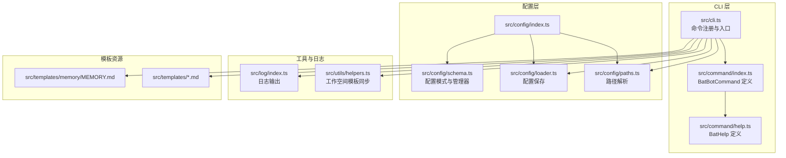
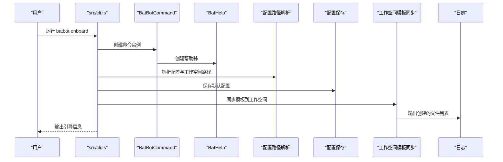
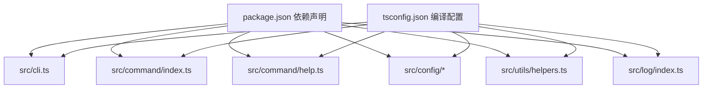

# 扩展开发

<cite>
**本文引用的文件**
- [src/index.ts](file://src/index.ts)
- [src/cli.ts](file://src/cli.ts)
- [src/command/index.ts](file://src/command/index.ts)
- [src/command/help.ts](file://src/command/help.ts)
- [src/config/index.ts](file://src/config/index.ts)
- [src/config/paths.ts](file://src/config/paths.ts)
- [src/config/loader.ts](file://src/config/loader.ts)
- [src/config/schema.ts](file://src/config/schema.ts)
- [src/utils/helpers.ts](file://src/utils/helpers.ts)
- [src/utils/index.ts](file://src/utils/index.ts)
- [src/log/index.ts](file://src/log/index.ts)
- [src/templates/AGENTS.md](file://src/templates/AGENTS.md)
- [src/templates/SOUL.md](file://src/templates/SOUL.md)
- [src/templates/memory/MEMORY.md](file://src/templates/memory/MEMORY.md)
- [package.json](file://package.json)
- [tsconfig.json](file://tsconfig.json)
</cite>

## 目录
1. [简介](#简介)
2. [项目结构](#项目结构)
3. [核心组件](#核心组件)
4. [架构总览](#架构总览)
5. [详细组件分析](#详细组件分析)
6. [依赖分析](#依赖分析)
7. [性能考虑](#性能考虑)
8. [故障排查指南](#故障排查指南)
9. [结论](#结论)
10. [附录](#附录)

## 简介
本指南面向希望为 BatBot 开发扩展（尤其是自定义命令与工作空间模板）的开发者。文档聚焦以下目标：
- 如何基于现有 CLI 架构扩展命令体系（继承 BatBotCommand 类的完整流程与接口实现要点）
- 命令注册机制与参数解析方式
- 模板扩展方法（新增模板文件与工作空间管理）
- 插件系统的扩展点与最佳实践
- 提供可直接定位到源码位置的“代码片段路径”，便于对照实现

## 项目结构
BatBot 的 CLI 主入口通过一个自定义的命令行框架构建：以 Commander 为基础，封装了自定义的命令类与帮助器类，并在主程序中集中注册子命令。

图表来源
- [src/cli.ts:1-94](file://src/cli.ts#L1-L94)
- [src/command/index.ts:1-16](file://src/command/index.ts#L1-L16)
- [src/command/help.ts:1-57](file://src/command/help.ts#L1-L57)
- [src/config/paths.ts:1-11](file://src/config/paths.ts#L1-L11)
- [src/config/loader.ts:1-16](file://src/config/loader.ts#L1-L16)
- [src/config/schema.ts:1-146](file://src/config/schema.ts#L1-L146)
- [src/utils/helpers.ts:1-47](file://src/utils/helpers.ts#L1-L47)
- [src/log/index.ts:1-49](file://src/log/index.ts#L1-L49)
- [src/templates/AGENTS.md:1-22](file://src/templates/AGENTS.md#L1-L22)
- [src/templates/SOUL.md:1-22](file://src/templates/SOUL.md#L1-L22)
- [src/templates/memory/MEMORY.md:1-24](file://src/templates/memory/MEMORY.md#L1-L24)

章节来源
- [src/cli.ts:1-94](file://src/cli.ts#L1-L94)
- [src/command/index.ts:1-16](file://src/command/index.ts#L1-L16)
- [src/command/help.ts:1-57](file://src/command/help.ts#L1-L57)
- [src/config/paths.ts:1-11](file://src/config/paths.ts#L1-L11)
- [src/config/loader.ts:1-16](file://src/config/loader.ts#L1-L16)
- [src/config/schema.ts:1-146](file://src/config/schema.ts#L1-L146)
- [src/utils/helpers.ts:1-47](file://src/utils/helpers.ts#L1-L47)
- [src/log/index.ts:1-49](file://src/log/index.ts#L1-L49)
- [src/templates/AGENTS.md:1-22](file://src/templates/AGENTS.md#L1-L22)
- [src/templates/SOUL.md:1-22](file://src/templates/SOUL.md#L1-L22)
- [src/templates/memory/MEMORY.md:1-24](file://src/templates/memory/MEMORY.md#L1-L24)

## 核心组件
- 自定义命令类：BatBotCommand 继承自 Commander 的 Command，重写 createCommand 与 createHelp，确保帮助输出风格统一且可定制。
- 帮助器类：BatHelp 在 Help 基础上增加颜色样式与文本包装能力，提升 CLI 可读性。
- 配置系统：提供配置模式（Zod）、默认值预填充、配置保存与路径解析；同时提供 ConfigManger 以解析工作空间路径。
- 工作空间模板同步：在初始化时将模板目录复制到用户工作空间，确保首次使用具备基础文件。
- 日志系统：提供 info、success、warn、error、debug 等多级输出，支持彩色与格式化。

章节来源
- [src/command/index.ts:1-16](file://src/command/index.ts#L1-L16)
- [src/command/help.ts:1-57](file://src/command/help.ts#L1-L57)
- [src/config/schema.ts:118-146](file://src/config/schema.ts#L118-L146)
- [src/config/paths.ts:1-11](file://src/config/paths.ts#L1-L11)
- [src/config/loader.ts:1-16](file://src/config/loader.ts#L1-L16)
- [src/utils/helpers.ts:11-47](file://src/utils/helpers.ts#L11-L47)
- [src/log/index.ts:5-44](file://src/log/index.ts#L5-L44)

## 架构总览
下图展示 CLI 初始化与命令注册的整体流程，以及与配置、模板、日志的交互关系。

图表来源
- [src/cli.ts:14-56](file://src/cli.ts#L14-L56)
- [src/command/index.ts:5-12](file://src/command/index.ts#L5-L12)
- [src/command/help.ts:6-54](file://src/command/help.ts#L6-L54)
- [src/config/paths.ts:4-10](file://src/config/paths.ts#L4-L10)
- [src/config/loader.ts:6-15](file://src/config/loader.ts#L6-L15)
- [src/utils/helpers.ts:11-46](file://src/utils/helpers.ts#L11-L46)
- [src/log/index.ts:5-44](file://src/log/index.ts#L5-L44)

## 详细组件分析

### 自定义命令类与帮助器
- BatBotCommand 负责：
  - 重写 createCommand，保证所有子命令均为 BatBotCommand 实例，保持行为一致。
  - 重写 createHelp，注入自定义帮助器 BatHelp，统一帮助输出风格。
- BatHelp 负责：
  - 文本宽度计算（去除 ANSI 控制符）。
  - 文本换行包装。
  - 标题、命令、描述、选项、参数、子命令等不同元素的颜色样式。

实现要点与扩展建议
- 若需新增命令，应从 BatBotCommand 继承，确保帮助输出风格一致。
- 若需调整帮助样式，可在 BatHelp 中扩展或覆盖对应样式方法。

章节来源
- [src/command/index.ts:5-12](file://src/command/index.ts#L5-L12)
- [src/command/help.ts:6-54](file://src/command/help.ts#L6-L54)

### 命令注册机制与参数解析
- 入口文件在 src/cli.ts 中创建 BatBotCommand 实例，并注册多个子命令（如 onboard、gateway、agent、status、channels、provider）。
- 每个命令通过 .command(...) 注册，随后通过 .description(...) 设置描述，最后通过 .action(...) 绑定处理逻辑。
- 参数解析由 Commander 负责，BatBotCommand 未做额外定制，因此默认遵循 Commander 的参数解析规则。

扩展流程（新增命令）
- 在 src/cli.ts 中调用 program.command("your-command")。
- 使用 .description(...) 添加帮助描述。
- 使用 .action((opts) => { ... }) 实现处理逻辑。
- 如需子命令，可在 action 内部再次调用 program.command(...) 并绑定子动作。

章节来源
- [src/cli.ts:14-93](file://src/cli.ts#L14-L93)
- [src/command/index.ts:5-12](file://src/command/index.ts#L5-L12)

### 配置系统与工作空间管理
- 路径解析：getConfigPath 与 getWorkspacePath 提供默认配置与工作空间路径。
- 配置保存：saveConfig 将配置对象写入 JSON 文件，自动创建目录。
- 配置模式：ConfigSchema 使用 Zod 定义各模块配置的字段与默认值；ConfigManger 提供工作空间路径解析（支持 ~ 替换为用户主目录）。
- 工作空间模板同步：syncWorkspaceTemplates 将 src/templates 下的 Markdown 文件复制到工作空间，并创建 memory 与 skills 目录；同时创建空的历史文件。

扩展点与最佳实践
- 新增配置项：在 schema.ts 中扩展相应 Schema，并在 ConfigSchema 中组合；在 ConfigManger 中暴露访问器。
- 新增模板文件：在 src/templates 下新增 .md 文件，同步逻辑会自动复制到工作空间；如需特殊处理，可在 syncWorkspaceTemplates 中扩展。
- 工作空间管理：通过 ConfigManger.workspacePath 获取标准化的工作空间路径，避免硬编码。

章节来源
- [src/config/paths.ts:4-10](file://src/config/paths.ts#L4-L10)
- [src/config/loader.ts:6-15](file://src/config/loader.ts#L6-L15)
- [src/config/schema.ts:118-146](file://src/config/schema.ts#L118-L146)
- [src/utils/helpers.ts:11-46](file://src/utils/helpers.ts#L11-L46)

### 日志系统
- 提供 info、success、warn、error、debug 等方法，支持彩色输出与占位符格式化。
- 适合在命令执行过程中输出状态、警告与错误信息，提升可观测性。

章节来源
- [src/log/index.ts:5-44](file://src/log/index.ts#L5-L44)

### 模板系统与工作空间
- 模板文件位于 src/templates 与 src/templates/memory，包含 AGENTS.md、SOUL.md、MEMORY.md 等。
- 初始化时，syncWorkspaceTemplates 会将这些模板复制到用户工作空间，并创建必要的目录与空文件，确保首次使用具备基础内容。

扩展方法
- 新增模板文件：在 src/templates 下添加 .md 文件，即可在初始化时被复制到工作空间。
- 新增内存与技能目录：syncWorkspaceTemplates 已内置创建 memory 与 skills 目录的逻辑，无需额外修改。

章节来源
- [src/utils/helpers.ts:11-46](file://src/utils/helpers.ts#L11-L46)
- [src/templates/AGENTS.md:1-22](file://src/templates/AGENTS.md#L1-L22)
- [src/templates/SOUL.md:1-22](file://src/templates/SOUL.md#L1-L22)
- [src/templates/memory/MEMORY.md:1-24](file://src/templates/memory/MEMORY.md#L1-L24)

## 依赖分析
- 外部依赖：commander（命令行框架）、chalk（彩色输出）、strip-ansi/wrap-ansi（文本处理）、zod（配置校验）。
- 构建配置：TypeScript 编译至 dist，构建脚本会复制 src 下的 Markdown 模板到 dist。

图表来源
- [package.json:22-34](file://package.json#L22-L34)
- [tsconfig.json:2-21](file://tsconfig.json#L2-L21)
- [src/cli.ts:1-14](file://src/cli.ts#L1-L14)
- [src/command/index.ts:1-16](file://src/command/index.ts#L1-L16)
- [src/command/help.ts:1-57](file://src/command/help.ts#L1-L57)
- [src/config/schema.ts:1-146](file://src/config/schema.ts#L1-L146)
- [src/utils/helpers.ts:1-47](file://src/utils/helpers.ts#L1-L47)
- [src/log/index.ts:1-49](file://src/log/index.ts#L1-L49)

章节来源
- [package.json:22-34](file://package.json#L22-L34)
- [tsconfig.json:2-21](file://tsconfig.json#L2-L21)

## 性能考虑
- 命令注册与解析：Commander 默认解析性能良好，建议避免在 action 中进行重型同步 I/O；如需读取大量文件，优先采用异步策略并分批处理。
- 模板同步：syncWorkspaceTemplates 会遍历模板目录并复制文件，建议在首次初始化时一次性完成；若频繁变更模板，可考虑增量同步策略。
- 日志输出：彩色与格式化会带来少量开销，建议在生产环境按需启用 debug 输出。

## 故障排查指南
- 配置文件已存在但需要覆盖：onboard 命令会在检测到配置存在时提示覆盖或刷新；确认日志输出后按提示操作。
- 工作空间未创建：onboard 命令会自动创建工作空间目录；若权限不足，检查用户主目录写入权限。
- 模板未复制：确认 src/templates 下的 .md 文件命名规范（不以点开头且以 .md 结尾），并在同步逻辑中检查是否存在异常。
- 版本与标识：版本号与 Logo 通过 src/index.ts 暴露，可用于诊断 CLI 版本一致性问题。

章节来源
- [src/cli.ts:30-56](file://src/cli.ts#L30-L56)
- [src/utils/helpers.ts:11-46](file://src/utils/helpers.ts#L11-L46)
- [src/index.ts:1-4](file://src/index.ts#L1-L4)

## 结论
通过继承 BatBotCommand 并复用现有的配置、模板与日志体系，开发者可以快速扩展 BatBot 的命令与工作空间能力。建议遵循以下原则：
- 命令扩展：基于现有 CLI 注册模式，保持帮助输出风格一致。
- 配置扩展：通过 Zod Schema 与 ConfigManger 统一管理配置与路径。
- 模板扩展：在 src/templates 下新增 .md 文件即可自动同步到工作空间。
- 最佳实践：减少同步 I/O，合理使用异步与缓存；在日志中清晰记录关键状态与错误。

## 附录

### 新增自定义命令的实现步骤
- 在 CLI 入口注册命令：参考 [src/cli.ts:14-93](file://src/cli.ts#L14-L93)，调用 program.command("your-command") 并绑定 .action。
- 使用自定义命令类：确保命令实例来自 BatBotCommand，参考 [src/command/index.ts:5-12](file://src/command/index.ts#L5-L12)。
- 参数解析：遵循 Commander 默认规则；如需复杂参数，可在 action 中进行二次解析。
- 输出与日志：使用 [src/log/index.ts](file://src/log/index.ts) 的日志方法输出状态与结果。

### 新增模板文件与工作空间管理
- 新增模板：在 [src/templates/](file://src/templates/) 下添加 .md 文件，参考 [src/utils/helpers.ts:11-46](file://src/utils/helpers.ts#L11-L46) 的同步逻辑。
- 工作空间路径：通过 [src/config/schema.ts:130-145](file://src/config/schema.ts#L130-L145) 的 ConfigManger.workspacePath 获取标准化路径。
- 初始化流程：参考 [src/cli.ts:24-48](file://src/cli.ts#L24-L48) 的 onboard 命令实现。

### 插件系统的扩展点与最佳实践
- 扩展点：CLI 命令注册处（参考 [src/cli.ts:14-93](file://src/cli.ts#L14-L93)）是主要扩展点；配置 Schema（参考 [src/config/schema.ts:118-146](file://src/config/schema.ts#L118-L146)）用于承载插件相关配置。
- 最佳实践：
  - 将插件配置纳入 ConfigSchema，使用默认值与预填充简化用户设置。
  - 在 action 中按需加载插件模块，避免启动时的全局依赖。
  - 使用日志模块输出插件运行状态与错误，便于排障。