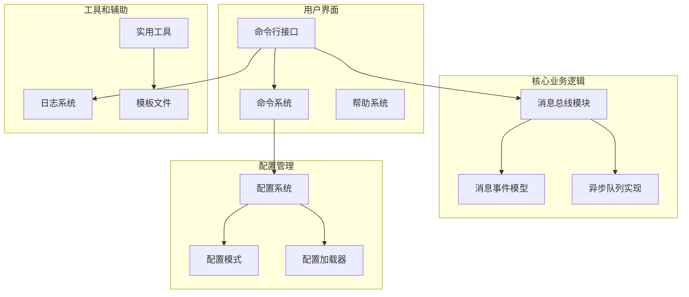
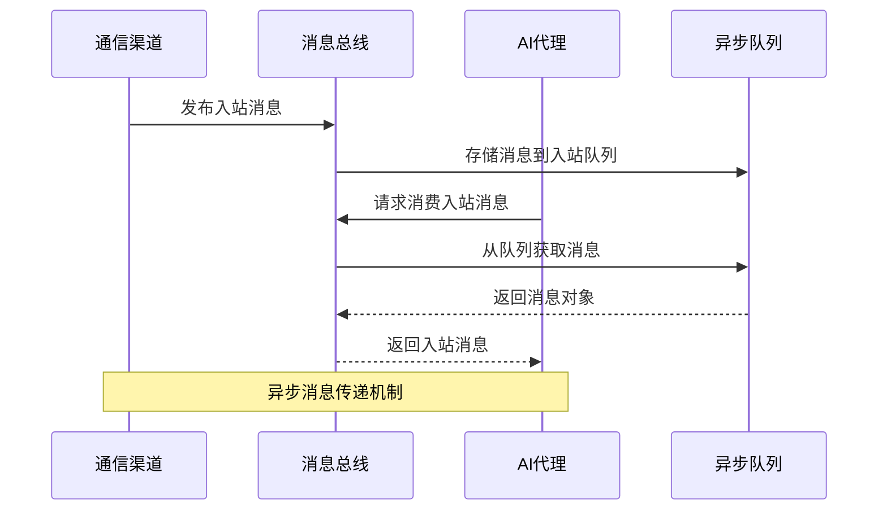
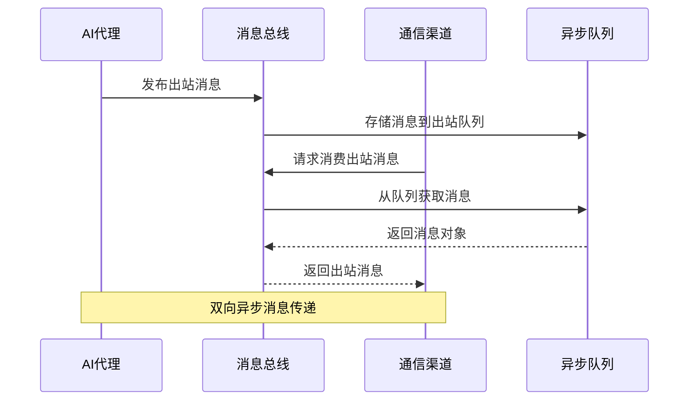
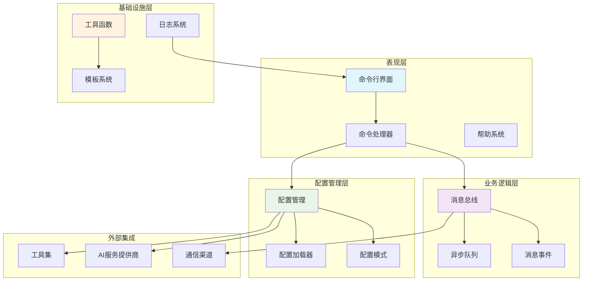
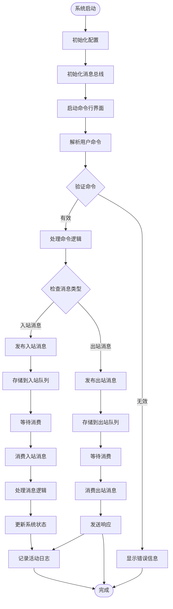
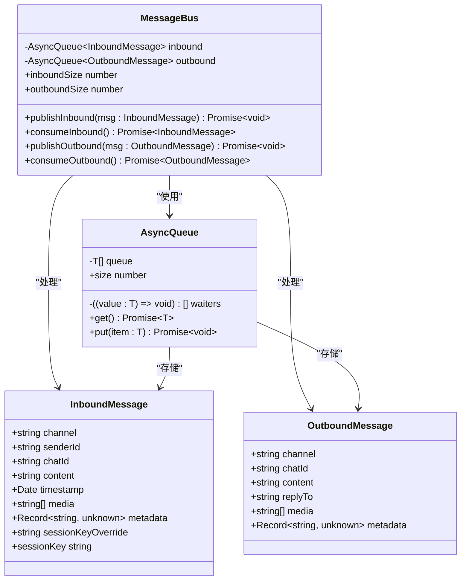
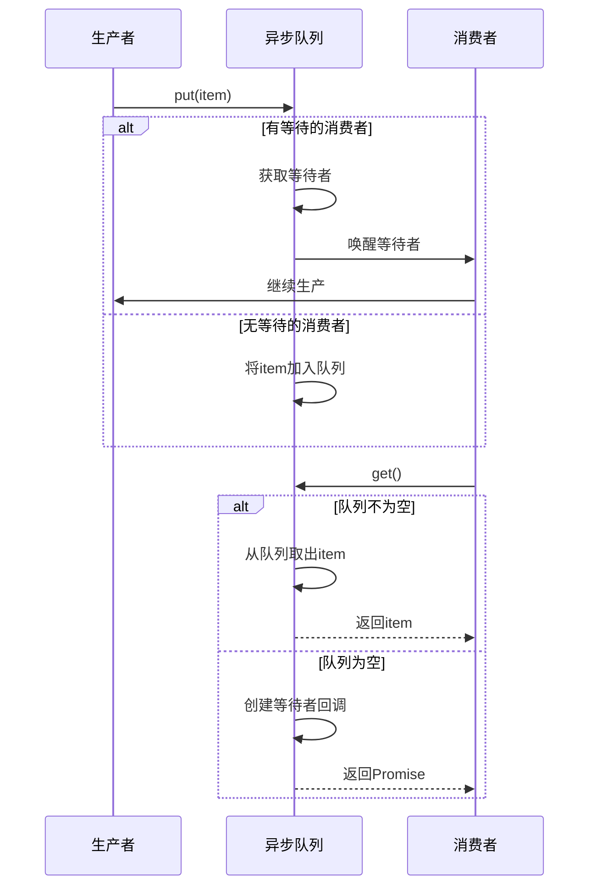
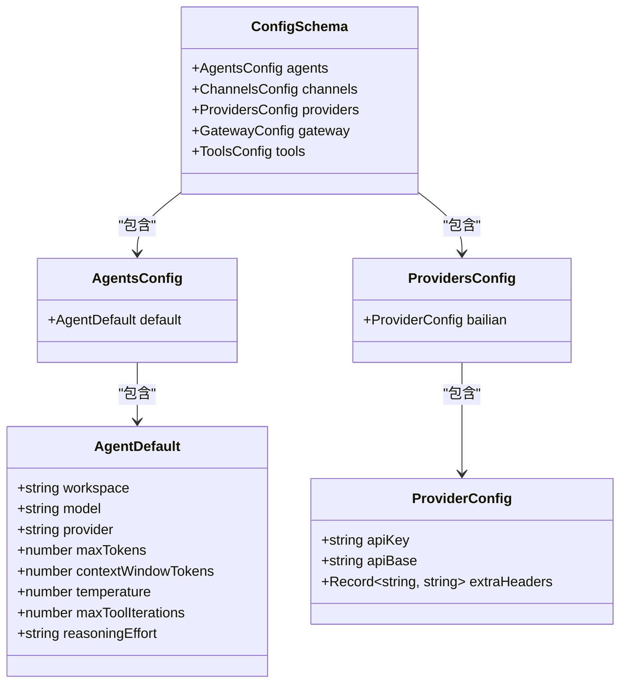
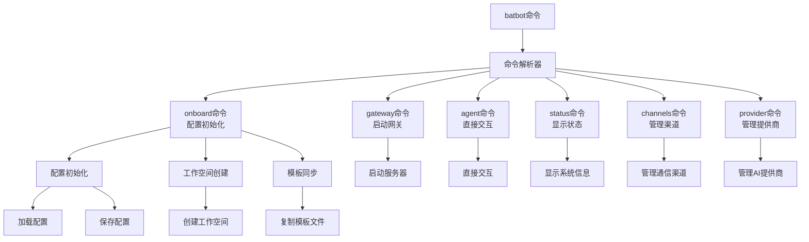

# 消息系统与总线

<cite>
**本文档引用的文件**
- [src/bus/events.ts](file://src/bus/events.ts)
- [src/bus/async-queue.ts](file://src/bus/async-queue.ts)
- [src/bus/queue.ts](file://src/bus/queue.ts)
- [src/cli.ts](file://src/cli.ts)
- [src/command/index.ts](file://src/command/index.ts)
- [src/config/index.ts](file://src/config/index.ts)
- [src/config/loader.ts](file://src/config/loader.ts)
- [src/config/schema.ts](file://src/config/schema.ts)
- [src/utils/helpers.ts](file://src/utils/helpers.ts)
- [src/log/index.ts](file://src/log/index.ts)
- [package.json](file://package.json)
</cite>

## 目录
1. [简介](#简介)
2. [项目结构](#项目结构)
3. [核心组件](#核心组件)
4. [架构概览](#架构概览)
5. [详细组件分析](#详细组件分析)
6. [依赖关系分析](#依赖关系分析)
7. [性能考虑](#性能考虑)
8. [故障排除指南](#故障排除指南)
9. [结论](#结论)

## 简介

BatBot 是一个个人AI助手系统，其核心功能围绕消息传递和总线机制构建。该系统采用异步队列设计模式，通过消息总线在不同的通信渠道（如Telegram、Discord、Slack、WhatsApp等）之间进行消息路由和处理。

系统的主要目标是提供一个可扩展的消息处理框架，支持多渠道集成、异步消息处理和灵活的配置管理。通过模块化的架构设计，BatBot能够轻松集成新的通信渠道，并为用户提供统一的AI助手体验。

## 项目结构

项目采用模块化组织方式，主要目录结构如下：



**图表来源**
- [src/bus/queue.ts:1-59](file://src/bus/queue.ts#L1-L59)
- [src/config/index.ts:1-3](file://src/config/index.ts#L1-L3)
- [src/cli.ts:1-112](file://src/cli.ts#L1-L112)

**章节来源**
- [src/bus/queue.ts:1-59](file://src/bus/queue.ts#L1-L59)
- [src/config/index.ts:1-3](file://src/config/index.ts#L1-L3)
- [src/cli.ts:1-112](file://src/cli.ts#L1-L112)

## 核心组件

### 消息总线系统

消息总线是整个系统的核心，负责在不同组件之间传递消息。它提供了两个独立的异步队列：入站消息队列和出站消息队列。

#### 入站消息处理流程



**图表来源**
- [src/bus/queue.ts:17-27](file://src/bus/queue.ts#L17-L27)
- [src/bus/async-queue.ts:5-10](file://src/bus/async-queue.ts#L5-L10)

#### 出站消息处理流程



**图表来源**
- [src/bus/queue.ts:33-43](file://src/bus/queue.ts#L33-L43)
- [src/bus/async-queue.ts:12-19](file://src/bus/async-queue.ts#L12-L19)

**章节来源**
- [src/bus/queue.ts:1-59](file://src/bus/queue.ts#L1-L59)
- [src/bus/async-queue.ts:1-25](file://src/bus/async-queue.ts#L1-L25)

### 消息数据模型

系统定义了标准化的消息格式，确保不同通信渠道之间的兼容性。

#### 入站消息模型

入站消息代表来自外部通信渠道的消息，包含以下关键属性：
- `channel`: 通信渠道类型
- `senderId`: 发送者标识符
- `chatId`: 聊天会话标识符
- `content`: 消息内容
- `timestamp`: 消息时间戳
- `media`: 媒体资源URL列表
- `metadata`: 渠道特定元数据
- `sessionKeyOverride`: 会话键覆盖选项

#### 出站消息模型

出站消息代表发送给外部通信渠道的响应消息，包含以下关键属性：
- `channel`: 目标通信渠道
- `chatId`: 目标聊天会话
- `content`: 响应内容
- `replyTo`: 回复的消息ID
- `media`: 媒体资源URL列表
- `metadata`: 渠道特定元数据

**章节来源**
- [src/bus/events.ts:1-74](file://src/bus/events.ts#L1-L74)

## 架构概览

系统采用分层架构设计，各层职责明确，耦合度低，便于维护和扩展。



**图表来源**
- [src/bus/queue.ts:1-59](file://src/bus/queue.ts#L1-L59)
- [src/config/schema.ts:118-126](file://src/config/schema.ts#L118-L126)
- [src/cli.ts:1-112](file://src/cli.ts#L1-L112)

### 数据流架构



**图表来源**
- [src/bus/queue.ts:17-43](file://src/bus/queue.ts#L17-L43)
- [src/config/loader.ts:7-20](file://src/config/loader.ts#L7-L20)

## 详细组件分析

### 消息总线类分析

消息总线类是系统的核心组件，负责协调所有消息传递操作。



**图表来源**
- [src/bus/queue.ts:4-11](file://src/bus/queue.ts#L4-L11)
- [src/bus/async-queue.ts:1-25](file://src/bus/async-queue.ts#L1-L25)
- [src/bus/events.ts:1-74](file://src/bus/events.ts#L1-L74)

#### 消息总线设计模式

消息总线采用了生产者-消费者模式和发布-订阅模式的结合：

1. **生产者-消费者模式**: 每个消息队列都有明确的生产者和消费者角色
2. **发布-订阅模式**: 消息可以在多个消费者之间分发
3. **异步处理**: 所有消息处理都是非阻塞的
4. **背压处理**: 队列长度限制防止内存溢出

**章节来源**
- [src/bus/queue.ts:1-59](file://src/bus/queue.ts#L1-L59)
- [src/bus/async-queue.ts:1-25](file://src/bus/async-queue.ts#L1-L25)

### 异步队列实现分析

异步队列是消息总线的基础数据结构，提供了高效的并发消息存储和检索能力。



**图表来源**
- [src/bus/async-queue.ts:5-19](file://src/bus/async-queue.ts#L5-L19)

#### 性能特性

异步队列实现了以下性能优化：

1. **零拷贝优化**: 当有等待消费者时直接传递消息对象
2. **内存效率**: 使用数组作为底层存储结构
3. **并发安全**: 内置的等待者队列确保线程安全
4. **背压控制**: 通过队列长度监控防止内存泄漏

**章节来源**
- [src/bus/async-queue.ts:1-25](file://src/bus/async-queue.ts#L1-L25)

### 配置管理系统分析

配置管理系统提供了灵活的配置管理和验证机制。



**图表来源**
- [src/config/schema.ts:118-126](file://src/config/schema.ts#L118-L126)
- [src/config/schema.ts:35-37](file://src/config/schema.ts#L35-L37)
- [src/config/schema.ts:49-53](file://src/config/schema.ts#L49-L53)

#### 配置验证机制

系统使用Zod库实现强类型的配置验证：

1. **运行时验证**: 所有配置在加载时进行类型检查
2. **默认值设置**: 缺失的配置项自动使用默认值
3. **环境适配**: 支持用户主目录路径解析
4. **配置持久化**: 自动创建配置文件目录结构

**章节来源**
- [src/config/schema.ts:1-146](file://src/config/schema.ts#L1-L146)
- [src/config/loader.ts:1-30](file://src/config/loader.ts#L1-L30)

### 命令行接口分析

命令行接口提供了用户交互入口和系统管理功能。



**图表来源**
- [src/cli.ts:24-102](file://src/cli.ts#L24-L102)
- [src/command/index.ts:5-12](file://src/command/index.ts#L5-L12)

#### 命令系统架构

命令系统基于Commander.js构建，提供了：

1. **自定义帮助系统**: 扩展了标准的Commander帮助功能
2. **异步命令处理**: 支持异步命令执行
3. **参数验证**: 自动参数类型验证
4. **错误处理**: 统一的错误处理机制

**章节来源**
- [src/cli.ts:1-112](file://src/cli.ts#L1-L112)
- [src/command/index.ts:1-16](file://src/command/index.ts#L1-L16)

## 依赖关系分析

系统依赖关系清晰，层次分明，便于维护和扩展。

```mermaid
graph TB
subgraph "核心依赖"
TS[TypeScript]
ZOD[Zod类型验证]
PROMPTS[@clack/prompts]
CHALK[Chalk颜色输出]
end
subgraph "开发依赖"
TSC[TypeScript编译器]
NODE_TYPES[@types/node]
CYP[cpy-cli文件复制]
end
subgraph "运行时依赖"
COMMANDER[Commander命令行]
FS[Node.js文件系统]
PATH[Node.js路径模块]
OS[Node.js操作系统]
end
subgraph "应用模块"
BUS[消息总线]
CONFIG[配置系统]
CLI[命令行接口]
UTILS[工具函数]
LOG[日志系统]
end
BUS --> ASYNC_QUEUE[异步队列]
BUS --> EVENTS[消息事件]
CONFIG --> SCHEMA[配置模式]
CONFIG --> LOADER[配置加载器]
CLI --> COMMAND[命令系统]
CLI --> HELP[帮助系统]
UTILS --> HELPERS[辅助函数]
UTILS --> TEMPLATES[模板系统]
LOG --> CHALK
subgraph "外部集成"
CHANNELS[通信渠道]
PROVIDERS[AI服务提供商]
TOOLS[工具集]
end
BUS --> CHANNELS
CONFIG --> PROVIDERS
CONFIG --> TOOLS
```

**图表来源**
- [package.json:22-34](file://package.json#L22-L34)
- [src/bus/queue.ts:1-2](file://src/bus/queue.ts#L1-L2)
- [src/config/index.ts:1-3](file://src/config/index.ts#L1-L3)

### 外部依赖管理

系统对外部依赖进行了精心选择和管理：

1. **核心依赖最小化**: 仅使用必要的运行时依赖
2. **类型安全**: 使用TypeScript确保类型安全
3. **配置验证**: 使用Zod确保配置完整性
4. **用户界面**: 使用@clack/prompts提供良好的用户体验

**章节来源**
- [package.json:1-36](file://package.json#L1-L36)

## 性能考虑

系统在设计时充分考虑了性能优化和资源管理。

### 内存管理策略

1. **队列大小限制**: 异步队列没有固定上限，但通过合理的使用模式避免内存泄漏
2. **对象复用**: 消息对象在队列中复用，减少垃圾回收压力
3. **延迟加载**: 配置文件按需加载，避免不必要的I/O操作

### 并发处理优化

1. **非阻塞操作**: 所有消息处理都是异步的，不会阻塞主线程
2. **等待者模式**: 消费者等待时不会占用CPU资源
3. **批量处理**: 支持批量消息处理以提高吞吐量

### I/O性能优化

1. **文件系统缓存**: 模板文件复制后可以重复使用
2. **配置缓存**: 加载的配置可以缓存在内存中
3. **网络请求优化**: 通过配置管理器统一管理API调用

## 故障排除指南

### 常见问题诊断

#### 消息丢失问题

**症状**: 消息发送后没有收到响应

**可能原因**:
1. 消息总线未正确初始化
2. 消费者未启动或崩溃
3. 队列已满导致消息被丢弃

**解决方案**:
1. 检查消息总线状态
2. 验证消费者连接
3. 监控队列长度

#### 配置加载失败

**症状**: 启动时出现配置错误

**可能原因**:
1. 配置文件格式错误
2. 权限不足无法读取配置
3. 配置项缺失

**解决方案**:
1. 检查JSON格式
2. 验证文件权限
3. 使用默认配置重新生成

#### 内存泄漏

**症状**: 系统运行时间越长内存占用越高

**可能原因**:
1. 队列中积压大量消息
2. 消费者处理速度慢于生产者
3. 未正确清理资源

**解决方案**:
1. 实施背压机制
2. 优化消费者性能
3. 添加资源清理定时任务

**章节来源**
- [src/bus/queue.ts:48-57](file://src/bus/queue.ts#L48-L57)
- [src/config/loader.ts:11-20](file://src/config/loader.ts#L11-L20)

### 调试技巧

1. **启用调试日志**: 使用logger.debug查看详细执行信息
2. **监控队列状态**: 定期检查inboundSize和outboundSize
3. **验证消息格式**: 确保消息对象符合预期结构
4. **测试配置加载**: 验证配置文件的完整性和有效性

## 结论

BatBot的消息系统与总线架构展现了现代异步消息处理系统的最佳实践。通过精心设计的模块化架构、强类型的配置管理和高效的异步队列实现，系统实现了高可用性、可扩展性和易维护性的平衡。

### 主要优势

1. **模块化设计**: 清晰的职责分离使得系统易于理解和维护
2. **类型安全**: TypeScript和Zod的结合确保了运行时的安全性
3. **异步处理**: 非阻塞的消息处理提高了系统整体性能
4. **配置灵活**: 动态配置管理支持多种部署场景
5. **扩展性强**: 插件化的架构设计便于添加新功能

### 技术亮点

1. **消息总线模式**: 有效的解耦了生产者和消费者
2. **异步队列优化**: 零拷贝和等待者模式提升了性能
3. **配置验证**: 运行时类型检查确保了系统稳定性
4. **命令行接口**: 用户友好的交互设计

### 发展方向

未来可以考虑的功能增强：
1. **持久化队列**: 添加消息持久化支持
2. **负载均衡**: 支持多实例部署
3. **监控告警**: 集成系统监控和告警机制
4. **插件系统**: 更灵活的插件加载机制

这个消息系统为构建复杂的多渠道AI助手应用提供了坚实的技术基础，其设计理念和实现方式值得其他类似项目借鉴和学习。