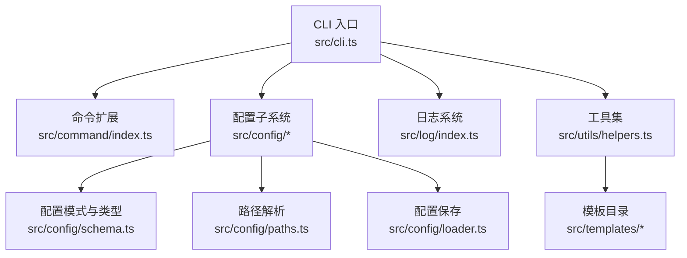
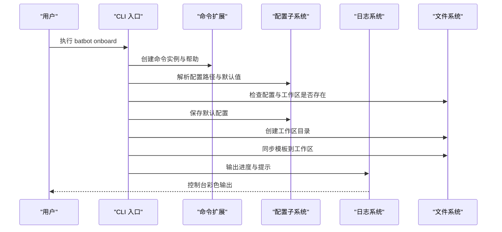
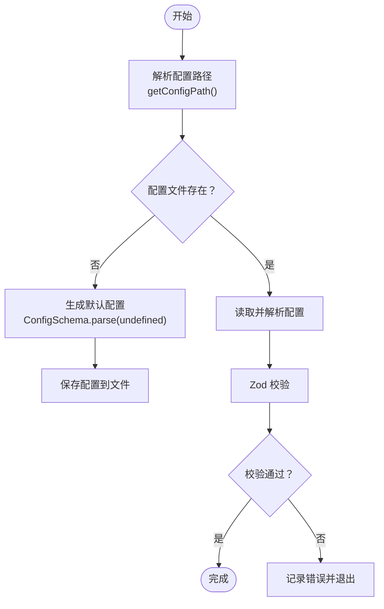
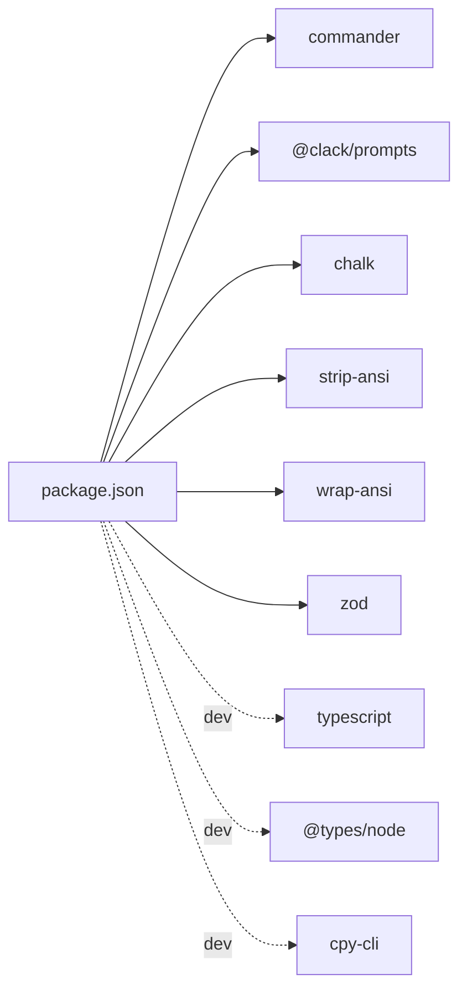

# 调试与测试

<cite>
**本文引用的文件**
- [package.json](file://package.json)
- [tsconfig.json](file://tsconfig.json)
- [src/index.ts](file://src/index.ts)
- [src/cli.ts](file://src/cli.ts)
- [src/log/index.ts](file://src/log/index.ts)
- [src/config/index.ts](file://src/config/index.ts)
- [src/config/schema.ts](file://src/config/schema.ts)
- [src/config/paths.ts](file://src/config/paths.ts)
- [src/config/loader.ts](file://src/config/loader.ts)
- [src/command/index.ts](file://src/command/index.ts)
- [src/command/help.ts](file://src/command/help.ts)
- [src/utils/helpers.ts](file://src/utils/helpers.ts)
- [src/utils/index.ts](file://src/utils/index.ts)
- [src/templates/memory/MEMORY.md](file://src/templates/memory/MEMORY.md)
- [src/templates/AGENTS.md](file://src/templates/AGENTS.md)
</cite>

## 目录
1. [简介](#简介)
2. [项目结构](#项目结构)
3. [核心组件](#核心组件)
4. [架构总览](#架构总览)
5. [详细组件分析](#详细组件分析)
6. [依赖分析](#依赖分析)
7. [性能考虑](#性能考虑)
8. [故障排查指南](#故障排查指南)
9. [结论](#结论)
10. [附录](#附录)

## 简介
本指南面向开发者与高级用户，聚焦于 BatBot 的调试与测试实践。内容涵盖：
- 开发环境搭建与配置
- 日志系统使用与调试技巧
- 单元测试与集成测试编写思路
- 配置文件验证与错误处理机制
- 常见问题诊断与解决方案
- 性能优化与内存管理最佳实践
- 调试工具使用与故障排除流程

## 项目结构
项目采用按功能域分层的组织方式：命令行入口、配置加载与校验、日志输出、命令扩展与帮助、工作区模板同步等模块职责清晰，便于定位问题与编写测试。

图表来源
- [src/cli.ts:1-107](file://src/cli.ts#L1-L107)
- [src/command/index.ts:1-16](file://src/command/index.ts#L1-L16)
- [src/config/index.ts:1-3](file://src/config/index.ts#L1-L3)
- [src/config/schema.ts:1-146](file://src/config/schema.ts#L1-L146)
- [src/config/paths.ts:1-11](file://src/config/paths.ts#L1-L11)
- [src/config/loader.ts:1-16](file://src/config/loader.ts#L1-L16)
- [src/log/index.ts:1-49](file://src/log/index.ts#L1-L49)
- [src/utils/helpers.ts:1-47](file://src/utils/helpers.ts#L1-L47)

章节来源
- [package.json:1-36](file://package.json#L1-L36)
- [tsconfig.json:1-21](file://tsconfig.json#L1-L21)

## 核心组件
- CLI 入口与命令扩展：负责解析命令、展示帮助、执行初始化与工作区同步等操作。
- 配置子系统：提供配置路径、默认值预填充、Zod 模式校验与保存逻辑。
- 日志系统：统一输出格式，支持信息、成功、警告、错误、调试、标题与分隔线等样式。
- 工具集：工作区模板同步，自动创建必要的文件与目录。
- 帮助系统：基于 Commander 的自定义 Help，增强可读性与一致性。

章节来源
- [src/cli.ts:1-107](file://src/cli.ts#L1-L107)
- [src/command/index.ts:1-16](file://src/command/index.ts#L1-L16)
- [src/command/help.ts:1-57](file://src/command/help.ts#L1-L57)
- [src/config/schema.ts:1-146](file://src/config/schema.ts#L1-L146)
- [src/config/paths.ts:1-11](file://src/config/paths.ts#L1-L11)
- [src/config/loader.ts:1-16](file://src/config/loader.ts#L1-L16)
- [src/log/index.ts:1-49](file://src/log/index.ts#L1-L49)
- [src/utils/helpers.ts:1-47](file://src/utils/helpers.ts#L1-L47)

## 架构总览
下图展示了从 CLI 到配置与日志的关键交互路径，以及模板同步在初始化流程中的位置。

图表来源
- [src/cli.ts:22-69](file://src/cli.ts#L22-L69)
- [src/config/paths.ts:4-10](file://src/config/paths.ts#L4-L10)
- [src/config/loader.ts:6-15](file://src/config/loader.ts#L6-L15)
- [src/utils/helpers.ts:11-46](file://src/utils/helpers.ts#L11-L46)
- [src/log/index.ts:5-44](file://src/log/index.ts#L5-L44)

## 详细组件分析

### CLI 与命令扩展
- 功能要点
  - 定义 batbot 主命令、版本输出、子命令 onboard/gateway/agent/status/channels/provider。
  - onboard 子命令负责检查/覆盖配置、创建工作区、同步模板，并输出下一步指引。
  - 使用自定义命令类与帮助类，提升用户体验与一致性。
- 调试建议
  - 在子命令 action 中添加日志桩，确认执行路径与参数传递。
  - 使用最小化配置输入进行快速回归测试（例如仅调用 onboard）。
  - 对交互式确认与选择逻辑，准备模拟输入以避免阻塞测试。

章节来源
- [src/cli.ts:15-106](file://src/cli.ts#L15-L106)
- [src/command/index.ts:4-13](file://src/command/index.ts#L4-L13)
- [src/command/help.ts:25-54](file://src/command/help.ts#L25-L54)

### 配置子系统（模式、路径、保存）
- 功能要点
  - 使用 Zod 定义完整配置模式，含 agents、channels、providers、gateway、tools 等模块。
  - 提供默认值预填充（prefault），确保未显式配置时仍可运行。
  - 路径解析统一到用户主目录下的 .batbot 目录。
  - 保存逻辑确保目录存在且写入 JSON 文件。
- 调试建议
  - 在加载/保存前后打印关键字段，验证默认值是否生效。
  - 对异常路径（如无权限目录）进行边界测试。
  - 使用 Schema 的 parse 或 safeParse 进行显式校验，捕获错误并记录。

图表来源
- [src/config/paths.ts:4-10](file://src/config/paths.ts#L4-L10)
- [src/config/schema.ts:118-126](file://src/config/schema.ts#L118-L126)
- [src/config/loader.ts:6-15](file://src/config/loader.ts#L6-L15)

章节来源
- [src/config/schema.ts:1-146](file://src/config/schema.ts#L1-L146)
- [src/config/paths.ts:1-11](file://src/config/paths.ts#L1-L11)
- [src/config/loader.ts:1-16](file://src/config/loader.ts#L1-L16)

### 日志系统
- 功能要点
  - 统一 info/success/warn/error/debug/title/gray/divider 等输出接口。
  - 使用 chalk 实现彩色输出，便于区分级别。
- 调试建议
  - 将关键分支与状态变更通过不同级别日志输出，形成“可追踪的控制流”。
  - 在长时间任务中插入周期性进度日志，辅助性能分析。
  - 在测试中替换 logger 输出目标，避免污染控制台。

章节来源
- [src/log/index.ts:1-49](file://src/log/index.ts#L1-L49)

### 工具集与模板同步
- 功能要点
  - 遍历模板目录，将 .md 文件复制到工作区；不存在的文件写空文件占位。
  - 自动创建 memory 与 skills 目录。
- 调试建议
  - 在测试中使用临时工作区，断言文件与目录创建结果。
  - 对已存在文件跳过策略进行验证，避免重复写入。

章节来源
- [src/utils/helpers.ts:11-46](file://src/utils/helpers.ts#L11-L46)
- [src/templates/memory/MEMORY.md:1-24](file://src/templates/memory/MEMORY.md#L1-L24)
- [src/templates/AGENTS.md:1-22](file://src/templates/AGENTS.md#L1-L22)

### 版本与标识
- 版本与 Logo 作为常量导出，便于 CLI 显示与构建产物识别。
- 调试建议
  - 在 CI 中比对版本号与发布标签，确保一致性。

章节来源
- [src/index.ts:1-4](file://src/index.ts#L1-L4)

## 依赖分析
- 运行时依赖
  - commander：命令行解析与帮助系统
  - @clack/prompts：交互式选择与确认
  - chalk、strip-ansi、wrap-ansi：终端输出美化与文本处理
  - zod：配置模式校验
- 开发依赖
  - typescript、@types/node：类型与编译支持
  - cpy-cli：构建时复制模板资源

图表来源
- [package.json:22-34](file://package.json#L22-L34)

章节来源
- [package.json:1-36](file://package.json#L1-L36)

## 性能考虑
- I/O 与文件系统
  - 批量文件写入与目录创建应合并为一次事务式操作，减少多次系统调用。
  - 对重复存在的文件/目录进行存在性检查，避免不必要的写入。
- 日志开销
  - 在高频循环中降低 debug 级别日志频率，或在测试环境下关闭 debug。
- 配置加载
  - 预填充默认值可减少运行时分支判断，提高启动速度。
- 编译与打包
  - TypeScript 目标为 ES2022，模块解析为 NodeNext，确保兼容性与体积控制。

章节来源
- [src/utils/helpers.ts:19-29](file://src/utils/helpers.ts#L19-L29)
- [src/config/schema.ts:118-126](file://src/config/schema.ts#L118-L126)
- [tsconfig.json:2-13](file://tsconfig.json#L2-L13)

## 故障排查指南
- 初始化失败（onboard）
  - 症状：无法创建配置或工作区
  - 排查：检查用户主目录权限、磁盘空间；查看日志输出的路径与提示
  - 参考
    - [src/cli.ts:25-57](file://src/cli.ts#L25-L57)
    - [src/config/loader.ts:10-15](file://src/config/loader.ts#L10-L15)
- 配置校验失败
  - 症状：启动时报错或行为异常
  - 排查：使用 Zod 的 safeParse 获取错误详情；核对配置键名与类型
  - 参考
    - [src/config/schema.ts:118-126](file://src/config/schema.ts#L118-L126)
- 模板同步异常
  - 症状：部分模板未生成或目录缺失
  - 排查：确认模板目录存在；检查工作区路径；验证写入权限
  - 参考
    - [src/utils/helpers.ts:11-46](file://src/utils/helpers.ts#L11-L46)
- 日志输出不符合预期
  - 症状：颜色不显示或输出被吞
  - 排查：检查终端 ANSI 支持；在测试中重定向输出
  - 参考
    - [src/log/index.ts:5-44](file://src/log/index.ts#L5-L44)

## 结论
通过明确的模块职责、完善的配置校验与日志体系，以及可复用的模板同步工具，BatBot 的调试与测试具备良好的可操作性。建议在开发流程中结合单元与集成测试，配合日志与最小化配置进行回归验证，持续优化 I/O 与日志开销，确保稳定交付。

## 附录

### 开发环境设置与配置
- 安装依赖
  - 使用包管理器安装项目依赖
- 编译与运行
  - 开发：监听编译 watch
  - 构建：编译 TypeScript 并复制模板资源
  - 运行：执行构建产物
- TypeScript 配置
  - 输出目录、模块解析、严格模式等选项已在配置中设定

章节来源
- [package.json:17-21](file://package.json#L17-L21)
- [tsconfig.json:2-13](file://tsconfig.json#L2-L13)

### 日志系统使用与调试技巧
- 使用 logger 的不同级别输出，形成清晰的调试信息层级
- 在关键路径插入日志，便于回溯执行流程
- 在测试中替换输出目标，避免干扰控制台

章节来源
- [src/log/index.ts:5-44](file://src/log/index.ts#L5-L44)

### 单元测试与集成测试编写方法
- 单元测试
  - 针对配置模式与路径解析函数进行断言，覆盖默认值与边界条件
  - 针对日志接口进行输出捕获与断言
- 集成测试
  - 模拟 CLI 子命令执行，断言文件系统变更（配置、工作区、模板）
  - 使用临时目录隔离测试数据，避免污染真实用户环境

章节来源
- [src/config/schema.ts:118-126](file://src/config/schema.ts#L118-L126)
- [src/config/paths.ts:4-10](file://src/config/paths.ts#L4-L10)
- [src/utils/helpers.ts:11-46](file://src/utils/helpers.ts#L11-L46)
- [src/cli.ts:22-69](file://src/cli.ts#L22-L69)

### 配置文件验证与错误处理机制
- 使用 Zod 模式定义强类型配置，提供默认值与预填充
- 在保存前进行目录创建与写入，失败时抛出错误
- 建议在应用启动阶段集中执行一次配置校验，尽早暴露问题

章节来源
- [src/config/schema.ts:118-126](file://src/config/schema.ts#L118-L126)
- [src/config/loader.ts:6-15](file://src/config/loader.ts#L6-L15)

### 常见问题诊断与解决方案
- 权限不足导致无法写入配置或工作区
  - 方案：提升目录权限或更换用户主目录
- 终端不支持颜色输出
  - 方案：在测试或 CI 环境中禁用颜色或重定向输出
- 模板未同步
  - 方案：确认模板目录存在且可读，检查工作区路径

章节来源
- [src/config/loader.ts:10-15](file://src/config/loader.ts#L10-L15)
- [src/utils/helpers.ts:19-39](file://src/utils/helpers.ts#L19-L39)
- [src/log/index.ts:5-44](file://src/log/index.ts#L5-L44)

### 性能优化建议与内存管理最佳实践
- 减少文件系统调用次数，合并批量写入
- 控制日志级别与频率，避免在热路径产生大量输出
- 使用默认值预填充，降低运行时分支判断成本
- 在测试中清理临时目录，防止磁盘占用累积

章节来源
- [src/utils/helpers.ts:19-29](file://src/utils/helpers.ts#L19-L29)
- [src/config/schema.ts:118-126](file://src/config/schema.ts#L118-L126)

### 调试工具使用与故障排除流程
- 命令行调试
  - 使用最小化命令组合快速复现问题
  - 在交互式流程中准备模拟输入，避免阻塞
- 日志辅助
  - 在关键节点输出上下文信息，形成可追溯的执行轨迹
- 文件系统审计
  - 对配置与工作区目录进行一致性检查，定位异常

章节来源
- [src/cli.ts:22-69](file://src/cli.ts#L22-L69)
- [src/log/index.ts:5-44](file://src/log/index.ts#L5-L44)