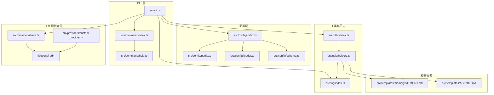
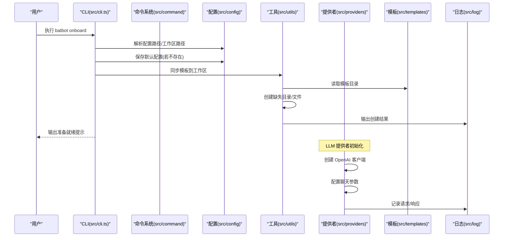
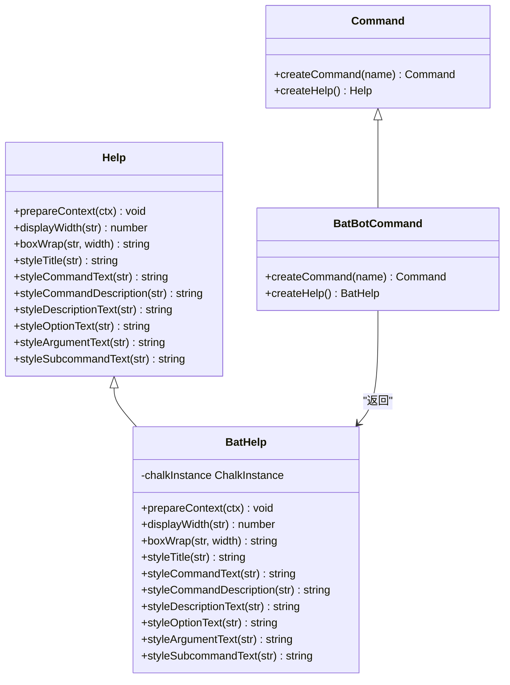
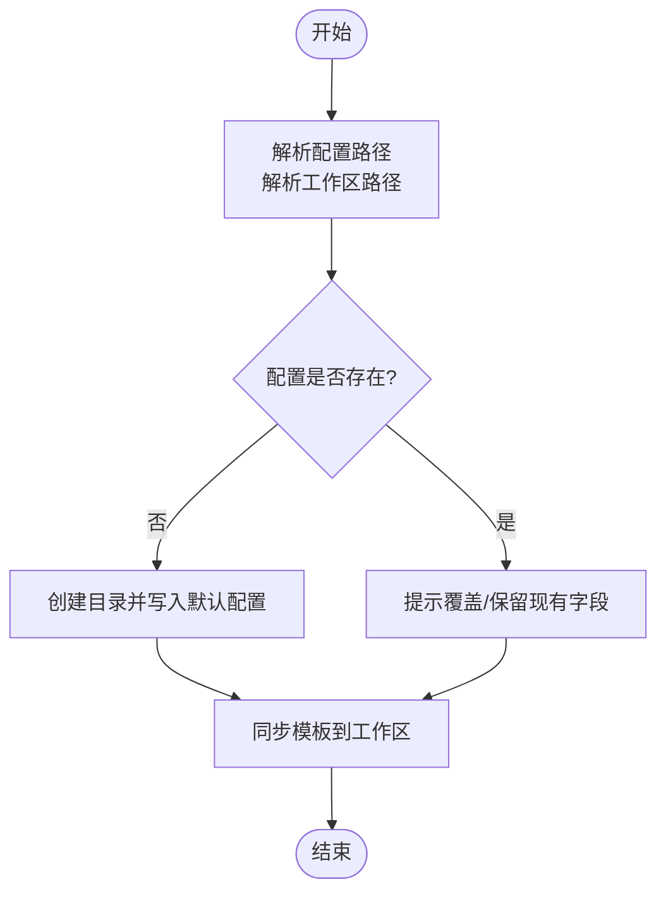
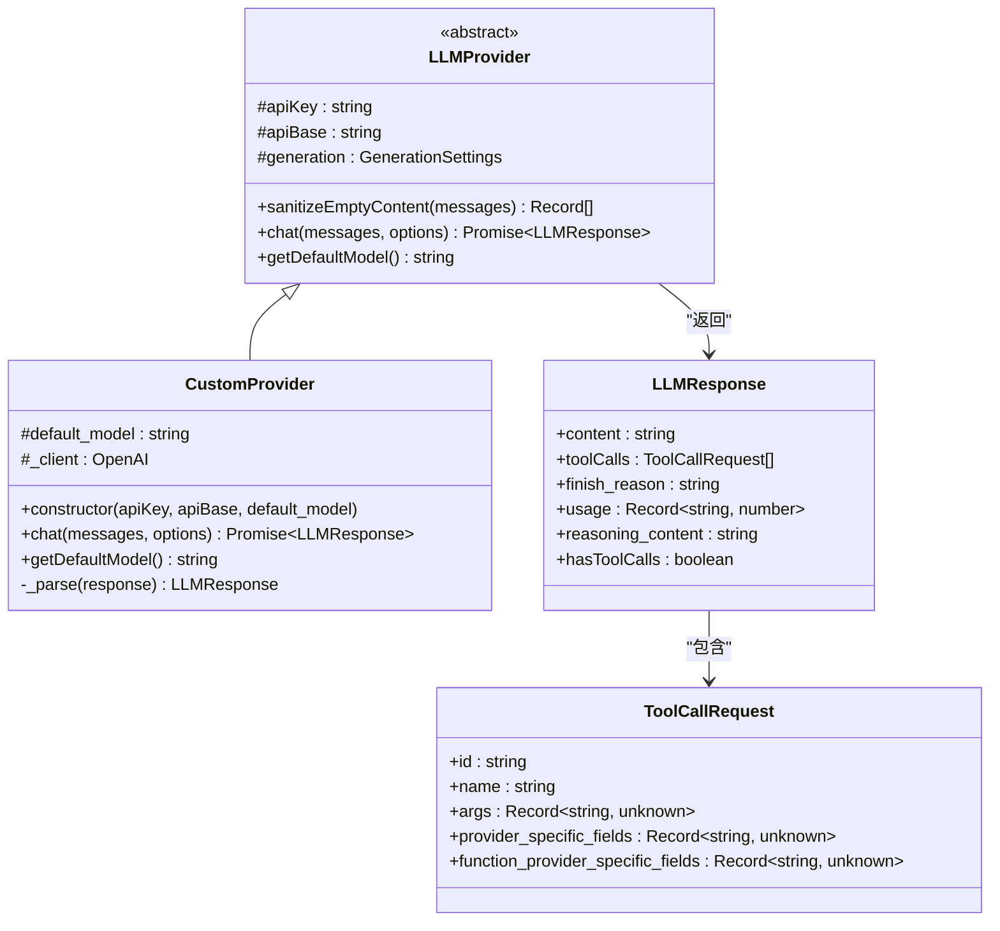
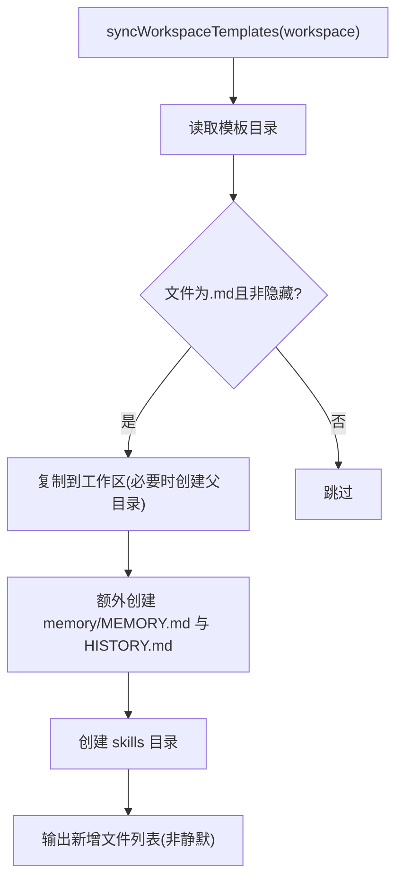
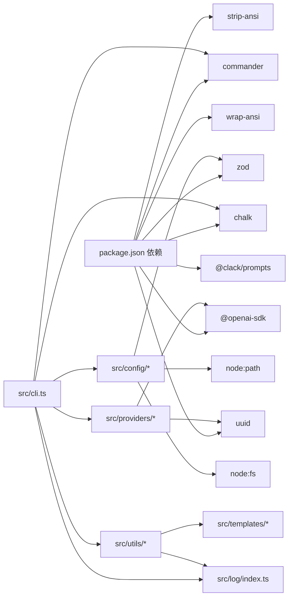

# 项目结构

<cite>
**本文引用的文件**
- [package.json](file://package.json)
- [tsconfig.json](file://tsconfig.json)
- [src/index.ts](file://src/index.ts)
- [src/cli.ts](file://src/cli.ts)
- [src/command/index.ts](file://src/command/index.ts)
- [src/command/help.ts](file://src/command/help.ts)
- [src/config/index.ts](file://src/config/index.ts)
- [src/config/paths.ts](file://src/config/paths.ts)
- [src/config/loader.ts](file://src/config/loader.ts)
- [src/config/schema.ts](file://src/config/schema.ts)
- [src/log/index.ts](file://src/log/index.ts)
- [src/utils/index.ts](file://src/utils/index.ts)
- [src/utils/helpers.ts](file://src/utils/helpers.ts)
- [src/providers/base.ts](file://src/providers/base.ts)
- [src/providers/custom-provider.ts](file://src/providers/custom-provider.ts)
- [src/templates/memory/MEMORY.md](file://src/templates/memory/MEMORY.md)
- [src/templates/AGENTS.md](file://src/templates/AGENTS.md)
</cite>

## 更新摘要
**变更内容**
- 新增 LLM 提供者抽象基类和自定义实现模块
- 添加 OpenAI SDK 依赖支持
- 更新 CLI 命令以支持提供者管理
- 增强项目架构以支持多 LLM 提供者集成

## 目录
1. [简介](#简介)
2. [项目结构](#项目结构)
3. [核心组件](#核心组件)
4. [架构总览](#架构总览)
5. [详细组件分析](#详细组件分析)
6. [依赖分析](#依赖分析)
7. [性能考虑](#性能考虑)
8. [故障排查指南](#故障排查指南)
9. [结论](#结论)
10. [附录](#附录)

## 简介
本项目是一个以 TypeScript 编写的个人 AI 助手 CLI 工具，提供配置初始化、工作区模板同步、命令行子命令管理、日志输出与格式化、以及可扩展的配置模式（Zod Schema）等功能。项目采用模块化设计，围绕"命令行入口 -> 配置系统 -> 工作区模板 -> 日志输出"的主路径展开，并通过清晰的模块边界实现高内聚、低耦合。

**更新** 项目现已集成 LLM 提供者抽象架构，支持通过 OpenAI SDK 进行大语言模型对话，为未来的智能体功能奠定基础。

## 项目结构
仓库采用按功能域划分的目录组织方式，核心模块如下：
- agent：待实现的智能体相关模块（当前未见具体实现文件）
- bus：消息总线或事件分发模块（当前未见具体实现文件）
- channels：渠道配置与管理（如钉钉等），由配置 schema 定义
- command：命令行子系统的定制化封装（基于 commander）
- config：配置加载、保存、路径解析与 Zod Schema 校验
- log：统一的日志输出与颜色样式封装
- providers：LLM 提供者抽象基类和自定义实现，支持 OpenAI SDK 集成
- templates：默认工作区模板文件集合
- utils：通用工具函数（如工作区模板同步）

**图表来源**
- [src/cli.ts:1-112](file://src/cli.ts#L1-L112)
- [src/command/index.ts:1-16](file://src/command/index.ts#L1-L16)
- [src/command/help.ts:1-57](file://src/command/help.ts#L1-L57)
- [src/config/index.ts:1-3](file://src/config/index.ts#L1-L3)
- [src/config/paths.ts:1-11](file://src/config/paths.ts#L1-L11)
- [src/config/loader.ts:1-16](file://src/config/loader.ts#L1-L16)
- [src/config/schema.ts:1-146](file://src/config/schema.ts#L1-L146)
- [src/utils/index.ts:1-1](file://src/utils/index.ts#L1-L1)
- [src/utils/helpers.ts:1-47](file://src/utils/helpers.ts#L1-L47)
- [src/log/index.ts:1-49](file://src/log/index.ts#L1-L49)
- [src/providers/base.ts:1-151](file://src/providers/base.ts#L1-L151)
- [src/providers/custom-provider.ts:1-92](file://src/providers/custom-provider.ts#L1-L92)
- [src/templates/memory/MEMORY.md:1-24](file://src/templates/memory/MEMORY.md#L1-L24)
- [src/templates/AGENTS.md:1-22](file://src/templates/AGENTS.md#L1-L22)

**章节来源**
- [package.json:1-39](file://package.json#L1-L39)
- [tsconfig.json:1-21](file://tsconfig.json#L1-L21)
- [src/index.ts:1-4](file://src/index.ts#L1-L4)

## 核心组件
- 命令行入口与子命令
  - 入口位于 CLI 文件，注册多个子命令（onboard、gateway、agent、status、channels、provider），并通过自定义 Command 类与 Help 实现增强的终端输出风格。
- 配置系统
  - 路径解析：提供用户目录下的配置与工作区路径。
  - 加载与保存：支持创建目录、写入 JSON 配置。
  - 模式校验：使用 Zod 对配置进行强类型校验与默认值填充。
- 工具与日志
  - 工具函数：将模板资源复制到工作区，自动创建目录与占位文件。
  - 日志模块：提供 info/success/warn/error/debug/title/gray/divider 等方法，统一输出风格。
- LLM 提供者系统
  - 抽象基类：定义统一的 LLM 接口规范，包括聊天接口、模型管理、错误处理等。
  - 自定义实现：基于 OpenAI SDK 的具体实现，支持工具调用、推理内容等高级特性。
  - 配置支持：通过环境变量和配置文件管理 API 密钥和基础 URL。
- 模板资源
  - 默认模板文件（如 AGENTS.md、MEMORY.md）用于引导用户在工作区中建立长期记忆与代理指令。

**章节来源**
- [src/cli.ts:1-112](file://src/cli.ts#L1-L112)
- [src/command/index.ts:1-16](file://src/command/index.ts#L1-L16)
- [src/command/help.ts:1-57](file://src/command/help.ts#L1-L57)
- [src/config/paths.ts:1-11](file://src/config/paths.ts#L1-L11)
- [src/config/loader.ts:1-16](file://src/config/loader.ts#L1-L16)
- [src/config/schema.ts:1-146](file://src/config/schema.ts#L1-L146)
- [src/utils/helpers.ts:1-47](file://src/utils/helpers.ts#L1-L47)
- [src/log/index.ts:1-49](file://src/log/index.ts#L1-L49)
- [src/providers/base.ts:1-151](file://src/providers/base.ts#L1-L151)
- [src/providers/custom-provider.ts:1-92](file://src/providers/custom-provider.ts#L1-L92)
- [src/templates/memory/MEMORY.md:1-24](file://src/templates/memory/MEMORY.md#L1-L24)
- [src/templates/AGENTS.md:1-22](file://src/templates/AGENTS.md#L1-L22)

## 架构总览
下图展示了从 CLI 到配置、工具与模板的整体交互流程，体现模块间的调用关系与数据流向。

**图表来源**
- [src/cli.ts:20-74](file://src/cli.ts#L20-L74)
- [src/config/paths.ts:4-10](file://src/config/paths.ts#L4-L10)
- [src/config/loader.ts:6-15](file://src/config/loader.ts#L6-L15)
- [src/utils/helpers.ts:11-46](file://src/utils/helpers.ts#L11-L46)
- [src/log/index.ts:5-44](file://src/log/index.ts#L5-L44)
- [src/providers/custom-provider.ts:10-23](file://src/providers/custom-provider.ts#L10-L23)

## 详细组件分析

### 命令行与帮助系统
- 设计要点
  - 自定义 Command 子类，覆盖 createHelp 返回自定义 Help 实例，统一命令行输出风格。
  - 使用 Chalk 进行颜色渲染，结合 strip-ansi/wrap-ansi 控制宽度与 ANSI 清理。
- 关键交互
  - CLI 注册多个子命令；每个子命令在 action 中执行相应逻辑（当前示例中打印占位信息）。
  - 新增的 provider 命令为 LLM 提供者管理预留接口。
- 可扩展性
  - 新增命令时仅需在 CLI 中添加新命令与 action，保持入口简洁。

**图表来源**
- [src/command/index.ts:5-13](file://src/command/index.ts#L5-L13)
- [src/command/help.ts:6-54](file://src/command/help.ts#L6-L54)

**章节来源**
- [src/cli.ts:14-112](file://src/cli.ts#L14-L112)
- [src/command/index.ts:1-16](file://src/command/index.ts#L1-L16)
- [src/command/help.ts:1-57](file://src/command/help.ts#L1-L57)

### 配置系统
- 职责与边界
  - 路径解析：提供用户主目录下的配置与工作区绝对路径。
  - 配置保存：确保目录存在后写入 JSON。
  - 模式校验：使用 Zod 对多层级配置进行强类型校验与默认值填充。
  - 管理器：提供便捷访问工作区路径的只读属性。
- 数据流
  - CLI 读取/生成配置 -> 保存到本地 -> 工具层读取配置影响行为（如工作区路径）。

**图表来源**
- [src/config/paths.ts:4-10](file://src/config/paths.ts#L4-L10)
- [src/config/loader.ts:6-15](file://src/config/loader.ts#L6-L15)
- [src/utils/helpers.ts:11-46](file://src/utils/helpers.ts#L11-L46)

**章节来源**
- [src/config/paths.ts:1-11](file://src/config/paths.ts#L1-L11)
- [src/config/loader.ts:1-16](file://src/config/loader.ts#L1-L16)
- [src/config/schema.ts:118-146](file://src/config/schema.ts#L118-L146)

### LLM 提供者系统
- 抽象基类设计
  - 定义统一的 LLM 接口规范，包括聊天接口、模型管理、错误处理等。
  - 提供默认生成参数配置，支持温度、最大令牌数、推理努力度等参数。
  - 实现重试机制和临时错误标记，提高服务稳定性。
- 自定义实现
  - 基于 OpenAI SDK 的具体实现，支持工具调用、推理内容等高级特性。
  - 配置客户端连接参数，包括 API 密钥、基础 URL、会话亲和性等。
  - 实现聊天请求参数转换和响应解析。
- 错误处理
  - 统一的错误捕获和日志记录机制。
  - 返回标准化的 LLM 响应对象，包含内容、工具调用、完成原因等信息。

**图表来源**
- [src/providers/base.ts:87-151](file://src/providers/base.ts#L87-L151)
- [src/providers/custom-provider.ts:6-92](file://src/providers/custom-provider.ts#L6-L92)
- [src/providers/base.ts:56-79](file://src/providers/base.ts#L56-L79)
- [src/providers/base.ts:31-45](file://src/providers/base.ts#L31-L45)

**章节来源**
- [src/providers/base.ts:1-151](file://src/providers/base.ts#L1-L151)
- [src/providers/custom-provider.ts:1-92](file://src/providers/custom-provider.ts#L1-L92)

### 工具与日志
- 工具函数
  - 将模板目录中的 Markdown 文件复制到工作区，自动创建中间目录，同时创建内存与技能目录。
  - 支持静默模式，避免重复输出。
- 日志模块
  - 提供多种输出级别与标题/分隔符等辅助方法，统一终端风格。

**图表来源**
- [src/utils/helpers.ts:11-46](file://src/utils/helpers.ts#L11-L46)
- [src/log/index.ts:5-44](file://src/log/index.ts#L5-L44)

**章节来源**
- [src/utils/helpers.ts:1-47](file://src/utils/helpers.ts#L1-L47)
- [src/log/index.ts:1-49](file://src/log/index.ts#L1-L49)

### 模板资源
- 目的
  - 为用户提供初始工作区内容，包括长期记忆、代理指令等。
- 结构
  - memory/MEMORY.md：长期记忆模板
  - AGENTS.md：代理指令模板
  - 其他模板文件：用于引导用户建立上下文与任务管理

**章节来源**
- [src/templates/memory/MEMORY.md:1-24](file://src/templates/memory/MEMORY.md#L1-L24)
- [src/templates/AGENTS.md:1-22](file://src/templates/AGENTS.md#L1-L22)

## 依赖分析
- 外部依赖
  - commander：命令行参数与子命令解析
  - zod：配置模式校验与默认值填充
  - chalk/strip-ansi/wrap-ansi：终端颜色与文本包装
  - **新增** openai：OpenAI SDK，支持大语言模型对话和工具调用
  - @clack/prompts：交互式命令行界面
  - uuid：生成唯一标识符
- 内部模块耦合
  - CLI 依赖命令系统、配置、工具、日志与提供者模块
  - 工具模块依赖模板资源与日志模块
  - 配置模块内部通过 index 统一导出路径、加载器与模式
  - **新增** 提供者模块依赖 OpenAI SDK 和日志模块

**图表来源**
- [package.json:23-32](file://package.json#L23-L32)
- [src/cli.ts:1-14](file://src/cli.ts#L1-L14)
- [src/utils/helpers.ts:1-8](file://src/utils/helpers.ts#L1-L8)
- [src/config/loader.ts:1-4](file://src/config/loader.ts#L1-L4)
- [src/config/paths.ts:1-2](file://src/config/paths.ts#L1-L2)
- [src/providers/custom-provider.ts:1-4](file://src/providers/custom-provider.ts#L1-L4)

**章节来源**
- [package.json:1-39](file://package.json#L1-L39)

## 性能考虑
- I/O 优化
  - 模板同步仅在首次初始化时执行，后续增量操作可通过静默模式减少输出开销。
  - 配置保存前先确保目录存在，避免多次失败重试。
- 类型与校验
  - 使用 Zod 在运行前完成配置校验，降低运行期分支判断成本。
- 终端输出
  - 日志模块统一处理颜色与换行，避免频繁字符串拼接带来的性能损耗。
- **新增** LLM 提供者优化
  - 提供者基类内置重试机制，支持指数退避策略。
  - 消息内容空值清理，避免无效请求导致的错误。
  - 统一的错误处理和日志记录，便于性能监控和问题诊断。

## 故障排查指南
- 配置文件已存在但需要重置
  - CLI 会在配置存在时提示覆盖或刷新策略，按提示选择即可。
- 工作区未创建
  - CLI 会尝试创建工作区目录；若权限不足，需检查用户主目录权限。
- 模板未同步
  - 确认模板目录存在且包含 .md 文件；工具函数会自动创建缺失文件与目录。
- 日志输出异常
  - 检查终端是否支持颜色；日志模块内部使用 ANSI 清理与宽度计算，确保跨平台兼容。
- **新增** LLM 提供者问题
  - API 密钥验证：确认配置文件中的 API 密钥有效且有相应权限。
  - 网络连接：检查网络连接和代理设置，确保能够访问 LLM 服务。
  - 请求超时：调整重试参数和超时设置，避免频繁的网络错误。
  - 工具调用：确认工具定义正确，参数格式符合预期。

**章节来源**
- [src/cli.ts:30-74](file://src/cli.ts#L30-L74)
- [src/utils/helpers.ts:19-29](file://src/utils/helpers.ts#L19-L29)
- [src/log/index.ts:26-28](file://src/log/index.ts#L26-L28)
- [src/providers/base.ts:88-102](file://src/providers/base.ts#L88-L102)
- [src/providers/custom-provider.ts:52-61](file://src/providers/custom-provider.ts#L52-L61)

## 结论
本项目通过清晰的模块边界与强类型的配置体系，实现了从 CLI 初始化到工作区模板同步的完整链路。命令系统与日志模块提供了良好的用户体验，配置系统保证了运行时的稳定性。

**更新** 新增的 LLM 提供者系统为项目奠定了智能化基础，通过抽象基类和 OpenAI SDK 集成，支持灵活的多提供者架构。未来可在 agent、bus、channels 等模块完善具体实现，进一步提升系统的可扩展性与业务能力，为构建智能体应用提供坚实的技术支撑。

## 附录
- TypeScript 项目配置要点
  - 目标与模块：ES2022 + NodeNext，严格模式开启，启用 ES 模块互操作。
  - 输出目录：dist，源码根目录 src。
  - 包含与排除：仅构建 src 下文件，排除 node_modules 与 dist。
- 构建与运行
  - 开发：tsc --watch
  - 构建：tsc 并复制模板资源到 dist
  - 运行：node dist/index.js
  - **新增** 测试：npm test（测试自定义提供者实现）

**章节来源**
- [tsconfig.json:2-13](file://tsconfig.json#L2-L13)
- [package.json:17-22](file://package.json#L17-L22)
- [src/providers/custom-provider.ts:21](file://src/providers/custom-provider.ts#L21)