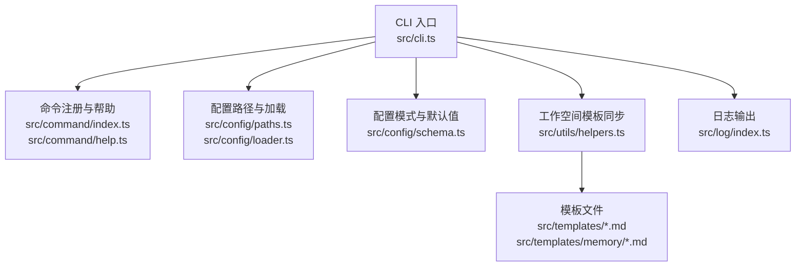
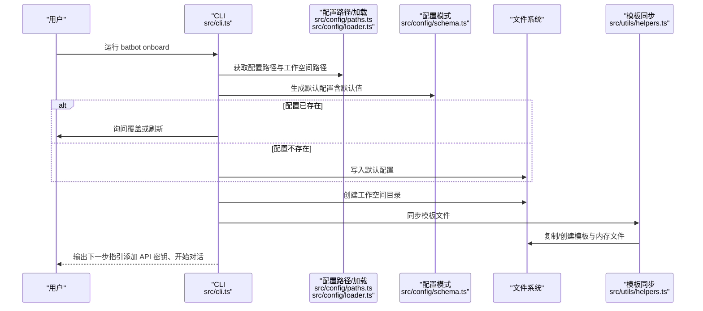
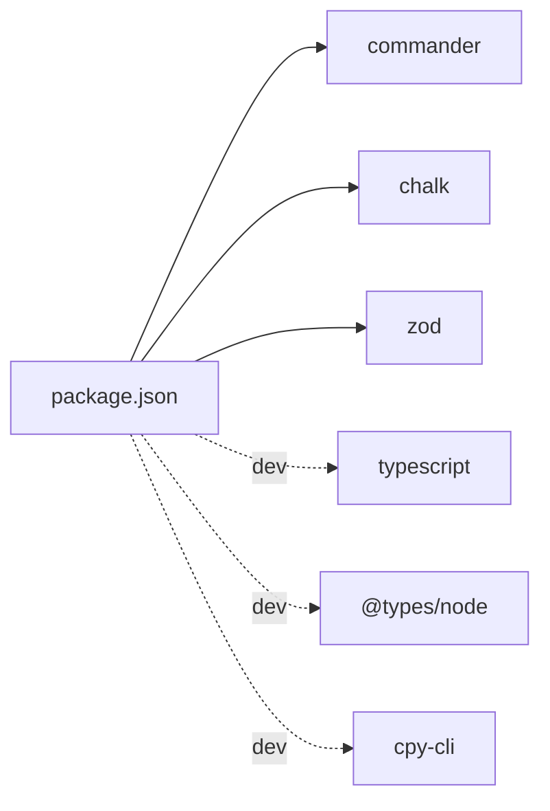

# 快速开始

<cite>
**本文引用的文件**
- [package.json](file://package.json)
- [tsconfig.json](file://tsconfig.json)
- [src/index.ts](file://src/index.ts)
- [src/cli.ts](file://src/cli.ts)
- [src/command/index.ts](file://src/command/index.ts)
- [src/command/help.ts](file://src/command/help.ts)
- [src/config/index.ts](file://src/config/index.ts)
- [src/config/schema.ts](file://src/config/schema.ts)
- [src/config/paths.ts](file://src/config/paths.ts)
- [src/config/loader.ts](file://src/config/loader.ts)
- [src/utils/helpers.ts](file://src/utils/helpers.ts)
- [src/log/index.ts](file://src/log/index.ts)
- [src/templates/AGENTS.md](file://src/templates/AGENTS.md)
- [src/templates/SOUL.md](file://src/templates/SOUL.md)
- [src/templates/HEARTBEAT.md](file://src/templates/HEARTBEAT.md)
- [src/templates/TOOLS.md](file://src/templates/TOOLS.md)
- [src/templates/USER.md](file://src/templates/USER.md)
- [src/templates/memory/MEMORY.md](file://src/templates/memory/MEMORY.md)
</cite>

## 更新摘要
**变更内容**
- 版本从1.0.0降至0.1.0，反映项目的早期开发阶段
- Node.js版本要求从>=18提升至>=20，确保更好的兼容性和性能
- 增强CLI可执行性，通过bin配置和shebang支持直接运行batbot命令
- 新增类型声明文件支持，提供更好的TypeScript开发体验
- 改进构建脚本，包含模板文件复制和类型声明生成

## 目录
1. [简介](#简介)
2. [项目结构](#项目结构)
3. [核心组件](#核心组件)
4. [架构总览](#架构总览)
5. [详细组件分析](#详细组件分析)
6. [依赖分析](#依赖分析)
7. [性能考虑](#性能考虑)
8. [故障排除指南](#故障排除指南)
9. [结论](#结论)
10. [附录](#附录)

## 简介
本指南帮助你在15分钟内完成 BatBot 的安装与首次使用，涵盖以下内容：
- 安装与环境准备（Node.js版本要求、npm安装命令）
- 初始化配置与工作空间（batbot onboard）
- 配置 API 密钥与工作空间
- 开始 AI 对话（batbot agent）
- 常见命令与模板说明
- 基础故障排除步骤

**重要说明**：当前版本为0.1.0，这是一个早期开发版本，功能可能不稳定。请在测试环境中使用。

## 项目结构
BatBot 是一个基于 Node.js 的 CLI 工具，采用 TypeScript 编写，主要模块如下：
- CLI 入口与命令解析：src/cli.ts、src/command/index.ts、src/command/help.ts
- 配置系统：src/config/schema.ts、src/config/paths.ts、src/config/loader.ts
- 工作空间与模板同步：src/utils/helpers.ts
- 日志输出：src/log/index.ts
- 模板文件：src/templates/* 及其子目录

**图表来源**
- [src/cli.ts:1-148](file://src/cli.ts#L1-L148)
- [src/command/index.ts:1-16](file://src/command/index.ts#L1-L16)
- [src/command/help.ts:1-57](file://src/command/help.ts#L1-L57)
- [src/config/paths.ts:1-11](file://src/config/paths.ts#L1-L11)
- [src/config/loader.ts:1-33](file://src/config/loader.ts#L1-L33)
- [src/config/schema.ts:1-168](file://src/config/schema.ts#L1-L168)
- [src/utils/helpers.ts:1-66](file://src/utils/helpers.ts#L1-L66)
- [src/log/index.ts:1-49](file://src/log/index.ts#L1-L49)

**章节来源**
- [src/cli.ts:1-148](file://src/cli.ts#L1-L148)
- [src/command/index.ts:1-16](file://src/command/index.ts#L1-L16)
- [src/command/help.ts:1-57](file://src/command/help.ts#L1-L57)
- [src/config/paths.ts:1-11](file://src/config/paths.ts#L1-L11)
- [src/config/loader.ts:1-33](file://src/config/loader.ts#L1-L33)
- [src/config/schema.ts:1-168](file://src/config/schema.ts#L1-L168)
- [src/utils/helpers.ts:1-66](file://src/utils/helpers.ts#L1-L66)
- [src/log/index.ts:1-49](file://src/log/index.ts#L1-L49)

## 核心组件
- CLI 命令与帮助
  - 使用 commander 扩展自定义命令类，并通过自定义帮助类美化输出。
  - 关键命令：onboard、gateway、agent、status、channels、provider。
- 配置系统
  - 使用 Zod 定义配置模式，支持默认值与预填充。
  - 支持多提供方（如 bailian）、工具配置（web/exec/mcp）等。
- 工作空间与模板
  - 自动生成 ~/.batbot/workspace 目录及模板文件（含 memory/HISTORY.md、skills 等）。
- 日志系统
  - 提供 info/success/warn/error/debug 等彩色输出。

**章节来源**
- [src/command/index.ts:1-16](file://src/command/index.ts#L1-L16)
- [src/command/help.ts:1-57](file://src/command/help.ts#L1-L57)
- [src/config/schema.ts:124-132](file://src/config/schema.ts#L124-L132)
- [src/config/schema.ts:136-168](file://src/config/schema.ts#L136-L168)
- [src/utils/helpers.ts:11-66](file://src/utils/helpers.ts#L11-L66)
- [src/log/index.ts:5-49](file://src/log/index.ts#L5-L49)

## 架构总览
下图展示了 batbot onboard 流程的关键交互：CLI 解析命令、生成配置与工作空间、同步模板文件，并提示下一步操作。

**图表来源**
- [src/cli.ts:27-77](file://src/cli.ts#L27-L77)
- [src/config/paths.ts:4-10](file://src/config/paths.ts#L4-L10)
- [src/config/loader.ts:7-22](file://src/config/loader.ts#L7-L22)
- [src/config/schema.ts:124-132](file://src/config/schema.ts#L124-L132)
- [src/utils/helpers.ts:11-66](file://src/utils/helpers.ts#L11-L66)

**章节来源**
- [src/cli.ts:27-77](file://src/cli.ts#L27-L77)
- [src/config/paths.ts:4-10](file://src/config/paths.ts#L4-L10)
- [src/config/loader.ts:7-22](file://src/config/loader.ts#L7-L22)
- [src/config/schema.ts:124-132](file://src/config/schema.ts#L124-L132)
- [src/utils/helpers.ts:11-66](file://src/utils/helpers.ts#L11-L66)

## 详细组件分析

### 安装与环境准备
- Node.js 版本要求
  - **更新**：项目现在要求 Node.js >= 20，以利用最新的语言特性和性能优化。
  - 建议使用 Node.js LTS（如 20.x）以获得最佳兼容性。
- 安装步骤
  - 使用 npm 安装依赖后构建项目，随后即可通过 CLI 使用 batbot。
  - 构建脚本会编译 TypeScript 并复制模板 Markdown 文件至 dist 目录。
- 脚本参考
  - 构建与开发脚本位于 package.json 的 scripts 字段中。

**章节来源**
- [package.json:25-27](file://package.json#L25-L27)
- [package.json:28-34](file://package.json#L28-L34)
- [tsconfig.json](file://tsconfig.json)

### 首次使用：初始化配置与工作空间
- 命令：batbot onboard
- 功能概述
  - 若配置文件不存在则创建默认配置；若已存在则提示覆盖或刷新。
  - 创建工作空间目录 ~/.batbot/workspace，并同步模板文件（含 memory/HISTORY.md、skills 等）。
  - 输出下一步指引：添加 API 密钥、开始对话。
- 关键实现位置
  - 命令注册与行为：src/cli.ts
  - 配置路径与保存：src/config/paths.ts、src/config/loader.ts
  - 模板同步逻辑：src/utils/helpers.ts

**章节来源**
- [src/cli.ts:27-77](file://src/cli.ts#L27-L77)
- [src/config/paths.ts:4-10](file://src/config/paths.ts#L4-L10)
- [src/config/loader.ts:7-22](file://src/config/loader.ts#L7-L22)
- [src/utils/helpers.ts:11-66](file://src/utils/helpers.ts#L11-L66)

### 配置 API 密钥与工作空间
- 配置文件位置
  - 默认位于用户主目录下的 ~/.batbot/config.json。
- API 密钥配置
  - 在 providers.bailian.apiKey 中填写你的 OpenRouter（或其他兼容服务）API 密钥。
  - 可选：设置 apiBase 与额外请求头（extraHeaders）。
- 工作空间设置
  - agents.defaults.workspace 指定工作空间根目录，默认为 ~/.batbot/workspace。
  - 可通过相对路径或绝对路径配置。
- 配置模式参考
  - 提供方与工具配置的字段定义与默认值可参考配置模式文件。

**章节来源**
- [src/config/paths.ts:4-10](file://src/config/paths.ts#L4-L10)
- [src/config/schema.ts:44-48](file://src/config/schema.ts#L44-L48)
- [src/config/schema.ts:124-132](file://src/config/schema.ts#L124-L132)

### 开始 AI 对话
- 命令：batbot agent
- 功能概述
  - 当前占位为"与代理直接交互"，后续将集成模型调用与工具执行。
- 下一步建议
  - 在完成 API 密钥配置后，使用 batbot agent -m "<你的消息>" 开始对话（当前仅占位，实际参数待实现）。

**章节来源**
- [src/cli.ts:87-91](file://src/cli.ts#L87-L91)

### 常用命令与模板
- 常用命令
  - batbot onboard：初始化配置与工作空间
  - batbot agent：与代理交互（占位）
  - batbot status：显示状态（占位）
  - batbot channels：管理通道（占位）
  - batbot provider：管理提供方（占位）
- 模板文件
  - AGENTS.md：代理指令与提醒机制
  - SOUL.md：个性与价值观
  - HEARTBEAT.md：周期任务清单
  - TOOLS.md：工具使用注意事项
  - USER.md：用户画像与偏好
  - memory/MEMORY.md：长期记忆模板

**章节来源**
- [src/cli.ts:27-145](file://src/cli.ts#L27-L145)
- [src/templates/AGENTS.md:1-22](file://src/templates/AGENTS.md#L1-L22)
- [src/templates/SOUL.md:1-22](file://src/templates/SOUL.md#L1-L22)
- [src/templates/HEARTBEAT.md:1-17](file://src/templates/HEARTBEAT.md#L1-L17)
- [src/templates/TOOLS.md:1-16](file://src/templates/TOOLS.md#L1-L16)
- [src/templates/USER.md:1-50](file://src/templates/USER.md#L1-L50)
- [src/templates/memory/MEMORY.md:1-24](file://src/templates/memory/MEMORY.md#L1-L24)

## 依赖分析
- 运行时依赖
  - commander：命令行接口与帮助系统
  - chalk：彩色日志输出
  - strip-ansi / wrap-ansi：帮助文本格式化
  - zod：配置模式校验与默认值
- 开发依赖
  - typescript、@types/node：类型与编译支持
  - cpy-cli：构建时复制模板文件

**图表来源**
- [package.json:35-49](file://package.json#L35-L49)

**章节来源**
- [package.json:35-49](file://package.json#L35-L49)

## 性能考虑
- 模板同步
  - 首次 onboard 会遍历模板目录并复制/创建文件，通常耗时极短；避免在大型工作空间频繁重复同步。
- 日志输出
  - 使用彩色日志提升可读性，但不会对运行时性能造成显著影响。
- 配置加载
  - 配置采用 JSON 文件存储，读取与写入均为本地文件操作，开销很小。

## 故障排除指南
- 无法找到 batbot 命令
  - 确认已安装依赖并完成构建；检查 PATH 是否包含本地 bin 或全局安装是否正确。
  - **新增**：确保 Node.js 版本 >= 20，旧版本可能导致命令不可执行。
- 配置文件未生成或权限不足
  - 确保用户主目录可写；onboard 会在需要时自动创建 ~/.batbot 目录。
- API 密钥无效或网络错误
  - 检查 providers.bailian.apiKey 是否正确；确认网络可达 OpenRouter（或其他提供方地址）。
- 工作空间未创建或模板缺失
  - 重新运行 onboard；确认模板复制逻辑未被中断。
- 日志输出无颜色
  - 检查终端对 ANSI 的支持；必要时在不支持颜色的环境中使用非彩色输出。

**章节来源**
- [src/cli.ts:27-77](file://src/cli.ts#L27-L77)
- [src/config/loader.ts:7-22](file://src/config/loader.ts#L7-L22)
- [src/log/index.ts:5-49](file://src/log/index.ts#L5-L49)

## 结论
通过以上步骤，你可以在 15 分钟内完成 BatBot 的安装、初始化配置、工作空间搭建与首次对话准备。当前版本为0.1.0，功能仍在开发中，建议在测试环境中使用。建议在完成 API 密钥配置后，结合模板文件进一步定制个性化体验。

## 附录
- 版本信息
  - 版本号与图标由入口导出，便于 CLI 显示与识别。
  - **更新**：当前版本为0.1.0，反映项目的早期开发阶段。
- 模板文件用途
  - 用于指导代理行为、记录长期记忆、维护周期任务与工具使用规范。

**章节来源**
- [src/index.ts:1-4](file://src/index.ts#L1-L4)
- [src/templates/AGENTS.md:1-22](file://src/templates/AGENTS.md#L1-L22)
- [src/templates/HEARTBEAT.md:1-17](file://src/templates/HEARTBEAT.md#L1-L17)
- [src/templates/TOOLS.md:1-16](file://src/templates/TOOLS.md#L1-L16)
- [src/templates/USER.md:1-50](file://src/templates/USER.md#L1-L50)
- [src/templates/memory/MEMORY.md:1-24](file://src/templates/memory/MEMORY.md#L1-L24)