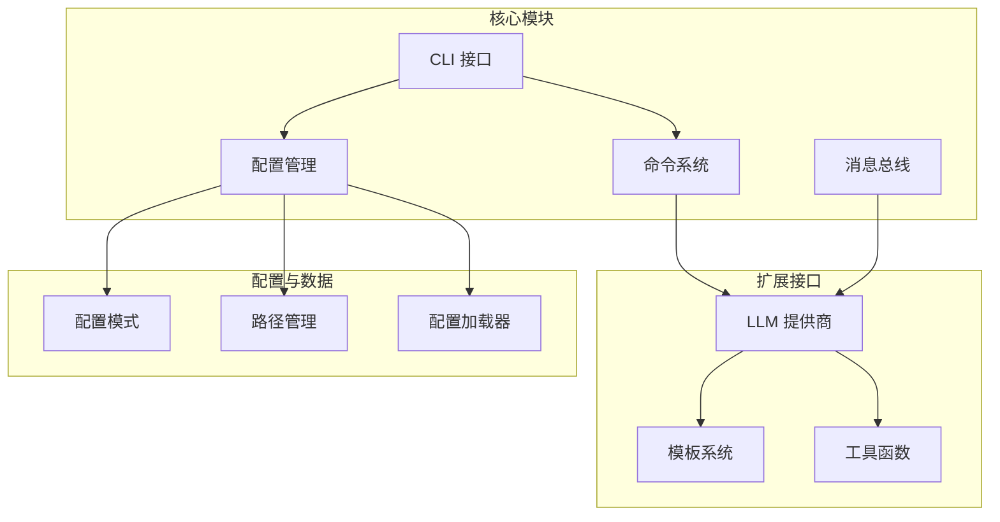
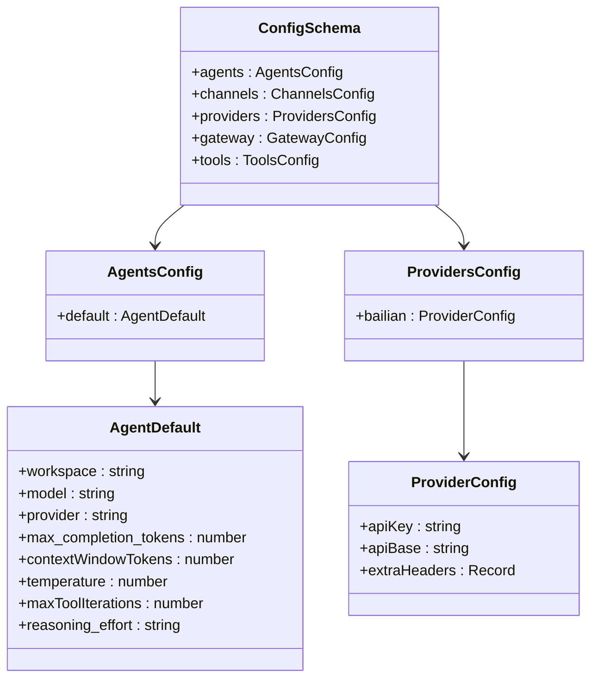
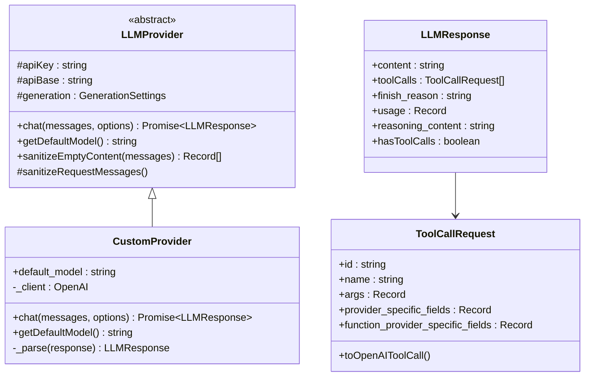
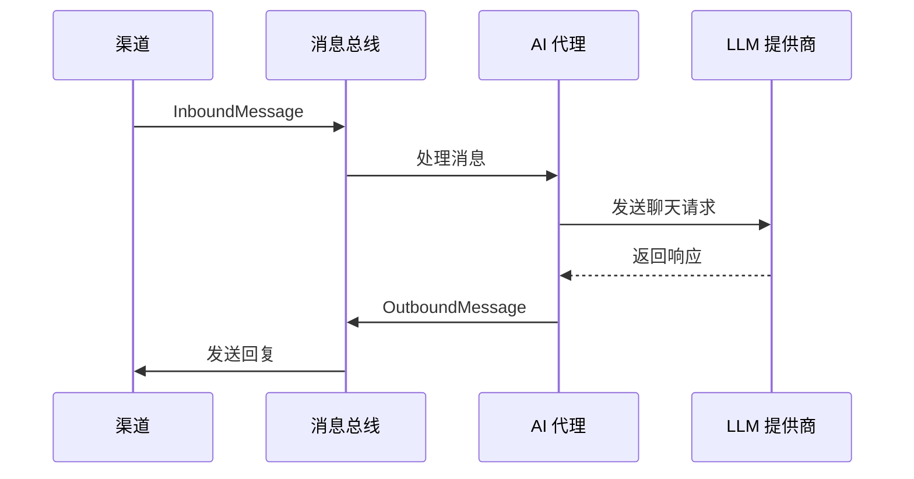
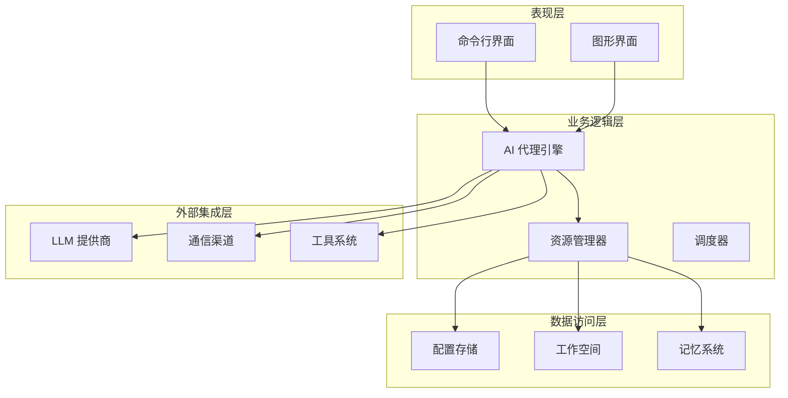
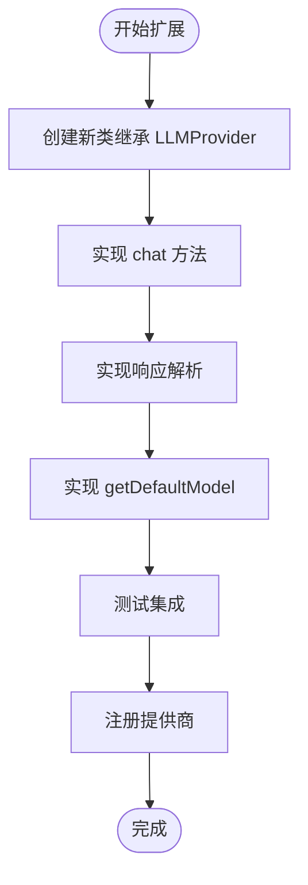
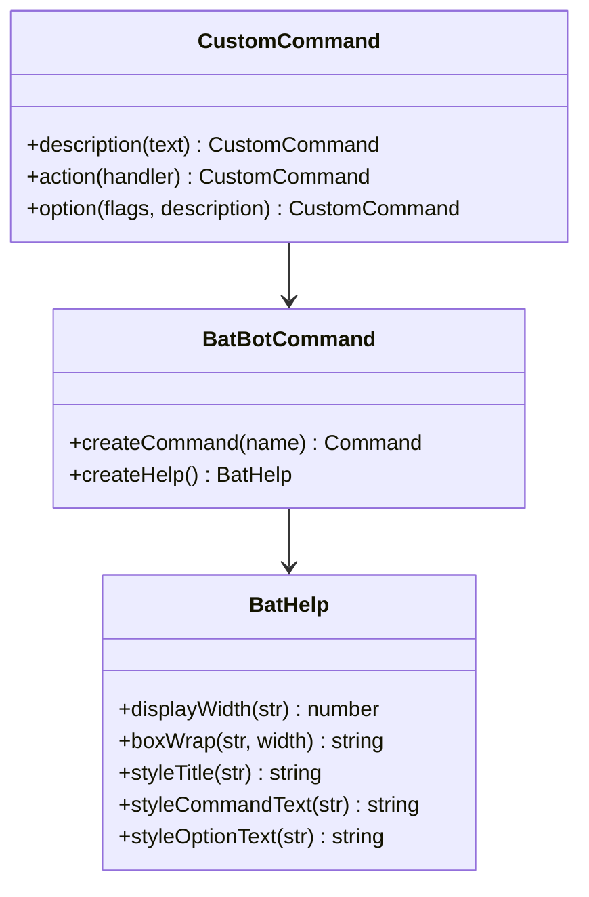
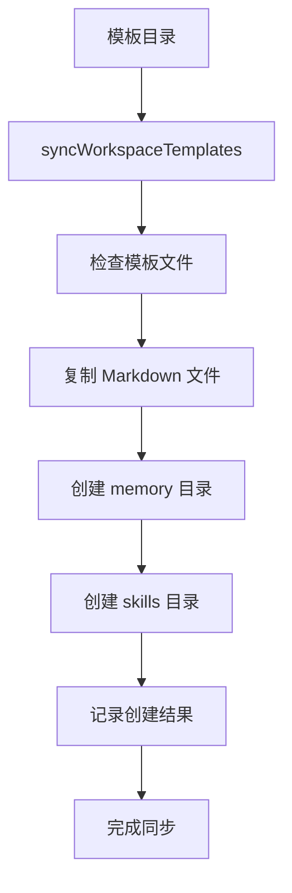
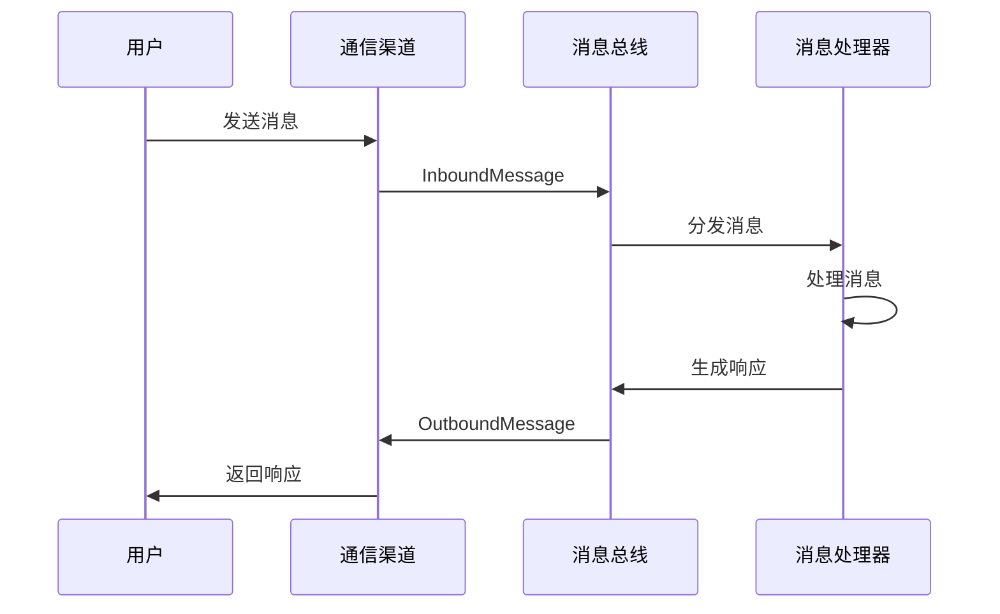

# 扩展开发

<cite>
**本文档引用的文件**
- [package.json](file://package.json)
- [src/index.ts](file://src/index.ts)
- [src/cli.ts](file://src/cli.ts)
- [src/command/index.ts](file://src/command/index.ts)
- [src/command/help.ts](file://src/command/help.ts)
- [src/config/index.ts](file://src/config/index.ts)
- [src/config/schema.ts](file://src/config/schema.ts)
- [src/config/loader.ts](file://src/config/loader.ts)
- [src/config/paths.ts](file://src/config/paths.ts)
- [src/providers/base.ts](file://src/providers/base.ts)
- [src/providers/custom-provider.ts](file://src/providers/custom-provider.ts)
- [src/utils/helpers.ts](file://src/utils/helpers.ts)
- [src/bus/events.ts](file://src/bus/events.ts)
- [src/templates/AGENTS.md](file://src/templates/AGENTS.md)
- [src/templates/SOUL.md](file://src/templates/SOUL.md)
</cite>

## 目录
1. [简介](#简介)
2. [项目结构](#项目结构)
3. [核心组件](#核心组件)
4. [架构概览](#架构概览)
5. [详细组件分析](#详细组件分析)
6. [依赖关系分析](#依赖关系分析)
7. [性能考虑](#性能考虑)
8. [故障排除指南](#故障排除指南)
9. [结论](#结论)
10. [附录](#附录)

## 简介

BatBot 是一个可扩展的个人 AI 助手框架，基于 TypeScript 构建，提供了完整的命令行界面、配置管理、LLM 提供商抽象层和消息总线系统。该项目的核心目标是为开发者提供一个灵活的平台，可以轻松集成不同的大语言模型提供商，并通过工具系统扩展功能。

该框架支持多种扩展方式：
- **LLM 提供商扩展**：通过实现抽象基类创建新的 AI 模型提供商
- **命令扩展**：添加新的 CLI 命令和功能
- **通道扩展**：支持新的通信渠道（Telegram、Discord 等）
- **工具扩展**：开发自定义工具函数和技能
- **模板扩展**：创建自定义工作空间模板

## 项目结构

项目采用模块化设计，主要目录结构如下：



**图表来源**
- [src/cli.ts:1-112](file://src/cli.ts#L1-L112)
- [src/config/index.ts:1-3](file://src/config/index.ts#L1-L3)
- [src/providers/base.ts:87-151](file://src/providers/base.ts#L87-L151)

**章节来源**
- [package.json:1-39](file://package.json#L1-L39)
- [src/index.ts:1-4](file://src/index.ts#L1-L4)

## 核心组件

### 命令行接口 (CLI)

CLI 接口基于 Commander.js 构建，提供了完整的命令行体验。核心功能包括：

- **版本管理**：显示当前版本信息
- **引导程序**：初始化配置和工作空间
- **网关管理**：启动服务网关
- **代理交互**：直接与 AI 代理对话
- **状态查询**：显示系统状态
- **通道管理**：管理各种通信渠道
- **提供商管理**：配置和管理 LLM 提供商

**章节来源**
- [src/cli.ts:16-112](file://src/cli.ts#L16-L112)
- [src/command/index.ts:1-16](file://src/command/index.ts#L1-L16)

### 配置管理系统

配置系统采用 Zod 进行类型安全验证，支持复杂的嵌套配置结构：



**图表来源**
- [src/config/schema.ts:121-131](file://src/config/schema.ts#L121-L131)
- [src/config/schema.ts:38-42](file://src/config/schema.ts#L38-L42)
- [src/config/schema.ts:52-56](file://src/config/schema.ts#L52-L56)

**章节来源**
- [src/config/schema.ts:1-149](file://src/config/schema.ts#L1-L149)
- [src/config/loader.ts:1-30](file://src/config/loader.ts#L1-L30)
- [src/config/paths.ts:1-11](file://src/config/paths.ts#L1-L11)

### LLM 提供商抽象层

提供了一个灵活的抽象基类，支持多种 LLM 提供商的统一接口：



**图表来源**
- [src/providers/base.ts:87-151](file://src/providers/base.ts#L87-L151)
- [src/providers/custom-provider.ts:6-92](file://src/providers/custom-provider.ts#L6-L92)

**章节来源**
- [src/providers/base.ts:1-151](file://src/providers/base.ts#L1-L151)
- [src/providers/custom-provider.ts:1-92](file://src/providers/custom-provider.ts#L1-L92)

### 消息总线系统

实现了跨渠道的消息传递机制：



**图表来源**
- [src/bus/events.ts:1-74](file://src/bus/events.ts#L1-L74)

**章节来源**
- [src/bus/events.ts:1-74](file://src/bus/events.ts#L1-L74)

## 架构概览

BatBot 采用了分层架构设计，确保了良好的可扩展性和维护性：



**图表来源**
- [src/cli.ts:1-112](file://src/cli.ts#L1-L112)
- [src/providers/base.ts:87-151](file://src/providers/base.ts#L87-L151)
- [src/bus/events.ts:1-74](file://src/bus/events.ts#L1-L74)

## 详细组件分析

### 扩展 LLM 提供商

要创建新的 LLM 提供商，需要继承 `LLMProvider` 抽象基类并实现必要的方法：

#### 基础扩展流程



**图表来源**
- [src/providers/base.ts:87-151](file://src/providers/base.ts#L87-L151)
- [src/providers/custom-provider.ts:6-92](file://src/providers/custom-provider.ts#L6-L92)

#### 关键实现要点

1. **消息处理**：实现 `sanitizeEmptyContent` 方法处理空内容问题
2. **参数映射**：正确映射聊天选项到提供商特定的参数
3. **错误处理**：实现适当的异常处理和重试机制
4. **响应格式**：确保返回标准的 `LLMResponse` 对象

**章节来源**
- [src/providers/base.ts:119-144](file://src/providers/base.ts#L119-L144)
- [src/providers/custom-provider.ts:25-86](file://src/providers/custom-provider.ts#L25-L86)

### 扩展 CLI 命令

CLI 系统基于 Commander.js 构建，支持动态命令扩展：

#### 命令扩展架构



**图表来源**
- [src/command/index.ts:5-13](file://src/command/index.ts#L5-L13)
- [src/command/help.ts:6-57](file://src/command/help.ts#L6-L57)

**章节来源**
- [src/command/index.ts:1-16](file://src/command/index.ts#L1-L16)
- [src/command/help.ts:1-57](file://src/command/help.ts#L1-L57)

### 扩展工作空间模板

工作空间模板系统允许创建自定义的项目结构和初始文件：

#### 模板同步机制



**图表来源**
- [src/utils/helpers.ts:11-47](file://src/utils/helpers.ts#L11-L47)

**章节来源**
- [src/utils/helpers.ts:1-47](file://src/utils/helpers.ts#L1-L47)
- [src/templates/AGENTS.md:1-22](file://src/templates/AGENTS.md#L1-L22)
- [src/templates/SOUL.md:1-22](file://src/templates/SOUL.md#L1-L22)

### 扩展通道集成

消息总线系统支持多种通信渠道的统一接入：

#### 通道消息处理



**图表来源**
- [src/bus/events.ts:1-74](file://src/bus/events.ts#L1-L74)

**章节来源**
- [src/bus/events.ts:1-74](file://src/bus/events.ts#L1-L74)

## 依赖关系分析

项目使用了现代化的依赖管理策略，确保了良好的可维护性：

```mermaid
graph LR
subgraph "运行时依赖"
OpenAI[openai@^6.33.0]
Commander[commander@^14.0.3]
Clack[@clack/prompts@^1.1.0]
Chalk[chalk@^5.6.2]
UUID[uuid@^13.0.0]
Zod[zod@^4.3.6]
end
subgraph "开发依赖"
TS[typescript@^5.9.3]
Cpy[cpy-cli@^7.0.0]
Types[@types/node@^25.5.0]
end
OpenAI --> Zod
Commander --> Clack
Chalk --> UUID
```

**图表来源**
- [package.json:23-37](file://package.json#L23-L37)

**章节来源**
- [package.json:1-39](file://package.json#L1-L39)

## 性能考虑

### 缓存策略

系统实现了多层缓存机制以提高性能：

1. **配置缓存**：避免重复读取配置文件
2. **模型响应缓存**：缓存常用的模型响应
3. **模板缓存**：减少文件系统操作

### 错误处理和重试

LLM 提供商实现了智能的错误处理和重试机制：

- **指数退避重试**：对临时性错误进行自动重试
- **错误分类**：区分永久性错误和可恢复错误
- **超时控制**：防止长时间阻塞操作

### 资源管理

- **连接池管理**：复用 LLM 客户端连接
- **内存优化**：及时清理临时数据
- **并发控制**：限制同时进行的操作数量

## 故障排除指南

### 常见问题诊断

#### 配置相关问题

1. **配置文件损坏**
   - 检查配置文件格式是否正确
   - 使用默认配置作为参考
   - 验证配置路径权限

2. **环境变量问题**
   - 确认 API 密钥设置正确
   - 检查网络连接状态
   - 验证代理设置

#### LLM 提供商问题

1. **连接失败**
   - 检查 API 端点可达性
   - 验证认证凭据
   - 查看提供商状态页面

2. **响应异常**
   - 检查输入消息格式
   - 验证模型参数设置
   - 查看提供商返回的错误详情

**章节来源**
- [src/config/loader.ts:11-20](file://src/config/loader.ts#L11-L20)
- [src/providers/base.ts:88-102](file://src/providers/base.ts#L88-L102)

### 调试技巧

1. **启用详细日志**
   - 使用调试模式查看详细信息
   - 检查网络请求和响应
   - 监控资源使用情况

2. **单元测试**
   - 为新扩展编写测试用例
   - 测试边界条件和异常情况
   - 验证集成效果

## 结论

BatBot 提供了一个强大而灵活的扩展平台，支持多种类型的扩展开发。其模块化设计和清晰的抽象层使得开发者可以轻松地添加新的功能而不影响现有系统。

### 主要优势

1. **高度可扩展性**：通过抽象基类和接口设计支持无限扩展
2. **类型安全**：使用 TypeScript 和 Zod 确保代码质量
3. **模块化架构**：清晰的分层设计便于维护和扩展
4. **丰富的生态系统**：内置多种工具和模板支持

### 最佳实践

1. **遵循现有模式**：参考现有的实现模式进行扩展
2. **保持向后兼容**：确保新功能不影响现有功能
3. **充分测试**：为新扩展编写全面的测试用例
4. **文档完善**：为新功能编写详细的使用文档

## 附录

### 开发环境设置

1. **克隆仓库**
   ```bash
   git clone https://github.com/neciszhang/batbot.git
   cd batbot
   ```

2. **安装依赖**
   ```bash
   npm install
   ```

3. **构建项目**
   ```bash
   npm run build
   ```

4. **开发模式**
   ```bash
   npm run dev
   ```

### 发布流程

1. **代码审查**
   - 确保代码质量符合标准
   - 运行所有测试用例
   - 检查文档完整性

2. **版本管理**
   - 更新版本号
   - 更新变更日志
   - 创建发布标签

3. **部署发布**
   - 构建生产版本
   - 上传到包管理器
   - 更新文档网站