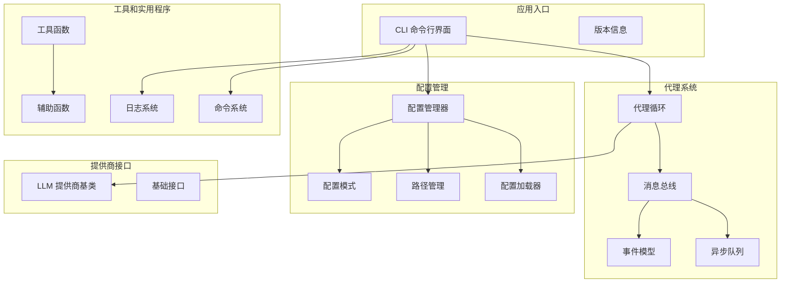
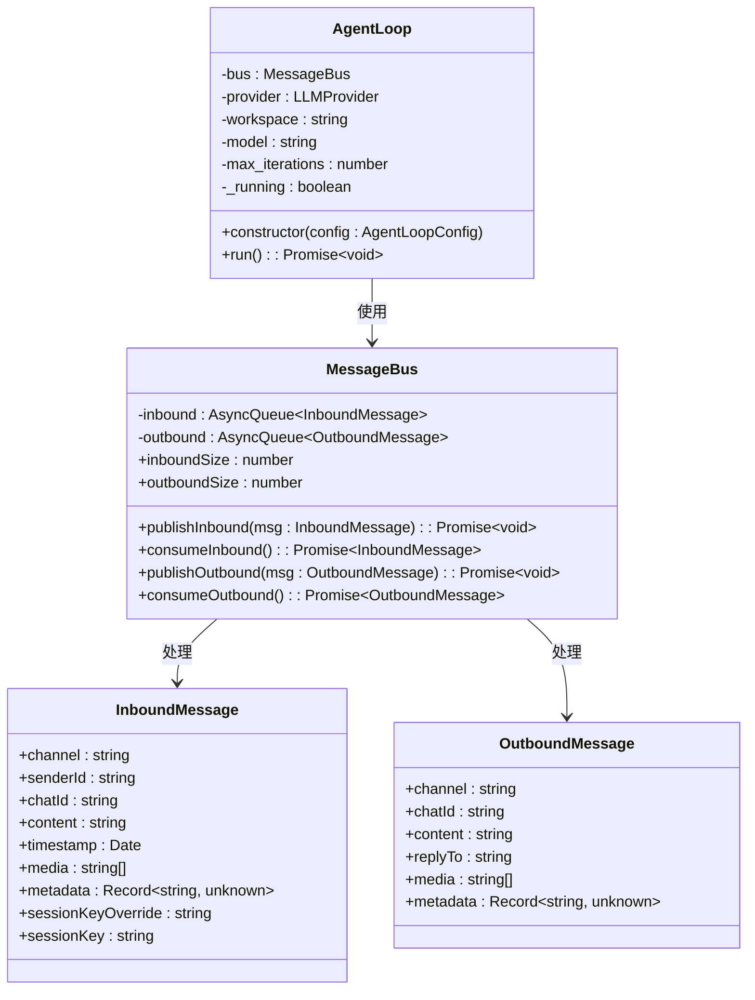
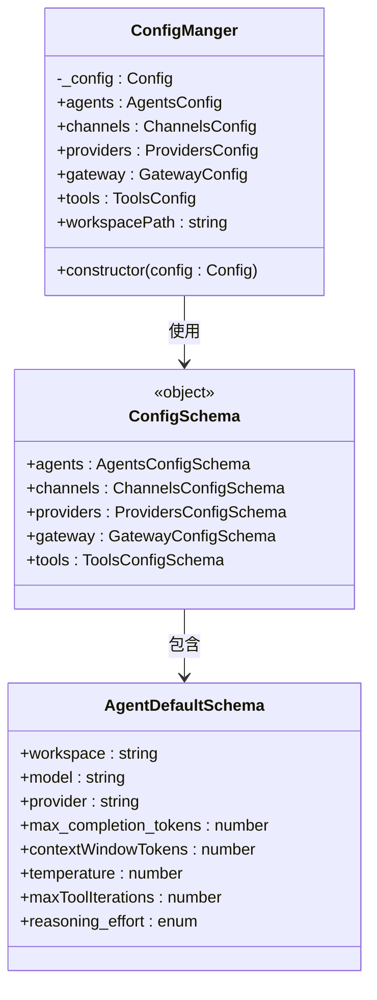
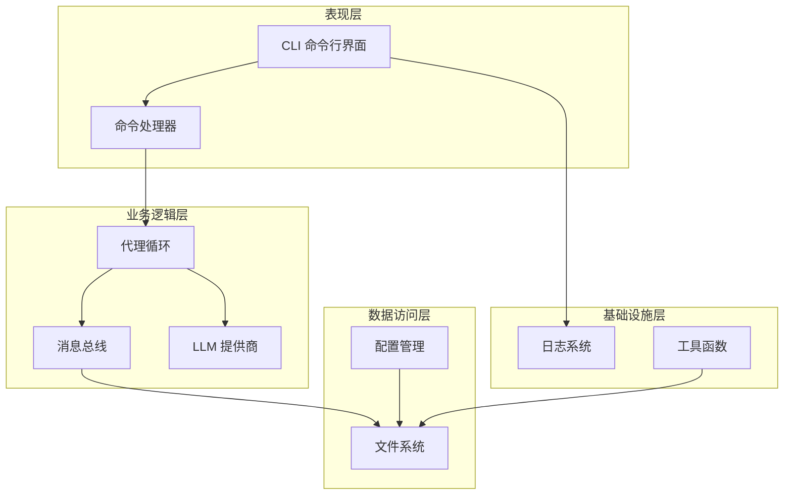
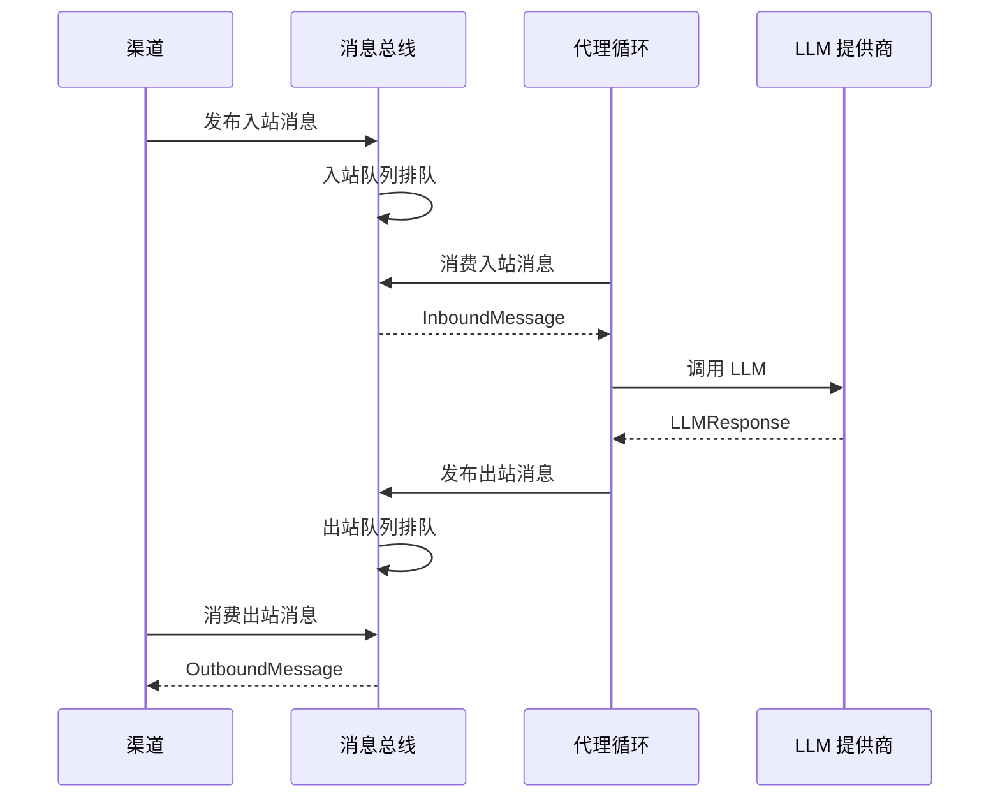
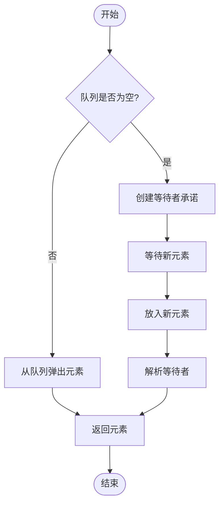
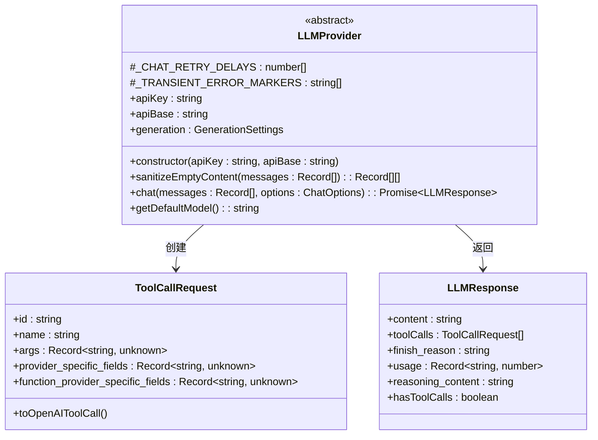
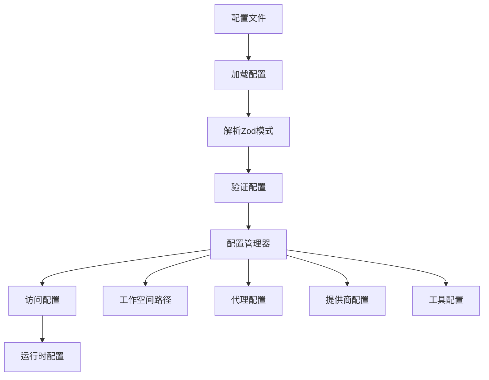
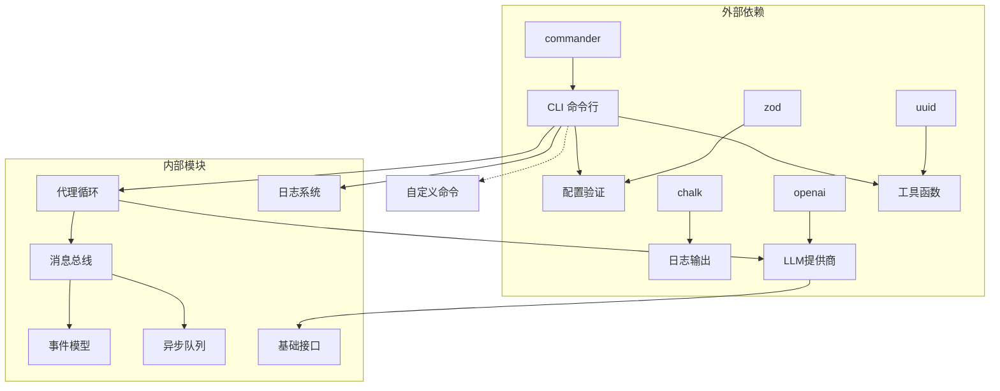

# 代理循环基础设施

<cite>
**本文档引用的文件**
- [src/index.ts](file://src/index.ts)
- [src/cli.ts](file://src/cli.ts)
- [src/agent/loop.ts](file://src/agent/loop.ts)
- [src/bus/events.ts](file://src/bus/events.ts)
- [src/bus/async-queue.ts](file://src/bus/async-queue.ts)
- [src/bus/queue.ts](file://src/bus/queue.ts)
- [src/providers/base.ts](file://src/providers/base.ts)
- [src/config/index.ts](file://src/config/index.ts)
- [src/config/paths.ts](file://src/config/paths.ts)
- [src/config/loader.ts](file://src/config/loader.ts)
- [src/config/schema.ts](file://src/config/schema.ts)
- [src/utils/helpers.ts](file://src/utils/helpers.ts)
- [src/log/index.ts](file://src/log/index.ts)
- [src/command/index.ts](file://src/command/index.ts)
- [package.json](file://package.json)
</cite>

## 目录
1. [简介](#简介)
2. [项目结构](#项目结构)
3. [核心组件](#核心组件)
4. [架构概览](#架构概览)
5. [详细组件分析](#详细组件分析)
6. [依赖关系分析](#依赖关系分析)
7. [性能考虑](#性能考虑)
8. [故障排除指南](#故障排除指南)
9. [结论](#结论)

## 简介

BatBot 是一个基于 TypeScript 的个人 AI 助手代理循环基础设施。该项目提供了一个可扩展的消息传递系统，支持多种聊天渠道（Telegram、Discord、Slack、WhatsApp 等），并通过抽象的 LLM 提供商接口支持不同的大语言模型。

该系统的核心是代理循环（Agent Loop），它负责接收来自不同渠道的消息，构建上下文，调用 LLM，并处理工具调用和响应发送。系统采用异步队列机制确保消息处理的可靠性和响应性。

## 项目结构

项目采用模块化设计，主要分为以下几个核心模块：

**图表来源**
- [src/cli.ts:1-143](file://src/cli.ts#L1-L143)
- [src/agent/loop.ts:1-52](file://src/agent/loop.ts#L1-L52)
- [src/bus/queue.ts:1-59](file://src/bus/queue.ts#L1-L59)

**章节来源**
- [src/index.ts:1-4](file://src/index.ts#L1-L4)
- [src/cli.ts:1-143](file://src/cli.ts#L1-L143)
- [package.json:1-39](file://package.json#L1-L39)

## 核心组件

### 代理循环系统

代理循环是系统的核心处理引擎，负责协调整个消息处理流程：

**图表来源**
- [src/agent/loop.ts:21-52](file://src/agent/loop.ts#L21-L52)
- [src/bus/queue.ts:4-59](file://src/bus/queue.ts#L4-L59)
- [src/bus/events.ts:1-74](file://src/bus/events.ts#L1-L74)

### 配置管理系统

系统采用 Zod 模式验证的配置管理器，提供类型安全的配置访问：

**图表来源**
- [src/config/schema.ts:136-168](file://src/config/schema.ts#L136-L168)
- [src/config/schema.ts:124-132](file://src/config/schema.ts#L124-L132)
- [src/config/schema.ts:20-34](file://src/config/schema.ts#L20-L34)

**章节来源**
- [src/agent/loop.ts:5-11](file://src/agent/loop.ts#L5-L11)
- [src/bus/queue.ts:1-59](file://src/bus/queue.ts#L1-L59)
- [src/config/schema.ts:136-168](file://src/config/schema.ts#L136-L168)

## 架构概览

系统采用分层架构设计，各层职责明确，耦合度低：

**图表来源**
- [src/cli.ts:17-143](file://src/cli.ts#L17-L143)
- [src/agent/loop.ts:21-52](file://src/agent/loop.ts#L21-L52)
- [src/bus/queue.ts:4-59](file://src/bus/queue.ts#L4-L59)

系统的关键特性包括：

1. **异步消息处理**：使用异步队列确保消息处理的非阻塞特性
2. **插件化提供商**：通过抽象基类支持多种 LLM 提供商
3. **类型安全配置**：使用 Zod 进行运行时类型验证
4. **模块化设计**：清晰的模块边界和依赖关系

## 详细组件分析

### 消息总线系统

消息总线是系统通信的核心枢纽，负责在不同组件间传递消息：

**图表来源**
- [src/bus/queue.ts:17-43](file://src/bus/queue.ts#L17-L43)
- [src/agent/loop.ts:42-50](file://src/agent/loop.ts#L42-L50)

消息总线包含以下关键组件：

#### 异步队列实现

异步队列提供了生产者-消费者模式的消息传递机制：

**图表来源**
- [src/bus/async-queue.ts:5-19](file://src/bus/async-queue.ts#L5-L19)

#### 事件模型设计

系统定义了标准化的消息格式，支持多渠道集成：

| 属性名 | 类型 | 描述 | 必需 |
|--------|------|------|------|
| channel | string | 渠道类型（telegram/discord/slack/whatsapp） | 是 |
| senderId | string | 用户标识符 | 是 |
| chatId | string | 聊天/频道标识符 | 是 |
| content | string | 消息文本内容 | 是 |
| timestamp | Date | 消息时间戳 | 否 |
| media | string[] | 媒体URL列表 | 否 |
| metadata | Record<string, unknown> | 渠道特定元数据 | 否 |
| sessionKeyOverride | string | 会话键覆盖 | 否 |

**章节来源**
- [src/bus/async-queue.ts:1-25](file://src/bus/async-queue.ts#L1-L25)
- [src/bus/events.ts:1-74](file://src/bus/events.ts#L1-L74)
- [src/bus/queue.ts:1-59](file://src/bus/queue.ts#L1-L59)

### LLM 提供商接口

抽象的 LLM 提供商基类定义了统一的接口规范：

**图表来源**
- [src/providers/base.ts:87-151](file://src/providers/base.ts#L87-L151)
- [src/providers/base.ts:31-79](file://src/providers/base.ts#L31-L79)

提供商接口的关键特性：

1. **重试机制**：内置指数退避重试策略
2. **错误处理**：自动识别临时性错误
3. **内容净化**：处理空内容导致的 API 错误
4. **工具调用**：支持结构化的工具调用响应

**章节来源**
- [src/providers/base.ts:1-151](file://src/providers/base.ts#L1-L151)

### 配置管理架构

配置系统采用分层设计，提供灵活的配置管理能力：

**图表来源**
- [src/config/loader.ts:7-23](file://src/config/loader.ts#L7-L23)
- [src/config/schema.ts:124-132](file://src/config/schema.ts#L124-L132)

配置系统的层次结构：

| 层级 | 组件 | 功能 |
|------|------|------|
| 应用层 | ConfigManger | 配置访问和管理 |
| 模式层 | ConfigSchema | 类型定义和验证 |
| 数据层 | Config | 实际配置数据 |
| 文件层 | JSON 文件 | 持久化存储 |

**章节来源**
- [src/config/index.ts:1-3](file://src/config/index.ts#L1-L3)
- [src/config/paths.ts:1-11](file://src/config/paths.ts#L1-L11)
- [src/config/loader.ts:1-33](file://src/config/loader.ts#L1-L33)
- [src/config/schema.ts:1-168](file://src/config/schema.ts#L1-L168)

## 依赖关系分析

系统采用模块化依赖管理，主要依赖关系如下：

**图表来源**
- [package.json:23-32](file://package.json#L23-L32)
- [src/cli.ts:1-16](file://src/cli.ts#L1-L16)

### 关键依赖特性

1. **命令行界面**：基于 commander.js 构建，支持子命令和帮助系统
2. **配置验证**：使用 Zod 进行运行时类型检查，确保配置安全性
3. **日志系统**：集成 chalk 实现彩色输出，提升用户体验
4. **异步处理**：无外部异步依赖，使用原生 Promise 和队列实现

**章节来源**
- [package.json:1-39](file://package.json#L1-L39)
- [src/command/index.ts:1-16](file://src/command/index.ts#L1-L16)

## 性能考虑

### 异步队列优化

系统通过异步队列实现非阻塞的消息处理：

1. **零拷贝设计**：队列元素直接传递，避免不必要的数据复制
2. **背压控制**：通过队列长度监控防止内存溢出
3. **并发安全**：使用单向队列确保线程安全

### 内存管理

1. **对象池模式**：重复使用消息对象减少垃圾回收压力
2. **流式处理**：大消息采用流式处理避免内存峰值
3. **及时清理**：定期清理过期会话和历史记录

### 网络优化

1. **连接复用**：提供商层实现连接池复用
2. **批量请求**：支持批量消息处理提高吞吐量
3. **超时控制**：合理的超时设置避免资源泄露

## 故障排除指南

### 常见问题诊断

#### 配置加载失败

**症状**：启动时提示配置加载错误

**解决方案**：
1. 检查配置文件格式是否正确
2. 验证配置字段是否符合 Zod 模式
3. 确认文件权限和路径有效性

#### 消息处理阻塞

**症状**：代理循环无法响应停止信号

**解决方案**：
1. 检查队列状态和积压情况
2. 验证消息处理逻辑的异步性
3. 确认循环控制变量的状态

#### LLM 调用失败

**症状**：提供商调用频繁出现错误

**解决方案**：
1. 检查 API 密钥和端点配置
2. 验证网络连接和防火墙设置
3. 查看重试机制是否正常工作

**章节来源**
- [src/config/loader.ts:13-20](file://src/config/loader.ts#L13-L20)
- [src/agent/loop.ts:42-50](file://src/agent/loop.ts#L42-L50)
- [src/providers/base.ts:87-102](file://src/providers/base.ts#L87-L102)

## 结论

BatBot 代理循环基础设施提供了一个现代化、可扩展的 AI 助手平台。系统的主要优势包括：

1. **模块化设计**：清晰的组件分离和职责划分
2. **类型安全**：完整的 TypeScript 类型系统保障
3. **异步处理**：高效的异步消息传递机制
4. **配置灵活**：强大的配置管理和验证系统
5. **扩展性强**：插件化的提供商接口支持多种 LLM

该系统为构建企业级 AI 助手应用奠定了坚实的基础，通过合理的架构设计和最佳实践，能够满足各种复杂场景的需求。未来可以进一步增强的功能包括分布式部署、监控告警、热更新等高级特性。