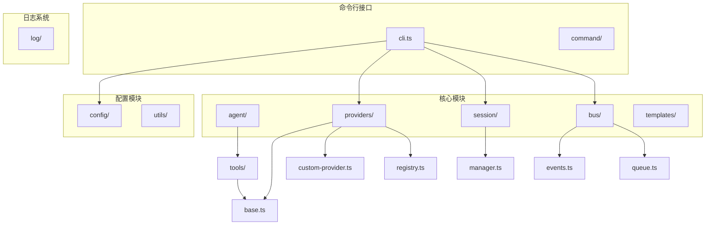
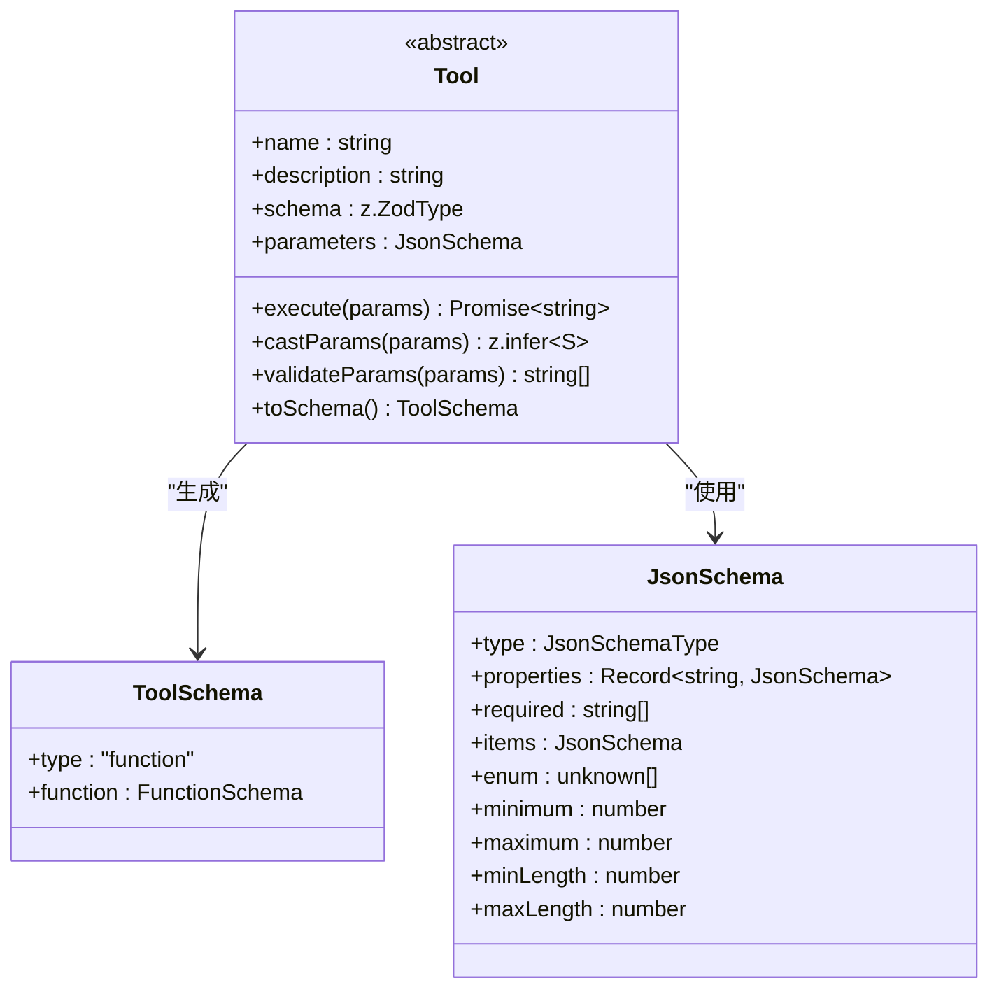
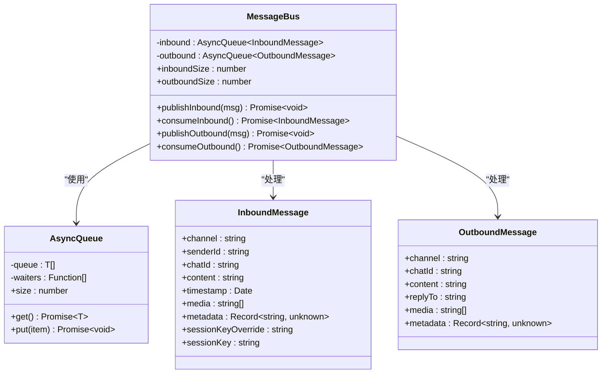
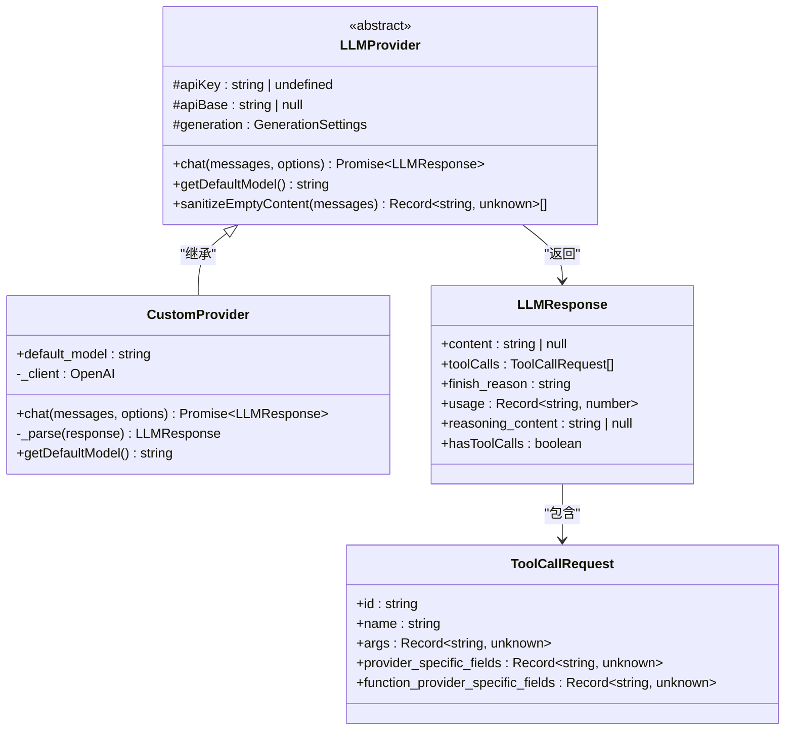
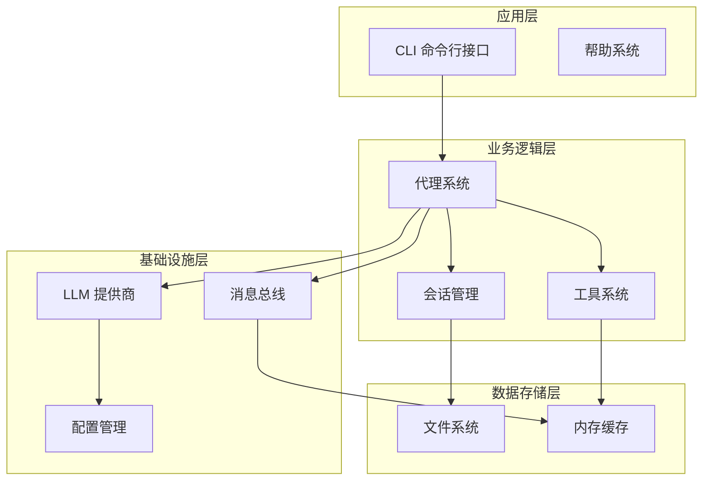
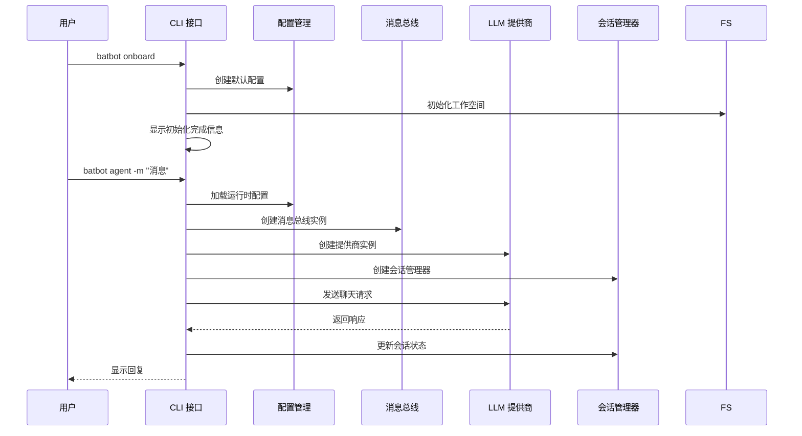
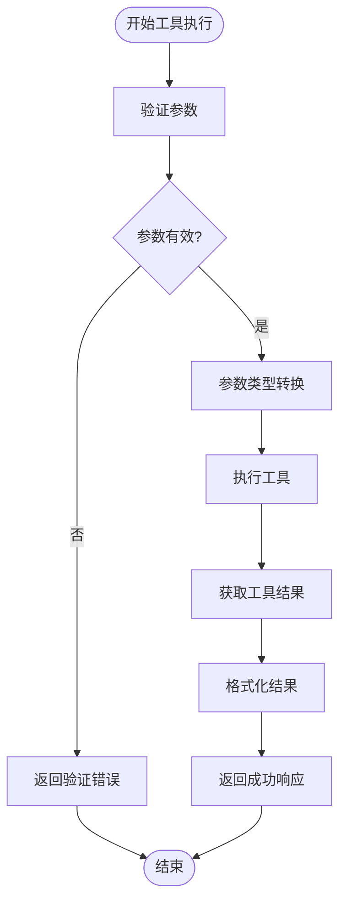
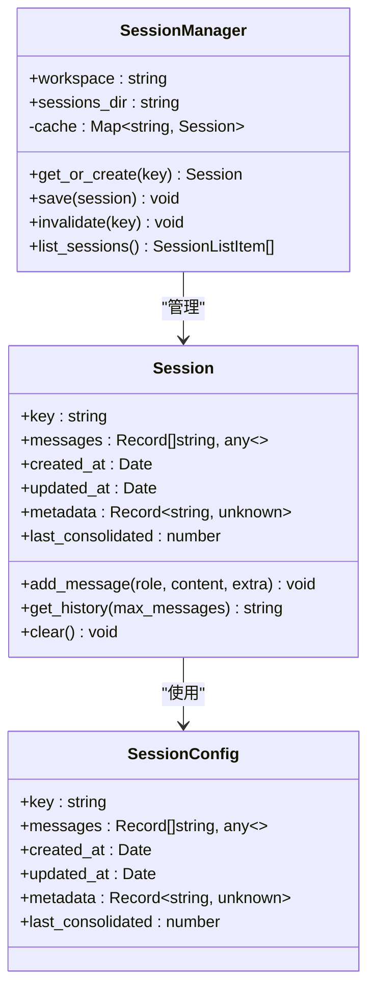

# 工具系统框架

<cite>
**本文档引用的文件**
- [src/index.ts](file://src/index.ts)
- [src/cli.ts](file://src/cli.ts)
- [src/agent/tools/base.ts](file://src/agent/tools/base.ts)
- [src/bus/index.ts](file://src/bus/index.ts)
- [src/bus/async-queue.ts](file://src/bus/async-queue.ts)
- [src/bus/events.ts](file://src/bus/events.ts)
- [src/bus/queue.ts](file://src/bus/queue.ts)
- [src/command/index.ts](file://src/command/index.ts)
- [src/session/manager.ts](file://src/session/manager.ts)
- [src/providers/base.ts](file://src/providers/base.ts)
- [src/providers/custom-provider.ts](file://src/providers/custom-provider.ts)
- [src/providers/registry.ts](file://src/providers/registry.ts)
- [src/templates/TOOLS.md](file://src/templates/TOOLS.md)
- [package.json](file://package.json)
</cite>

## 目录
1. [简介](#简介)
2. [项目结构](#项目结构)
3. [核心组件](#核心组件)
4. [架构概览](#架构概览)
5. [详细组件分析](#详细组件分析)
6. [依赖关系分析](#依赖关系分析)
7. [性能考虑](#性能考虑)
8. [故障排除指南](#故障排除指南)
9. [结论](#结论)

## 简介

BatBot 是一个个人 AI 助手工具系统框架，专注于提供灵活的工具调用机制和消息传递系统。该框架采用模块化设计，支持多种 LLM 提供商、会话管理和异步消息处理。

框架的核心特性包括：
- 基于抽象类的工具系统，支持类型安全的参数验证
- 异步消息总线，支持多通道消息传递
- 会话管理，持久化对话历史
- 多提供商支持，包括本地和云端 LLM 服务
- 安全的工具执行机制

## 项目结构

项目采用清晰的模块化组织结构，主要目录包含：



**图表来源**
- [src/cli.ts:1-201](file://src/cli.ts#L1-L201)
- [src/agent/tools/base.ts:1-301](file://src/agent/tools/base.ts#L1-L301)
- [src/bus/queue.ts:1-59](file://src/bus/queue.ts#L1-L59)

**章节来源**
- [src/cli.ts:1-201](file://src/cli.ts#L1-L201)
- [package.json:1-51](file://package.json#L1-L51)

## 核心组件

### 工具系统基础

工具系统基于抽象基类设计，提供类型安全的参数验证和执行机制：



**图表来源**
- [src/agent/tools/base.ts:36-301](file://src/agent/tools/base.ts#L36-L301)

### 消息总线系统

消息总线提供异步通信机制，支持多通道消息传递：



**图表来源**
- [src/bus/queue.ts:4-59](file://src/bus/queue.ts#L4-L59)
- [src/bus/async-queue.ts:1-25](file://src/bus/async-queue.ts#L1-L25)
- [src/bus/events.ts:1-74](file://src/bus/events.ts#L1-L74)

### LLM 提供商系统

提供统一的 LLM 调用接口，支持多种提供商：



**图表来源**
- [src/providers/base.ts:87-151](file://src/providers/base.ts#L87-L151)
- [src/providers/custom-provider.ts:6-92](file://src/providers/custom-provider.ts#L6-L92)

**章节来源**
- [src/agent/tools/base.ts:1-301](file://src/agent/tools/base.ts#L1-L301)
- [src/bus/queue.ts:1-59](file://src/bus/queue.ts#L1-L59)
- [src/providers/base.ts:1-151](file://src/providers/base.ts#L1-L151)

## 架构概览

系统采用分层架构设计，各层职责明确：



**图表来源**
- [src/cli.ts:62-144](file://src/cli.ts#L62-L144)
- [src/session/manager.ts:89-237](file://src/session/manager.ts#L89-L237)

## 详细组件分析

### 命令行接口系统

CLI 系统提供完整的命令行交互功能：



**图表来源**
- [src/cli.ts:69-144](file://src/cli.ts#L69-L144)

### 工具执行流程

工具系统提供类型安全的参数验证和执行机制：



**图表来源**
- [src/agent/tools/base.ts:74-87](file://src/agent/tools/base.ts#L74-L87)
- [src/agent/tools/base.ts:194-216](file://src/agent/tools/base.ts#L194-L216)

### 会话管理系统

会话管理器提供持久化的对话历史存储：



**图表来源**
- [src/session/manager.ts:89-237](file://src/session/manager.ts#L89-L237)

**章节来源**
- [src/cli.ts:1-201](file://src/cli.ts#L1-L201)
- [src/agent/tools/base.ts:1-301](file://src/agent/tools/base.ts#L1-L301)
- [src/session/manager.ts:1-237](file://src/session/manager.ts#L1-L237)

## 依赖关系分析

项目依赖关系清晰，采用模块化设计：

```mermaid
graph LR
subgraph "外部依赖"
Commander[commander]
OpenAI[openai]
Zod[zod]
UUID[uuid]
Chalk[chalk]
Prompts[@clack/prompts]
end
subgraph "内部模块"
CLI[src/cli.ts]
Tools[src/agent/tools/base.ts]
Bus[src/bus/queue.ts]
Providers[src/providers/custom-provider.ts]
Session[src/session/manager.ts]
end
CLI --> Providers
CLI --> Session
CLI --> Bus
Tools --> Zod
Providers --> OpenAI
CLI --> Commander
CLI --> Prompts
CLI --> Chalk
Providers --> UUID
```

**图表来源**
- [package.json:35-49](file://package.json#L35-L49)
- [src/cli.ts:1-23](file://src/cli.ts#L1-L23)

**章节来源**
- [package.json:1-51](file://package.json#L1-L51)

## 性能考虑

系统在设计时充分考虑了性能优化：

### 异步处理
- 使用 AsyncQueue 实现非阻塞的消息传递
- 支持并发消息处理，提高系统吞吐量

### 缓存策略
- 内存缓存会话数据，减少磁盘 I/O
- 按需加载会话，避免不必要的资源消耗

### 参数验证优化
- 使用 Zod 进行快速类型验证
- 预编译 JSON Schema，提高验证效率

### 资源管理
- 及时清理失效的会话缓存
- 合理的文件句柄管理

## 故障排除指南

### 常见问题及解决方案

**配置文件问题**
- 检查配置文件路径是否正确
- 验证配置文件格式是否符合 schema
- 确认必要的环境变量已设置

**消息传递问题**
- 检查消息总线队列状态
- 验证消息格式是否正确
- 确认会话键值是否唯一

**工具执行问题**
- 查看工具参数验证错误
- 检查工具实现是否正确
- 验证工具权限设置

**LLM 提供商连接问题**
- 确认 API 密钥有效性
- 检查网络连接状态
- 验证模型名称匹配

**章节来源**
- [src/cli.ts:24-42](file://src/cli.ts#L24-L42)
- [src/bus/queue.ts:17-43](file://src/bus/queue.ts#L17-L43)
- [src/agent/tools/base.ts:194-216](file://src/agent/tools/base.ts#L194-L216)

## 结论

BatBot 工具系统框架提供了完整而灵活的 AI 助手解决方案。通过模块化设计和清晰的架构分离，系统具备以下优势：

1. **可扩展性**：模块化设计便于添加新的工具和提供商
2. **可靠性**：完善的错误处理和重试机制
3. **性能**：异步处理和缓存策略提升系统效率
4. **安全性**：严格的参数验证和执行限制
5. **易用性**：简洁的命令行接口和配置管理

该框架为构建复杂的 AI 应用程序提供了坚实的基础，开发者可以在此基础上快速实现各种功能需求。