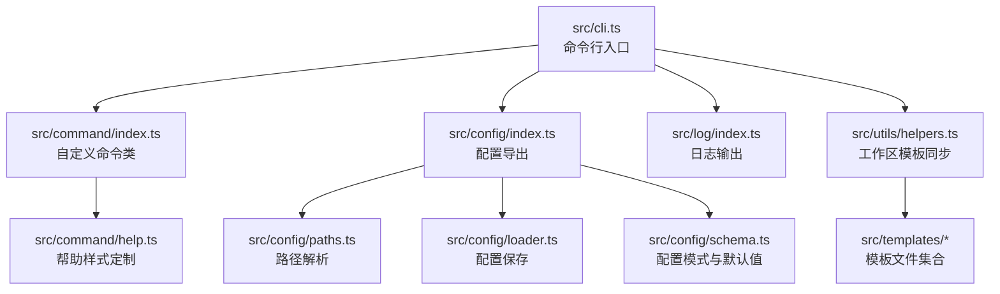
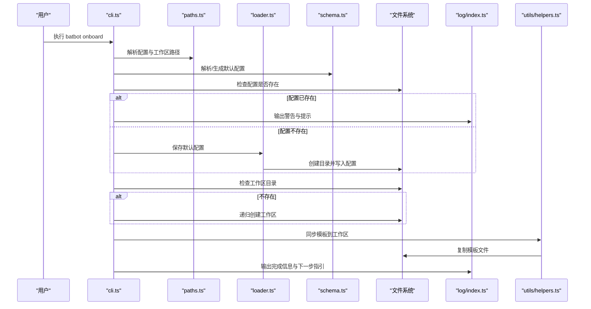
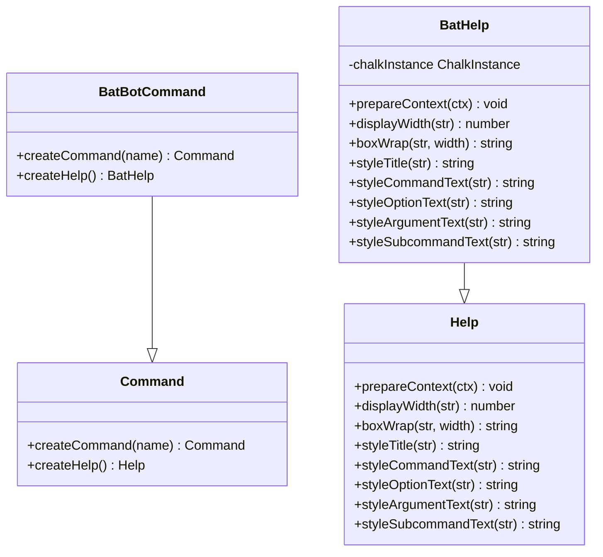
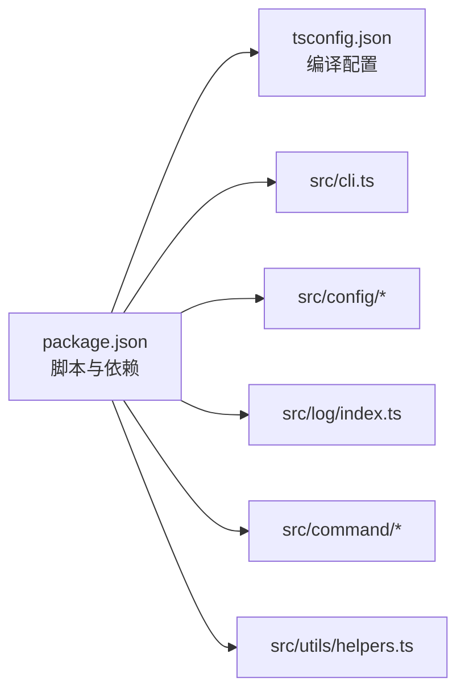

# 故障排除

<cite>
**本文引用的文件**
- [package.json](file://package.json)
- [tsconfig.json](file://tsconfig.json)
- [src/index.ts](file://src/index.ts)
- [src/cli.ts](file://src/cli.ts)
- [src/command/index.ts](file://src/command/index.ts)
- [src/command/help.ts](file://src/command/help.ts)
- [src/log/index.ts](file://src/log/index.ts)
- [src/config/index.ts](file://src/config/index.ts)
- [src/config/paths.ts](file://src/config/paths.ts)
- [src/config/loader.ts](file://src/config/loader.ts)
- [src/config/schema.ts](file://src/config/schema.ts)
- [src/utils/helpers.ts](file://src/utils/helpers.ts)
- [src/templates/AGENTS.md](file://src/templates/AGENTS.md)
- [src/templates/HEARTBEAT.md](file://src/templates/HEARTBEAT.md)
- [src/templates/TOOLS.md](file://src/templates/TOOLS.md)
</cite>

## 目录
1. [简介](#简介)
2. [项目结构](#项目结构)
3. [核心组件](#核心组件)
4. [架构总览](#架构总览)
5. [详细组件分析](#详细组件分析)
6. [依赖分析](#依赖分析)
7. [性能考虑](#性能考虑)
8. [故障排除指南](#故障排除指南)
9. [结论](#结论)
10. [附录](#附录)

## 简介
本指南面向 batbot 用户与维护者，提供系统化的故障排除流程与解决方案，覆盖配置错误、网络连接问题、权限问题、兼容性问题、日志分析与调试技巧，并给出性能识别与优化建议。文档中的所有定位与建议均基于仓库现有源码与脚本配置。

## 项目结构
项目采用按功能域分层的组织方式：命令行入口、配置管理、日志输出、模板同步与帮助系统等模块清晰分离。CLI 使用 commander 构建子命令；配置通过 Zod 校验与默认值管理；日志提供多色输出与调试能力；模板系统用于初始化工作区与引导使用说明。

图表来源
- [src/cli.ts:1-92](file://src/cli.ts#L1-L92)
- [src/command/index.ts:1-16](file://src/command/index.ts#L1-L16)
- [src/command/help.ts:1-57](file://src/command/help.ts#L1-L57)
- [src/log/index.ts:1-49](file://src/log/index.ts#L1-L49)
- [src/config/index.ts:1-3](file://src/config/index.ts#L1-L3)
- [src/config/paths.ts:1-11](file://src/config/paths.ts#L1-L11)
- [src/config/loader.ts:1-16](file://src/config/loader.ts#L1-L16)
- [src/config/schema.ts:1-146](file://src/config/schema.ts#L1-L146)
- [src/utils/helpers.ts:1-47](file://src/utils/helpers.ts#L1-L47)

章节来源
- [src/cli.ts:1-92](file://src/cli.ts#L1-L92)
- [src/command/index.ts:1-16](file://src/command/index.ts#L1-L16)
- [src/command/help.ts:1-57](file://src/command/help.ts#L1-L57)
- [src/log/index.ts:1-49](file://src/log/index.ts#L1-L49)
- [src/config/index.ts:1-3](file://src/config/index.ts#L1-L3)
- [src/config/paths.ts:1-11](file://src/config/paths.ts#L1-L11)
- [src/config/loader.ts:1-16](file://src/config/loader.ts#L1-L16)
- [src/config/schema.ts:1-146](file://src/config/schema.ts#L1-L146)
- [src/utils/helpers.ts:1-47](file://src/utils/helpers.ts#L1-L47)

## 核心组件
- 命令行入口与子命令：提供 onboard、gateway、agent、status、channels、provider 等命令，onboard 负责初始化配置与工作区。
- 配置系统：Zod 模式定义配置结构与默认值，路径解析与保存逻辑独立封装。
- 日志系统：统一输出接口，支持 info/success/warn/error/debug 等级别与彩色输出。
- 工作区模板同步：在首次初始化时复制模板文件至用户工作区，便于快速上手。
- 帮助系统：自定义 Help 类，增强 CLI 输出的可读性与一致性。

章节来源
- [src/cli.ts:14-92](file://src/cli.ts#L14-L92)
- [src/config/schema.ts:118-146](file://src/config/schema.ts#L118-L146)
- [src/log/index.ts:5-44](file://src/log/index.ts#L5-L44)
- [src/utils/helpers.ts:11-47](file://src/utils/helpers.ts#L11-L47)
- [src/command/index.ts:4-13](file://src/command/index.ts#L4-L13)

## 架构总览
下图展示 CLI 初始化流程与关键交互点，包括配置路径解析、工作区创建、模板同步与日志输出。

图表来源
- [src/cli.ts:24-54](file://src/cli.ts#L24-L54)
- [src/config/paths.ts:4-10](file://src/config/paths.ts#L4-L10)
- [src/config/loader.ts:6-15](file://src/config/loader.ts#L6-L15)
- [src/config/schema.ts:20-37](file://src/config/schema.ts#L20-L37)
- [src/utils/helpers.ts:11-47](file://src/utils/helpers.ts#L11-L47)
- [src/log/index.ts:5-44](file://src/log/index.ts#L5-L44)

## 详细组件分析

### 命令行与帮助系统
- 自定义命令类继承 commander 的 Command，重写 createHelp 返回自定义帮助实现，提升 CLI 可读性与一致性。
- 帮助类对标题、命令文本、选项、参数、子命令等进行样式定制，并处理 ANSI 清理与宽度计算。

图表来源
- [src/command/index.ts:4-13](file://src/command/index.ts#L4-L13)
- [src/command/help.ts:6-54](file://src/command/help.ts#L6-L54)

章节来源
- [src/command/index.ts:1-16](file://src/command/index.ts#L1-L16)
- [src/command/help.ts:1-57](file://src/command/help.ts#L1-L57)

### 配置系统（路径、加载、模式）
- 路径解析：返回用户主目录下的 .batbot/config.json 与 .batbot/workspace。
- 配置保存：确保目录存在后写入 JSON 文件。
- 配置模式：使用 Zod 定义 agents、channels、providers、gateway、tools 等配置段的结构与默认值，并提供 ConfigManger 获取工作区绝对路径。

图表来源
- [src/config/paths.ts:4-10](file://src/config/paths.ts#L4-L10)
- [src/config/loader.ts:6-15](file://src/config/loader.ts#L6-L15)
- [src/config/schema.ts:118-146](file://src/config/schema.ts#L118-L146)

章节来源
- [src/config/paths.ts:1-11](file://src/config/paths.ts#L1-L11)
- [src/config/loader.ts:1-16](file://src/config/loader.ts#L1-L16)
- [src/config/schema.ts:1-146](file://src/config/schema.ts#L1-L146)

### 日志系统
- 提供 info/success/warn/error/debug 等输出方法，统一使用 chalk 进行彩色输出，便于在终端中快速识别信息级别。
- 支持占位符格式化与分隔线、标题等辅助输出。

章节来源
- [src/log/index.ts:5-44](file://src/log/index.ts#L5-L44)

### 工作区模板同步
- 在首次初始化时，将模板目录中的 .md 文件复制到工作区，并创建 memory 与 skills 子目录。
- 对重复文件会跳过，新增文件名列表可用于反馈创建结果。

章节来源
- [src/utils/helpers.ts:11-47](file://src/utils/helpers.ts#L11-L47)

## 依赖分析
- 运行时依赖：chalk、commander、strip-ansi、wrap-ansi、zod。
- 开发依赖：@types/node、cpy-cli、typescript。
- 版本与构建：package.json 中定义了 dev/build/start 脚本，tsconfig.json 控制编译行为。

图表来源
- [package.json:17-33](file://package.json#L17-L33)
- [tsconfig.json](file://tsconfig.json)
- [src/cli.ts:1-92](file://src/cli.ts#L1-L92)
- [src/config/schema.ts:1-146](file://src/config/schema.ts#L1-L146)
- [src/log/index.ts:1-49](file://src/log/index.ts#L1-L49)
- [src/command/index.ts:1-16](file://src/command/index.ts#L1-L16)
- [src/utils/helpers.ts:1-47](file://src/utils/helpers.ts#L1-L47)

章节来源
- [package.json:1-35](file://package.json#L1-L35)
- [tsconfig.json](file://tsconfig.json)

## 性能考虑
- CLI 命令执行为轻量级控制流，主要开销来自文件系统操作（路径解析、目录创建、模板复制）与日志输出。
- 模板同步仅在首次初始化时进行，后续运行成本极低。
- 建议：
  - 将工作区与配置放置在本地磁盘，避免网络挂载导致的 IO 延迟。
  - 如需批量模板操作，可在离线状态下完成初始化后再接入网络环境。
  - 使用日志级别区分信息与调试输出，减少不必要的调试日志打印。

## 故障排除指南

### 一、通用诊断流程
1. 确认版本与环境
   - 查看版本与图标常量，确认运行的是预期版本。
   - 检查 Node.js 与 TypeScript 编译器是否满足项目要求。
2. 检查 CLI 命令可用性
   - 使用 batbot --help 或 batbot -h 查看命令列表与描述。
   - 使用 batbot onboard 初始化配置与工作区。
3. 核对配置与工作区路径
   - 确认 ~/.batbot/config.json 是否存在且可读。
   - 确认 ~/.batbot/workspace 目录存在且可写。
4. 观察日志输出
   - 使用 info/success/warn/error/debug 级别输出定位问题。
   - 若输出被截断，检查终端宽度与 ANSI 处理设置。

章节来源
- [src/index.ts:1-4](file://src/index.ts#L1-L4)
- [package.json:17-21](file://package.json#L17-L21)
- [src/cli.ts:16-54](file://src/cli.ts#L16-L54)
- [src/config/paths.ts:4-10](file://src/config/paths.ts#L4-L10)
- [src/log/index.ts:5-44](file://src/log/index.ts#L5-L44)

### 二、常见问题与解决方案

#### 1. 配置错误
- 症状
  - 配置文件缺失或格式不正确，导致初始化失败或运行时报错。
  - 默认值未生效，或字段类型不匹配。
- 排查步骤
  - 使用 batbot onboard 重新生成默认配置。
  - 检查 ~/.batbot/config.json 是否存在，必要时删除后重试。
  - 使用 Zod 模式校验配置结构，确保字段类型与取值范围符合 schema。
- 相关实现
  - 配置保存与默认值：见 [src/config/loader.ts:6-15](file://src/config/loader.ts#L6-L15)、[src/config/schema.ts:118-146](file://src/config/schema.ts#L118-L146)。
  - 路径解析：见 [src/config/paths.ts:4-10](file://src/config/paths.ts#L4-L10)。

章节来源
- [src/config/loader.ts:6-15](file://src/config/loader.ts#L6-L15)
- [src/config/schema.ts:118-146](file://src/config/schema.ts#L118-L146)
- [src/config/paths.ts:4-10](file://src/config/paths.ts#L4-L10)

#### 2. 权限问题
- 症状
  - 无法创建 ~/.batbot 目录或写入配置文件。
  - 模板同步失败，提示无权限。
- 排查步骤
  - 检查当前用户对 ~/.batbot 的读写权限。
  - 临时切换到有权限的账户执行 batbot onboard。
  - 确保父目录存在且可写，必要时手动创建并赋予权限。
- 相关实现
  - 目录创建与写入：见 [src/config/loader.ts:10-15](file://src/config/loader.ts#L10-L15)、[src/utils/helpers.ts:21-29](file://src/utils/helpers.ts#L21-L29)。

章节来源
- [src/config/loader.ts:10-15](file://src/config/loader.ts#L10-L15)
- [src/utils/helpers.ts:21-29](file://src/utils/helpers.ts#L21-L29)

#### 3. 网络连接问题
- 症状
  - 代理或上游服务不可达，导致工具调用失败。
  - Web 搜索或外部工具请求超时。
- 排查步骤
  - 检查 tools.web.proxy 设置是否正确。
  - 验证上游 API Base 与认证头配置。
  - 使用最小化请求验证网络连通性。
- 相关实现
  - Web 工具与代理配置：见 [src/config/schema.ts:82-85](file://src/config/schema.ts#L82-L85)、[src/config/schema.ts:41-47](file://src/config/schema.ts#L41-L47)。

章节来源
- [src/config/schema.ts:82-85](file://src/config/schema.ts#L82-L85)
- [src/config/schema.ts:41-47](file://src/config/schema.ts#L41-L47)

#### 4. 兼容性问题
- 症状
  - 终端不支持彩色输出或 ANSI 控制码。
  - 文本换行与宽度计算异常。
- 排查步骤
  - 检查终端设置与颜色支持。
  - 使用 strip-ansi 与 wrap-ansi 的组合处理宽度与换行。
- 相关实现
  - 帮助系统对 ANSI 的清理与宽度计算：见 [src/command/help.ts:25-31](file://src/command/help.ts#L25-L31)。

章节来源
- [src/command/help.ts:25-31](file://src/command/help.ts#L25-L31)

#### 5. 模板与工作区问题
- 症状
  - 模板未复制到工作区，或部分文件缺失。
  - memory/HISTORY.md 未创建。
- 排查步骤
  - 确认模板目录存在且可读。
  - 手动触发模板同步，观察新增文件列表。
  - 检查 skills 目录是否创建成功。
- 相关实现
  - 模板同步逻辑：见 [src/utils/helpers.ts:11-47](file://src/utils/helpers.ts#L11-L47)。

章节来源
- [src/utils/helpers.ts:11-47](file://src/utils/helpers.ts#L11-L47)

#### 6. 日志与调试
- 症状
  - 信息级别混淆，难以定位问题。
  - 调试信息过多或过少。
- 排查步骤
  - 使用 logger.debug 输出调试信息，使用 logger.error 输出错误。
  - 使用 logger.divider 与 logger.title 组织输出结构。
- 相关实现
  - 日志接口：见 [src/log/index.ts:5-44](file://src/log/index.ts#L5-L44)。

章节来源
- [src/log/index.ts:5-44](file://src/log/index.ts#L5-L44)

### 三、错误代码与消息解释
- 配置已存在提示
  - 现象：onboard 时若配置已存在，会提示是否覆盖或保留。
  - 处理：根据提示选择覆盖或刷新配置。
  - 参考：见 [src/cli.ts:30-37](file://src/cli.ts#L30-L37)。
- 工作区创建成功
  - 现象：工作区不存在时自动创建。
  - 处理：确认目录权限与磁盘空间。
  - 参考：见 [src/cli.ts:39-42](file://src/cli.ts#L39-L42)。
- 模板同步完成
  - 现象：同步完成后输出新增文件列表。
  - 处理：核对工作区内容，确保模板完整。
  - 参考：见 [src/utils/helpers.ts:41-46](file://src/utils/helpers.ts#L41-L46)。

章节来源
- [src/cli.ts:30-37](file://src/cli.ts#L30-L37)
- [src/cli.ts:39-42](file://src/cli.ts#L39-L42)
- [src/utils/helpers.ts:41-46](file://src/utils/helpers.ts#L41-L46)

### 四、日志分析技巧与调试工具
- 使用 logger 系列方法区分信息级别，便于快速定位问题。
- 在需要时启用 debug 输出，但注意生产环境关闭冗余调试。
- 结合 strip-ansi 与 wrap-ansi 的宽度计算，确保日志在不同终端中可读。

章节来源
- [src/log/index.ts:5-44](file://src/log/index.ts#L5-L44)
- [src/command/help.ts:25-31](file://src/command/help.ts#L25-L31)

### 五、性能问题识别与优化
- 识别
  - 初始化阶段的 IO 操作（路径解析、目录创建、模板复制）是主要耗时点。
  - 日志输出在大量数据时可能影响性能。
- 优化
  - 将工作区与配置放在本地磁盘，避免网络延迟。
  - 减少不必要的模板同步，仅在首次初始化时执行。
  - 控制日志级别，避免在生产环境输出过多调试信息。

章节来源
- [src/utils/helpers.ts:11-47](file://src/utils/helpers.ts#L11-L47)
- [src/log/index.ts:5-44](file://src/log/index.ts#L5-L44)

### 六、社区支持与问题报告
- 项目主页与问题反馈
  - 项目主页与问题跟踪地址已在 package.json 中声明，遇到问题请前往提交 Issue。
- 参考
  - 见 [package.json:5-12](file://package.json#L5-L12)。

章节来源
- [package.json:5-12](file://package.json#L5-L12)

## 结论
本指南提供了从基础检查到高级调试的系统化排障流程，结合配置、权限、网络、兼容性与性能等方面的具体建议。通过遵循本文的步骤与参考相关源码位置，可高效定位并解决问题，同时提升日常使用体验。

## 附录

### A. 关键文件与职责速览
- src/cli.ts：命令入口与 onboard 初始化流程。
- src/config/paths.ts：配置与工作区路径解析。
- src/config/loader.ts：配置保存与目录创建。
- src/config/schema.ts：配置模式、默认值与 ConfigManger。
- src/log/index.ts：统一日志输出接口。
- src/utils/helpers.ts：模板同步与工作区初始化。
- src/command/index.ts 与 src/command/help.ts：命令与帮助系统定制。
- package.json：脚本与依赖声明。
- tsconfig.json：编译配置。

章节来源
- [src/cli.ts:1-92](file://src/cli.ts#L1-L92)
- [src/config/paths.ts:1-11](file://src/config/paths.ts#L1-L11)
- [src/config/loader.ts:1-16](file://src/config/loader.ts#L1-L16)
- [src/config/schema.ts:1-146](file://src/config/schema.ts#L1-L146)
- [src/log/index.ts:1-49](file://src/log/index.ts#L1-L49)
- [src/utils/helpers.ts:1-47](file://src/utils/helpers.ts#L1-L47)
- [src/command/index.ts:1-16](file://src/command/index.ts#L1-L16)
- [src/command/help.ts:1-57](file://src/command/help.ts#L1-L57)
- [package.json:1-35](file://package.json#L1-L35)
- [tsconfig.json](file://tsconfig.json)