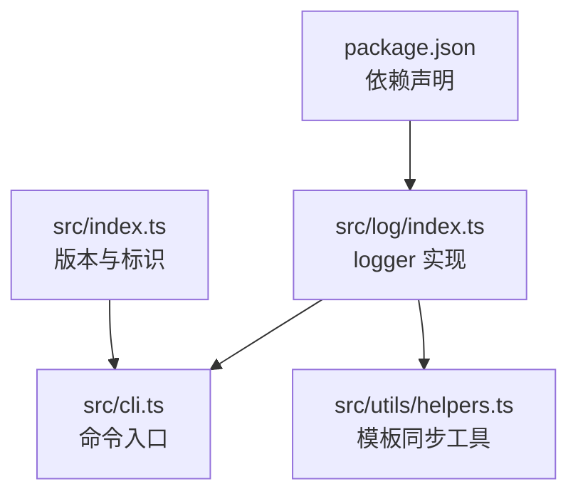
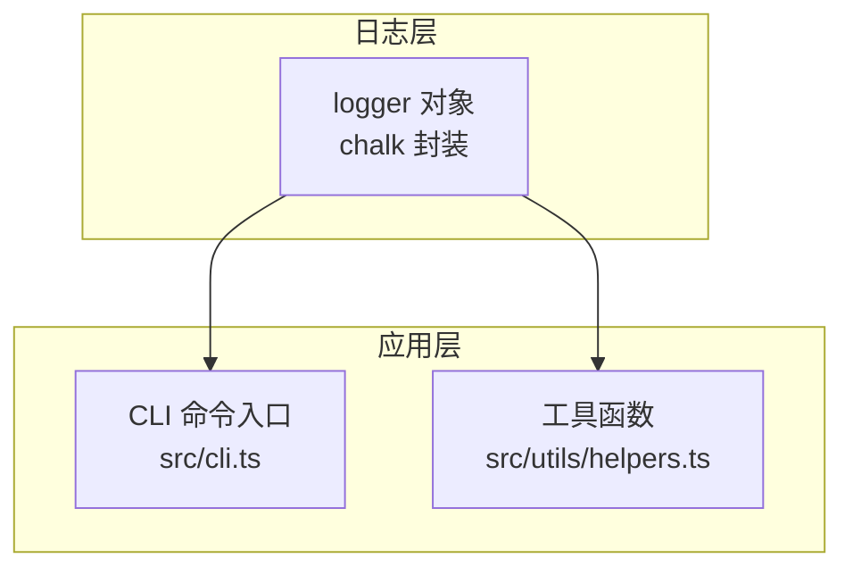
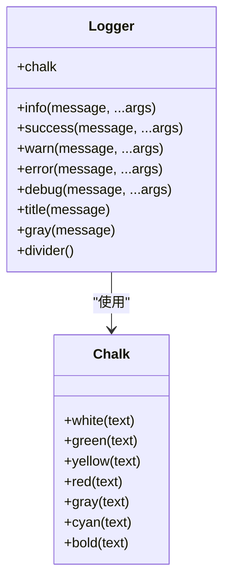
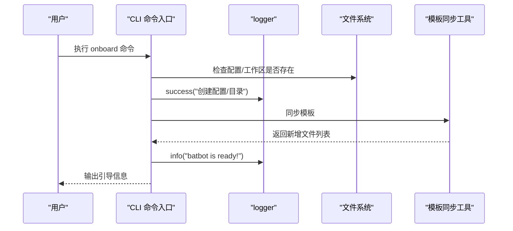
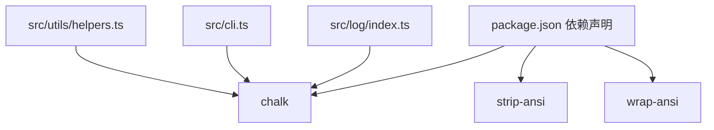

# 日志系统

<cite>
**本文引用的文件**
- [src/log/index.ts](file://src/log/index.ts)
- [src/cli.ts](file://src/cli.ts)
- [src/utils/helpers.ts](file://src/utils/helpers.ts)
- [src/index.ts](file://src/index.ts)
- [package.json](file://package.json)
</cite>

## 目录
1. [简介](#简介)
2. [项目结构](#项目结构)
3. [核心组件](#核心组件)
4. [架构总览](#架构总览)
5. [详细组件分析](#详细组件分析)
6. [依赖关系分析](#依赖关系分析)
7. [性能考量](#性能考量)
8. [故障排查指南](#故障排查指南)
9. [结论](#结论)
10. [附录](#附录)

## 简介
本文件为 batbot 项目的日志系统技术文档，聚焦于彩色终端输出的实现原理与使用方式，涵盖日志级别（调试、信息、警告、错误、成功）、日志格式化规则、消息结构、错误处理策略、异常情况下的日志记录、调试与故障排除中的应用，以及日志配置选项与自定义方法。日志系统基于 chalk 库进行 ANSI 颜色码处理，并通过统一的 logger 模块对外暴露接口，便于在 CLI 与工具函数中一致地输出带颜色的控制台信息。

## 项目结构
日志系统位于 src/log/index.ts，主要导出一个 logger 对象与原生 console.log 的别名 log。CLI 入口与工具函数均通过模块导入使用该 logger，形成统一的输出规范。

图表来源
- [src/log/index.ts:1-49](file://src/log/index.ts#L1-L49)
- [src/cli.ts:1-96](file://src/cli.ts#L1-L96)
- [src/utils/helpers.ts:1-47](file://src/utils/helpers.ts#L1-L47)
- [src/index.ts:1-4](file://src/index.ts#L1-L4)
- [package.json:1-35](file://package.json#L1-L35)

章节来源
- [src/log/index.ts:1-49](file://src/log/index.ts#L1-L49)
- [src/cli.ts:1-96](file://src/cli.ts#L1-L96)
- [src/utils/helpers.ts:1-47](file://src/utils/helpers.ts#L1-L47)
- [src/index.ts:1-4](file://src/index.ts#L1-L4)
- [package.json:1-35](file://package.json#L1-L35)

## 核心组件
- logger：统一的日志输出对象，提供以下方法：
  - info(message, ...args)：信息级别输出，使用白色文本。
  - success(message, ...args)：成功级别输出，使用绿色图标与文本。
  - warn(message, ...args)：警告级别输出，使用黄色图标与文本。
  - error(message, ...args)：错误级别输出，使用红色图标与文本。
  - debug(message, ...args)：调试级别输出，使用灰色图标与文本。
  - title(message)：标题输出，使用粗体青色文本。
  - gray(message)：普通灰字输出。
  - divider()：分隔线输出，使用灰字横线。
  - chalk：直接导出 chalk 库实例，便于按需使用更丰富的样式。
- log：原生 console.log 的别名，用于保持与标准控制台行为的一致性。

日志格式化规则
- 使用占位符 %s 进行简单字符串替换，支持传入多个参数，按顺序替换。
- 所有输出最终通过 console.log 输出到标准输出流。

章节来源
- [src/log/index.ts:1-49](file://src/log/index.ts#L1-L49)

## 架构总览
日志系统采用“集中式封装 + 统一导出”的设计，CLI 与工具函数通过 import 引入 logger，避免在各处重复实现颜色逻辑与格式化规则。

图表来源
- [src/log/index.ts:1-49](file://src/log/index.ts#L1-L49)
- [src/cli.ts:1-96](file://src/cli.ts#L1-L96)
- [src/utils/helpers.ts:1-47](file://src/utils/helpers.ts#L1-L47)

## 详细组件分析

### 组件：logger 对象与 chalk 集成
- 设计要点
  - 通过 chalk 对文本进行样式装饰（颜色、粗体等），并结合图标前缀增强可读性。
  - 使用占位符 %s 的简单格式化，确保与常见日志库的兼容性。
  - 提供多种输出风格（标题、分隔线、灰字）以满足不同场景。
- 数据结构与复杂度
  - 方法均为 O(n) 的字符串替换与拼接，n 为参数数量；整体开销极低。
- 错误处理与边界
  - 当传入非字符串类型时，会先转换为字符串再输出，避免运行时异常。
  - 若未传入参数，直接输出原始 message，不进行替换。
- 性能影响
  - 仅进行少量字符串操作与 chalk 调用，对 CLI 启动与命令执行的性能影响可忽略。

图表来源
- [src/log/index.ts:1-49](file://src/log/index.ts#L1-L49)

章节来源
- [src/log/index.ts:1-49](file://src/log/index.ts#L1-L49)

### 组件：CLI 中的日志使用
- 使用场景
  - 初始化流程：创建配置文件、工作区目录、模板同步后输出成功与信息提示。
  - 用户引导：输出下一步操作说明与链接提示。
- 输出风格
  - 成功：success
  - 信息：info
  - 标题：title（用于 Logo 与步骤标题）
  - 链接高亮：直接使用 chalk.cyan/chalk.dim 等样式

图表来源
- [src/cli.ts:1-96](file://src/cli.ts#L1-L96)
- [src/log/index.ts:1-49](file://src/log/index.ts#L1-L49)
- [src/utils/helpers.ts:1-47](file://src/utils/helpers.ts#L1-L47)

章节来源
- [src/cli.ts:1-96](file://src/cli.ts#L1-L96)
- [src/utils/helpers.ts:1-47](file://src/utils/helpers.ts#L1-L47)

### 组件：工具函数中的日志使用
- 使用场景
  - 模板同步完成后，逐条输出“已创建”的文件名，使用灰字输出以降低视觉干扰。
- 输出风格
  - gray：用于非关键信息的补充输出。

图表来源
- [src/utils/helpers.ts:1-47](file://src/utils/helpers.ts#L1-L47)
- [src/log/index.ts:1-49](file://src/log/index.ts#L1-L49)

章节来源
- [src/utils/helpers.ts:1-47](file://src/utils/helpers.ts#L1-L47)

### 组件：日志级别与使用场景
- info：常规信息输出，如“batbot is ready!”、“下一步操作”等。
- success：成功完成某项任务，如“创建配置/目录”。
- warn：潜在问题或需要关注的提示，当前实现中未直接调用，但保留接口。
- error：错误状态输出，如异常或失败场景。
- debug：调试信息输出，当前实现中未直接调用，但保留接口。
- title：标题输出，常用于主标题或分段标题。
- gray/divider：辅助输出，用于弱化信息或分隔内容。

章节来源
- [src/log/index.ts:1-49](file://src/log/index.ts#L1-L49)

### 组件：日志格式化规则与消息结构
- 占位符规则
  - 使用 %s 进行简单替换，按传入参数顺序依次替换。
  - 若未传入参数，则直接输出原始 message。
- 图标与颜色
  - success：绿色图标 + 绿色文本
  - warn：黄色图标 + 黄色文本
  - error：红色图标 + 红色文本
  - debug：灰色图标 + 灰色文本
  - info/title/gray：对应颜色与样式
- 结构建议
  - 建议在消息前添加简短上下文标签（如“配置”、“工作区”、“模板”），便于快速识别。
  - 对重要链接或路径使用 chalk 高亮，提升可读性。

章节来源
- [src/log/index.ts:1-49](file://src/log/index.ts#L1-L49)

### 组件：错误处理策略与异常日志
- 当前实现
  - logger 本身不捕获异常，仅负责输出；异常应由上层调用方捕获并使用 logger.error 输出。
  - 工具函数中对文件系统操作的异常未显式捕获，建议在关键路径增加 try/catch 并输出错误日志。
- 建议实践
  - 在 CLI 命令与工具函数的关键节点包裹 try/catch。
  - 使用 logger.error 输出错误信息，并在必要时输出堆栈或上下文。
  - 对于可恢复的错误，使用 logger.warn 并提供修复建议。

章节来源
- [src/cli.ts:1-96](file://src/cli.ts#L1-L96)
- [src/utils/helpers.ts:1-47](file://src/utils/helpers.ts#L1-L47)
- [src/log/index.ts:1-49](file://src/log/index.ts#L1-L49)

### 组件：调试与故障排除中的应用
- 调试
  - 可通过在关键路径插入 logger.debug 输出（当前实现保留接口，尚未直接使用）。
  - 使用 title 与 divider 分隔调试输出，便于在大量日志中定位。
- 故障排除
  - 使用 logger.error 输出致命错误与异常。
  - 使用 chalk.cyan/chalk.dim 等样式突出显示路径、URL、命令等关键信息，便于复制与核对。
  - 在 CLI 引导阶段，使用 info 输出清晰的下一步操作说明，减少用户困惑。

章节来源
- [src/log/index.ts:1-49](file://src/log/index.ts#L1-L49)
- [src/cli.ts:1-96](file://src/cli.ts#L1-L96)

### 组件：日志配置选项与自定义方法
- 内置能力
  - 直接导出 chalk 实例，可在需要时使用 chalk 的高级样式（如 rgb/bgHex/ansi256 等）。
  - 支持自定义图标与颜色组合，以满足不同主题需求。
- 自定义建议
  - 可在 logger 外层封装一层配置开关（如是否启用颜色、是否输出图标），以适配 CI/CD 或无彩色终端环境。
  - 可扩展日志级别（如 verbose、trace），并为每个级别绑定不同的图标与颜色。
  - 可引入时间戳、模块名前缀等结构化字段，便于日志聚合与检索。

章节来源
- [src/log/index.ts:1-49](file://src/log/index.ts#L1-L49)

## 依赖关系分析
- chalk：用于终端颜色与样式的渲染，版本在 package.json 中声明。
- strip-ansi：用于去除 ANSI 控制码，便于在非彩色环境中输出纯文本。
- wrap-ansi：用于在多列宽度下自动换行，配合 chalk 使用可提升长文本可读性。

图表来源
- [package.json:1-35](file://package.json#L1-L35)
- [src/log/index.ts:1-49](file://src/log/index.ts#L1-L49)
- [src/cli.ts:1-96](file://src/cli.ts#L1-L96)
- [src/utils/helpers.ts:1-47](file://src/utils/helpers.ts#L1-L47)

章节来源
- [package.json:1-35](file://package.json#L1-L35)
- [src/log/index.ts:1-49](file://src/log/index.ts#L1-L49)

## 性能考量
- 字符串替换与 chalk 调用均为轻量级操作，对 CLI 启动与命令执行的性能影响微乎其微。
- 在高频输出场景（如批量文件处理）中，建议合并输出或使用缓冲策略，减少频繁 I/O。
- 在 CI/CD 环境中，若终端不支持彩色输出，可通过禁用颜色或降级为纯文本输出，避免额外开销。

## 故障排查指南
- 彩色输出异常
  - 检查终端是否支持 ANSI 颜色码；在 Windows 上可使用支持 ANSI 的终端或启用虚拟终端序列。
  - 若需要纯文本输出，可使用 strip-ansi 去除颜色控制码。
- 日志缺失或顺序异常
  - 确认调用链中未被 try/catch 捕获且吞掉异常。
  - 在关键路径增加 logger.error 输出，确保异常信息可见。
- 输出格式不符合预期
  - 检查是否正确传入参数以触发 %s 替换。
  - 确保传入参数类型可安全转换为字符串。

章节来源
- [src/log/index.ts:1-49](file://src/log/index.ts#L1-L49)
- [src/cli.ts:1-96](file://src/cli.ts#L1-L96)
- [src/utils/helpers.ts:1-47](file://src/utils/helpers.ts#L1-L47)

## 结论
本日志系统以 chalk 为核心，提供了简洁、统一且可扩展的彩色终端输出方案。通过标准化的日志级别与格式化规则，CLI 与工具函数能够一致地向用户传达信息、提示与警告。建议在后续迭代中引入更完善的错误处理机制、可配置的颜色与图标策略，以及结构化的日志字段，以进一步提升可观测性与可维护性。

## 附录
- 版本与标识
  - 版本号与 Logo 常量在入口文件中定义，便于在 CLI 输出中统一展示。
- 常用 chalk 样式参考
  - 文本颜色：white/green/yellow/red/gray/cyan
  - 样式修饰：bold
  - 其他：rgb/bgRgb/hex/bgHex/ansi256 等（通过导出的 chalk 实例使用）

章节来源
- [src/index.ts:1-4](file://src/index.ts#L1-L4)
- [src/log/index.ts:1-49](file://src/log/index.ts#L1-L49)