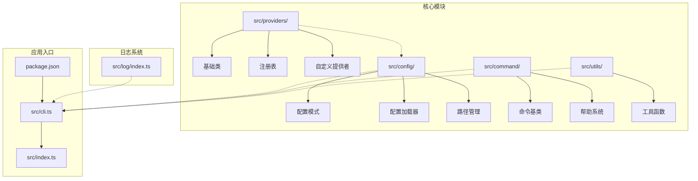
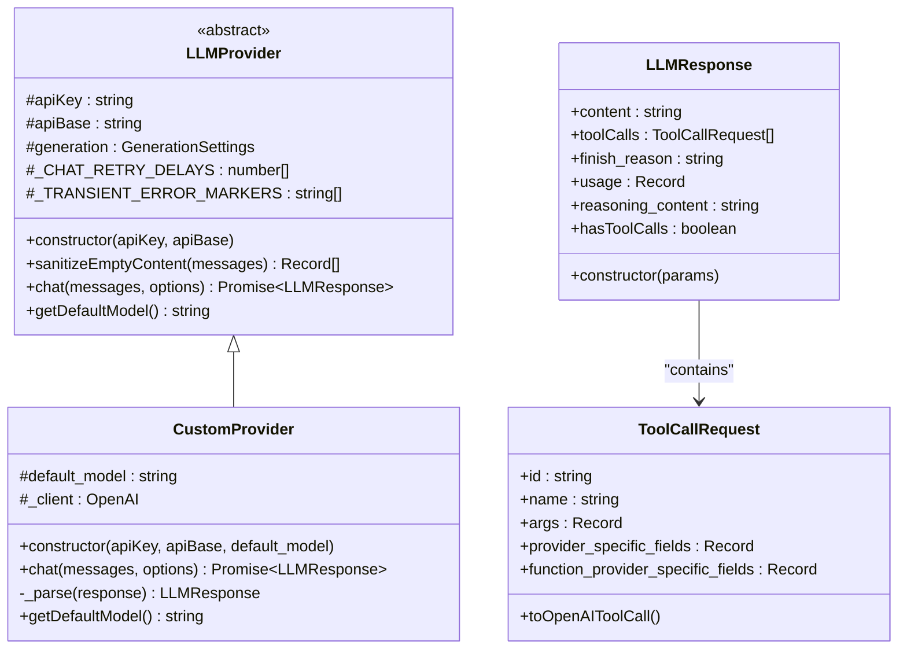
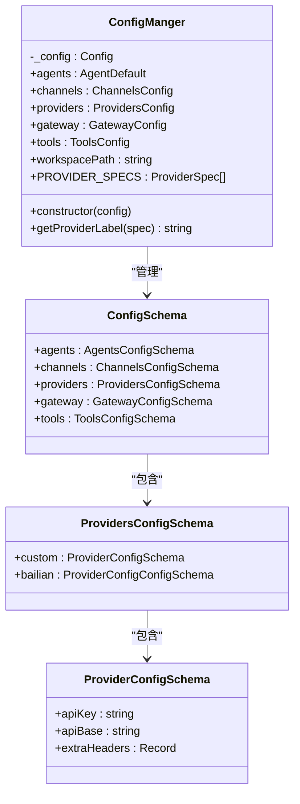
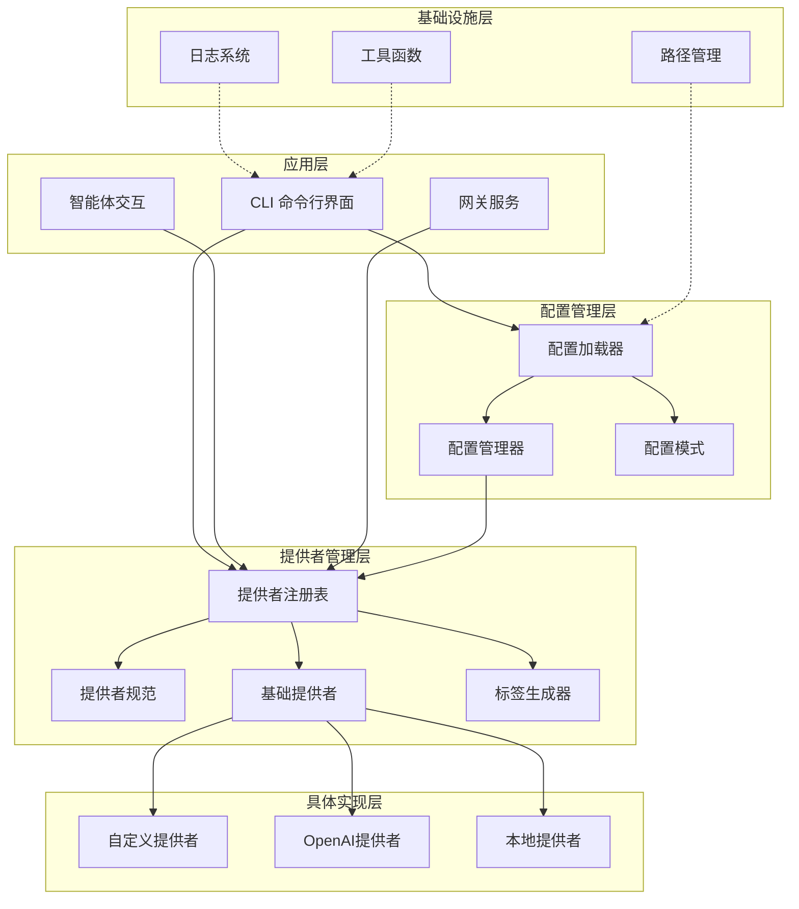
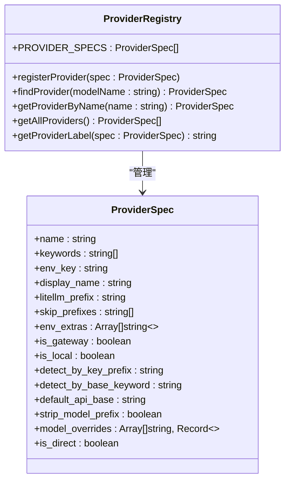
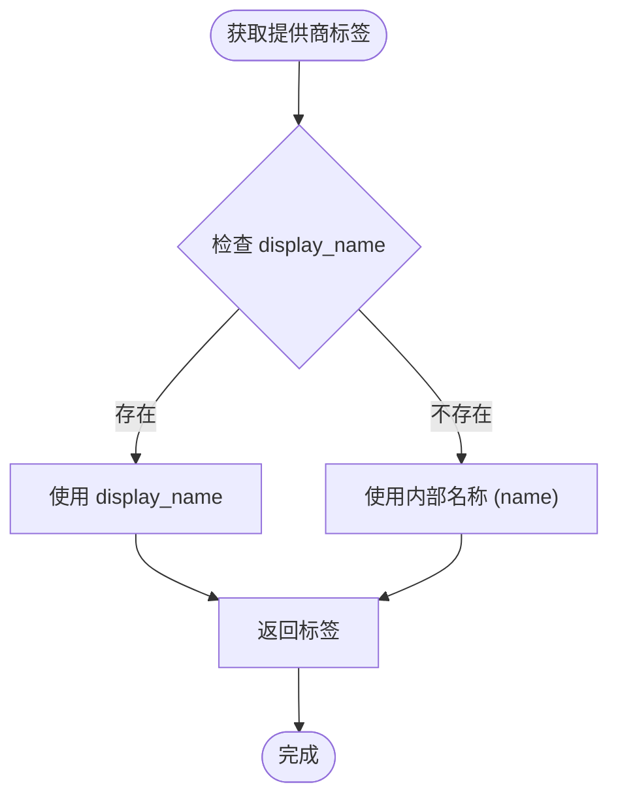
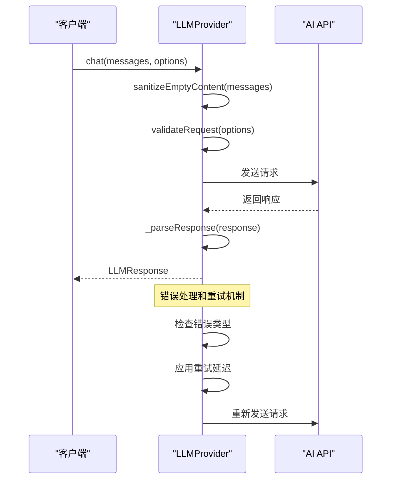
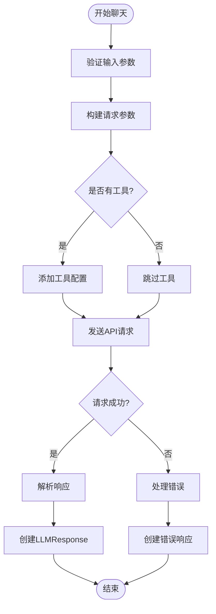
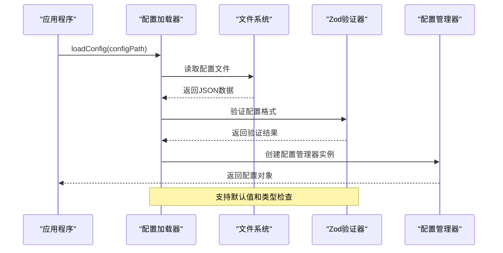
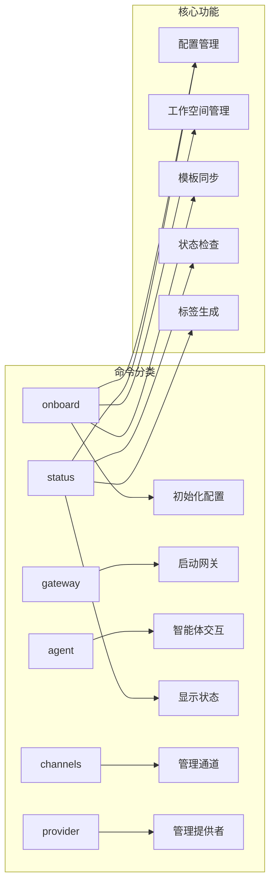

# 提供者注册系统

<cite>
**本文档引用的文件**
- [src/providers/index.ts](file://src/providers/index.ts)
- [src/providers/registry.ts](file://src/providers/registry.ts)
- [src/providers/base.ts](file://src/providers/base.ts)
- [src/providers/custom-provider.ts](file://src/providers/custom-provider.ts)
- [src/config/schema.ts](file://src/config/schema.ts)
- [src/config/loader.ts](file://src/config/loader.ts)
- [src/config/paths.ts](file://src/config/paths.ts)
- [src/cli.ts](file://src/cli.ts)
- [src/command/index.ts](file://src/command/index.ts)
- [src/command/help.ts](file://src/command/help.ts)
- [src/log/index.ts](file://src/log/index.ts)
- [src/utils/helpers.ts](file://src/utils/helpers.ts)
- [package.json](file://package.json)
</cite>

## 更新摘要
**变更内容**
- 新增 getProviderLabel 函数作为提供商规格的中央标签生成器
- 更新 CLI 状态显示功能，使用 getProviderLabel 生成人类可读的提供商标签
- 增强提供商元数据管理，支持 display_name 和内部名称的统一处理

## 目录
1. [简介](#简介)
2. [项目结构](#项目结构)
3. [核心组件](#核心组件)
4. [架构概览](#架构概览)
5. [详细组件分析](#详细组件分析)
6. [依赖关系分析](#依赖关系分析)
7. [性能考虑](#性能考虑)
8. [故障排除指南](#故障排除指南)
9. [结论](#结论)

## 简介

提供者注册系统是一个为AI助手应用设计的模块化架构，专注于LLM（大语言模型）提供者的统一管理和配置。该系统通过标准化的接口和配置机制，支持多种AI服务提供商的无缝集成，包括本地部署和云端服务。

系统的核心目标是提供一个灵活、可扩展的框架，允许用户轻松添加新的AI服务提供商，同时保持一致的API接口和配置管理。通过提供者注册机制，系统能够自动识别和路由到正确的AI服务，无论它们是本地部署还是通过网关访问。

**更新** 系统现已集成 getProviderLabel 函数，作为提供商规格的中央标签生成器，为 display_name 或内部名称提供统一的人类可读标签显示。

## 项目结构

项目采用模块化的文件组织方式，主要分为以下几个核心目录：



**图表来源**
- [src/providers/index.ts:1-4](file://src/providers/index.ts#L1-L4)
- [src/config/index.ts:1-3](file://src/config/index.ts#L1-L3)
- [src/command/index.ts:1-16](file://src/command/index.ts#L1-L16)

**章节来源**
- [src/providers/index.ts:1-4](file://src/providers/index.ts#L1-L4)
- [src/config/index.ts:1-3](file://src/config/index.ts#L1-L3)
- [src/command/index.ts:1-16](file://src/command/index.ts#L1-L16)

## 核心组件

### 提供者抽象层

系统的核心是LLMProvider抽象基类，它定义了所有AI服务提供者必须实现的标准接口：



**图表来源**
- [src/providers/base.ts:87-151](file://src/providers/base.ts#L87-L151)
- [src/providers/custom-provider.ts:6-92](file://src/providers/custom-provider.ts#L6-L92)

### 配置管理系统

系统使用Zod进行类型安全的配置验证和管理：



**图表来源**
- [src/config/schema.ts:124-135](file://src/config/schema.ts#L124-L135)
- [src/config/schema.ts:52-59](file://src/config/schema.ts#L52-L59)
- [src/config/schema.ts:44-48](file://src/config/schema.ts#L44-L48)

**章节来源**
- [src/providers/base.ts:87-151](file://src/providers/base.ts#L87-L151)
- [src/providers/custom-provider.ts:6-92](file://src/providers/custom-provider.ts#L6-L92)
- [src/config/schema.ts:124-168](file://src/config/schema.ts#L124-L168)

## 架构概览

系统采用分层架构设计，从底层的提供者抽象到上层的应用接口：



**图表来源**
- [src/cli.ts:17-143](file://src/cli.ts#L17-L143)
- [src/config/loader.ts:7-33](file://src/config/loader.ts#L7-L33)
- [src/providers/registry.ts:53-79](file://src/providers/registry.ts#L53-L79)

## 详细组件分析

### 提供者注册表

提供者注册表是系统的核心组件，负责维护所有可用AI服务提供者的信息：



**图表来源**
- [src/providers/registry.ts:10-51](file://src/providers/registry.ts#L10-L51)

**更新** 新增 getProviderLabel 函数，作为提供商规格的中央标签生成器，提供 display_name 或内部名称的人类可读标签。

提供者注册表的设计特点：

1. **标准化配置**：每个提供者都遵循统一的ProviderSpec接口
2. **关键字匹配**：通过关键词自动识别和路由到正确的提供者
3. **环境变量集成**：自动处理API密钥和配置参数
4. **前缀管理**：支持模型名称的自动前缀添加
5. **检测机制**：支持基于API密钥前缀和基础URL的自动检测
6. **标签生成**：通过 getProviderLabel 提供统一的人类可读标签显示

**章节来源**
- [src/providers/registry.ts:1-81](file://src/providers/registry.ts#L1-L81)

### 标签生成器系统

**新增** getProviderLabel 函数是系统中的中央标签生成器，专门负责为提供商规格生成人类可读的标签：



**图表来源**
- [src/providers/registry.ts:53](file://src/providers/registry.ts#L53)

getProviderLabel 函数的工作原理：
- 优先使用 display_name 字段作为人类可读标签
- 如果 display_name 不存在，则回退到内部名称 (name) 字段
- 这种设计确保了所有提供商都有清晰、一致的显示名称

**章节来源**
- [src/providers/registry.ts:53](file://src/providers/registry.ts#L53)

### 基础提供者类

LLMProvider抽象基类定义了所有提供者必须实现的标准接口：



**图表来源**
- [src/providers/base.ts:141-144](file://src/providers/base.ts#L141-L144)
- [src/providers/custom-provider.ts:25-62](file://src/providers/custom-provider.ts#L25-L62)

**章节来源**
- [src/providers/base.ts:87-151](file://src/providers/base.ts#L87-L151)

### 自定义提供者实现

CustomProvider展示了如何实现具体的AI服务提供者：



**图表来源**
- [src/providers/custom-provider.ts:25-86](file://src/providers/custom-provider.ts#L25-L86)

**章节来源**
- [src/providers/custom-provider.ts:1-92](file://src/providers/custom-provider.ts#L1-L92)

### 配置管理系统

配置系统提供了类型安全的配置管理和验证：



**图表来源**
- [src/config/loader.ts:7-23](file://src/config/loader.ts#L7-L23)
- [src/config/schema.ts:124-135](file://src/config/schema.ts#L124-L135)

**章节来源**
- [src/config/loader.ts:1-33](file://src/config/loader.ts#L1-L33)
- [src/config/schema.ts:1-168](file://src/config/schema.ts#L1-L168)

### 命令行界面

CLI系统提供了用户交互的入口点：



**更新** CLI 状态命令现已集成 getProviderLabel 函数，用于生成人类可读的提供商状态标签。

**图表来源**
- [src/cli.ts:24-143](file://src/cli.ts#L24-L143)

**章节来源**
- [src/cli.ts:1-143](file://src/cli.ts#L1-L143)

## 依赖关系分析

系统使用TypeScript和现代JavaScript生态系统构建：

```mermaid
graph TB
subgraph "运行时依赖"
A[openai ^6.33.0] --> B[OpenAI SDK]
C[zod ^4.3.6] --> D[类型验证]
E[uuid ^13.0.0] --> F[唯一标识符]
G[chalk ^5.6.2] --> H[彩色输出]
I[@clack/prompts ^1.1.0] --> J[交互式提示]
K[commander ^14.0.3] --> L[命令行解析]
end
subgraph "开发依赖"
M[typescript ^5.9.3] --> N[编译器]
O[cpy-cli ^7.0.0] --> P[文件复制]
Q[@types/node ^25.5.0] --> R[类型定义]
end
subgraph "构建脚本"
S[dev: tsc --watch]
T[build: tsc && cpy]
U[start: node dist/index.js]
V[test: node dist/cli.js]
end
```

**图表来源**
- [package.json:23-39](file://package.json#L23-L39)

**章节来源**
- [package.json:1-39](file://package.json#L1-L39)

## 性能考虑

系统在设计时考虑了多个性能优化方面：

1. **连接复用**：OpenAI客户端实例在提供者中复用，减少连接开销
2. **请求重试**：内置指数退避重试机制，提高请求成功率
3. **内存管理**：使用流式处理和及时释放资源
4. **缓存策略**：通过会话亲和性头优化连接分配
5. **异步处理**：所有网络请求都是异步执行，避免阻塞
6. **标签缓存**：getProviderLabel 函数简单高效，无需额外缓存机制

## 故障排除指南

### 常见问题及解决方案

1. **配置加载失败**
   - 检查配置文件格式是否正确
   - 验证JSON语法和字段完整性
   - 确认文件权限设置

2. **提供者连接问题**
   - 验证API密钥是否正确
   - 检查网络连接和防火墙设置
   - 确认API端点可达性

3. **模型匹配失败**
   - 检查模型名称关键字配置
   - 验证提供者优先级设置
   - 确认模型前缀配置正确

4. **标签显示问题**
   - **新增** 检查 ProviderSpec 中的 display_name 字段是否正确设置
   - 确认 getProviderLabel 函数正常工作
   - 验证 CLI 状态命令中的标签生成逻辑

5. **日志和调试**
   - 使用详细日志级别进行调试
   - 检查错误堆栈信息
   - 验证环境变量设置

**章节来源**
- [src/log/index.ts:1-49](file://src/log/index.ts#L1-L49)
- [src/providers/base.ts:88-102](file://src/providers/base.ts#L88-L102)

## 结论

提供者注册系统展现了现代AI应用架构的最佳实践，通过模块化设计、类型安全和标准化接口，实现了高度的可扩展性和易用性。系统的核心优势包括：

1. **统一抽象**：通过LLMProvider基类提供一致的API接口
2. **灵活配置**：支持多种配置源和动态更新
3. **类型安全**：使用Zod确保配置的完整性和正确性
4. **易于扩展**：提供者注册机制支持新服务的快速集成
5. **生产就绪**：包含完整的错误处理和监控机制
6. **用户体验优化**：通过 getProviderLabel 函数提供一致的人类可读标签显示

**更新** 最新的 getProviderLabel 函数增强了系统的用户体验，通过统一的标签生成机制，确保所有提供商都有清晰、一致的显示名称，提升了状态显示和用户界面的一致性。

该系统为AI助手应用提供了一个坚实的基础，可以轻松适配各种AI服务提供商，同时保持代码的清晰性和可维护性。