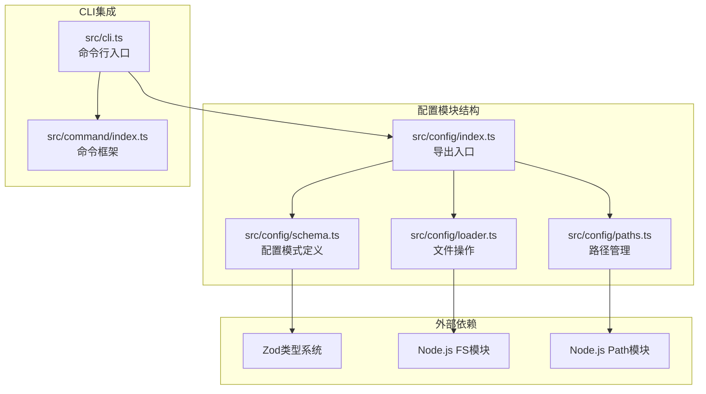
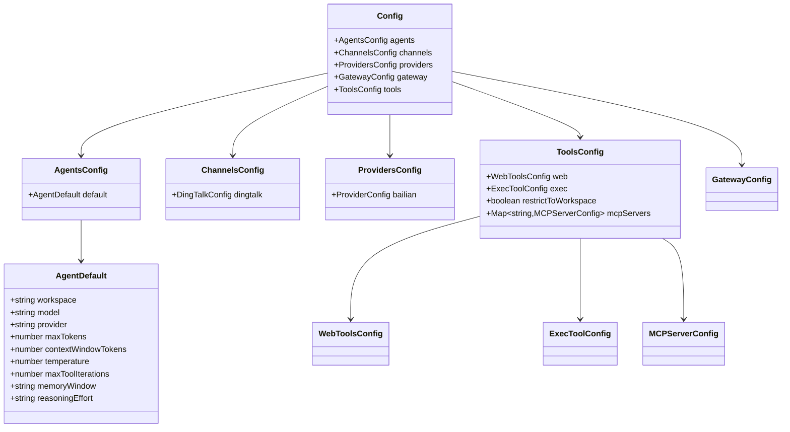
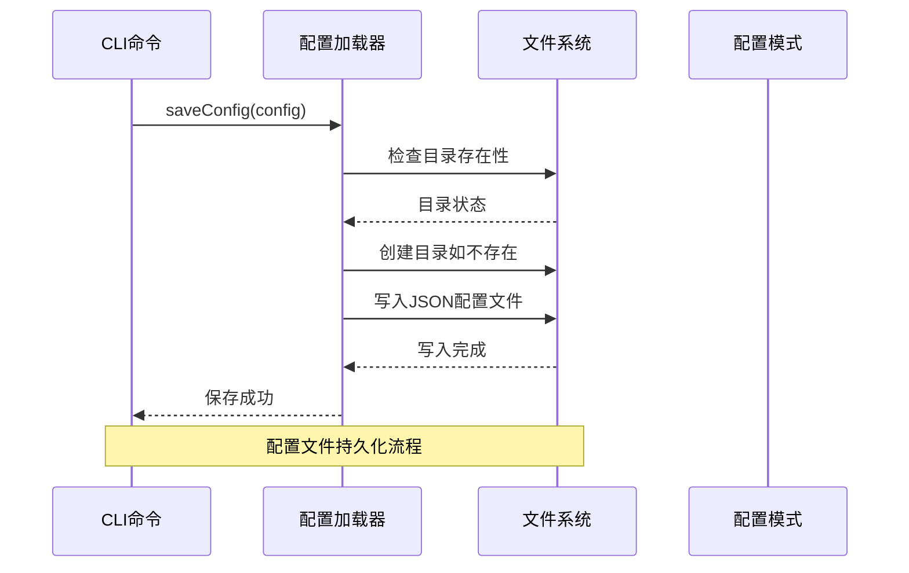
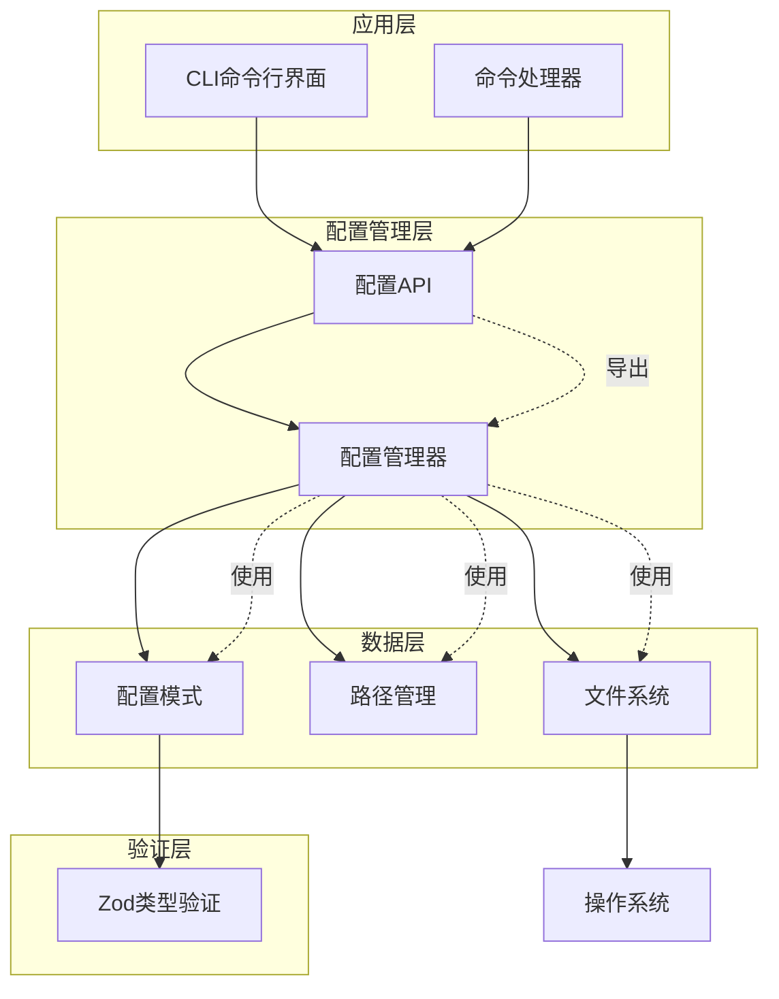
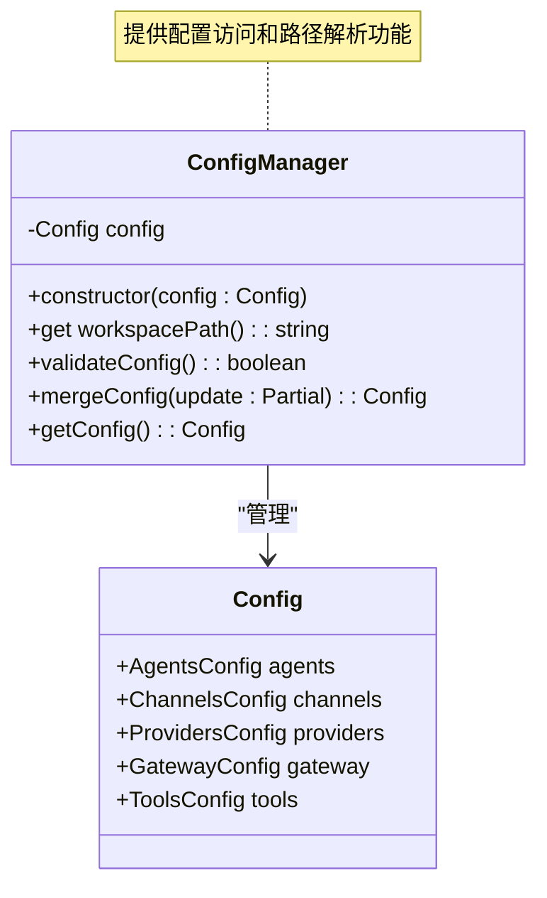
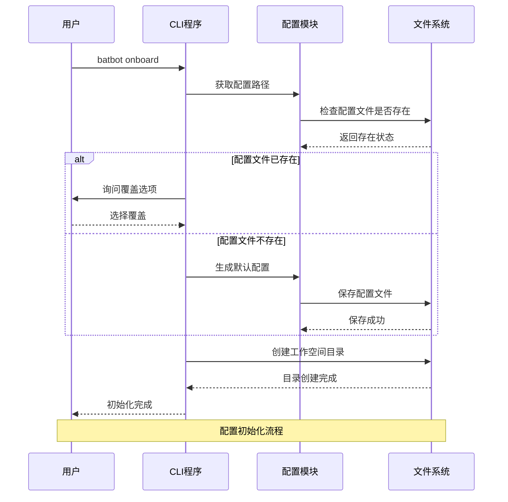
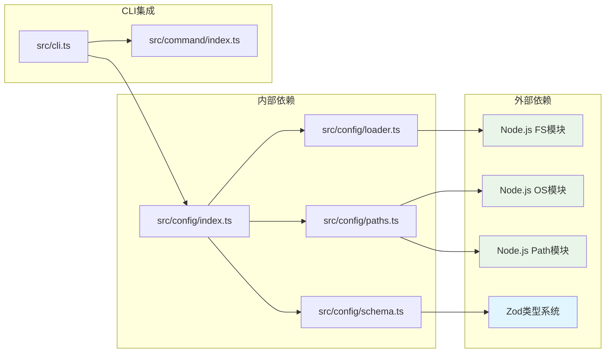
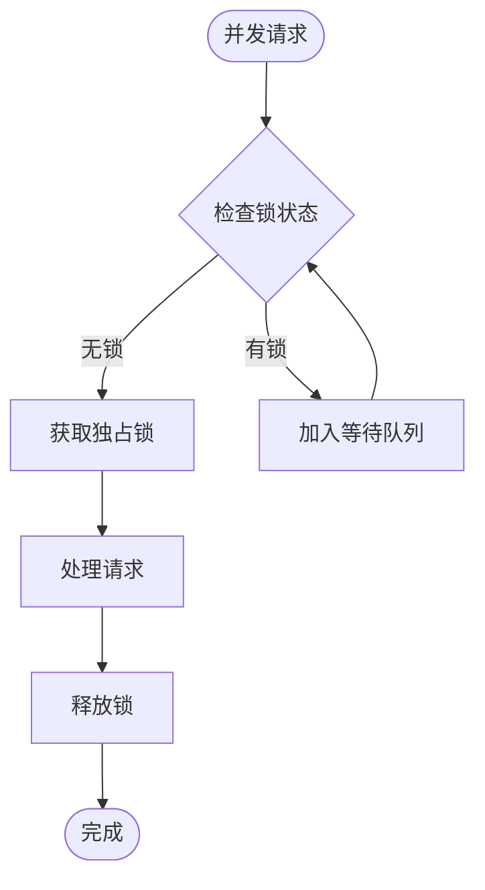

# 配置入口

<cite>
**本文档引用的文件**
- [src/config/index.ts](file://src/config/index.ts)
- [src/config/loader.ts](file://src/config/loader.ts)
- [src/config/paths.ts](file://src/config/paths.ts)
- [src/config/schema.ts](file://src/config/schema.ts)
- [src/cli.ts](file://src/cli.ts)
- [src/command/index.ts](file://src/command/index.ts)
- [package.json](file://package.json)
</cite>

## 目录
1. [简介](#简介)
2. [项目结构](#项目结构)
3. [核心组件](#核心组件)
4. [架构概览](#架构概览)
5. [详细组件分析](#详细组件分析)
6. [依赖关系分析](#依赖关系分析)
7. [性能考虑](#性能考虑)
8. [故障排除指南](#故障排除指南)
9. [结论](#结论)

## 简介

BatBot配置入口模块是整个AI助手系统的核心基础设施，负责管理用户配置、工作空间路径以及配置文件的持久化。该模块采用TypeScript实现，结合Zod类型系统确保配置数据的完整性和一致性，为后续的代理、通道、工具等模块提供统一的配置基础。

配置系统目前支持以下主要配置类别：
- 代理配置（Agents）：工作空间、模型参数、推理设置
- 通道配置（Channels）：DingTalk等通信渠道设置
- 提供商配置（Providers）：API密钥、端点配置
- 网关配置（Gateway）：网络服务参数
- 工具配置（Tools）：Web搜索、执行工具、MCP服务器

## 项目结构

配置模块采用清晰的分层架构，每个文件都有明确的职责分工：

**图表来源**
- [src/config/index.ts:1-3](file://src/config/index.ts#L1-L3)
- [src/config/schema.ts:1-146](file://src/config/schema.ts#L1-L146)
- [src/config/paths.ts:1-11](file://src/config/paths.ts#L1-L11)
- [src/config/loader.ts:1-16](file://src/config/loader.ts#L1-L16)

**章节来源**
- [src/config/index.ts:1-3](file://src/config/index.ts#L1-L3)
- [src/config/schema.ts:1-146](file://src/config/schema.ts#L1-L146)
- [src/config/paths.ts:1-11](file://src/config/paths.ts#L1-L11)
- [src/config/loader.ts:1-16](file://src/config/loader.ts#L1-L16)

## 核心组件

### 配置模式定义（Schema）

配置系统的核心是基于Zod的强类型定义，提供了完整的配置结构描述和默认值设置：

**图表来源**
- [src/config/schema.ts:118-128](file://src/config/schema.ts#L118-L128)
- [src/config/schema.ts:35-39](file://src/config/schema.ts#L35-L39)
- [src/config/schema.ts:14-18](file://src/config/schema.ts#L14-L18)
- [src/config/schema.ts:49-53](file://src/config/schema.ts#L49-L53)
- [src/config/schema.ts:108-116](file://src/config/schema.ts#L108-L116)

### 路径管理器

提供标准化的配置文件和工作空间路径管理：

| 组件 | 功能 | 默认路径 |
|------|------|----------|
| getConfigPath | 获取配置文件路径 | ~/.batbot/config.json |
| getWorkspacePath | 获取工作空间路径 | ~/.batbot/workspace |

### 配置加载器

提供配置文件的读取和写入能力：

**图表来源**
- [src/config/loader.ts:6-15](file://src/config/loader.ts#L6-L15)

**章节来源**
- [src/config/schema.ts:118-145](file://src/config/schema.ts#L118-L145)
- [src/config/paths.ts:4-10](file://src/config/paths.ts#L4-L10)
- [src/config/loader.ts:6-15](file://src/config/loader.ts#L6-L15)

## 架构概览

配置系统采用模块化设计，通过清晰的接口分离关注点：

**图表来源**
- [src/cli.ts:7-12](file://src/cli.ts#L7-L12)
- [src/config/index.ts:1-3](file://src/config/index.ts#L1-L3)
- [src/config/schema.ts:130-145](file://src/config/schema.ts#L130-L145)

## 详细组件分析

### 配置模式系统

配置模式系统基于Zod实现，提供了强大的类型安全和验证能力：

#### 核心配置模式

| 模式名称 | 结构 | 默认值策略 | 用途 |
|----------|------|------------|------|
| ConfigSchema | 主配置对象 | prefault({}) | 整体配置容器 |
| AgentDefaultSchema | 代理默认设置 | prefault({}) | 代理参数默认值 |
| ProvidersConfigSchema | 提供商配置 | prefault({}) | API提供商设置 |
| ToolsConfigSchema | 工具配置 | prefault({}) | 工具功能设置 |

#### 验证特性

- **类型安全**：编译时类型检查
- **运行时验证**：自动数据验证和转换
- **默认值管理**：智能默认值填充
- **嵌套对象处理**：复杂对象结构支持

### 配置管理器

配置管理器提供配置实例的统一访问接口：

**图表来源**
- [src/config/schema.ts:130-145](file://src/config/schema.ts#L130-L145)

### CLI集成

配置系统与命令行界面深度集成，提供完整的配置初始化流程：

**图表来源**
- [src/cli.ts:25-53](file://src/cli.ts#L25-L53)

**章节来源**
- [src/config/schema.ts:130-145](file://src/config/schema.ts#L130-L145)
- [src/cli.ts:25-53](file://src/cli.ts#L25-L53)

## 依赖关系分析

配置系统依赖关系简洁明了，主要依赖于标准库和第三方类型验证库：

**图表来源**
- [src/config/index.ts:1-3](file://src/config/index.ts#L1-L3)
- [src/config/schema.ts:1-3](file://src/config/schema.ts#L1-L3)
- [src/config/paths.ts:1-2](file://src/config/paths.ts#L1-L2)
- [src/config/loader.ts:1-4](file://src/config/loader.ts#L1-L4)

**章节来源**
- [package.json:22-28](file://package.json#L22-L28)
- [src/config/index.ts:1-3](file://src/config/index.ts#L1-L3)

## 性能考虑

### 内存使用优化

1. **延迟初始化**：配置对象在首次访问时才进行完整解析
2. **只读模式**：配置对象保持不可变性，减少内存复制
3. **默认值预分配**：使用prefault()避免重复的对象创建

### 并发访问控制

### 序列化性能

- **增量更新**：仅保存变更的配置部分
- **批量操作**：支持多个配置项的原子更新
- **缓存机制**：最近访问的配置项保持在内存中

## 故障排除指南

### 常见问题及解决方案

| 问题类型 | 症状 | 解决方案 |
|----------|------|----------|
| 配置文件损坏 | 解析错误 | 使用默认配置覆盖 |
| 权限不足 | 文件写入失败 | 检查用户权限 |
| 路径不存在 | 目录创建失败 | 手动创建目录 |
| 类型验证失败 | 运行时错误 | 检查配置格式 |

### 调试技巧

1. **启用详细日志**：在开发环境中增加调试输出
2. **配置备份**：定期备份配置文件
3. **版本兼容性**：检查配置格式的向后兼容性

**章节来源**
- [src/cli.ts:31-46](file://src/cli.ts#L31-L46)
- [src/config/loader.ts:10-15](file://src/config/loader.ts#L10-L15)

## 结论

BatBot配置入口模块展现了现代TypeScript应用的最佳实践，通过以下关键特性实现了可靠的配置管理：

1. **类型安全**：基于Zod的强类型系统确保配置完整性
2. **模块化设计**：清晰的职责分离便于维护和扩展
3. **用户友好**：简化的CLI接口降低使用门槛
4. **可扩展性**：灵活的配置结构支持未来功能扩展

该模块为BatBot生态系统奠定了坚实的基础，支持从简单的个人使用到复杂的多用户部署场景。随着功能的不断丰富，配置系统将继续演进以满足更高级的需求。