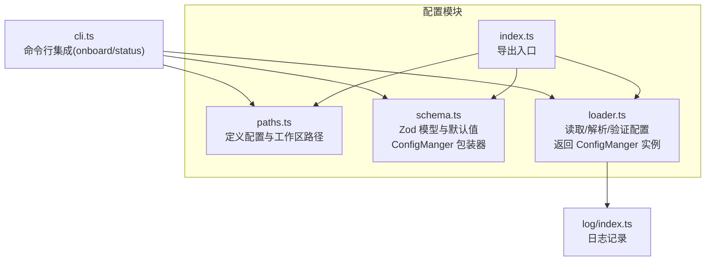
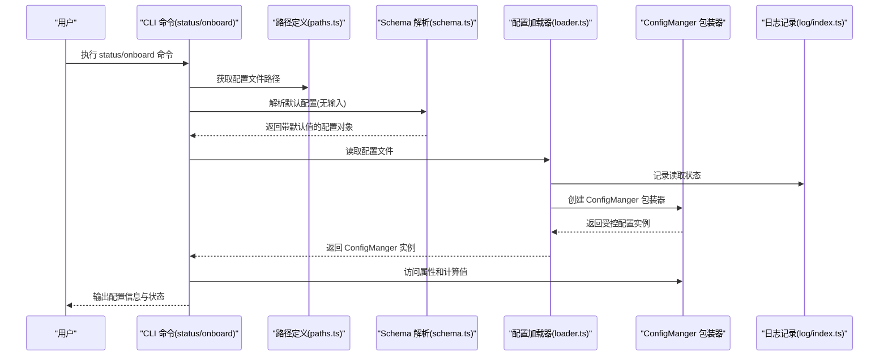
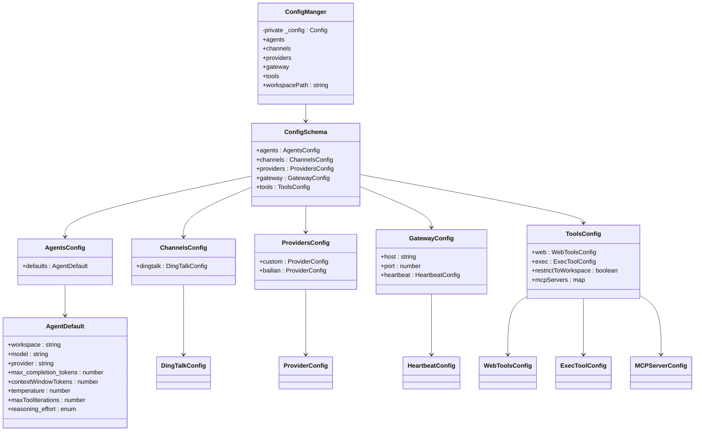
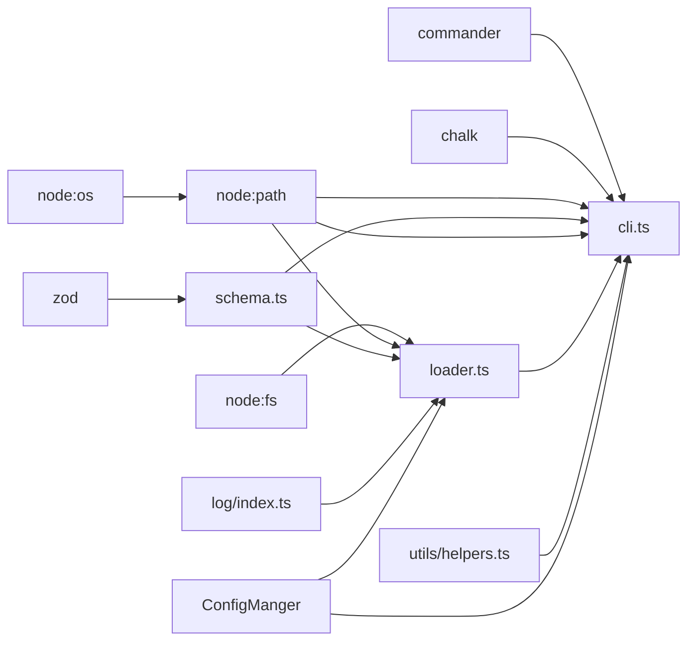

# 配置加载器

<cite>
**本文引用的文件**
- [src/config/index.ts](file://src/config/index.ts)
- [src/config/paths.ts](file://src/config/paths.ts)
- [src/config/schema.ts](file://src/config/schema.ts)
- [src/config/loader.ts](file://src/config/loader.ts)
- [src/cli.ts](file://src/cli.ts)
- [src/log/index.ts](file://src/log/index.ts)
- [src/utils/helpers.ts](file://src/utils/helpers.ts)
- [package.json](file://package.json)
- [tsconfig.json](file://tsconfig.json)
</cite>

## 更新摘要
**变更内容**
- 更新了配置加载器的核心行为：`loadConfig` 现在返回 `ConfigManger` 包装器实例
- 新增了 `ConfigManger` 类，提供受控的配置属性访问和计算值（如 `workspacePath`）
- 更新了 CLI 集成，展示了如何使用 `ConfigManger` 的属性访问和计算值
- 增强了配置访问的安全性和便利性

## 目录
1. [简介](#简介)
2. [项目结构](#项目结构)
3. [核心组件](#核心组件)
4. [架构总览](#架构总览)
5. [详细组件分析](#详细组件分析)
6. [依赖关系分析](#依赖关系分析)
7. [性能考虑](#性能考虑)
8. [故障排查指南](#故障排查指南)
9. [结论](#结论)
10. [附录](#附录)

## 简介
本文件系统化阐述 BatBot 的配置加载器设计与实现，覆盖以下主题：
- 配置文件的读取、解析与验证流程（含 Zod 验证器与错误处理）
- 配置文件的默认搜索路径与优先级规则（当前实现仅支持用户主目录下的固定路径）
- 合并逻辑与热重载机制现状与建议
- 配置文件格式规范（字段类型、默认值、可选字段、枚举等）
- 配置迁移工具与版本兼容性处理建议
- 常见问题诊断与解决方案

**更新** 本版本新增了完整的配置文件读取功能，增强了错误处理机制，当配置文件无法加载或解析时能够优雅降级到默认配置，确保系统的稳定性和可靠性。配置加载器现在提供受控的配置访问接口，通过 `ConfigManger` 包装器增强安全性。

## 项目结构
配置相关模块位于 src/config 目录，主要由以下文件组成：
- 路径定义：用于确定配置文件与工作区的默认位置
- Schema 定义：使用 Zod 定义完整的配置模型与默认值，包含 `ConfigManger` 类
- 加载器：提供配置读取、解析、验证与保存能力，返回 `ConfigManger` 实例
- CLI 集成：通过命令初始化配置与工作区，使用 `ConfigManger` 进行属性访问



**图表来源**
- [src/config/paths.ts:1-11](file://src/config/paths.ts#L1-L11)
- [src/config/schema.ts:136-167](file://src/config/schema.ts#L136-L167)
- [src/config/loader.ts:1-33](file://src/config/loader.ts#L1-L33)
- [src/config/index.ts:1-3](file://src/config/index.ts#L1-L3)
- [src/cli.ts:1-135](file://src/cli.ts#L1-L135)
- [src/log/index.ts:1-49](file://src/log/index.ts#L1-L49)

**章节来源**
- [src/config/index.ts:1-3](file://src/config/index.ts#L1-L3)
- [src/config/paths.ts:1-11](file://src/config/paths.ts#L1-L11)
- [src/config/schema.ts:1-168](file://src/config/schema.ts#L1-L168)
- [src/config/loader.ts:1-33](file://src/config/loader.ts#L1-L33)
- [src/cli.ts:1-135](file://src/cli.ts#L1-L135)
- [src/log/index.ts:1-49](file://src/log/index.ts#L1-L49)

## 核心组件
- 路径定义（paths.ts）
  - 提供配置文件路径与工作区路径的计算函数
  - 默认路径位于用户主目录下的隐藏目录中
- Schema 定义（schema.ts）
  - 使用 Zod 定义完整配置模型，包含默认值与类型约束
  - 支持嵌套对象与数组，默认值通过 prefault 注入
  - **新增**：`ConfigManger` 类提供受控的配置属性访问和计算值
- 加载器（loader.ts）
  - 实现完整的配置读取、解析、验证与保存功能
  - **更新**：现在返回 `ConfigManger` 实例而非原始配置对象
  - 包含优雅的错误处理机制，支持配置文件无法加载时的降级
- CLI 集成（cli.ts）
  - onboard 命令会调用 Schema 解析生成默认配置并保存到磁盘
  - 若目标路径已存在，则提示覆盖或刷新（保持既有值并追加新字段）
  - **更新**：status 命令现在使用 `ConfigManger` 的属性访问和计算值

**更新** 加载器现在提供了完整的配置管理能力，包括读取、解析、验证和保存功能，并且具备强大的错误处理和降级机制。ConfigManger 包装器提供了更安全的配置访问方式。

**章节来源**
- [src/config/paths.ts:1-11](file://src/config/paths.ts#L1-L11)
- [src/config/schema.ts:136-167](file://src/config/schema.ts#L136-L167)
- [src/config/loader.ts:1-33](file://src/config/loader.ts#L1-L33)
- [src/cli.ts:25-75](file://src/cli.ts#L25-L75)

## 架构总览
下图展示配置加载器在 CLI 初始化流程中的交互，包括新的 `ConfigManger` 包装器：



**图表来源**
- [src/cli.ts:25-75](file://src/cli.ts#L25-L75)
- [src/config/paths.ts:4-6](file://src/config/paths.ts#L4-L6)
- [src/config/schema.ts:136-167](file://src/config/schema.ts#L136-L167)
- [src/config/loader.ts:7-23](file://src/config/loader.ts#L7-L23)
- [src/log/index.ts:1-49](file://src/log/index.ts#L1-L49)

## 详细组件分析

### 组件一：路径定义（paths.ts）
- 功能
  - 计算配置文件路径与工作区路径
  - 默认路径位于用户主目录下的隐藏目录
- 关键点
  - 配置文件路径固定为用户主目录下的特定子路径
  - 工作区路径同样位于同一父目录下
- 优先级与搜索路径
  - 当前实现为"单路径优先"，不存在多路径搜索或环境变量覆盖
  - 如需扩展，可在路径函数中加入环境变量读取与多候选路径判断

**章节来源**
- [src/config/paths.ts:4-10](file://src/config/paths.ts#L4-L10)

### 组件二：Schema 定义（schema.ts）
- 功能
  - 定义完整的配置模型，包含各子模块的结构与默认值
  - 使用 Zod 进行类型校验与默认值注入
  - **新增**：`ConfigManger` 类提供受控的配置访问接口
- 数据模型概览
  - 顶层字段：agents、channels、providers、gateway、tools
  - 子模块字段覆盖：如 agents.defaults、channels.dingtalk、providers.bailian、gateway.heartbeat、tools.web/exec/mcpServers 等
- 默认值与约束
  - 大量字段带有默认值（字符串、布尔、数值、数组、枚举）
  - 数值字段常包含正整数、范围限制等约束
  - 部分子模块使用 prefault 注入默认空对象，确保深层字段可用
- 可观测性
  - **新增**：`ConfigManger` 类提供工作区路径计算逻辑（支持 ~ 展开与绝对路径解析）
  - **新增**：提供受控的属性访问，防止直接修改内部配置对象



**图表来源**
- [src/config/schema.ts:124-134](file://src/config/schema.ts#L124-L134)
- [src/config/schema.ts:136-167](file://src/config/schema.ts#L136-L167)
- [src/config/schema.ts:20-40](file://src/config/schema.ts#L20-L40)
- [src/config/schema.ts:14-18](file://src/config/schema.ts#L14-L18)
- [src/config/schema.ts:44-57](file://src/config/schema.ts#L44-L57)
- [src/config/schema.ts:73-77](file://src/config/schema.ts#L73-L77)
- [src/config/schema.ts:114-120](file://src/config/schema.ts#L114-L120)

**章节来源**
- [src/config/schema.ts:1-168](file://src/config/schema.ts#L1-L168)

### 组件三：加载器（loader.ts）
- 功能
  - 将配置对象序列化为 JSON 并写入磁盘
  - 自动创建目标目录（递归）
  - **新增**：从磁盘读取 JSON 配置文件并使用 Zod 验证
  - **新增**：包含优雅的错误处理机制，支持配置文件无法加载时的降级
  - **更新**：现在返回 `ConfigManger` 实例而非原始配置对象
- 错误处理机制
  - 当配置文件读取失败时，记录警告日志并使用默认配置
  - 使用 try-catch 包装 JSON 解析和 Zod 验证过程
  - 降级到空对象解析，确保系统始终有可用的配置
- 日志记录
  - 使用 logger.warn 记录配置加载失败的详细信息
  - 使用 logger.info 记录降级到默认配置的操作
- 当前限制
  - 未包含热重载、缓存、增量合并等机制
- 建议扩展
  - 引入文件监控（如 fs.watch）实现热重载
  - 引入内存缓存与 ETag/时间戳校验减少重复解析
  - 实现"部分字段覆盖 + 默认值合并"的策略

**更新** 加载器现在具备完整的配置管理能力，包括读取、解析、验证和保存功能，并且具有强大的错误处理和降级机制。现在返回 `ConfigManger` 包装器实例，提供更安全的配置访问方式。

**章节来源**
- [src/config/loader.ts:1-33](file://src/config/loader.ts#L1-L33)

### 组件四：CLI 集成（cli.ts）
- onboard 命令
  - 调用 Schema.parse(undefined) 生成默认配置
  - 若配置文件已存在，提示用户选择覆盖或刷新（保留既有值并追加新字段）
  - 创建工作区目录并同步模板文件
  - **新增**：使用 loadConfig 函数读取现有配置，支持配置刷新功能
- status 命令
  - **更新**：现在使用 `ConfigManger` 实例进行配置访问
  - 访问 `config.workspacePath` 获取计算的工作区路径
  - 访问 `config.agents.defaults.model` 获取模型配置
  - 提供更简洁的配置信息展示
- 其他命令
  - 保留 gateway、agent、channels、provider 等命令占位，便于后续扩展

**更新** CLI 现在集成了新的配置加载器，支持配置刷新功能，用户可以选择保留现有配置并添加新字段。status 命令现在使用 `ConfigManger` 的属性访问和计算值，提供更直观的配置信息展示。

**章节来源**
- [src/cli.ts:25-75](file://src/cli.ts#L25-L75)
- [src/cli.ts:96-118](file://src/cli.ts#L96-L118)
- [src/utils/helpers.ts:11-46](file://src/utils/helpers.ts#L11-L46)

## 依赖关系分析
- 外部依赖
  - zod：用于配置模型定义与运行时验证
  - commander：用于 CLI 命令解析
  - chalk：用于日志输出美化
- 内部依赖
  - paths.ts 被 loader.ts 与 CLI 共同使用
  - schema.ts 被 CLI 与 loader（读取）共同使用，包含 ConfigManger 类
  - utils/helpers.ts 与 CLI 协作完成工作区模板同步
  - log/index.ts 为加载器提供日志记录功能



**图表来源**
- [package.json:22-28](file://package.json#L22-L28)
- [src/config/schema.ts:1-3](file://src/config/schema.ts#L1-L3)
- [src/config/loader.ts:1-5](file://src/config/loader.ts#L1-L5)
- [src/config/paths.ts:1-2](file://src/config/paths.ts#L1-L2)
- [src/cli.ts:1-15](file://src/cli.ts#L1-L15)
- [src/log/index.ts:1-49](file://src/log/index.ts#L1-L49)
- [src/utils/helpers.ts:1-9](file://src/utils/helpers.ts#L1-L9)

**章节来源**
- [package.json:22-28](file://package.json#L22-L28)
- [src/config/schema.ts:1-3](file://src/config/schema.ts#L1-L3)
- [src/config/loader.ts:1-5](file://src/config/loader.ts#L1-L5)
- [src/config/paths.ts:1-2](file://src/config/paths.ts#L1-L2)
- [src/cli.ts:1-15](file://src/cli.ts#L1-L15)
- [src/log/index.ts:1-49](file://src/log/index.ts#L1-L49)
- [src/utils/helpers.ts:1-9](file://src/utils/helpers.ts#L1-L9)

## 性能考虑
- 解析成本
  - Zod 解析默认值与校验在首次初始化时执行，通常开销较小
  - 若引入热重载，应避免频繁全量解析，建议采用缓存与增量更新
  - **新增**：ConfigManger 包装器的创建成本极低，主要是简单的对象包装
- I/O 成本
  - 写入配置为一次性操作，成本低
  - 读取配置若频繁触发，建议引入内存缓存与文件监控
- 并发与一致性
  - 多进程同时写入同一配置文件可能导致竞态
  - 建议引入锁文件或原子写入策略
- **新增**：错误处理成本
  - 配置文件读取失败时的日志记录开销很小
  - 降级到默认配置的解析成本与正常初始化相当
  - ConfigManger 包装器的创建不会增加额外的性能负担

**更新** 新增了 ConfigManger 包装器的性能考虑，强调其轻量级特性和零性能开销。

## 故障排查指南
- 配置文件无法创建或写入
  - 检查用户主目录权限与磁盘空间
  - 确认路径函数返回的目录是否存在，必要时手动创建
- 配置解析失败
  - 确认 JSON 文件是否符合 Schema 规范（类型、范围、枚举）
  - 使用 Schema 的 parse 或 safeParse 方法捕获错误并打印字段路径
  - **新增**：检查日志输出，查看具体的解析错误信息
- 工作区路径异常
  - 检查配置中 workspace 字段是否以波浪号开头（需要展开为主目录）
  - 确认路径解析逻辑是否正确处理相对路径与绝对路径
  - **新增**：使用 `ConfigManger.workspacePath` 属性获取标准化的工作区路径
- CLI 行为不符合预期
  - onboard 命令在配置已存在时会提示覆盖或刷新，请确认交互选择
  - 模板同步失败时检查模板目录是否存在以及权限
  - **新增**：status 命令现在使用 ConfigManger 进行配置访问，如果出现属性访问错误，检查 ConfigManger 是否正确初始化
- **新增**：配置加载降级问题
  - 检查配置文件是否存在且可读
  - 确认配置文件格式是否为有效的 JSON
  - 查看日志中关于配置加载失败的警告信息
  - 验证配置文件权限设置
  - **新增**：确认 ConfigManger 包装器正确创建，检查 loadConfig 返回类型

**更新** 新增了 ConfigManger 相关的故障排查指南，包括工作区路径获取和属性访问问题的诊断方法。

**章节来源**
- [src/config/loader.ts:13-20](file://src/config/loader.ts#L13-L20)
- [src/config/schema.ts:159-166](file://src/config/schema.ts#L159-L166)
- [src/cli.ts:25-75](file://src/cli.ts#L25-L75)
- [src/log/index.ts:16-24](file://src/log/index.ts#L16-L24)
- [src/utils/helpers.ts:11-46](file://src/utils/helpers.ts#L11-L46)

## 结论
- 现状总结
  - 配置加载器具备完善的 Schema 定义与默认值注入能力
  - CLI 提供了便捷的初始化流程，现已支持配置读取与降级功能
  - **新增**：完整的配置文件读取、解析、验证与保存能力
  - **新增**：强大的错误处理机制，确保系统稳定性
  - **新增**：ConfigManger 包装器提供受控的配置访问接口，增强安全性
- 建议演进方向
  - 引入热重载与缓存：通过文件监控与内存缓存提升响应速度
  - 增强合并策略：支持"保留既有值 + 追加新字段"的安全合并
  - 完善迁移工具：提供版本比较与自动迁移脚本，保障向后兼容
  - **新增**：监控与告警：添加配置文件变更监控和异常告警功能
  - **新增**：ConfigManger 扩展：可以考虑添加更多的计算属性和验证方法

**更新** 结论部分反映了配置加载器的重大改进，现在具备了完整的配置管理能力和强大的错误处理机制，同时引入了安全的配置访问包装器。

## 附录

### 配置文件格式规范（基于 Schema）
- 顶层字段
  - agents：包含 defaults 子模块
  - channels：包含 dingtalk 子模块
  - providers：包含 custom、bailian 等子模块
  - gateway：包含 host、port、heartbeat 子模块
  - tools：包含 web、exec、restrictToWorkspace、mcpServers 子模块
- agents.defaults
  - workspace：字符串，默认值为用户主目录下的工作区路径
  - model：字符串，默认值为指定模型标识
  - provider：字符串，默认值为自动选择
  - max_completion_tokens：正整数，默认值为较大上限
  - contextWindowTokens：正整数，默认值为较大上限
  - temperature：0~2 的数值，默认值很小
  - maxToolIterations：正整数，默认值为较大上限
  - reasoning_effort：枚举（none/minimal/low/medium/high/xhigh 或 null），默认为 null
- channels.dingtalk
  - enabled：布尔，默认值为 false
  - clientId：字符串，默认值为空
  - clientSecret：字符串，默认值为空
  - allowFrom：字符串数组，默认值为空数组
- providers.custom/bailian
  - apiKey：字符串，默认值为空
  - apiBase：字符串或 null，默认值为 null
  - extraHeaders：字符串到字符串的映射或 null，默认值为 null
- gateway.heartbeat
  - enabled：布尔，默认值为 false
  - intervalS：正整数，默认值为半小时
- tools.web
  - proxy：字符串或 null，默认值为 null
  - search：包含 apiKey 与 maxResults 的子模块
- tools.exec
  - timeout：正整数，默认值为 60 秒
  - pathAppend：字符串，默认值为空
- tools.mcpServers
  - 键为字符串，值为包含类型、命令、参数、环境变量、URL、请求头与工具超时的子模块

**章节来源**
- [src/config/schema.ts:5-167](file://src/config/schema.ts#L5-L167)

### 配置搜索路径与优先级
- 当前实现
  - 固定路径：用户主目录下的隐藏目录
  - 无多路径搜索、无环境变量覆盖
- 建议扩展
  - 支持环境变量覆盖路径
  - 支持多候选路径按顺序查找并返回首个存在的配置文件
  - 支持命令行参数显式指定配置文件路径

**章节来源**
- [src/config/paths.ts:4-10](file://src/config/paths.ts#L4-L10)

### 合并逻辑与热重载机制
- 现状
  - **新增**：支持配置文件读取与解析
  - **新增**：支持配置刷新功能，保留既有值并添加新字段
  - **新增**：ConfigManger 包装器提供受控的配置访问
  - 未实现热重载与缓存
- 建议
  - 引入文件监控与内存缓存，避免重复解析
  - 在变更检测到后，触发回调或重新初始化相关模块
  - **新增**：实现增量合并策略，支持部分字段覆盖
  - **新增**：ConfigManger 可以扩展为支持配置监听和事件通知

**更新** 合并逻辑部分反映了配置加载器的新功能，现在支持配置刷新和部分字段合并，同时引入了安全的配置访问包装器。

**章节来源**
- [src/config/schema.ts:136-167](file://src/config/schema.ts#L136-L167)
- [src/config/loader.ts:1-33](file://src/config/loader.ts#L1-L33)
- [src/cli.ts:45-54](file://src/cli.ts#L45-L54)

### 配置迁移工具与版本兼容
- 建议
  - 维护版本号与迁移脚本，比较当前配置版本与期望版本
  - 对缺失字段进行默认值填充，对废弃字段进行清理或转换
  - 提供 dry-run 与备份策略，降低迁移风险
  - **新增**：支持配置格式升级，自动将旧格式转换为新格式
  - **新增**：ConfigManger 可以提供版本兼容性检查和自动修复功能

### 错误处理与诊断
- 使用 Zod 的 safeParse 捕获错误并输出字段路径
- CLI 中对文件存在性与权限进行检查
- 工作区路径解析失败时，检查配置项与路径展开逻辑
- **新增**：配置加载失败时的优雅降级机制
- **新增**：详细的日志记录，包括错误类型和恢复操作
- **新增**：ConfigManger 初始化失败的诊断方法
- **新增**：属性访问错误的排查指南

**更新** 错误处理部分新增了 ConfigManger 相关的错误处理和诊断功能。

**章节来源**
- [src/config/schema.ts:159-166](file://src/config/schema.ts#L159-L166)
- [src/cli.ts:25-75](file://src/cli.ts#L25-L75)
- [src/log/index.ts:16-24](file://src/log/index.ts#L16-L24)
- [src/utils/helpers.ts:11-46](file://src/utils/helpers.ts#L11-L46)

### 配置加载器 API 参考
- loadConfig(configPath?: string): ConfigManger
  - 读取并解析配置文件
  - 参数：configPath - 配置文件路径（可选）
  - 返回：`ConfigManger` 包装器实例，提供受控的配置访问
  - 异常：配置文件读取失败时返回默认配置的 ConfigManger 实例
- saveConfig(config: Config, configPath?: string): void
  - 保存配置到磁盘
  - 参数：config - 配置对象，configPath - 配置文件路径（可选）
  - 返回：无
  - 异常：文件写入失败时抛出异常
- ConfigManger 类
  - 提供受控的配置属性访问（agents、channels、providers、gateway、tools）
  - 提供计算值属性（workspacePath）
  - 防止直接修改内部配置对象

**更新** 配置加载器 API 参考，详细说明了新的配置读取和保存接口，以及 ConfigManger 包装器的使用方法。

**章节来源**
- [src/config/loader.ts:7-32](file://src/config/loader.ts#L7-L32)
- [src/config/schema.ts:136-167](file://src/config/schema.ts#L136-L167)

### ConfigManger 使用示例
- 基本属性访问
  ```typescript
  const config = loadConfig();
  const workspace = config.workspacePath; // 计算的工作区路径
  const model = config.agents.defaults.model; // 模型配置
  const provider = config.providers.bailian; // 提供商配置
  ```
- 安全性优势
  - 无法直接修改内部配置对象
  - 提供统一的属性访问接口
  - 支持计算值的懒加载

**章节来源**
- [src/config/schema.ts:136-167](file://src/config/schema.ts#L136-L167)
- [src/cli.ts:96-118](file://src/cli.ts#L96-L118)