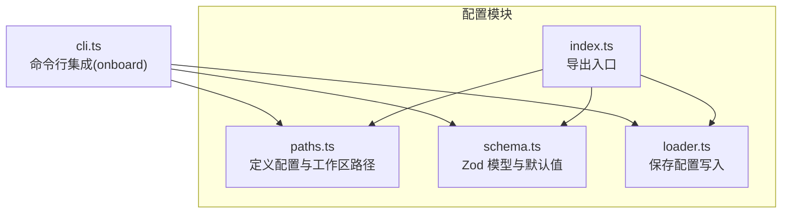
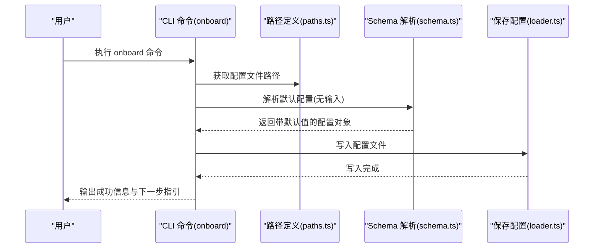
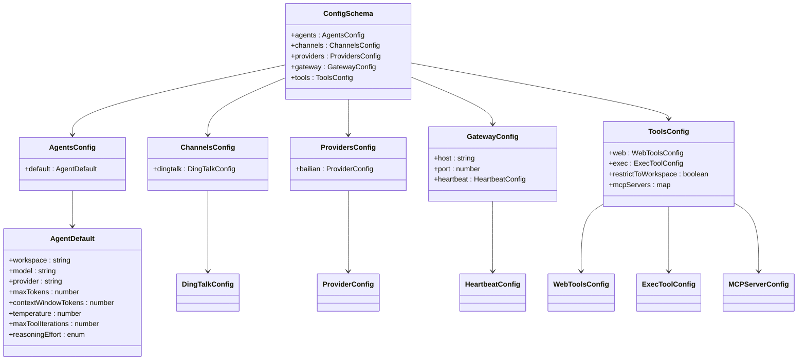
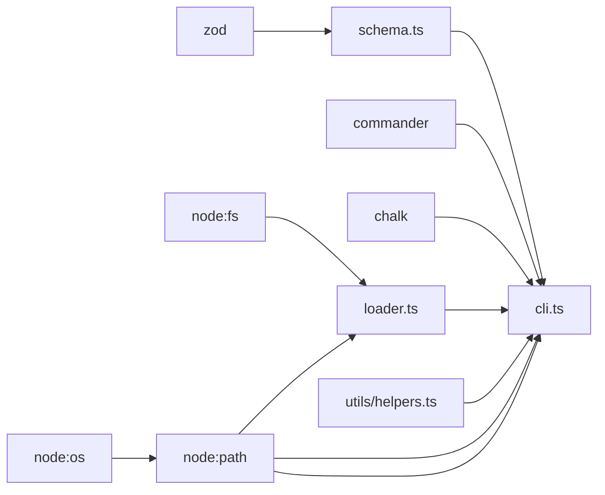

# 配置加载器

<cite>
**本文引用的文件**
- [src/config/index.ts](file://src/config/index.ts)
- [src/config/paths.ts](file://src/config/paths.ts)
- [src/config/schema.ts](file://src/config/schema.ts)
- [src/config/loader.ts](file://src/config/loader.ts)
- [src/cli.ts](file://src/cli.ts)
- [src/utils/helpers.ts](file://src/utils/helpers.ts)
- [package.json](file://package.json)
- [tsconfig.json](file://tsconfig.json)
</cite>

## 目录
1. [简介](#简介)
2. [项目结构](#项目结构)
3. [核心组件](#核心组件)
4. [架构总览](#架构总览)
5. [详细组件分析](#详细组件分析)
6. [依赖关系分析](#依赖关系分析)
7. [性能考虑](#性能考虑)
8. [故障排查指南](#故障排查指南)
9. [结论](#结论)
10. [附录](#附录)

## 简介
本文件系统化阐述 BatBot 的配置加载器设计与实现，覆盖以下主题：
- 配置文件的读取、解析与验证流程（含 Zod 验证器与错误处理）
- 配置文件的默认搜索路径与优先级规则（当前实现仅支持用户主目录下的固定路径）
- 合并逻辑与热重载机制现状与建议
- 配置文件格式规范（字段类型、默认值、可选字段、枚举等）
- 配置迁移工具与版本兼容性处理建议
- 常见问题诊断与解决方案

说明：当前仓库中未发现“读取 JSON 文件”的实现代码；现有能力仅包含“保存配置”和“基于 Zod Schema 的解析”。因此，本文在“读取/解析/验证/热重载”等环节以“现状与建议”的形式呈现，帮助读者在不改变现有实现的前提下扩展功能。

## 项目结构
配置相关模块位于 src/config 目录，主要由以下文件组成：
- 路径定义：用于确定配置文件与工作区的默认位置
- Schema 定义：使用 Zod 定义完整的配置模型与默认值
- 加载器：提供配置写入能力（当前无读取实现）
- CLI 集成：通过命令初始化配置与工作区

图表来源
- [src/config/paths.ts:1-11](file://src/config/paths.ts#L1-L11)
- [src/config/schema.ts:1-146](file://src/config/schema.ts#L1-L146)
- [src/config/loader.ts:1-16](file://src/config/loader.ts#L1-L16)
- [src/config/index.ts:1-3](file://src/config/index.ts#L1-L3)
- [src/cli.ts:1-94](file://src/cli.ts#L1-L94)

章节来源
- [src/config/index.ts:1-3](file://src/config/index.ts#L1-L3)
- [src/config/paths.ts:1-11](file://src/config/paths.ts#L1-L11)
- [src/config/schema.ts:1-146](file://src/config/schema.ts#L1-L146)
- [src/config/loader.ts:1-16](file://src/config/loader.ts#L1-L16)
- [src/cli.ts:1-94](file://src/cli.ts#L1-L94)

## 核心组件
- 路径定义（paths.ts）
  - 提供配置文件路径与工作区路径的计算函数
  - 默认路径位于用户主目录下的隐藏目录中
- Schema 定义（schema.ts）
  - 使用 Zod 定义完整配置模型，包含默认值与类型约束
  - 支持嵌套对象与数组，默认值通过 prefault 注入
- 加载器（loader.ts）
  - 当前实现为“保存配置”，尚未包含“读取配置”的逻辑
- CLI 集成（cli.ts）
  - onboard 命令会调用 Schema 解析生成默认配置并保存到磁盘
  - 若目标路径已存在，则提示覆盖或刷新（保持既有值并追加新字段）

章节来源
- [src/config/paths.ts:1-11](file://src/config/paths.ts#L1-L11)
- [src/config/schema.ts:1-146](file://src/config/schema.ts#L1-L146)
- [src/config/loader.ts:1-16](file://src/config/loader.ts#L1-L16)
- [src/cli.ts:20-56](file://src/cli.ts#L20-L56)

## 架构总览
下图展示配置加载器在 CLI 初始化流程中的交互：

图表来源
- [src/cli.ts:20-56](file://src/cli.ts#L20-L56)
- [src/config/paths.ts:4-6](file://src/config/paths.ts#L4-L6)
- [src/config/schema.ts:118-126](file://src/config/schema.ts#L118-L126)
- [src/config/loader.ts:6-15](file://src/config/loader.ts#L6-L15)

## 详细组件分析

### 组件一：路径定义（paths.ts）
- 功能
  - 计算配置文件路径与工作区路径
  - 默认路径位于用户主目录下的隐藏目录
- 关键点
  - 配置文件路径固定为用户主目录下的特定子路径
  - 工作区路径同样位于同一父目录下
- 优先级与搜索路径
  - 当前实现为“单路径优先”，不存在多路径搜索或环境变量覆盖
  - 如需扩展，可在路径函数中加入环境变量读取与多候选路径判断

章节来源
- [src/config/paths.ts:4-10](file://src/config/paths.ts#L4-L10)

### 组件二：Schema 定义（schema.ts）
- 功能
  - 定义完整的配置模型，包含各子模块的结构与默认值
  - 使用 Zod 进行类型校验与默认值注入
- 数据模型概览
  - 顶层字段：agents、channels、providers、gateway、tools
  - 子模块字段覆盖：如 agents.default、channels.dingtalk、providers.bailian、gateway.heartbeat、tools.web/exec/mcpServers 等
- 默认值与约束
  - 大量字段带有默认值（字符串、布尔、数值、数组、枚举）
  - 数值字段常包含正整数、范围限制等约束
  - 部分子模块使用 prefault 注入默认空对象，确保深层字段可用
- 可观测性
  - 提供 ConfigManger 类，暴露工作区路径计算逻辑（支持 ~ 展开与绝对路径解析）

图表来源
- [src/config/schema.ts:118-126](file://src/config/schema.ts#L118-L126)
- [src/config/schema.ts:35-37](file://src/config/schema.ts#L35-L37)
- [src/config/schema.ts:14-18](file://src/config/schema.ts#L14-L18)
- [src/config/schema.ts:49-51](file://src/config/schema.ts#L49-L51)
- [src/config/schema.ts:67-71](file://src/config/schema.ts#L67-L71)
- [src/config/schema.ts:108-114](file://src/config/schema.ts#L108-L114)

章节来源
- [src/config/schema.ts:1-146](file://src/config/schema.ts#L1-L146)

### 组件三：加载器（loader.ts）
- 功能
  - 将配置对象序列化为 JSON 并写入磁盘
  - 自动创建目标目录（递归）
- 当前限制
  - 仅实现“保存配置”，未实现“读取配置”
  - 未包含热重载、缓存、增量合并等机制
- 建议扩展
  - 新增读取函数：读取 JSON 文件并使用 Zod 解析
  - 引入文件监控（如 fs.watch）实现热重载
  - 引入内存缓存与 ETag/时间戳校验减少重复解析
  - 实现“部分字段覆盖 + 默认值合并”的策略

章节来源
- [src/config/loader.ts:6-15](file://src/config/loader.ts#L6-L15)

### 组件四：CLI 集成（cli.ts）
- onboard 命令
  - 调用 Schema.parse(undefined) 生成默认配置
  - 若配置文件已存在，提示用户选择覆盖或刷新（保留既有值并追加新字段）
  - 创建工作区目录并同步模板文件
- 其他命令
  - 保留 gateway、agent、status、channels、provider 等命令占位，便于后续扩展

章节来源
- [src/cli.ts:20-56](file://src/cli.ts#L20-L56)
- [src/utils/helpers.ts:11-46](file://src/utils/helpers.ts#L11-L46)

## 依赖关系分析
- 外部依赖
  - zod：用于配置模型定义与运行时验证
  - commander：用于 CLI 命令解析
  - chalk：用于日志输出美化
- 内部依赖
  - paths.ts 被 loader.ts 与 CLI 共同使用
  - schema.ts 被 CLI 与 loader（未来读取）共同使用
  - utils/helpers.ts 与 CLI 协作完成工作区模板同步

图表来源
- [package.json:22-28](file://package.json#L22-L28)
- [src/config/schema.ts:1-3](file://src/config/schema.ts#L1-L3)
- [src/config/loader.ts:1-4](file://src/config/loader.ts#L1-L4)
- [src/config/paths.ts:1-2](file://src/config/paths.ts#L1-L2)
- [src/cli.ts:1-12](file://src/cli.ts#L1-L12)
- [src/utils/helpers.ts:1-9](file://src/utils/helpers.ts#L1-L9)

章节来源
- [package.json:22-28](file://package.json#L22-L28)
- [src/config/schema.ts:1-3](file://src/config/schema.ts#L1-L3)
- [src/config/loader.ts:1-4](file://src/config/loader.ts#L1-L4)
- [src/config/paths.ts:1-2](file://src/config/paths.ts#L1-L2)
- [src/cli.ts:1-12](file://src/cli.ts#L1-L12)
- [src/utils/helpers.ts:1-9](file://src/utils/helpers.ts#L1-L9)

## 性能考虑
- 解析成本
  - Zod 解析默认值与校验在首次初始化时执行，通常开销较小
  - 若引入热重载，应避免频繁全量解析，建议采用缓存与增量更新
- I/O 成本
  - 写入配置为一次性操作，成本低
  - 读取配置若频繁触发，建议引入内存缓存与文件监控
- 并发与一致性
  - 多进程同时写入同一配置文件可能导致竞态
  - 建议引入锁文件或原子写入策略

## 故障排查指南
- 配置文件无法创建或写入
  - 检查用户主目录权限与磁盘空间
  - 确认路径函数返回的目录是否存在，必要时手动创建
- 配置解析失败
  - 确认 JSON 文件是否符合 Schema 规范（类型、范围、枚举）
  - 使用 Schema 的 parse 或 safeParse 方法捕获错误并打印字段路径
- 工作区路径异常
  - 检查配置中 workspace 字段是否以波浪号开头（需要展开为主目录）
  - 确认路径解析逻辑是否正确处理相对路径与绝对路径
- CLI 行为不符合预期
  - onboard 命令在配置已存在时会提示覆盖或刷新，请确认交互选择
  - 模板同步失败时检查模板目录是否存在以及权限

章节来源
- [src/config/loader.ts:6-15](file://src/config/loader.ts#L6-L15)
- [src/config/schema.ts:130-145](file://src/config/schema.ts#L130-L145)
- [src/cli.ts:20-56](file://src/cli.ts#L20-L56)
- [src/utils/helpers.ts:11-46](file://src/utils/helpers.ts#L11-L46)

## 结论
- 现状总结
  - 配置加载器具备完善的 Schema 定义与默认值注入能力
  - CLI 提供了便捷的初始化流程，但“读取配置”与“热重载”尚未实现
- 建议演进方向
  - 扩展读取与解析：实现从磁盘读取 JSON 并使用 Zod 验证
  - 引入热重载与缓存：通过文件监控与内存缓存提升响应速度
  - 增强合并策略：支持“保留既有值 + 追加新字段”的安全合并
  - 完善迁移工具：提供版本比较与自动迁移脚本，保障向后兼容

## 附录

### 配置文件格式规范（基于 Schema）
- 顶层字段
  - agents：包含 default 子模块
  - channels：包含 dingtalk 子模块
  - providers：包含 bailian 子模块
  - gateway：包含 host、port、heartbeat 子模块
  - tools：包含 web、exec、restrictToWorkspace、mcpServers 子模块
- agents.default
  - workspace：字符串，默认值为用户主目录下的工作区路径
  - model：字符串，默认值为指定模型标识
  - provider：字符串，默认值为自动选择
  - maxTokens：正整数，默认值为较大上限
  - contextWindowTokens：正整数，默认值为较大上限
  - temperature：0~2 的数值，默认值很小
  - maxToolIterations：正整数，默认值为较大上限
  - reasoningEffort：枚举（low/medium/high），默认为空
- channels.dingtalk
  - enabled：布尔，默认值为 false
  - clientId：字符串，默认值为空
  - clientSecret：字符串，默认值为空
  - allowFrom：字符串数组，默认值为空数组
- providers.bailian
  - apiKey：字符串，默认值为空
  - apiBase：字符串或 null，默认值为 null
  - extraHeaders：字符串到字符串的映射或 null，默认值为 null
- gateway.heartbeat
  - enabled：布尔，默认值为 false
  - intervalS：正整数，默认值为半小时
- tools.web
  - proxy：字符串或 null，默认值为 null
  - search：包含 apiKey 与 maxResults 的子模块
- tools.exec
  - timeout：正整数，默认值为 60 秒
  - pathAppend：字符串，默认值为空
- tools.mcpServers
  - 键为字符串，值为包含类型、命令、参数、环境变量、URL、请求头与工具超时的子模块

章节来源
- [src/config/schema.ts:5-126](file://src/config/schema.ts#L5-L126)

### 配置搜索路径与优先级
- 当前实现
  - 固定路径：用户主目录下的隐藏目录
  - 无多路径搜索、无环境变量覆盖
- 建议扩展
  - 支持环境变量覆盖路径
  - 支持多候选路径按顺序查找并返回首个存在的配置文件
  - 支持命令行参数显式指定配置文件路径

章节来源
- [src/config/paths.ts:4-10](file://src/config/paths.ts#L4-L10)

### 合并逻辑与热重载机制
- 现状
  - 未实现读取与合并逻辑
  - 未实现热重载与缓存
- 建议
  - 读取现有配置文件，使用 Zod 解析
  - 与默认配置进行“保留既有值 + 追加新字段”的合并
  - 引入文件监控与内存缓存，避免重复解析
  - 在变更检测到后，触发回调或重新初始化相关模块

章节来源
- [src/config/schema.ts:118-126](file://src/config/schema.ts#L118-L126)
- [src/config/loader.ts:6-15](file://src/config/loader.ts#L6-L15)

### 配置迁移工具与版本兼容
- 建议
  - 维护版本号与迁移脚本，比较当前配置版本与期望版本
  - 对缺失字段进行默认值填充，对废弃字段进行清理或转换
  - 提供 dry-run 与备份策略，降低迁移风险

### 错误处理与诊断
- 使用 Zod 的 safeParse 捕获错误并输出字段路径
- CLI 中对文件存在性与权限进行检查
- 工作区路径解析失败时，检查配置项与路径展开逻辑

章节来源
- [src/config/schema.ts:130-145](file://src/config/schema.ts#L130-L145)
- [src/cli.ts:20-56](file://src/cli.ts#L20-L56)
- [src/utils/helpers.ts:11-46](file://src/utils/helpers.ts#L11-L46)