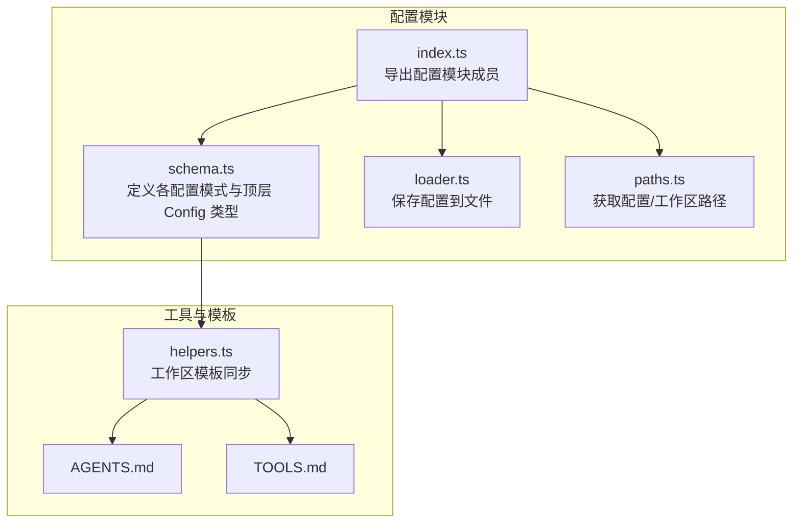
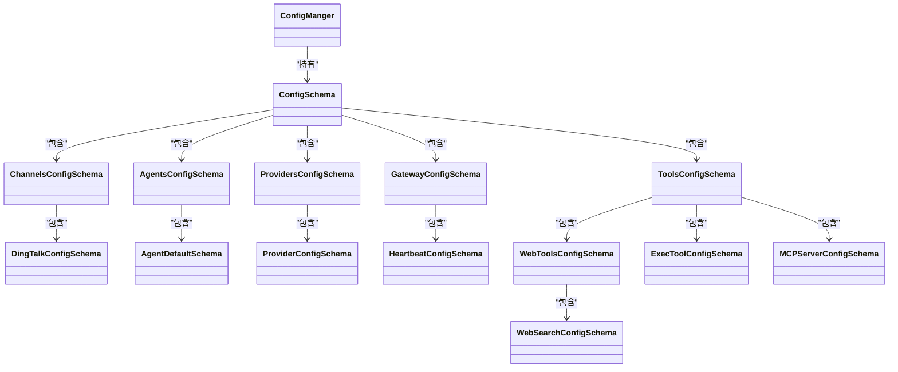
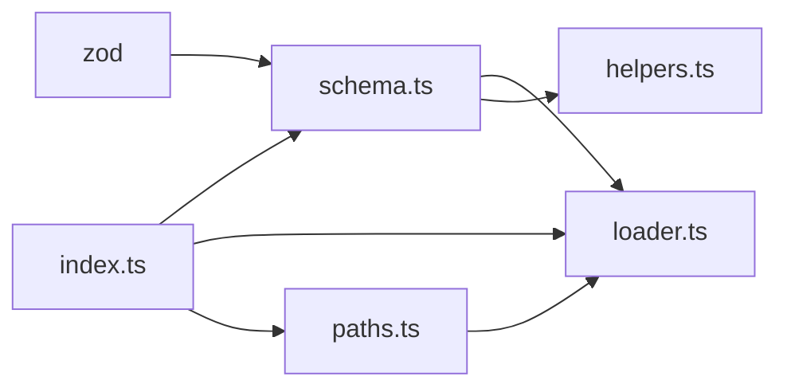

# 配置模式定义

<cite>
**本文引用的文件**
- [schema.ts](file://src/config/schema.ts)
- [index.ts](file://src/config/index.ts)
- [loader.ts](file://src/config/loader.ts)
- [paths.ts](file://src/config/paths.ts)
- [helpers.ts](file://src/utils/helpers.ts)
- [AGENTS.md](file://src/templates/AGENTS.md)
- [TOOLS.md](file://src/templates/TOOLS.md)
- [package.json](file://package.json)
</cite>

## 目录
1. [简介](#简介)
2. [项目结构](#项目结构)
3. [核心组件](#核心组件)
4. [架构总览](#架构总览)
5. [详细组件分析](#详细组件分析)
6. [依赖分析](#依赖分析)
7. [性能考虑](#性能考虑)
8. [故障排查指南](#故障排查指南)
9. [结论](#结论)
10. [附录](#附录)

## 简介
本文件系统性地解析 BatBot 的配置模式定义与实现，重点围绕 Zod 配置模式的字段定义、数据类型约束、默认值设置、嵌套关系与继承机制（通过 prefault() 实现）、验证规则与错误处理策略、类型推断机制，以及扩展与自定义配置的方法。目标是帮助开发者在不直接阅读源码的情况下，也能快速理解并正确使用配置模式。

## 项目结构
配置相关代码集中在 src/config 目录，核心文件如下：
- schema.ts：定义所有配置模式（Zod Schema）与顶层 Config 类型，以及一个用于路径解析的配置管理类。
- index.ts：导出配置模块的子模块，便于统一引入。
- loader.ts：提供配置保存能力（将配置对象序列化为 JSON 文件）。
- paths.ts：提供配置文件与工作区目录的默认路径解析逻辑。

图表来源
- [schema.ts:1-146](file://src/config/schema.ts#L1-L146)
- [loader.ts:1-16](file://src/config/loader.ts#L1-L16)
- [paths.ts:1-11](file://src/config/paths.ts#L1-L11)
- [index.ts:1-3](file://src/config/index.ts#L1-L3)
- [helpers.ts:1-47](file://src/utils/helpers.ts#L1-L47)
- [AGENTS.md:1-22](file://src/templates/AGENTS.md#L1-L22)
- [TOOLS.md:1-16](file://src/templates/TOOLS.md#L1-L16)

章节来源
- [schema.ts:1-146](file://src/config/schema.ts#L1-L146)
- [index.ts:1-3](file://src/config/index.ts#L1-L3)
- [loader.ts:1-16](file://src/config/loader.ts#L1-L16)
- [paths.ts:1-11](file://src/config/paths.ts#L1-L11)

## 核心组件
本节概述所有配置模式及其职责边界，并说明它们如何组合成顶层 Config。

- DingTalkConfigSchema：定义渠道“钉钉”的启用状态、客户端 ID、密钥与允许来源列表等字段。
- ChannelsConfigSchema：聚合各渠道配置，默认包含钉钉配置，并通过 prefault 初始化空对象。
- AgentDefaultSchema：定义代理默认参数，如工作区路径、模型名、提供商、上下文窗口、温度、最大工具迭代次数、推理强度等。
- AgentsConfigSchema：聚合代理配置，默认包含 AgentDefault。
- ProviderConfigSchema：定义提供商的 API Key、基础地址与额外请求头。
- ProvidersConfigSchema：聚合提供商配置，默认包含名为“bailian”的提供商。
- HeartbeatConfigSchema：定义心跳任务的开关与间隔秒数。
- GatewayConfigSchema：定义网关主机、端口与心跳配置。
- WebSearchConfigSchema：定义网页搜索的 API Key 与最大结果数。
- WebToolsConfigSchema：定义网页工具的代理与搜索子配置。
- ExecToolConfigSchema：定义执行工具的超时与路径追加。
- MCPServerConfigSchema：定义 MCP 服务器的类型、命令、参数、环境变量、URL、请求头与工具超时。
- ToolsConfigSchema：聚合工具配置，包含 WebTools、Exec、限制访问工作区的开关、以及 MCP 服务器映射。
- ConfigSchema：顶层配置对象，聚合 agents、channels、providers、gateway、tools，并通过 prefault 初始化空对象。
- ConfigManger：提供工作区路径解析逻辑，支持“~”展开与绝对路径解析。

章节来源
- [schema.ts:5-146](file://src/config/schema.ts#L5-L146)

## 架构总览
下图展示配置模式之间的嵌套与继承关系，以及顶层 Config 的组成。

图表来源
- [schema.ts:5-146](file://src/config/schema.ts#L5-L146)

## 详细组件分析

### AgentDefaultSchema（代理默认配置）
- 字段与约束
  - 工作区路径：字符串，默认值指向用户主目录下的固定路径；支持“~”展开。
  - 模型名：字符串，默认值为特定模型标识。
  - 提供商：字符串，默认值为自动选择。
  - 最大 Token 数：整数且为正数，默认值较大，适配长上下文。
  - 上下文窗口 Token 数：整数且为正数，默认值更大，适配超长上下文。
  - 温度：数值范围在 0 到 2，默认值较小，偏向稳定输出。
  - 最大工具迭代次数：整数且为正数，默认值较高，避免工具调用死循环。
  - 记忆窗口：可空数字，已标注为运行时忽略的弃用字段。
  - 推理强度：枚举（low/medium/high），可空，默认为空。
- 默认值处理
  - 使用 Zod 的 default() 设置默认值，确保未显式提供的字段具备合理初始值。
- 类型推断
  - 通过 z.infer 生成类型 AgentDefault，用于静态类型检查与 IDE 智能提示。

章节来源
- [schema.ts:20-31](file://src/config/schema.ts#L20-L31)

### AgentsConfigSchema（代理配置）
- 结构
  - 包含 default 字段，类型为 AgentDefaultSchema。
- 默认值处理
  - 通过 default: AgentDefaultSchema.prefault({}) 在顶层配置加载时自动填充默认代理参数。
- 嵌套关系
  - 作为 Config 的一部分，被 ConfigSchema 聚合。

章节来源
- [schema.ts:35-37](file://src/config/schema.ts#L35-L37)

### ProviderConfigSchema（提供商配置）
- 字段与约束
  - API Key：字符串，默认空。
  - API Base：可空字符串，默认 null。
  - 额外请求头：字符串到字符串的记录表，可空，默认 null。
- 默认值处理
  - 使用 default() 与 nullable() 组合，保证可选字段的明确默认行为。
- 类型推断
  - 通过 z.infer 生成 ProviderConfig 类型。

章节来源
- [schema.ts:41-45](file://src/config/schema.ts#L41-L45)

### ProvidersConfigSchema（提供商集合）
- 结构
  - 包含 bailian 键，类型为 ProviderConfigSchema。
- 默认值处理
  - 通过 bailian: ProviderConfigSchema.prefault({}) 自动初始化默认提供商配置。
- 嵌套关系
  - 作为 Config 的一部分，被 ConfigSchema 聚合。

章节来源
- [schema.ts:49-51](file://src/config/schema.ts#L49-L51)

### ChannelsConfigSchema（渠道配置）
- 结构
  - 包含 dingtalk 子配置，类型为 DingTalkConfigSchema。
- 默认值处理
  - 通过 dingtalk: DingTalkConfigSchema.prefault({}) 与自身 .prefault({}) 初始化空对象。
- 嵌套关系
  - 作为 Config 的一部分，被 ConfigSchema 聚合。

章节来源
- [schema.ts:14-18](file://src/config/schema.ts#L14-L18)

### DingTalkConfigSchema（钉钉渠道配置）
- 字段与约束
  - 启用状态：布尔，默认 false。
  - 客户端 ID：字符串，默认空。
  - 密钥：字符串，默认空。
  - 允许来源：字符串数组，默认空数组。
- 默认值处理
  - 使用 default() 为每个字段设置默认值。
- 类型推断
  - 通过 z.infer 生成 DingTalkConfig 类型。

章节来源
- [schema.ts:5-10](file://src/config/schema.ts#L5-L10)

### GatewayConfigSchema（网关配置）
- 字段与约束
  - 主机：字符串，默认本地回环地址。
  - 端口：正整数，默认端口。
  - 心跳：HeartbeatConfigSchema 子配置。
- 默认值处理
  - 主机与端口使用 default()，心跳通过 .prefault({}) 初始化。
- 嵌套关系
  - 作为 Config 的一部分，被 ConfigSchema 聚合。

章节来源
- [schema.ts:67-71](file://src/config/schema.ts#L67-L71)

### HeartbeatConfigSchema（心跳配置）
- 字段与约束
  - 开关：布尔，默认 false。
  - 间隔秒数：正整数，默认半小时。
- 默认值处理
  - 使用 default() 与 .int().positive() 确保正值与整数。
- 类型推断
  - 通过 z.infer 生成 HeartbeatConfig 类型。

章节来源
- [schema.ts:55-63](file://src/config/schema.ts#L55-L63)

### ToolsConfigSchema（工具配置）
- 字段与约束
  - web：WebToolsConfigSchema 子配置。
  - exec：ExecToolConfigSchema 子配置。
  - restrictToWorkspace：布尔，默认 false。
  - mcpServers：字符串到 MCPServerConfigSchema 的映射，默认空对象。
- 默认值处理
  - web/exec 通过 .prefault({}) 初始化；mcpServers 通过 .default({}) 初始化空映射。
- 嵌套关系
  - 作为 Config 的一部分，被 ConfigSchema 聚合。

章节来源
- [schema.ts:108-114](file://src/config/schema.ts#L108-L114)

### WebToolsConfigSchema（网页工具配置）
- 字段与约束
  - proxy：可空字符串，默认 null。
  - search：WebSearchConfigSchema 子配置。
- 默认值处理
  - proxy 使用 .nullable().default(null)，search 通过 .prefault({}) 初始化。
- 嵌套关系
  - 作为 ToolsConfig 的一部分，被 ToolsConfigSchema 聚合。

章节来源
- [schema.ts:82-85](file://src/config/schema.ts#L82-L85)

### WebSearchConfigSchema（网页搜索配置）
- 字段与约束
  - apiKey：字符串，默认空。
  - maxResults：正整数，默认 5。
- 默认值处理
  - 使用 default() 与 .int().positive() 确保正值与整数。
- 类型推断
  - 通过 z.infer 生成 WebSearchConfig 类型。

章节来源
- [schema.ts:75-78](file://src/config/schema.ts#L75-L78)

### ExecToolConfigSchema（执行工具配置）
- 字段与约束
  - timeout：正整数，默认 60 秒。
  - pathAppend：字符串，默认空。
- 默认值处理
  - 使用 default() 与 .int().positive() 确保正值与整数。
- 类型推断
  - 通过 z.infer 生成 ExecToolConfig 类型。

章节来源
- [schema.ts:89-92](file://src/config/schema.ts#L89-L92)

### MCPServerConfigSchema（MCP 服务器配置）
- 字段与约束
  - type：枚举（stdio/sse/streamableHttp），可空，默认 null。
  - command：字符串，默认空。
  - args：字符串数组，默认空数组。
  - env：字符串到字符串的记录表，可空，默认 null。
  - url：可空字符串，默认空。
  - headers：字符串到字符串的记录表，可空，默认 null。
  - toolTimeout：正整数，默认 30 秒。
- 默认值处理
  - 大量字段使用 default() 与 .nullable() 组合，确保可选字段的明确默认行为。
- 类型推断
  - 通过 z.infer 生成 MCPServerConfig 类型。

章节来源
- [schema.ts:96-104](file://src/config/schema.ts#L96-L104)

### ConfigSchema（顶层配置）
- 字段与约束
  - agents：AgentsConfigSchema 子配置。
  - channels：ChannelsConfigSchema 子配置。
  - providers：ProvidersConfigSchema 子配置。
  - gateway：GatewayConfigSchema 子配置。
  - tools：ToolsConfigSchema 子配置。
- 默认值处理
  - 每个子配置均通过 .prefault({}) 初始化空对象，顶层也通过 .prefault({}) 初始化。
- 类型推断
  - 通过 z.infer 生成 Config 类型。

章节来源
- [schema.ts:118-126](file://src/config/schema.ts#L118-L126)

### ConfigManger（配置管理器）
- 功能
  - 持有 Config 对象。
  - 提供 workspacePath 属性，根据 agents.default.workspace 解析实际工作区路径，支持“~”展开与绝对路径解析。
- 用途
  - 在需要确定工作区根路径时使用，避免硬编码路径。

章节来源
- [schema.ts:130-145](file://src/config/schema.ts#L130-L145)

## 依赖分析
- 外部依赖
  - zod：用于构建强类型的配置模式与默认值处理。
- 内部依赖
  - schema.ts 依赖 zod 进行模式定义。
  - loader.ts 依赖 paths.ts 获取配置文件路径，并依赖 fs 将配置写入磁盘。
  - helpers.ts 依赖 schema.ts 中的类型信息进行工作区模板同步。
  - index.ts 统一导出配置模块成员，便于上层模块按需引入。

图表来源
- [schema.ts:1-3](file://src/config/schema.ts#L1-L3)
- [loader.ts:1-4](file://src/config/loader.ts#L1-L4)
- [paths.ts:1-6](file://src/config/paths.ts#L1-L6)
- [index.ts:1-3](file://src/config/index.ts#L1-L3)
- [helpers.ts:1-9](file://src/utils/helpers.ts#L1-L9)

章节来源
- [package.json:22-28](file://package.json#L22-L28)
- [schema.ts:1-3](file://src/config/schema.ts#L1-L3)
- [loader.ts:1-4](file://src/config/loader.ts#L1-L4)
- [paths.ts:1-6](file://src/config/paths.ts#L1-L6)
- [index.ts:1-3](file://src/config/index.ts#L1-L3)
- [helpers.ts:1-9](file://src/utils/helpers.ts#L1-L9)

## 性能考虑
- 预设值与惰性初始化
  - 通过 prefault() 在加载阶段即完成默认值填充，避免运行时重复计算或分支判断，提升启动与读取性能。
- 类型推断与编译期校验
  - 使用 z.infer 生成类型，结合严格编译选项，可在开发阶段尽早发现配置错误，减少运行时开销。
- 文件 I/O
  - 配置保存采用一次性写入 JSON 文件的方式，避免频繁小块写入带来的磁盘压力。

## 故障排查指南
- 配置保存失败
  - 现象：保存配置时报错或无文件生成。
  - 排查：确认目标目录存在或可写；若目录不存在，loader 会尝试递归创建。
  - 参考
    - [loader.ts:6-15](file://src/config/loader.ts#L6-L15)
    - [paths.ts:4-6](file://src/config/paths.ts#L4-L6)
- 工作区路径解析异常
  - 现象：工作区路径不正确或无法展开“~”。
  - 排查：确认 agents.default.workspace 是否为“~”开头或绝对路径；ConfigManger 会优先展开“~”，否则按绝对路径解析。
  - 参考
    - [schema.ts:137-144](file://src/config/schema.ts#L137-L144)
- 配置字段类型不匹配
  - 现象：运行时报类型错误或字段缺失。
  - 排查：检查对应 Schema 的字段类型与默认值是否符合预期；必要时在上层应用中对 Config 进行校验与转换。
  - 参考
    - [schema.ts:118-126](file://src/config/schema.ts#L118-L126)

章节来源
- [loader.ts:6-15](file://src/config/loader.ts#L6-L15)
- [paths.ts:4-6](file://src/config/paths.ts#L4-L6)
- [schema.ts:137-144](file://src/config/schema.ts#L137-L144)
- [schema.ts:118-126](file://src/config/schema.ts#L118-L126)

## 结论
本配置体系以 Zod 为核心，通过严格的字段类型约束、合理的默认值与 prefault() 预设机制，实现了高可靠性的配置加载与使用体验。顶层 ConfigSchema 将各子配置聚合为一体，配合 ConfigManger 的路径解析能力，满足了从配置定义到运行时使用的完整闭环。同时，通过类型推断与统一导出，降低了上层模块的耦合度与维护成本。

## 附录

### 验证规则与错误处理策略
- 字段类型与范围
  - 使用 .string()、.number()、.boolean()、.array()、.record()、.enum() 等限定字段类型。
  - 使用 .int().positive()、.min()/max()、.nullable() 等限定数值范围与可空性。
- 默认值策略
  - 所有可选字段均通过 default() 或 .nullable().default(...) 显式声明默认值，避免运行时歧义。
- 预设值处理（prefault）
  - 在子配置与顶层配置上均使用 .prefault({})，确保加载阶段即完成默认值填充，简化运行时分支。
- 类型推断
  - 通过 z.infer 生成类型，结合严格编译选项，实现编译期类型安全。

章节来源
- [schema.ts:5-146](file://src/config/schema.ts#L5-L146)

### 扩展方法与自定义配置
- 新增子配置
  - 在 schema.ts 中新增一个 Zod 对象模式，并在顶层 ConfigSchema 中添加相应字段。
  - 为新配置提供 .prefault({}) 以支持默认值预设。
  - 参考现有模式（如 AgentsConfigSchema、ToolsConfigSchema）的组织方式。
  - 参考
    - [schema.ts:35-37](file://src/config/schema.ts#L35-L37)
    - [schema.ts:108-114](file://src/config/schema.ts#L108-L114)
    - [schema.ts:118-126](file://src/config/schema.ts#L118-L126)
- 新增提供商
  - 在 ProvidersConfigSchema 中新增键值对，键名为提供商名称，值为 ProviderConfigSchema。
  - 参考
    - [schema.ts:49-51](file://src/config/schema.ts#L49-L51)
- 新增 MCP 服务器
  - 在 ToolsConfigSchema.mcpServers 中新增键值对，键名为服务器名称，值为 MCPServerConfigSchema。
  - 参考
    - [schema.ts](file://src/config/schema.ts#L113)
- 新增渠道
  - 在 ChannelsConfigSchema.dingtalk 之外新增其他渠道配置，并在顶层聚合。
  - 参考
    - [schema.ts:14-18](file://src/config/schema.ts#L14-L18)
- 配置保存与使用
  - 使用 loader.saveConfig 将配置对象持久化为 JSON 文件。
  - 使用 paths.getConfigPath 获取默认配置文件路径。
  - 参考
    - [loader.ts:6-15](file://src/config/loader.ts#L6-L15)
    - [paths.ts:4-6](file://src/config/paths.ts#L4-L6)

### 配置使用示例（概念性说明）
- 读取配置
  - 通过 Config 类型获取 agents.default、providers.bailian、gateway 等字段。
- 解析工作区路径
  - 使用 ConfigManger.workspacePath 获取实际工作区路径。
- 模板同步
  - 使用 helpers.syncWorkspaceTemplates 将模板文件同步到工作区。
  - 参考
    - [helpers.ts:11-46](file://src/utils/helpers.ts#L11-L46)
    - [AGENTS.md:1-22](file://src/templates/AGENTS.md#L1-L22)
    - [TOOLS.md:1-16](file://src/templates/TOOLS.md#L1-L16)