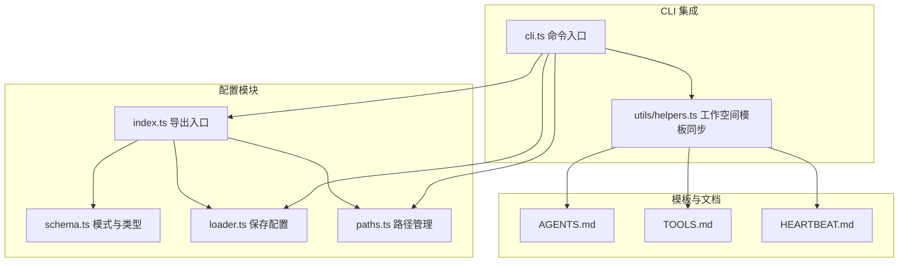
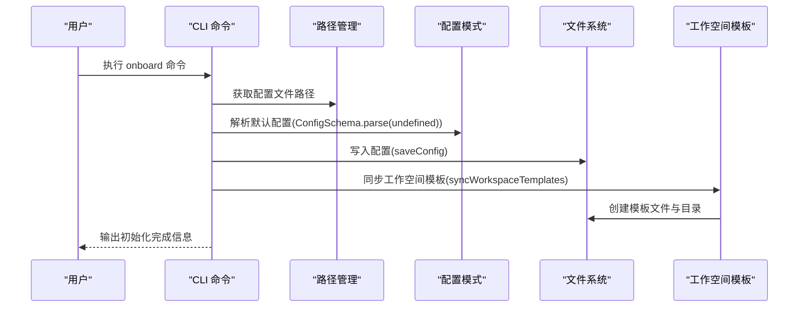
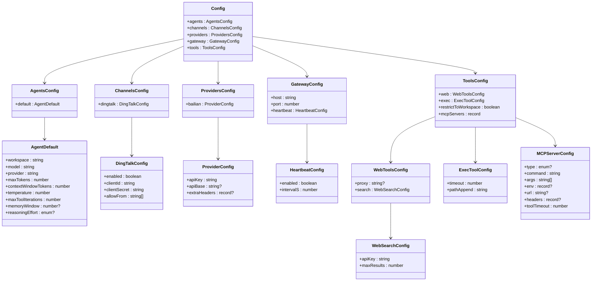
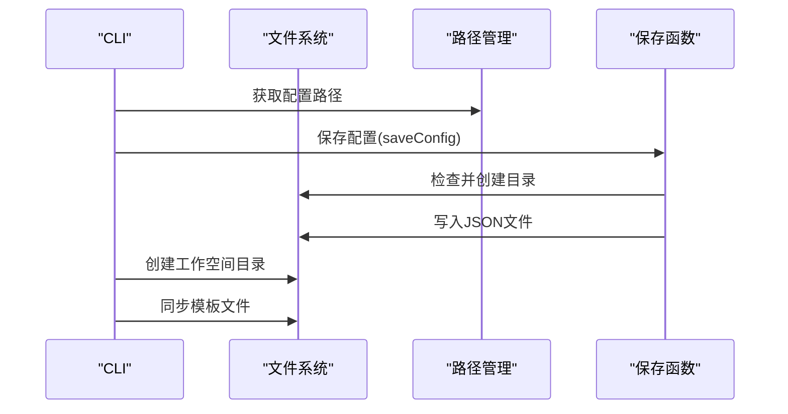
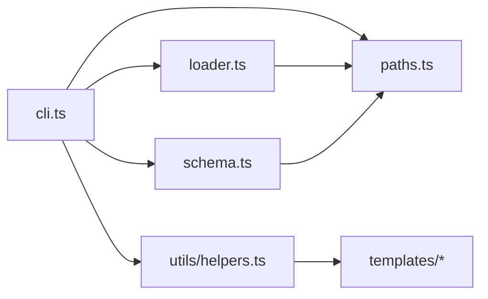

# 配置系统

<cite>
**本文引用的文件**
- [src/config/index.ts](file://src/config/index.ts)
- [src/config/schema.ts](file://src/config/schema.ts)
- [src/config/loader.ts](file://src/config/loader.ts)
- [src/config/paths.ts](file://src/config/paths.ts)
- [src/cli.ts](file://src/cli.ts)
- [src/utils/helpers.ts](file://src/utils/helpers.ts)
- [src/templates/AGENTS.md](file://src/templates/AGENTS.md)
- [src/templates/TOOLS.md](file://src/templates/TOOLS.md)
- [src/templates/HEARTBEAT.md](file://src/templates/HEARTBEAT.md)
</cite>

## 目录
1. [简介](#简介)
2. [项目结构](#项目结构)
3. [核心组件](#核心组件)
4. [架构总览](#架构总览)
5. [详细组件分析](#详细组件分析)
6. [依赖关系分析](#依赖关系分析)
7. [性能考量](#性能考量)
8. [故障排查指南](#故障排查指南)
9. [结论](#结论)
10. [附录](#附录)

## 简介
本文件为 BatBot 配置系统的综合文档，聚焦于基于 Zod 的类型安全配置体系，覆盖配置模式定义、验证规则与错误处理策略；系统化梳理代理配置、渠道配置、提供商配置、网关配置与工具配置的结构、字段、默认值、可选参数与约束条件；并说明配置文件的读写流程、路径管理与工作空间集成方式，最后提供配置迁移与版本兼容性建议。

## 项目结构
配置系统主要由以下模块组成：
- 模式与类型：定义各配置段的 Zod Schema 及推导类型，确保编译期与运行期一致
- 路径管理：统一配置文件与工作空间目录的解析逻辑
- 加载与保存：负责配置的持久化读写
- CLI 集成：通过命令初始化配置与工作空间，并在首次运行时生成默认配置

图表来源
- [src/config/index.ts:1-3](file://src/config/index.ts#L1-L3)
- [src/config/schema.ts:1-146](file://src/config/schema.ts#L1-L146)
- [src/config/loader.ts:1-16](file://src/config/loader.ts#L1-L16)
- [src/config/paths.ts:1-11](file://src/config/paths.ts#L1-L11)
- [src/cli.ts:1-96](file://src/cli.ts#L1-L96)
- [src/utils/helpers.ts:1-47](file://src/utils/helpers.ts#L1-L47)
- [src/templates/AGENTS.md:1-22](file://src/templates/AGENTS.md#L1-L22)
- [src/templates/TOOLS.md:1-16](file://src/templates/TOOLS.md#L1-L16)
- [src/templates/HEARTBEAT.md:1-17](file://src/templates/HEARTBEAT.md#L1-L17)

章节来源
- [src/config/index.ts:1-3](file://src/config/index.ts#L1-L3)
- [src/config/schema.ts:1-146](file://src/config/schema.ts#L1-L146)
- [src/config/loader.ts:1-16](file://src/config/loader.ts#L1-L16)
- [src/config/paths.ts:1-11](file://src/config/paths.ts#L1-L11)
- [src/cli.ts:1-96](file://src/cli.ts#L1-L96)
- [src/utils/helpers.ts:1-47](file://src/utils/helpers.ts#L1-L47)

## 核心组件
- 配置模式与类型（Zod）
  - 定义了完整的配置树结构，包含代理默认项、渠道、提供商、网关、工具等段落
  - 使用 .prefault({}) 为嵌套对象提供默认值，确保深层字段缺失时也能补全
  - 使用 .default(...) 为标量字段提供默认值
  - 对枚举、范围、正整数、记录映射等进行严格约束
- 路径管理
  - 统一返回用户主目录下的 .batbot/config.json 作为配置文件路径
  - 提供工作空间目录的解析方法，支持 ~ 占位符与绝对路径
- 配置保存
  - 保证父目录存在，不存在则递归创建
  - 将配置序列化为 JSON 并写入文件
- CLI 集成
  - onboard 命令使用 ConfigSchema.parse(undefined) 生成默认配置
  - 若配置已存在，提供覆盖或刷新选项
  - 初始化工作空间并同步模板文件

章节来源
- [src/config/schema.ts:118-129](file://src/config/schema.ts#L118-L129)
- [src/config/paths.ts:4-10](file://src/config/paths.ts#L4-L10)
- [src/config/loader.ts:6-15](file://src/config/loader.ts#L6-L15)
- [src/cli.ts:24-58](file://src/cli.ts#L24-L58)

## 架构总览
下图展示配置系统从 CLI 到模式、路径与保存模块的调用关系：

图表来源
- [src/cli.ts:24-58](file://src/cli.ts#L24-L58)
- [src/config/paths.ts:4-6](file://src/config/paths.ts#L4-L6)
- [src/config/schema.ts:118-129](file://src/config/schema.ts#L118-L129)
- [src/config/loader.ts:6-15](file://src/config/loader.ts#L6-L15)
- [src/utils/helpers.ts:11-46](file://src/utils/helpers.ts#L11-L46)

## 详细组件分析

### 配置模式与类型（Zod Schema）
- 代理默认项（agents.default）
  - 字段：workspace、model、provider、maxTokens、contextWindowTokens、temperature、maxToolIterations、memoryWindow（已弃用）、reasoningEffort
  - 默认值与约束：路径支持 ~ 展开；数值为正整数或指定范围；reasoningEffort 支持枚举且可空
- 渠道配置（channels）
  - 当前包含 dingtalk 子段，支持启用开关、客户端标识、密钥与来源白名单数组
- 提供商配置（providers）
  - bailian 提供商，包含 apiKey、apiBase（可空）、extraHeaders（可空记录）
- 网关配置（gateway）
  - host、port（正整数）、heartbeat（嵌套配置）
- 工具配置（tools）
  - web：proxy（可空）、search（包含 apiKey、maxResults）
  - exec：timeout（正整数）、pathAppend
  - restrictToWorkspace（布尔）
  - mcpServers：键为字符串，值为 MCP 服务器配置（type、command、args、env、url、headers、toolTimeout）

图表来源
- [src/config/schema.ts:5-146](file://src/config/schema.ts#L5-L146)

章节来源
- [src/config/schema.ts:5-146](file://src/config/schema.ts#L5-L146)

### 路径管理
- 配置文件路径：用户主目录下 .batbot/config.json
- 工作空间路径：用户主目录下 .batbot/workspace，支持 ~ 展开与绝对路径解析
- ConfigManager 提供 workspacePath 访问器，内部实现路径展开与解析

图表来源
- [src/config/schema.ts:130-145](file://src/config/schema.ts#L130-L145)
- [src/config/paths.ts:4-10](file://src/config/paths.ts#L4-L10)

章节来源
- [src/config/schema.ts:130-145](file://src/config/schema.ts#L130-L145)
- [src/config/paths.ts:4-10](file://src/config/paths.ts#L4-L10)

### 配置读写与 CLI 集成
- 保存配置
  - 自动创建父目录（递归）
  - 将配置对象序列化为 JSON 并写入文件
- CLI 初始化
  - onboard 命令：若配置不存在则直接写入默认配置；若已存在则提示覆盖或刷新
  - 初始化工作空间目录并同步模板文件（含 memory 与 skills 目录）

图表来源
- [src/config/loader.ts:6-15](file://src/config/loader.ts#L6-L15)
- [src/config/paths.ts:4-6](file://src/config/paths.ts#L4-L6)
- [src/cli.ts:24-58](file://src/cli.ts#L24-L58)
- [src/utils/helpers.ts:11-46](file://src/utils/helpers.ts#L11-L46)

章节来源
- [src/config/loader.ts:6-15](file://src/config/loader.ts#L6-L15)
- [src/cli.ts:24-58](file://src/cli.ts#L24-L58)
- [src/utils/helpers.ts:11-46](file://src/utils/helpers.ts#L11-L46)

### 工作空间与模板
- 工作空间初始化会创建以下结构：
  - 根目录：AGENTS.md、TOOLS.md、HEARTBEAT.md
  - memory 目录：MEMORY.md、HISTORY.md
  - skills 目录：用于存放技能脚本
- 模板内容用于指导代理行为、工具使用与心跳任务管理

章节来源
- [src/utils/helpers.ts:11-46](file://src/utils/helpers.ts#L11-L46)
- [src/templates/AGENTS.md:1-22](file://src/templates/AGENTS.md#L1-L22)
- [src/templates/TOOLS.md:1-16](file://src/templates/TOOLS.md#L1-L16)
- [src/templates/HEARTBEAT.md:1-17](file://src/templates/HEARTBEAT.md#L1-L17)

## 依赖关系分析
- 模块内聚与耦合
  - schema.ts 为核心，被 paths.ts、loader.ts、cli.ts 引用
  - loader.ts 仅依赖路径与文件系统
  - cli.ts 依赖 schema、paths、loader 与 utils
  - utils/helpers.ts 依赖模板目录，独立于 schema
- 外部依赖
  - Zod：类型安全与验证
  - Node.js 文件系统与路径模块：文件读写与路径解析
  - chalk：命令行输出高亮（onboard 命令中使用）

图表来源
- [src/cli.ts:1-96](file://src/cli.ts#L1-L96)
- [src/config/paths.ts:1-11](file://src/config/paths.ts#L1-L11)
- [src/config/loader.ts:1-16](file://src/config/loader.ts#L1-L16)
- [src/config/schema.ts:1-146](file://src/config/schema.ts#L1-L146)
- [src/utils/helpers.ts:1-47](file://src/utils/helpers.ts#L1-L47)

章节来源
- [src/cli.ts:1-96](file://src/cli.ts#L1-L96)
- [src/config/schema.ts:1-146](file://src/config/schema.ts#L1-L146)
- [src/config/loader.ts:1-16](file://src/config/loader.ts#L1-L16)
- [src/config/paths.ts:1-11](file://src/config/paths.ts#L1-L11)
- [src/utils/helpers.ts:1-47](file://src/utils/helpers.ts#L1-L47)

## 性能考量
- 配置读取与写入均为本地文件操作，开销极低
- Zod 验证发生在首次生成默认配置时，后续运行不涉及验证开销
- 路径解析仅在访问 workspacePath 时执行一次，成本可忽略
- 建议避免频繁写入配置文件；如需动态更新，可在内存中维护并在合适时机批量写入

## 故障排查指南
- 配置文件无法创建
  - 检查用户主目录权限与磁盘配额
  - 确认路径解析逻辑未被自定义覆盖
- 配置解析失败
  - 确保 JSON 格式正确，字段名与类型符合 Schema
  - 使用 ConfigSchema.parse(undefined) 生成最小可用默认配置进行对比
- 工作空间未初始化
  - 确认 onboard 命令已执行
  - 检查模板同步是否成功，确认 memory 与 skills 目录存在
- 心跳任务未生效
  - 检查 gateway heartbeat 配置与 intervalS 设置
  - 确认 HEARTBEAT.md 中存在有效任务条目

章节来源
- [src/config/loader.ts:6-15](file://src/config/loader.ts#L6-L15)
- [src/cli.ts:24-58](file://src/cli.ts#L24-L58)
- [src/templates/HEARTBEAT.md:1-17](file://src/templates/HEARTBEAT.md#L1-L17)

## 结论
本配置系统以 Zod 为核心，实现了强类型的配置定义与验证，结合统一的路径管理与 CLI 初始化流程，提供了清晰、可扩展且易于维护的配置体验。通过默认值与约束规则，系统在易用性与健壮性之间取得平衡；配合工作空间模板与工具说明，进一步降低了上手门槛。

## 附录

### 配置字段参考与默认值
- 代理默认项（agents.default）
  - workspace：默认值为用户主目录下的 .batbot/workspace
  - model：默认模型标识
  - provider：默认提供商标识
  - maxTokens：默认正整数
  - contextWindowTokens：默认正整数
  - temperature：默认 0~2 的数值
  - maxToolIterations：默认正整数
  - memoryWindow：已弃用（可空）
  - reasoningEffort：枚举值（low/medium/high）或空
- 渠道配置（channels.dingtalk）
  - enabled：布尔
  - clientId/clientSecret：字符串
  - allowFrom：字符串数组
- 提供商配置（providers.bailian）
  - apiKey：字符串
  - apiBase：可空字符串
  - extraHeaders：可空记录
- 网关配置（gateway）
  - host：默认 IP
  - port：默认正整数
  - heartbeat.enabled：布尔
  - heartbeat.intervalS：默认正整数（秒）
- 工具配置（tools）
  - web.proxy：可空字符串
  - web.search.apiKey：字符串
  - web.search.maxResults：默认正整数
  - exec.timeout：默认正整数（秒）
  - exec.pathAppend：字符串
  - restrictToWorkspace：布尔
  - mcpServers：键为字符串，值为 MCP 服务器配置（包含 type、command、args、env、url、headers、toolTimeout）

章节来源
- [src/config/schema.ts:5-146](file://src/config/schema.ts#L5-L146)

### 配置迁移与版本兼容性
- 迁移建议
  - 新增字段：旧配置可保留，新增字段按 Schema 默认值生效
  - 删除字段：旧配置中的冗余字段会被忽略（Zod 会丢弃未知字段）
  - 类型变更：若出现类型不匹配，建议先备份旧配置，再使用默认配置覆盖后手动迁移关键字段
- 版本兼容性
  - 采用 .prefault({}) 与 .default(...) 的组合，确保向后兼容
  - 对于已弃用字段（如 memoryWindow），系统会忽略其影响
  - 如未来引入新提供商或新工具，建议在现有 Schema 基础上扩展，保持根配置结构稳定

章节来源
- [src/config/schema.ts:28-31](file://src/config/schema.ts#L28-L31)
- [src/config/schema.ts:118-129](file://src/config/schema.ts#L118-L129)