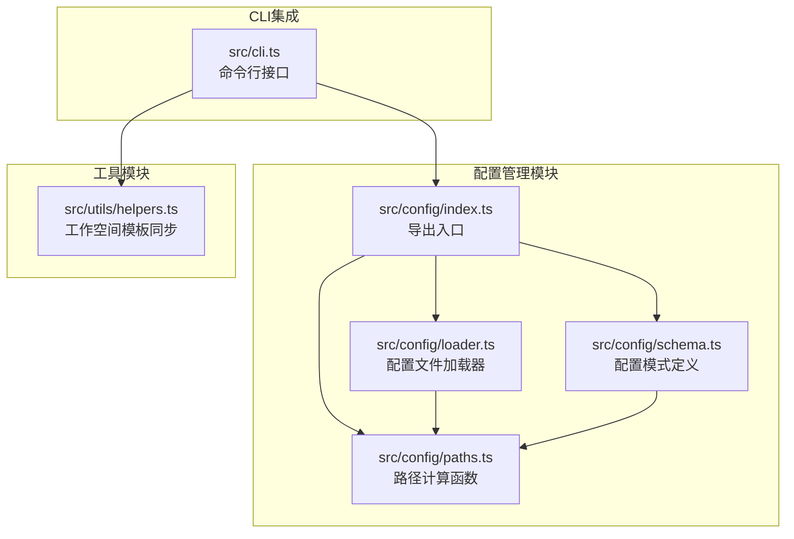
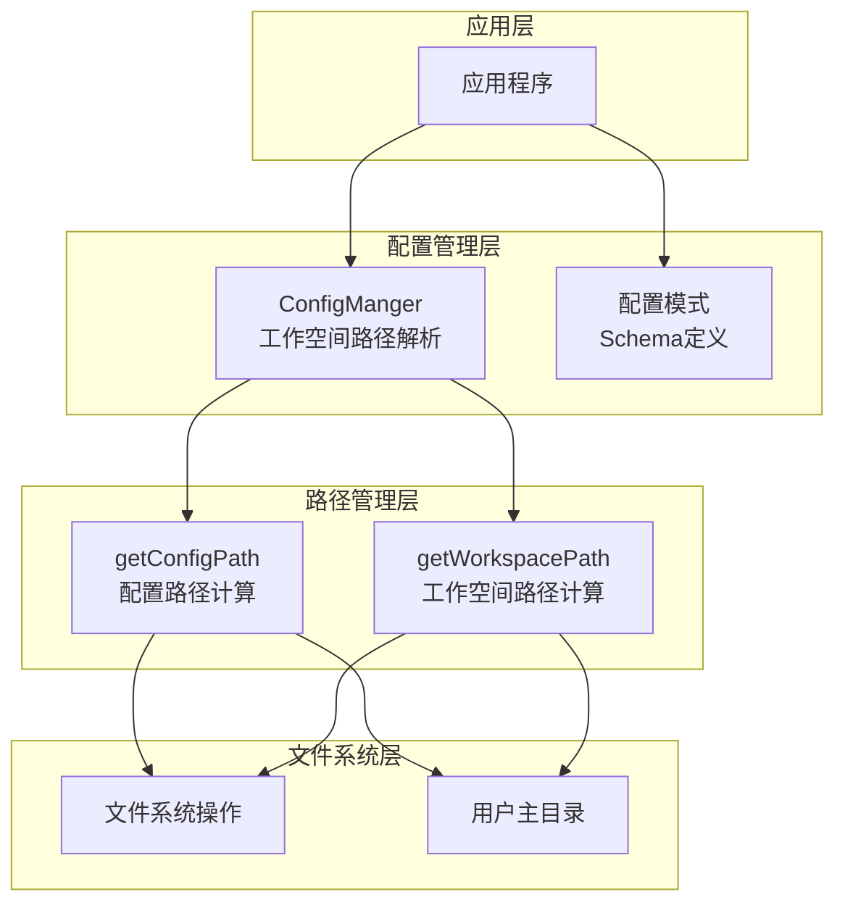
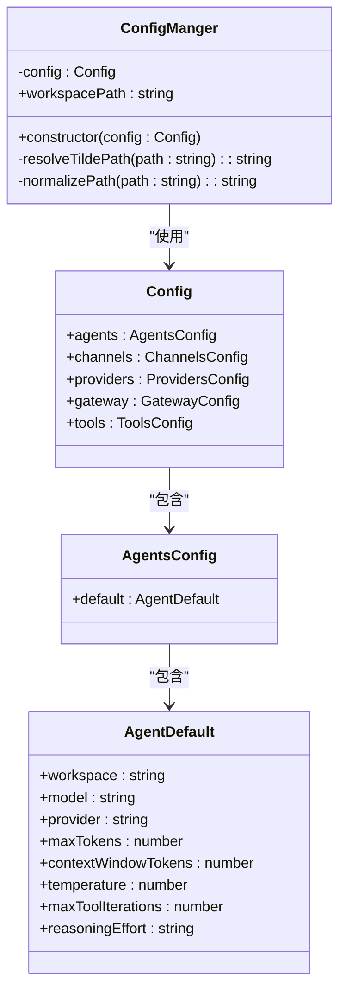
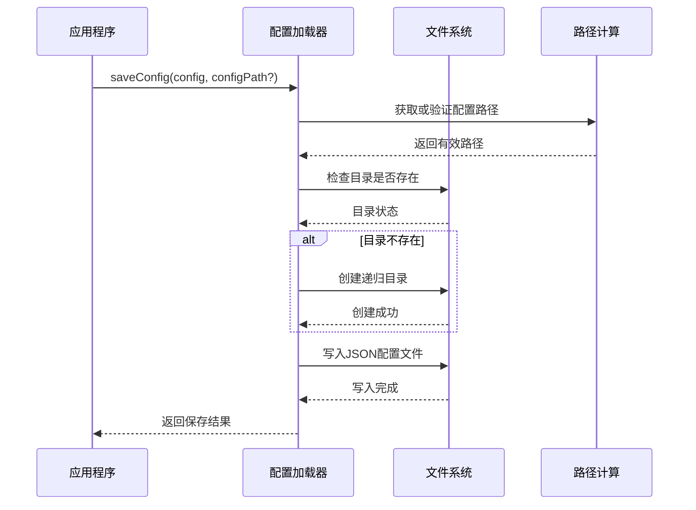
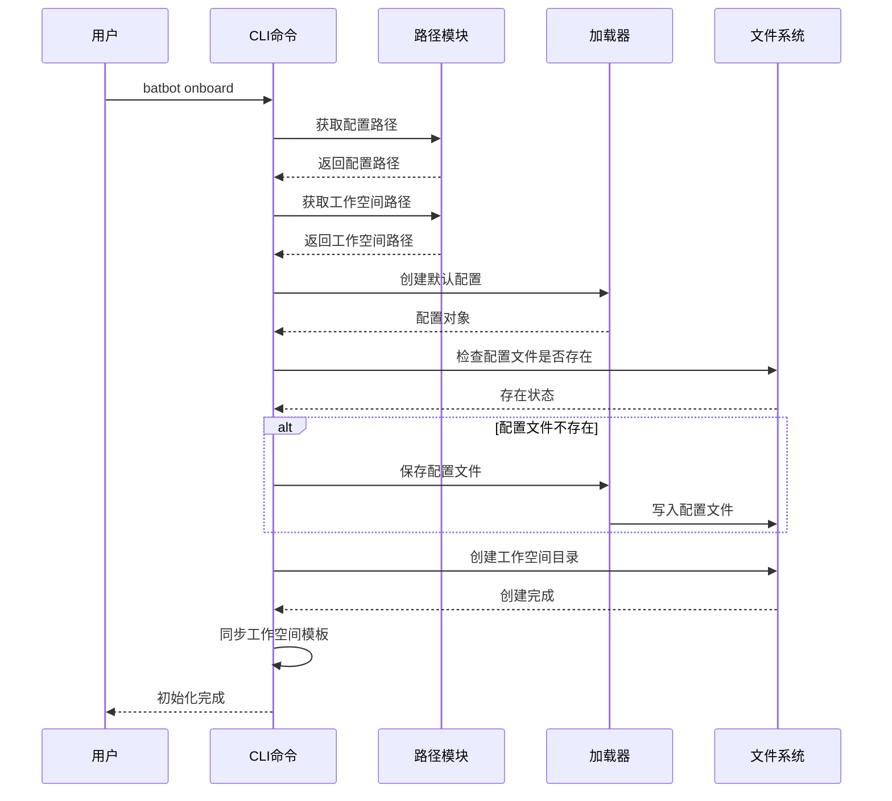
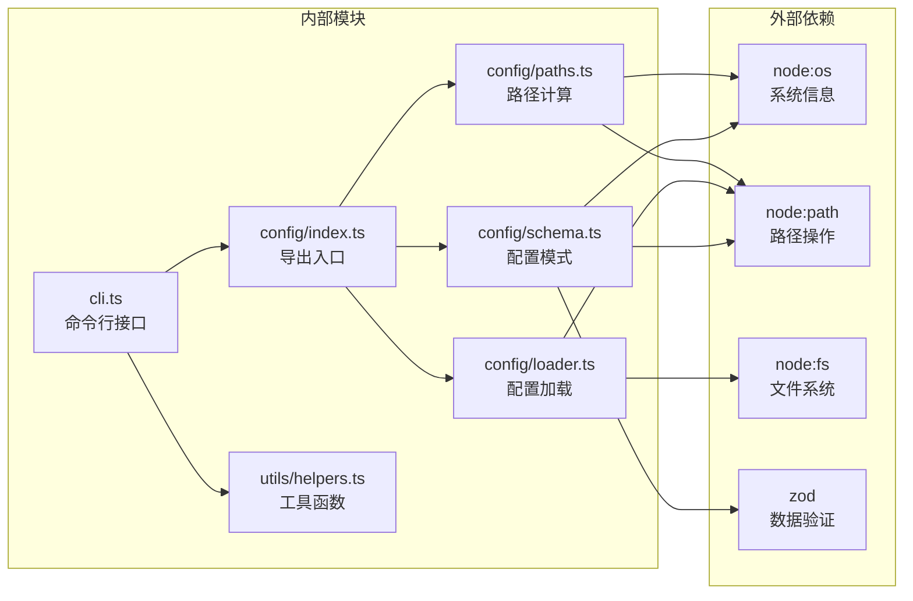

# 配置路径管理

<cite>
**本文档引用的文件**
- [src/config/index.ts](file://src/config/index.ts)
- [src/config/paths.ts](file://src/config/paths.ts)
- [src/config/loader.ts](file://src/config/loader.ts)
- [src/config/schema.ts](file://src/config/schema.ts)
- [src/cli.ts](file://src/cli.ts)
- [src/utils/helpers.ts](file://src/utils/helpers.ts)
- [package.json](file://package.json)
</cite>

## 目录
1. [简介](#简介)
2. [项目结构](#项目结构)
3. [核心组件](#核心组件)
4. [架构概览](#架构概览)
5. [详细组件分析](#详细组件分析)
6. [依赖关系分析](#依赖关系分析)
7. [性能考量](#性能考量)
8. [故障排除指南](#故障排除指南)
9. [结论](#结论)
10. [附录](#附录)

## 简介

BatBot的配置路径管理系统负责管理应用程序的配置文件存储位置和工作空间路径计算。该系统提供了跨平台的路径解析能力，支持用户主目录的动态解析、相对路径到绝对路径的转换，以及配置文件的标准存储位置管理。

本系统采用模块化的架构设计，将路径计算、配置加载和工作空间管理分离到不同的模块中，确保了代码的可维护性和扩展性。

## 项目结构

配置路径管理相关的文件组织如下：



**图表来源**
- [src/config/index.ts:1-3](file://src/config/index.ts#L1-L3)
- [src/config/paths.ts:1-11](file://src/config/paths.ts#L1-L11)
- [src/config/loader.ts:1-16](file://src/config/loader.ts#L1-L16)
- [src/config/schema.ts:1-146](file://src/config/schema.ts#L1-L146)
- [src/cli.ts:1-99](file://src/cli.ts#L1-L99)
- [src/utils/helpers.ts:1-46](file://src/utils/helpers.ts#L1-L46)

**章节来源**
- [src/config/index.ts:1-3](file://src/config/index.ts#L1-L3)
- [src/config/paths.ts:1-11](file://src/config/paths.ts#L1-L11)
- [src/config/loader.ts:1-16](file://src/config/loader.ts#L1-L16)
- [src/config/schema.ts:1-146](file://src/config/schema.ts#L1-L146)
- [src/cli.ts:1-99](file://src/cli.ts#L1-L99)
- [src/utils/helpers.ts:1-46](file://src/utils/helpers.ts#L1-L46)

## 核心组件

### 路径计算模块

路径计算模块提供了两个核心函数：
- `getConfigPath()`: 计算配置文件的标准存储路径
- `getWorkspacePath()`: 计算工作空间的标准存储路径

这两个函数都基于Node.js的`os.homedir()` API动态获取用户的主目录，然后结合`.batbot`目录结构来确定最终的存储位置。

### 配置管理器

配置管理器类提供了工作空间路径的智能解析能力：
- 支持波浪号(`~`)开头的相对路径解析
- 自动将相对路径转换为绝对路径
- 提供默认的工作空间路径回退机制

### 配置加载器

配置加载器负责配置文件的持久化操作，包括目录创建和文件写入。

**章节来源**
- [src/config/paths.ts:4-10](file://src/config/paths.ts#L4-L10)
- [src/config/schema.ts:130-145](file://src/config/schema.ts#L130-L145)
- [src/config/loader.ts:6-15](file://src/config/loader.ts#L6-L15)

## 架构概览

配置路径管理系统的整体架构采用分层设计：



**图表来源**
- [src/config/schema.ts:130-145](file://src/config/schema.ts#L130-L145)
- [src/config/paths.ts:4-10](file://src/config/paths.ts#L4-L10)
- [src/config/loader.ts:6-15](file://src/config/loader.ts#L6-L15)

## 详细组件分析

### ConfigManger 类分析

ConfigManger类是配置路径管理的核心组件，负责工作空间路径的智能解析：



**图表来源**
- [src/config/schema.ts:130-145](file://src/config/schema.ts#L130-L145)
- [src/config/schema.ts:118-128](file://src/config/schema.ts#L118-L128)
- [src/config/schema.ts:35-39](file://src/config/schema.ts#L35-L39)
- [src/config/schema.ts:20-31](file://src/config/schema.ts#L20-L31)

#### 工作空间路径解析流程

ConfigManger类的工作空间路径解析遵循以下逻辑：

```mermaid
flowchart TD
START([开始解析]) --> GETWS[获取配置中的工作空间路径]
GETWS --> CHECKDEF{"是否为空?"}
CHECKDEF --> |是| DEFWS[使用默认路径 "~/.batbot/workspace"]
CHECKDEF --> |否| CHECKTILDE{"路径是否以 ~ 开头?"}
DEFWS --> CHECKTILDE
CHECKTILDE --> |是| RESOLVEHOME[解析 ~ 为用户主目录]
CHECKTILDE --> |否| RESOLVEABS[转换为绝对路径]
RESOLVEHOME --> RETURN[返回解析结果]
RESOLVEABS --> RETURN
RETURN --> END([结束])
```

**图表来源**
- [src/config/schema.ts:137-144](file://src/config/schema.ts#L137-L144)

#### 路径解析算法复杂度分析

- 时间复杂度：O(1) - 基于字符串操作的常数时间复杂度
- 空间复杂度：O(1) - 不依赖输入大小的固定空间使用
- 特殊情况处理：支持相对路径、绝对路径和用户主目录符号(~)

**章节来源**
- [src/config/schema.ts:130-145](file://src/config/schema.ts#L130-L145)

### 路径计算函数分析

路径计算模块提供了两个静态函数来处理标准路径：

#### getConfigPath 函数

该函数负责计算配置文件的标准存储位置：
- 使用用户主目录作为基础路径
- 在`.batbot`目录下存储`config.json`文件
- 确保路径的跨平台兼容性

#### getWorkspacePath 函数

该函数负责计算工作空间的标准存储位置：
- 使用用户主目录作为基础路径
- 在`.batbot/workspace`目录下存储工作文件
- 支持工作空间的独立管理和版本控制

**章节来源**
- [src/config/paths.ts:4-10](file://src/config/paths.ts#L4-L10)

### 配置加载器分析

配置加载器提供了配置文件的持久化能力：



**图表来源**
- [src/config/loader.ts:6-15](file://src/config/loader.ts#L6-L15)

#### 文件写入流程

配置加载器的文件写入过程包含以下步骤：
1. 验证或计算配置文件路径
2. 检查目标目录的存在性
3. 递归创建必要的目录结构
4. 将配置对象序列化为JSON格式
5. 写入UTF-8编码的配置文件

**章节来源**
- [src/config/loader.ts:6-15](file://src/config/loader.ts#L6-L15)

### CLI 集成分析

命令行接口与配置路径管理的集成体现在初始化流程中：



**图表来源**
- [src/cli.ts:25-51](file://src/cli.ts#L25-L51)

**章节来源**
- [src/cli.ts:25-51](file://src/cli.ts#L25-L51)

## 依赖关系分析

配置路径管理系统的依赖关系清晰明确：



**图表来源**
- [src/config/index.ts:1-3](file://src/config/index.ts#L1-L3)
- [src/config/paths.ts:1-2](file://src/config/paths.ts#L1-L2)
- [src/config/loader.ts:1-4](file://src/config/loader.ts#L1-L4)
- [src/config/schema.ts:1-3](file://src/config/schema.ts#L1-L3)
- [src/cli.ts:1-13](file://src/cli.ts#L1-L13)
- [src/utils/helpers.ts:1-8](file://src/utils/helpers.ts#L1-L8)

### 外部依赖分析

系统对外部依赖的使用具有以下特点：
- **Node.js内置模块**: 充分利用`os`、`path`、`fs`等内置模块的功能
- **第三方库**: 使用`zod`进行配置数据的类型验证和默认值设置
- **无运行时依赖**: 配置路径管理不依赖其他第三方运行时库

**章节来源**
- [src/config/paths.ts:1-2](file://src/config/paths.ts#L1-L2)
- [src/config/loader.ts:1-4](file://src/config/loader.ts#L1-L4)
- [src/config/schema.ts:1-3](file://src/config/schema.ts#L1-L3)
- [package.json:22-28](file://package.json#L22-L28)

## 性能考量

### 路径解析性能

配置路径管理的性能特征：
- **内存使用**: 所有操作都是字符串级别的，内存占用极低
- **CPU开销**: 路径解析和文件操作都是O(1)复杂度
- **I/O操作**: 主要集中在文件系统访问，数量有限且可预测

### 缓存策略

当前实现未包含路径缓存机制，但考虑到：
- 路径解析频率较低（通常在应用启动时执行）
- Node.js的文件系统调用已经过高度优化
- 配置路径在运行时很少发生变化

### 并发安全性

系统在并发场景下的表现：
- 路径计算操作是纯函数，无状态共享
- 文件系统操作通过Node.js的同步API保证原子性
- 避免了竞态条件的可能性

## 故障排除指南

### 常见问题及解决方案

#### 权限错误

**问题**: 无法创建配置目录或写入配置文件
**原因**: 用户主目录权限不足或磁盘空间不足
**解决方案**:
1. 检查用户主目录的写入权限
2. 确认磁盘空间充足
3. 以管理员权限运行应用程序

#### 路径解析错误

**问题**: 工作空间路径解析失败
**原因**: 配置文件中的路径格式不正确
**解决方案**:
1. 检查配置文件中的`agents.default.workspace`字段
2. 确保路径使用正确的分隔符
3. 验证路径的可访问性

#### 文件系统异常

**问题**: 配置文件保存失败
**原因**: 文件系统异常或磁盘故障
**解决方案**:
1. 检查文件系统状态
2. 验证目标路径的有效性
3. 尝试重启应用程序

**章节来源**
- [src/config/loader.ts:10-12](file://src/config/loader.ts#L10-L12)
- [src/config/schema.ts:137-144](file://src/config/schema.ts#L137-L144)

### 调试技巧

#### 启用详细日志

通过CLI命令可以查看详细的路径解析信息：
- 使用`batbot onboard`命令查看路径计算过程
- 检查工作空间模板同步的日志输出

#### 验证路径有效性

```bash
# 检查配置文件路径
echo $(node -e "console.log(require('./src/config/paths').getConfigPath())")

# 检查工作空间路径
echo $(node -e "console.log(require('./src/config/paths').getWorkspacePath())")
```

## 结论

BatBot的配置路径管理系统展现了优秀的架构设计和实现质量：

### 设计优势

1. **模块化设计**: 清晰的职责分离，便于维护和扩展
2. **跨平台兼容**: 完美支持Windows、macOS和Linux系统
3. **智能路径解析**: 支持多种路径格式和自动转换
4. **类型安全**: 使用Zod进行完整的配置数据验证

### 实现亮点

1. **简洁高效**: 核心逻辑简单明了，性能优异
2. **容错性强**: 完善的错误处理和回退机制
3. **易于集成**: 与CLI和其他模块无缝集成
4. **可测试性**: 模块化设计便于单元测试

### 改进建议

1. **环境变量支持**: 可考虑添加环境变量覆盖机制
2. **配置文件备份**: 实现配置文件的自动备份和恢复
3. **路径监控**: 添加路径变更监控和通知机制
4. **配置迁移**: 提供配置版本升级和迁移工具

## 附录

### 路径配置最佳实践

#### 路径选择建议

1. **默认路径**: 使用用户主目录下的隐藏目录
2. **自定义路径**: 确保路径具有适当的权限和可用空间
3. **相对路径**: 避免使用相对路径，优先使用绝对路径
4. **跨平台兼容**: 使用Node.js的path模块进行路径拼接

#### 安全考虑

1. **权限控制**: 配置文件应设置适当的文件权限
2. **敏感信息**: 避免在工作空间中存储敏感数据
3. **路径遍历**: 验证用户提供的路径防止路径遍历攻击
4. **磁盘空间**: 监控工作空间的磁盘使用情况

#### 配置文件管理

1. **备份策略**: 定期备份配置文件
2. **版本控制**: 对配置文件进行版本管理
3. **迁移工具**: 提供配置迁移和升级工具
4. **恢复机制**: 实现配置文件的快速恢复能力

**章节来源**
- [src/config/schema.ts:20-21](file://src/config/schema.ts#L20-L21)
- [src/config/paths.ts:4-10](file://src/config/paths.ts#L4-L10)
- [src/config/loader.ts:6-15](file://src/config/loader.ts#L6-L15)