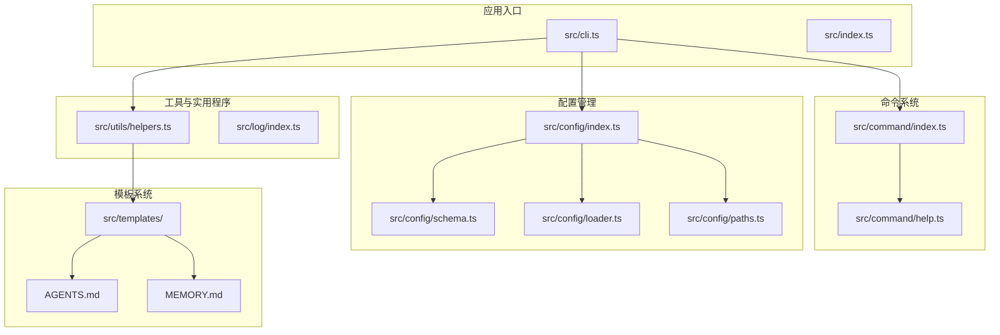
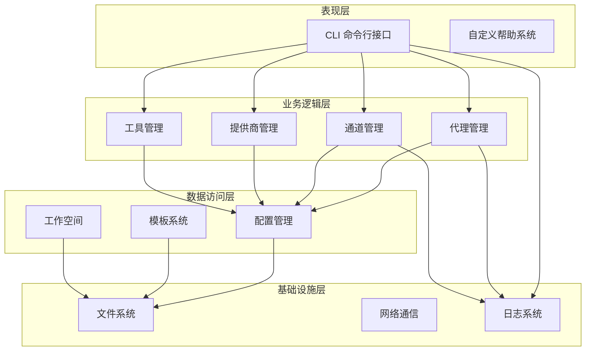
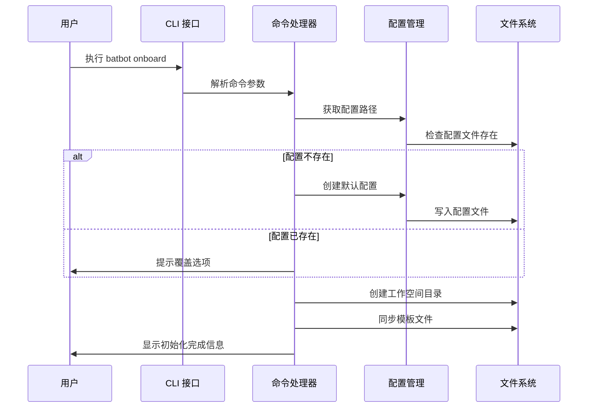
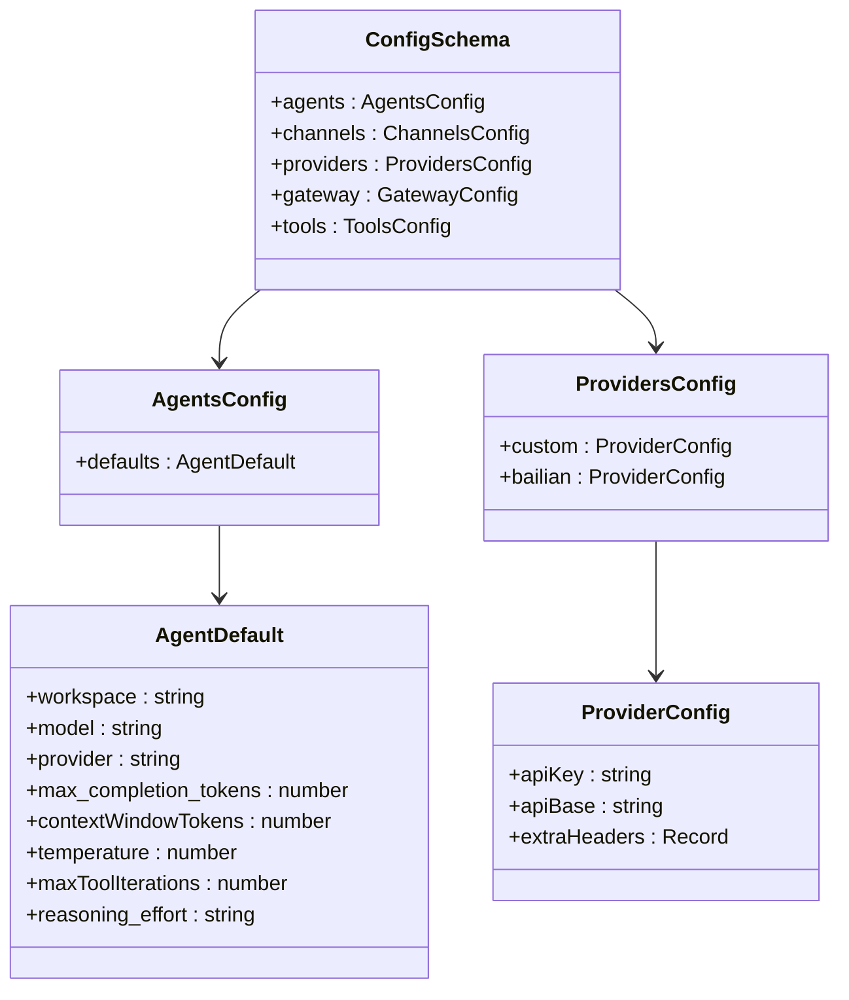
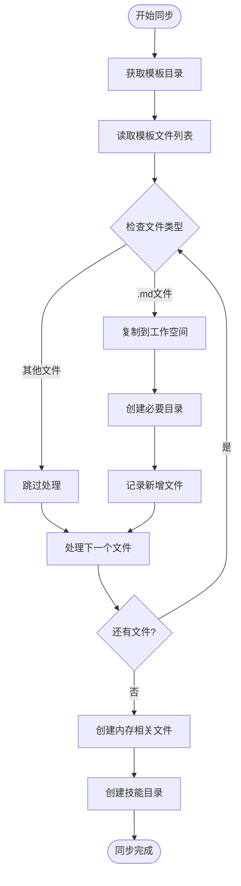

# 项目概述

<cite>
**本文档引用的文件**
- [package.json](file://package.json)
- [tsconfig.json](file://tsconfig.json)
- [src/index.ts](file://src/index.ts)
- [src/cli.ts](file://src/cli.ts)
- [src/command/index.ts](file://src/command/index.ts)
- [src/command/help.ts](file://src/command/help.ts)
- [src/config/index.ts](file://src/config/index.ts)
- [src/config/schema.ts](file://src/config/schema.ts)
- [src/config/loader.ts](file://src/config/loader.ts)
- [src/config/paths.ts](file://src/config/paths.ts)
- [src/utils/helpers.ts](file://src/utils/helpers.ts)
- [src/log/index.ts](file://src/log/index.ts)
- [src/templates/AGENTS.md](file://src/templates/AGENTS.md)
- [src/templates/memory/MEMORY.md](file://src/templates/memory/MEMORY.md)
</cite>

## 更新摘要
**所做更改**
- 更新了版本信息，反映项目从1.0.0降至0.1.0，表明项目进入早期alpha/beta发布阶段
- 更新了技术栈概览，反映package.json中的依赖关系变化
- 更新了安装前系统要求，反映Node.js版本要求提升至20+

## 目录
1. [简介](#简介)
2. [项目结构](#项目结构)
3. [核心组件](#核心组件)
4. [架构总览](#架构总览)
5. [详细组件分析](#详细组件分析)
6. [依赖关系分析](#依赖关系分析)
7. [性能考虑](#性能考虑)
8. [故障排除指南](#故障排除指南)
9. [结论](#结论)
10. [附录](#附录)

## 简介

BatBot 是一个基于 Node.js 的命令行 AI 助手工具，旨在为用户提供个人化的智能对话体验。该项目的核心目标是通过模块化设计和灵活的配置管理，支持多种 AI 提供商和即时通讯渠道，同时提供强大的模板系统和工作空间管理能力。

### 主要特性与价值主张

- **多提供商支持**：内置对多个 AI 提供商的支持，包括 Bailian 等主流平台
- **多渠道集成**：支持钉钉等即时通讯渠道的集成
- **智能代理系统**：提供可定制的 AI 代理，支持记忆、工具调用和任务管理
- **模板驱动的工作空间**：自动同步模板文件到本地工作空间
- **严格的配置验证**：使用 Zod 进行配置模式验证，确保运行时稳定性
- **友好的 CLI 体验**：基于 commander.js 构建的现代化命令行界面

### 技术栈概览

- **核心语言**：TypeScript（ES2022 目标）
- **命令行框架**：commander.js
- **配置验证**：Zod
- **日志输出**：chalk + 自定义日志模块
- **文本处理**：strip-ansi + wrap-ansi
- **构建工具**：TypeScript 编译器
- **版本控制**：当前版本 0.1.0，处于早期alpha/beta发布阶段

**更新** 版本从1.0.0降至0.1.0，反映了项目从初始开发状态进入早期alpha/beta发布阶段

## 项目结构

项目采用模块化组织方式，按照功能域进行分层：



**图表来源**
- [src/cli.ts:1-148](file://src/cli.ts#L1-L148)
- [src/command/index.ts:1-16](file://src/command/index.ts#L1-L16)
- [src/config/index.ts:1-3](file://src/config/index.ts#L1-L3)

**章节来源**
- [src/cli.ts:1-148](file://src/cli.ts#L1-L148)
- [src/command/index.ts:1-16](file://src/command/index.ts#L1-L16)
- [src/config/index.ts:1-3](file://src/config/index.ts#L1-L3)

## 核心组件

### 命令行接口系统

项目的核心是基于 commander.js 的自定义命令行接口，提供了丰富的子命令和帮助系统。

### 配置管理系统

采用 Zod 模式验证的配置系统，支持：
- 代理配置（模型、温度、上下文窗口等）
- 通道配置（钉钉等）
- 提供商配置（API 密钥、基础地址等）
- 工具配置（Web 搜索、执行工具等）

### 模板与工作空间

自动同步模板文件到本地工作空间，包括：
- AGENTS.md：代理指令模板
- MEMORY.md：长期记忆模板
- HEARTBEAT.md：心跳任务模板
- USER.md：用户信息模板
- TOOLS.md：工具使用说明

**章节来源**
- [src/command/index.ts:1-16](file://src/command/index.ts#L1-L16)
- [src/command/help.ts:1-57](file://src/command/help.ts#L1-L57)
- [src/config/schema.ts:1-168](file://src/config/schema.ts#L1-L168)
- [src/utils/helpers.ts:1-66](file://src/utils/helpers.ts#L1-L66)

## 架构总览

项目采用分层架构设计，各层职责清晰分离：



**图表来源**
- [src/cli.ts:1-148](file://src/cli.ts#L1-L148)
- [src/config/schema.ts:136-168](file://src/config/schema.ts#L136-L168)
- [src/log/index.ts:1-49](file://src/log/index.ts#L1-L49)

## 详细组件分析

### CLI 命令系统



**图表来源**
- [src/cli.ts:26-77](file://src/cli.ts#L26-L77)
- [src/config/paths.ts:4-10](file://src/config/paths.ts#L4-L10)
- [src/utils/helpers.ts:11-46](file://src/utils/helpers.ts#L11-L66)

### 配置验证系统

使用 Zod 实现的类型安全配置验证：



**图表来源**
- [src/config/schema.ts:124-134](file://src/config/schema.ts#L124-L134)
- [src/config/schema.ts:38-42](file://src/config/schema.ts#L38-L42)
- [src/config/schema.ts:52-59](file://src/config/schema.ts#L52-L59)

### 模板同步机制



**图表来源**
- [src/utils/helpers.ts:11-46](file://src/utils/helpers.ts#L11-L66)
- [src/templates/AGENTS.md:1-22](file://src/templates/AGENTS.md#L1-L22)

**章节来源**
- [src/cli.ts:1-148](file://src/cli.ts#L1-L148)
- [src/config/schema.ts:1-168](file://src/config/schema.ts#L1-L168)
- [src/utils/helpers.ts:1-66](file://src/utils/helpers.ts#L1-L66)

### 日志系统

自定义的日志模块提供了丰富的输出样式：

- 成功信息：绿色对勾标记
- 警告信息：黄色感叹号标记  
- 错误信息：红色叉号标记
- 调试信息：灰色虫子标记
- 标题信息：青色粗体显示
- 灰色文本：用于文件创建提示

**章节来源**
- [src/log/index.ts:1-49](file://src/log/index.ts#L1-L49)

## 依赖关系分析

项目的主要依赖关系如下：

```mermaid
graph TB
subgraph "运行时依赖"
Commander[commander.js]
Zod[zod]
Chalk[chalk]
StripAnsi[strip-ansi]
WrapAnsi[wrap-ansi]
OpenAI[openai]
UUID[uuid]
ClackPrompts[@clack/prompts]
end
subgraph "开发时依赖"
Typescript[typescript]
NodeTypes["@types/node"]
Cpy[cpy-cli]
end
subgraph "核心模块"
CLI[src/cli.ts]
Command[src/command/]
Config[src/config/]
Utils[src/utils/]
Log[src/log/]
end
CLI --> Commander
CLI --> Config
CLI --> Utils
CLI --> Log
Command --> Commander
Command --> ClackPrompts
Command --> Chalk
Command --> StripAnsi
Command --> WrapAnsi
Config --> Zod
Utils --> Log
```

**图表来源**
- [package.json:35-49](file://package.json#L35-L49)
- [src/cli.ts:1-18](file://src/cli.ts#L1-L18)
- [src/command/index.ts:1-2](file://src/command/index.ts#L1-L2)

**章节来源**
- [package.json:17-49](file://package.json#L17-L49)
- [tsconfig.json:1-21](file://tsconfig.json#L1-L21)

## 性能考虑

### 配置加载优化
- 使用 Zod 的预设模式减少重复验证开销
- 配置路径缓存避免重复文件系统查询
- 模板同步采用批量操作减少 I/O 次数

### 内存管理
- 代理配置采用惰性加载策略
- 工作空间路径解析使用缓存机制
- 日志输出采用流式处理避免大对象创建

### 并发处理
- 命令解析采用异步非阻塞模式
- 文件操作使用同步 API 保证顺序一致性
- 网络请求通过工具层统一管理

## 故障排除指南

### 常见问题与解决方案

**配置文件损坏**
- 症状：启动时报配置错误
- 解决方案：删除损坏的配置文件，重新运行 `batbot onboard`

**权限问题**
- 症状：无法写入工作空间或配置文件
- 解决方案：检查用户权限，确保对 `~/.batbot` 目录有读写权限

**网络连接问题**
- 症状：代理调用超时或失败
- 解决方案：检查 API 密钥配置和网络连通性

**模板同步失败**
- 症状：工作空间缺少必要的模板文件
- 解决方案：手动运行模板同步命令或检查磁盘空间

**版本兼容性问题**
- 症状：Node.js 版本过低导致运行错误
- 解决方案：升级到 Node.js 20+ 版本

**章节来源**
- [src/config/loader.ts:6-15](file://src/config/loader.ts#L6-L15)
- [src/utils/helpers.ts:19-29](file://src/utils/helpers.ts#L19-L66)

## 结论

BatBot AI 助手项目展现了现代 Node.js 应用的良好实践，通过模块化设计、严格的类型验证和优雅的 CLI 体验，为用户提供了强大而易用的 AI 助手工具。项目的核心价值在于：

1. **可扩展性**：模块化架构支持新功能的快速添加
2. **可靠性**：Zod 配置验证确保运行时稳定性
3. **易用性**：简洁的命令行接口和完善的模板系统
4. **灵活性**：支持多种 AI 提供商和即时通讯渠道

**更新** 当前版本0.1.0表明项目已进入早期alpha/beta发布阶段，但仍需进一步完善和测试。

## 附录

### 安装前系统要求

- **Node.js 版本**：**Node.js 20.0 或更高版本**（已更新，从原来的LTS版本要求提升）
- **操作系统**：Linux、macOS 或 Windows 10/11
- **内存要求**：至少 2GB RAM
- **存储空间**：至少 500MB 可用空间
- **网络连接**：稳定的互联网连接用于 API 调用

**更新** Node.js版本要求已提升至20+，反映了项目向生产就绪的转变

### 兼容性信息

- **TypeScript 支持**：ES2022 目标，NodeNext 模块解析
- **包管理器**：npm 8.0+ 或 yarn 1.0+
- **CI/CD 支持**：支持主流 CI/CD 平台
- **容器化**：可通过 Docker 容器部署

### 快速开始

1. 克隆仓库并安装依赖
2. 运行 `batbot onboard` 初始化配置
3. 在配置文件中添加 API 密钥
4. 使用 `batbot agent -m "Hello!"` 开始对话

### 版本历史

- **当前版本**：0.1.0（alpha/beta阶段）
- **上一个稳定版本**：1.0.0（已降级）
- **开发状态**：早期alpha/beta发布阶段，功能逐步完善中

**更新** 版本从1.0.0降至0.1.0，反映了项目从初始开发状态进入早期alpha/beta发布阶段